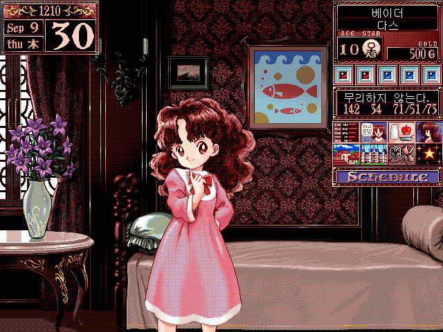
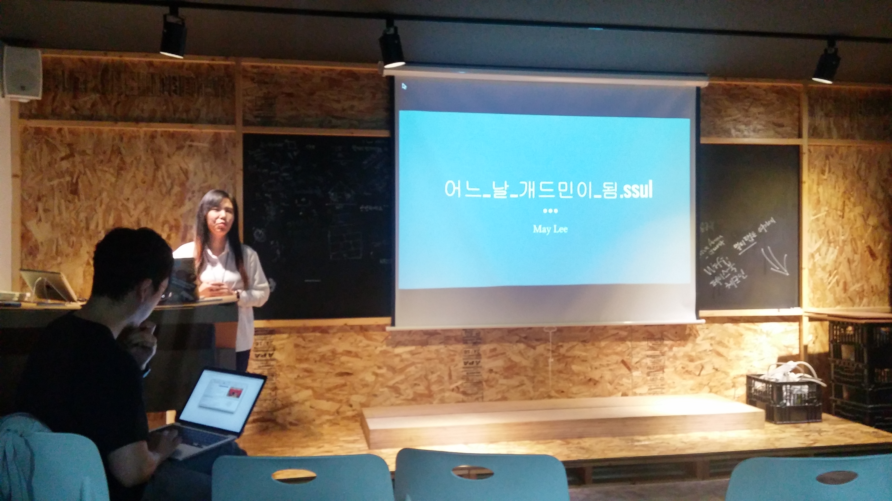

# 3명의 개발자들의 업무영역 확장에 대한 경험과 고민 - by 하이브 아레나
[하이브아레나](https://www.facebook.com/hivearena/)에서 주최한 개발자 행사에 참석하고 왔다.

페이스북에서 May님께서 본인의 DevOps 경험을 공유할 수 있는 자리가 있었으면 좋겠다는 얘기를 하시는걸 보았는데  
진짜 그 자리를 만드실줄이야 실행력 짱이신....ㄷㄷ  

여튼 나역시 May님의 경험은 관심이 많았던 주제라 (우리 회사도 개발자 역할범위가 넓어서 비슷하게 일을 하고 있었다) 신청을 하였다.
 
아무래도 발표에 집중하면서 발표내용을 전부 기록하는건 어려워서 ㅠㅠㅠ
군데군데 생략된 부분이 많다. 
 
아마 발표자분들이 발표자료를 곧 올려주시지 않을까!? 기대를 하고 있다 ㅠㅠㅠ.

## 1. 어느날 개드민이 되었다 - May Lee (이정희)
May님은 참 대단하신게 그 연차에 어울리지 않게 많은 경험을 하신것 같다. 
그러면서도 결국은 버티시고 해결해나가시는게 참 보기 좋은것 같다. 
아마도 많은 선배개발자님들께서 May님을 아끼고 격려하시는게 그런 성장하는 모습이 
보기 좋아서 그러시는게 아닐까 싶다

(선배님들은 아마 이 게임의 아빠의 마음이 아니실까!?)

같은 나이대와 비슷한 연차로서 정말 많은 열정을 꺼내게 만들어주시는 May님의 발표이다.

웹프로그래밍 밖에 모르셨던 May님이 시스템 운영까지 맡게되며 겪게 된 이야기들을 공유하는 시간

* 나는 왜 DevOps를 하게 됐는가
  - 하나밖에 없던 선임의 병특문제로 갑작스런 이직
  - 팀에 서버 개발자는 오직 본인뿐이라 시스템 운영까지 같이 하게 됨

* DevOps 전까지
  - 거의 백엔드만 하고 있었음
  - 개발에만 집중하면 됐었음
  - 서비스 운영에 개발이 차지하는게 일부분인줄 모르고 있었음

* DevOps - 초반 체감
  - 온 우주가 나의 불행을 바라는가!!??

* 운영을 하게 되니 개발이란 부분은 너무 협소하다는 것을 알게됨
  - 중간에 많은 미들웨어가 있다는 것을 알게됨
    - git, was, tmux, jenkinx, fabric
  - 테스팅
    - JUnit (전부는 아니라도 API는 다 하고 있음)
  - 트러블슈팅
  - 모니터링
    - CloudWatch, supervisord, logs
  - 이슈트래킹
    - jira(비개발팀), Github (개발팀)
  - Failover
    - AWS 오토 스케일링

* 결론 : 서비스가 작아도 할일은 무지하게 많았음

#### 트러블 슈팅 에피소드
* EC2 launch Fail
  - 최저가 푸시 시스템으로 특정 타임에 트레픽이 너무 몰리게 됨
  - 순식간에 20개의 서버가 증설되는 이슈가 발생
  - 몇개의 서버는 terminated 상태가 계속 됨
  - 이슈 원인
    - 추가한 테스트 코드로 인해 빌드가 실패해 어플리케이션이 시작이 되지 못하여 서버가 올라가지 못했음
  - 스스로의 개발실력에 자신감이 사라지게 되었음

* WebServer dead
  - 수정한 크롤러가 너무 많은 자원을 사용하고 있었음
  - htop 을 이용해서 보니 CPU를 비롯해 많은 자원이 100%를 찍고있었음
  - 중요한 서비스는 서버를 물리적으로 나누자
  - 크롤러가 있는 서버가 자원이 남는다고 여러 어플리케이션을 같이 돌리고 있다가 해당 어플리케이션 전부를 사용못하게 됨

* DB disability
  - AWS의 RDS를 사용중
  - AWS의 인터페이스를 통해 모든 설정을 하고 있었음 (RDS 한계)
  - 다른 자원은 다 남는데 CPU 만 높아지고 있엇음 ( 특히 DB를 하나만 가지고 있어 장애가 발생할 경우 전체에 영향을 줌)
  - 원인을 찾아보자
    - 앱 곳곳에 로그를 남김
    - nginx가 없어 tomcat으로 access log를 남김
  - 이슈 원인 
    - 사소한 연산자의 차이로 사용자 key가 수십번 refresh 되고 있었음
  -  원인2
    - 해당 버전의 앱외에도 여러버전에서도 문제가 있었는데 해당 버전에 대해서만 강제 업데이트 푸시가 되어 다른 문제있는 버전들은 업데이트가 안되어있었음
  - 문제가 있을 경우엔 그걸 숨기지 말자
    - 나중에 더 큰문제가 발생할 수 도 있고, 팀원간 신뢰에 문제가 생긴다. 
    - 조금 부끄럽더라도 빨리 공유하고 같이 해결하는게 좋다.

* 내가 일하는 방식을 강요하지 말자
  - 각자 자신의 역할에 최선을 다하되, 거기에 몰두돼 자신의 방식을 강요하면 안된다.
  (사례로 소개하신 내용은 인터넷에 공개해도 되는건가해서 여기선 포스팅하지 않겠습니다)

* 안이 힘들면 밖에서
  - 이제 3년차로 DB, 서버, 캐시등에 대한 문제가 발생할 경우 물어볼 사람이 없었다.
  - 외부의 많은 지인들에게 요청하여 질문 하고 발품하여 해결
  - 생각보다 개발자의 주변엔 능력자들이 많다. 힘들땐 도움을 요청하자.

* DevOps - 현재 체감
  - 온 우주가 나의 성장을 바라는 것 같다?
  - 연봉좀 올려줘!

## 2. 개발자를 가르치는 개발자의 경험과 고민 - 임성현
항상 주니어 개발자의 좋은 멘토가 되어주시는 임성현님의 발표
 
내가 세미나를 제법 (자주!?) 다니다보니 정말 많이 뵌것같다. 

(호호)

그때마다 개발자로서의 마음가짐이나 태도 습관에 대해 참 많은 가르침을 받고 오는 것 같다.  
물론 이번엔 정말 개발자로서 어떻게 사회에 기여할 수 있는지? 어떤 마음가짐으로 지내는게 좋은지에 대해 
정말 많은 생각을 하게 만들어 주셨다.
 

17년차 개발자의 자녀 멘토링과 봉사활동

#### 나
* 좋은 아빠가 되고 싶은 꿈과 초등학교 선생님이 되고 싶었던 꿈
* 대학원 -> 기술사 취득이 생각했던 것보다 너무 빠르게 끝남 (4개월만에 기술사 취득이라니.... ㅠ 짱 똑똑하셨다)

#### 대학생을 가르치는 아빠
* 자녀에게 자랑하려 시작한 멘토링
* 졸업작품만으로는 뭔가 남는게 없다는 것을 느낌
  - 낙후된 지역에 도움이 될만한 프로젝트를 진행하게 됨
  - 100줄도 안되는 **시각장애인을 위한 지폐인식 앱**으로 많은 감사와 상을 받게 됨

#### 청각장애 복지관 - 청음회관
* 프로그래밍을 하나도 모르는 속기사    & 통역사분과 했음에도 부트스트랩 강의가 진행 됨
* 10명의 청각 장애 IT인 모임에 실질적 도움 진행
  - 집중력과 꼼꼼함에 강점이 있는 것을 발견하여 테스팅 교육을 진행
  - 2015년 프로슈머에 참가 -> 전체 약 600명중 3명에게만 주는 우수 프로슈머상 수상자가 나옴 

#### 청각장애 청소년
* 보청기의 발전과 기존 교육의 어려움
  - 보청기를 통해 들리게 된 청각장애 청소년들이 생기게 됨
  - 어느 쪽에서도 적응하기가 어려움
* 덕성여대 학생들의 도움으로 더 적극적으로 학생들 참여가 진행
* 청각장애 대상 생활코딩 자막 진행

#### 일, 회사, 가족, 고민, 봉사, 공유하고 공존하는 삶
* 나 자신의 봉사로만 이런 행사들이 끝나면 내가 없어지면 더이상 이런 봉사활동은 지속될 수 없다,
  - 꾸준히 봉사가 진행될 수 있도록 사회적 기업으로 발전시킬 수 있도록 고민중
* 개발자로서의 나를 알고 있는 사람들을 피하기 위해 시작한 일이 지금의 모습까지 오게됨
* 회사에서의 나와 기업에서의 내가 계속 모습을 유지하기 위해 여전히 진행중

## 3. 좋아하는것 vs 잘하는것 vs 시장이 원하는 것 사이에서의 고민 - Cody Yun
개발자 뿐만 아니라 많은 직장인들과 취준생들이 비슷한 고민을 하고 있을 것 같다.  
좋아하는일과 잘하는일 중 어떤 일을 해야하는지  
근데 여기서 한가지 더 고려해야 하는게 있다.  
좋아하고 잘하는것 사이에서만 고민 해야하는게 아니라, 시장이 혹은 세상이 그 일을 원하는지이다. 

좋아하지만, 잘하지만 돈이 안된다면? 일자리가 없다면 그걸 직업으로 삼을 수 있을까 싶다.  
그 3가지가 달라 고민하고 계신 Cody Yun님이 직접 본인의 고민을 나누고자 나오셨다.  
여기선 해결책은 없다. 그냥 이런 고민을 다같이 생각해보자에 가까웠다. 보시는분들도 같이 생각해보셨으면 한다.

#### 장래희망
* PC게임, 모바일게임, 카카오게임플랫폼, 골프스크린 게임 등등 게임 클라이언트 계열에서는 많은 언어와 프레임워크를 사용해보았음
* 처음에는 C#을 사용해서 채팅서비스를 만들었지만 이걸 어디다 쓰지 란 생각에 열정이 사라짐
* 파이선&장고를 시작했지만 여태 사용한 언어와 너무 달라 또 열정이 식어짐
* 루비온레일즈의 빠른 개발에 매료되서 시작하게 됨 -> 또 재미가 없어짐
* Nodejs를 시작 -> 또 재미 없어짐
* 다시 C#을 시작하게 됨...
* 온갖 웹 언어와 프레임워크에 길을 잃게 됨
* 고민을 시작
  - 내가 좋아하는것 : 인디 게임 개발
  - 내가 잘하는것 : IOS 개발
  - 회사에서 원하는 것 : 안드로이드 개발
* 좋은기업을 넘어 위대한 기업으로 책에 꽂힌 구절
  - 좋아하는것/잘하는것/시장이원하는것 사이 **중간지점에 집중**하자
  - 난 여태 헛다리만 짚고 있다는 것을 깨닫게 됨
*  카카오게임에서 카카오뱅크로 이직하면서 잘하는것과 시장이원하는 것이 일치하게 됨 (IOS 개발)
  - 그래도 내가 좋아하는것은 못하게 되어 인디게임 개발을 **취미**로 하게 됨

* 좋아하는것을 하는 노하우
  - 학습하는 것에 그치지말고 런칭을 목표로 한다
  - 꾸준한 시간 투자를 위한 도시락 식사 (점심시간 활용을 위해)
  - 혼술 말고 혼커
  - 업무와 연관 있는 잉여짓
  - 하지만 그 무엇보다 중요한 **가족**

## 후기

