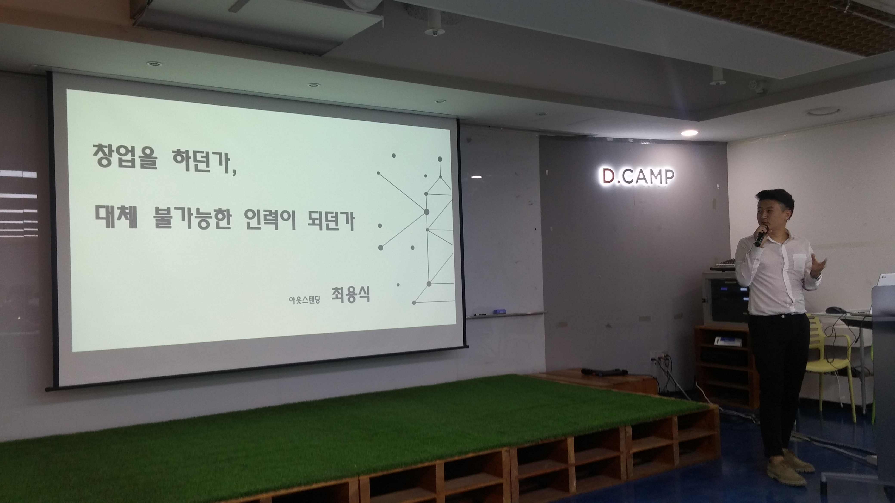
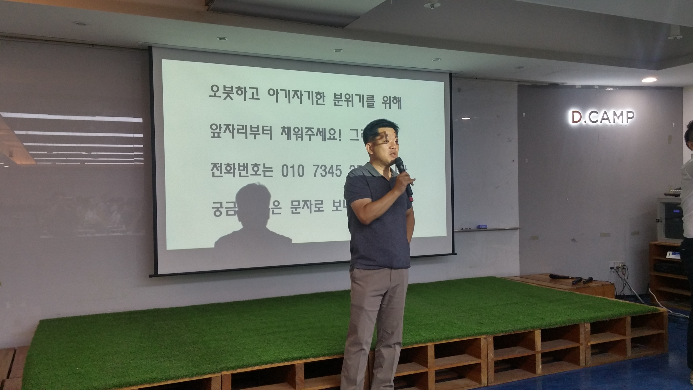

# 40대 아저씨도 벤처창업 할 수 있을까 -토크콘서트  by 아웃스탠딩
아웃스탠딩에서 모집한 [토크콘서트](http://outstanding.kr/talkconcert20160907/) 참석!  

## 창업을 하던가, 대체할 수 없는 인력이 되던가 - by 최용식 기자님
내용은 [아웃스탠딩 기사](http://outstanding.kr/whystartup20160422/)를 토대로 하고 있어서 한번 참고하는 것도 좋을것 같다.

#### 창업하기 쉬워졌다.
* 이전보다 자본금을 구하기 쉬워졌다.
* 많은 부분에서 아웃소싱이 가능하다.
  - 법무대행
  - 개발대행
  - 공동 사무공간

* 사람 구하기도 쉬워졌다.
  - 스타트업에 뛰어드는 많은 인재들
  - 스타트업에 대한 세계적 열광

* 실패에 대한 리스크도 줄고 있다.
  - 연대보증 부담이 줄어들고 있다.

#### 점점 나빠지는 고용환경
* 평균소득과 중위소득의 차이가 벌어질 만큼의 극단적 양극화
  - 즉, 중위(전체 임금자중 중간 위치) 이하의 사람들이 많이 못벌고, 중위 이상의 사람들이 많이 가져가고 있다.

* 적은 인원으로 기존 대기업만큼의 기업가치 창출하는 기업이 늘고 있다.
  - 월마트 220만명  vs 아마존 30만명의 임직원

* 모든 고정비용에서 비중이 가장 높은건 인건비다.
  - 불경기에 가장 쉽고 효과가 큰 방안은 구조조정
  
#### 창업자 DNA와 성공조건
* 주도적 일처리
* 말도 안되게 높은 꿈과 목표
* 여기저기 휘둘리지 않는 강한 자존감

#### 창업하기 힘든 사람
* 일과 가정의 조화가 중요한 사람
* 경쟁을 싫어하는 사람

#### 우리는 무엇을 준비해야 하나
* 회사에 남든, 창업을 하든, 어떤것을 하게 되더라도 주체적으로 커리어를 짜는 것이 필요하다.

## 북팔 이야기, 40대 아저씨도 벤처 창업할 수 있다. - by 김형석 대표님

* 40대 중반에 창업 시작
* 큰회사에서 내가 할 수 있는 일이 점점 줄어들고 있었다.
  - 나가거나 아주 유능한 관리자가 되는것을 요구하는 기존 회사
  - 주어진 길이 결국 나가는 것 밖에 없었다.

* 퇴사후 벤처에 합류
  - 2년만에 망함
  - 판이 차려진 곳에 가다보니 너무 쉽게 생각하게 됨
  - 디테일한 것에 눈이 가지 않게 됨
  - 내가 주도 하지 않은 싸움에는 끼어들면 안된다는 것을 깨달음
  - 창업은 결국 돈이 다떨어져도 버티는 맛이 있어야 한다. 그래서 본인이 한게 아니면 못버틴다.
  - 우리팀의 CEO가 될 사람은 자기주도력이 있는지를 봐야 한다.

* 시니어 창업과 주니어 창업의 차이
  - 가족의 생계 : 어찌됐든 가족의 동의가 필요하다. 가족의 생계를 버리고 창업을 하며 너무 쉽게 흔들린다.
  - 아주 엉성한 열차를 궤도에 올려놓는 것이 창업이다. 
    - 어찌됐든 철도위에 올려놔야 한다.
    - 궤도에 올라가면 출발점과 종료점이 정해진다. 이게 없으면 방향자체가 없다.

* 한 회사의 사내벤처 사례
  - 아이디어를 내고 시작을 하게 되면 월급을 주지 않고 3개월간 5천만원의 지원금을 준다
  - 해당 기간과 금액만으로 성과를 내기 위해 똘똘한 친구들끼리 빠르게 팀을 짜서 시작한다.
  - 총 2번의 기회속에 성공해서 분사하지 못하면 대기발령 시킨다.
  - 이후 어느팀에서도 그 친구들을 원하지 않으면 퇴사, 원하는 팀이 있다면 그팀으로 합류하게 한다.
  - 이런 룰속에서 진행하다보니 이전에 비해 사내벤처가 성공적으로 진행
  - 결국은 한정된 자원과 시간으로 누가 효율적으로 하는가가 창업

* 초기 창업에서 중요한건 **평판**
  - 팀원들이나 CEO의 평판에 따라 외부의 지원이 달라진다.
  - 외부의 지원없이 막히는 순간이 올 수 밖에 없다. 이때는 결국 지원을 받긴 받아야 한다.

* 성장하면 할수록 CEO의 능력이 요구된다.
  - 회사가 성장하는만큼 CEO도 성장할 수 있는 자세가 중요하다.
  - 10명일때와 50명일때가 회사 운영이 다르다.
  - 투자를 받으면 꼭 문제가 생긴다. 창립멤버가 떠나거나, 대표가 딴짓을 하거나, 구성원들간 문제가 발생하거나
  - 이때 CEO의 경영 능력이 발휘된다. 회사가 성장하는 만큼 CEO도 성정해야 버틸 수 있다.

* 아이템이 중요한것 같진 않다.
  - 처음 생각한 아이템으로 성공한 스타트업은 거의 없다.
  - 결국 구현해낼 수 있느냐가 중요하다.
  - 확률을 높여서 시작하는 것은 확률이 더 낮다. 시간이 지나면 지날수록 더 힘들다.
    - 북팔 역시 2011년도라서 성공했다. 2013년이면 이미 먼저 나온 회사가 있을것
    - 소비자들은 다 비교해서 선택하는게 아니다. 익숙한걸 계속 한다.
    - 진짜 허접한 자전거라도 출시해보겠다는게 결국 중요하다.

* 남들이 하지 말라는걸 해라
  - 야놀자 같은 모델을 생각하면 된다.
  - 세상이 바뀐다.

## Q & A 

(최용식 기자님과 참석자분들이 묻고 김형석 대표님이 답하다)

#### 최용식 기자님: 창업이 대안인가?
김형석 대표님: 창업의 과정도 여러개가 있다. 자영업도 있고, 자기 몫만 챙길 수 있는 프리랜서도 있다.  
꼭 스타트업을 할 필요가 없다.
자기에 맞는 카테고리를 찾아서 하면 된다.

#### 최용식 기자님: 시니어 창업자가 주니어 창업자보다 우위에 있는 것은?
김형석 대표님: 아무래도 경험이라는게 무시할 수는 없다.
프로세스에 숨어 있는 비효율에 대한 개선, 휴면 네트워크등이 더 유리하다.
세무, 법 등등의 디테일함에 유리하다.
결코 창업의 경쟁력이 떨어지지 않지만, 책임져야할 부분이 너무 많은것뿐이다.
기본적으론 창업에 대한 경쟁력이 더 뛰어나다고 생각한다.

#### 최용식 기자님: 주변 사람 설득을 어떻게 했는지?
김형석 대표님: 어찌됐든 내가 하고 있는 일이 신중하고 주의하고 있다는걸 보여주는게 중요한것 같다.
결국 회사나와서 백수로 사나, 창업하나 똑같은것 같다.

#### 최용식 기자님: 4년 동안 얼마나 집에 돈을 보내주었는지?
김형석 대표님: 4년 동안 2번을 제외하고 다 보내줬다.
한달에 150씩 보내줬지만 그돈으로 해결은 안된다. 집사람이 어떻게든 버텨준것 같다.

#### 최용식 기자님: 1년동안 돈을 못보내줄수도 있다고 생각하진 않았는지?
김형석 대표님: 농림부의 예산을 타낼수 있는 제안서를 써주면 300만원을 받을 수 있었다.
안되면 그거 1년하고 또 기회를 봐야지 라고 생각했다.
그것도 안되면 집 담보 대출 받을 생각 이였다.

#### 참석자: 투자할만한 가치가 있다고 포장하는게 맞는지?
김형석 대표님: 투자자가 써보고 가치가 있다고 생각해서 투자하진 않는다. 
먼저 입증해야 한다. 
입증되면 몰려든다. 

#### 참석자: 어떻게 열정을 계속 유지하는지?
김형석 대표님: 문제를 해결해야 문제가 끝난다.
미리 문제가 될만한걸 먼저 해결하려고 하다보니 시간가는줄 몰랐다.

#### 최용식 기자님: 주변사람의 투자는 받아야 하는지
김형석 대표님: 아는 사람의 돈을 받아야 한다.
사업이 망하면 무조건 뒷감당 해야한다.
그런 경우에 아는 사람이 훨씬낫다.

#### 최용식 기자님: 공동창업에 대해 어떻게 생각하는지?
김형석 대표님: 해야한다고 생각한다.
나중에 성과가 나서 분배문제가 생기면 그때가서 해결하면 된다.
혼자서는 절대 안된다.
혼자서 하면 독단에 빠지고 의사결정이 안된다.   

#### 최용식 기자님: 북팔의 성공요인?
김형석 대표님: 스타트업이 초반에 마케팅하기가 정말 어렵다.
자기만의 마케팅 방법 (그로스 해킹)을 빨리 찾아야 한다.
어차피 북팔이 성공한 마케팅 기법을 얘기해봐야 지금은 안통한다.
당시에 북팔은 앱스토어 랭킹 알고리즘 공부를 정말 많이 했다.
그걸 통해서 랭킹을 올렸다. 지금은 안통한다.

#### 최용식 기자님: 투자에 대한 생각
김형석 대표님: 투자는 투자받아야할 때가 있다.
그 타이밍에 맞는 돈의 숫자, 성격이 다 정해져있다 이걸 무시하면 아무리 PT를 잘해도 의미가 없다.
어찌보면 우리가 투자 받아야겠다고 생각해봐야 어렵다.
그 업체가 지금 어떤 카테고리에 투자해야겠다고 생각이 보일때 들어가야 한다. 
투자도 5천만원 받아야할 때랑 5억 받아야할 때랑 다르다.
투자는 all or nothing이다.
너무 투자에 올인하지마라. 올때는 20군데 다올때도 있다.

#### 참석자: 콘텐츠 유료화에 대한 생각
김형석 대표님: 경험상 사용자가 소비하는 것은 컨텐츠 소비가 아니라 **시간소비**이다.
그 사람들의 시간을 사는 거다.
모바일 게임이 그렇고, 웹툰/웹소설이 시간이 지나면 볼 수 있음에도 미리보기 하는 이유가 그거다.
사람들이 익숙한 패턴에 BM을 넣어야 지갑을 연다.
이걸 가장 잘하는 사람들이 게임쪽에 있다.
게임쪽을 잘 분석해보면 좋다.

아웃스탠딩은 600분이 유료결제 해주셨다.
조금씩 축적되고 있다.

#### 참석자: 아이템 결정에 대한 노하우
김형석 대표님: 아이템은 너무 많다. 하루에 100개씩도 **생각**할 수 있다.
근데 아이템 별로 안중요하다. 결국 구현해 낼 수 있는지, 얼마나 빠르게 구현할 수 있는지가 중요하다.
아이템이 없어서 사업을 못하는게 아니라 구현할 사람이 없어서 그렇다.
기능 개선 같은 아이템은 실패할 가능성이 높고,
그런거 해도 돼 라는 식의 **공격성 아이템**을 하는게 가능성이 높다
(예를 들어 아만다 같은 경우 요즘 VC들이 전부 관심을 갖고 투자하고 있다.)

#### 참석자: 어떻게 처음에 서비스를 구현하셨는지?
김형석 대표님: 같이 동업한 친구가 다재다능하다. 기획자이면서도 개발자였다.
첫 개발은 외주를 맡겼다. 1년 동안은 계속 외주를 맡겼다. 이후부터는 직접 유지보수하긴 했다.
품앗이 하듯이 부탁도 했다.
그게 중요하다.
일단 배를 띄우는게 중요하다. **조각배라도 띄었으니 성공**했다고 생각한다.
3개월 안에 기초모델이 나와서 소비자 반응을 get해야 한다.

#### 참석자: 작가와 작품들을 어떻게 섭외했는지
김형석 대표님: 연재소설 작가들이 당시에 가장 원했던 것은 지속적으로 활동할 수 있는 동기부여다.
그 동기부여는 아주 작은 금액이라도 수익창출이 가능하도록 하는것이였다.

#### 참석자: 타산지석 삼는 기업이 있으신지   & CEO의 도덕성
김형석 대표님: 롤모델은 딱히 없다. 따라하는걸 별로 좋아하진 않는다.
근데 그런건 있다. 거기선 그게 먹혔는데 우리쪽으로 가져오면 먹힐까 라는 고민은 있다.
직장 생활 15년, 회사운영 5년을 하면서 느낀건 회사가 제일 크게 위험할때가
경영자가 뻘짓 할때다 그래서 조심해야 한다고 생각한다.

#### 참석자: 창업전 포지션 & 개발이외의 역할들을 어디서 배우는지
김형석 대표님: 광고대행사 & 게임쪽에서 일을 했다. 그게 좀 도움이 됐던것 같다.
가장 최악의 팀 구성이 개발자들끼리 구성하는 것이다.
눈을 가리고 돌진하는거다. 뭔가 눈역할 할 사람은 있어야 한다.
여행가서 제일 안싸우는 구성이 고등학교/대학교 친구들이였다.
제일 친한 친구들중에 능력이 맞는 사람들과 하는것이 좋다.

#### 참석자: 나이차이 많이 나는 직원들과의 커뮤니케이션 어떻게 했는지
김형석 대표님: 일부러 어린 친구들과 어울릴려고 노력하진 않았다.
그들한테 **결정권을 위임**한다.
처음의 속도감을 유지하려면 선조치 후보고 해야 한다고 공유했다.
그러다보니 자연스레 가까워진것 같다.

## 후기
월요일 저녁 7시 30분에 진행된 세미나에 50분이나 참석했었다.  
나이대도 20~50대까지 다양한 분들이 참석하신 것을 보고 창업에 관심 많으신 분들이 이렇게 많구나 라는 생각을 하게 되었다.
살면서 한번은 좋든 싫든, 창업 혹은 프리랜서를 하는 시기가 된것 같다.  
올해 목표로 하고 있는 개인 서비스가 있다. 김형석 대표님의 말처럼 좋든 싫든 일단 **배를 띄어보자 그게 조각배든 종이배든**
