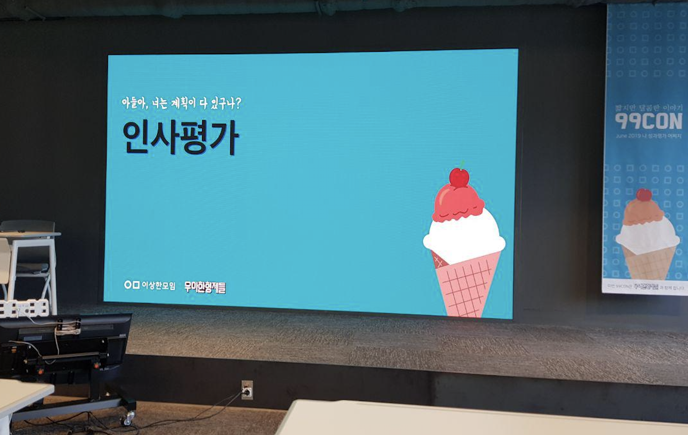
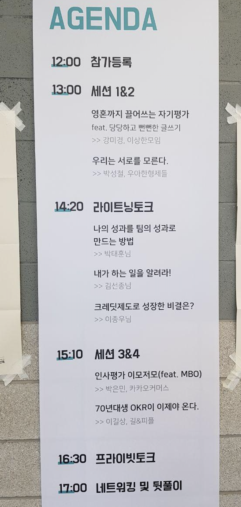
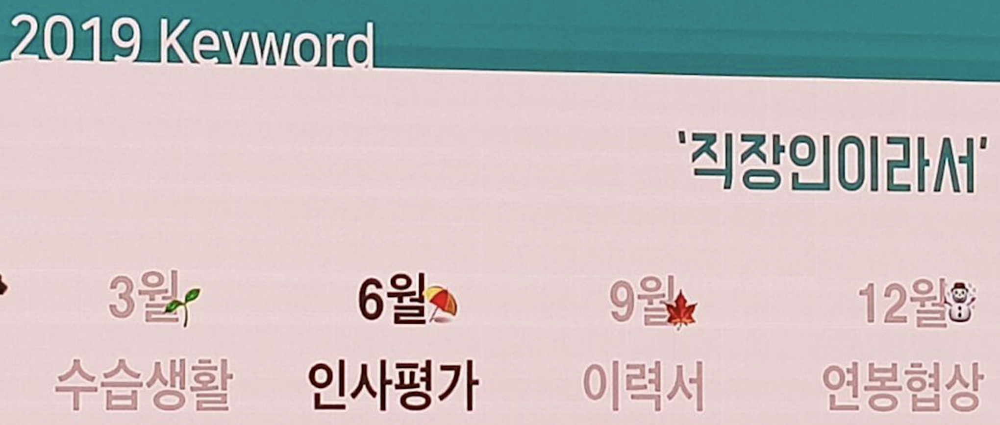

# 99콘 2019 - 인사평가

6월 15일! 우아한 형제들의 작은집에서 99콘이 진행되었습니다.

이번 99콘의 주제는 인사평가입니다.

* [자세히보기](https://www.notion.so/8464cbc53c08494299d31f5c46ed67ef)

발표장소 입구를 들어서면 오늘의 세션을 바로 확인할 수 있습니다.

1시부터 발표가 시작인데 12시부터 많은 분들이 도착해있어, 진행자이자 발표자이신 미경님께서 이상한 모임에 대해서 이야기하는 시간이 있었습니다.  
  
이때 올 한해 진행된 99콘의 주제들이 소개되었는데요.  
굉장히 흥미가 가는 주제들이 많이 남아 있는걸 알 수 있습니다.

(이력서와 연봉협상!)  
  
그럼 발표를 진행합니다.

## 1. 영혼까지 끌어쓰는 자기평가 - 강미경

* 영혼
* 평가
* 쓰기

### 1-1. 영혼

영혼은 직군의 구분이 없습니다.  
여러분의 상황에 대입해보세요.

* 현재 기획 직군
  * 사업기획? 상품기획? 광고기획?
  * 대부분의 업무가 회의 60 : 기획 30: 분석 10
  * 운이 없으면 분석10을 하지도 못함
  * 쓰는 도구는
    * 메일과 메신저
    * 위키
    * 지라
    * 제플린 (간혹 분석할때만)
* 영혼의 조각 1
  * 사장님이 단골 고객을 타게팅하는 광고 상품을 기획
  * 시스템 기획자와 개발자들이 으쌰으쌰 만들어줌
  * 근데 이 기간동안 이거 1개만 했으면 **성과 평가때 한줄만 써야하나**?
* 영혼의 조각 2
  * 광고 단가 수정한 일 찾음 -> 성과 기재
* 영혼의 조각 3
  * 메일함 전부 뒤적뒤적
* 영혼의 조각 4
  * 위키 전부 뒤적뒤적
* 영혼의 조각 5
  * 회의좀 들어가고 문서정리 도와줌
* 영혼의 조각 6
  * 입사한지 얼마 안되서 티타임을 많이 함
  * 강의자료 공유, 책읽기 등 새로운 지식을 나눠줌
  * 알고 있는걸 가르치게 됨 -> 팀내 스터디로 성과 기재
* 영혼의 조각 7
  * 사내에서 하는 활동에 참여
    * DR 서포터즈
  * 서포터즈 활동 했다고 기재
* 영혼의 조각 모음을 분류
  * 본업무 vs 부업무
  * 스스로 한 일 vs 요청 받아서 한 일
  * 돈이 된 일 vs 돈이 안된 일
* 영혼의 조각 모음을 분류해서 가중치
  * 위에서 언급한 기준으로 표로 관리
  * 스스로한일 & 업무 영역은 2점, 요청받은일 & 비업무 영역은 1점, 매출에 긍정적 효과는 100점 아니면 10점 등
* 영혼의 조각 모음 완료!
  * 신규 상품 기획 **및** 출시
  * 기존 광고 단가 정책 개선 **및** 유관부서 커뮤니케이션
  * DR서포터즈 활동 **및** 외부개발자 행사
  * 즉, 비슷한 업무들은 **묶어서** 기재한다.
* 정리하면
  * 업무이력에서 지난 **업무들을 추출**한다.
  * 가중치를 두고 점수를 매긴다

### 1-2. 평가

* 회사가 바라는 인재상?
  * 입사할때 본 채용공고
  * 면접 질문들
  * 회사에서 이야기하는 철학들
* 평가자가 바라(보)는 인재상?
  * 모르겠으면 물어보자 - **제가 뭘하면 좋을까요**?
    * 대답하려고 노력함 -> 생각이 정리됨 -> 평가 기준이 생김
  * 추측하지말고 물어보자
  * 평가자도 사람이다
    * 회사 상황에 따라 자주 바뀜
  * 꾸준히 상태 체크는 필수
* 조직장이랑 안 친하면?
  * 채용 공고 다시 확인해본다.
  * 지원자격 vs 우대사항
    * 지원자격은 기본기
    * 우대사항은 우대사항
  * 기본기
    * 말그대로 기본기
    * 서류제출용
    * 1점짜리
  * 우대사항
    * 이게 진짜 지원자격
    * 없으면 서류 광탈
    * 많을수록 면접합격 확률 높음
    * 10점짜리
  * 우대사항도 **가중치 내림차순**
    * 채용 우대사항 == 회사에서 벌어지는 일
      * 프로세스 개선 경험: 레거시 혹은 기존시스템 개편할일이 많구나?
    * 채용 우대사항 == **입사해도 평가될 역량**
      * 프로세스 개선 경험: 기존 로직을 개선하려 하는가?
* 정리하면
  * 나의 포지션에 기대하는 역할과 책임을 명확히하자
  * 채용 공고를 분석하여 **어떤 역량으로 평가될것인지** 예측해본다.

### 1-3. 쓰기

* 업무 + 기준 + 역량 == 글쓰기 좋은 날
  * 글 쓸만한 괜찮은 업무 
  * 내가 중요하게 여기는 기준
  * 회사가 중요하게 여기는 역량
* 업무를 성과로
  * 예시) 신규 상품 출시 기획
    * 어필할 항목 정리
    * 초안 작성
    * 버릴 것을 찾고 더할것을 찾는다.
    * 팩트는 숫자로
      * 상품 출시후 ~건 판매, 총 ~원 매출 발생
        * 근데 이게 잘된건가?
      * 달성 기준은 **목표를 명시하기** 
        * 구매 전환율 50% 달성 등
    * 성과의 크기는 **비교대상**을 두기
      * 기존 상품 A는 구매자당 1.1건이므로 대비 10% 향상됐다 등
    * 정성적인 것도 정량적으로
      * 주 6회 CS 인입 감소 등
    * 셀프 평가는 **진짜 뻔뻔하게**
      * 스스로 사업성 있는 상품을 기획한것에 의의를 둠
      * 스스로 뻔뻔하게 선빵치기
  * 한번 더?
    * 업무 요청 배경 작성
      * 2년 이상 유지된 기존 광고 단가를 눂여야할 필요성을 느껴 **객관적인 근거로** 표준단가표 산정
      * **제플린을 통해 SQL로 분석한 자료** 등 언급
    * 성과 마무리
      * 숫자를 몰라서 **뭉개는 단어를 사용**
      * 기여 / 개선 / 지원 등등
  * 진짜 마지막
    * DR 서포터즈 활동 및 외부 개발자 행사 유치
      * 너무 하고싶었던 일
    * 이게 왜 성과? - 제 생각을 들어주세여
      * 사내 개발조직 문화를 발전시키고 싶음
      * 개발자 위주의 문화에 **기획자도 녹아들었으면 좋겠다는 마음**
      * 회사 동료들과 친해지고 싶음
    * 성과
      * 기획자-개발자간의 업무 프로세스를 개선하는데 기여
      * 회사의 채용브랜딩에 기여하고자 함
* 개발자를 위한 특별 에제
  * 신규 기능 추가로 재주문율 몇배 상승
  * 아키텍쳐 개선 - 서버 비용 월 얼마 절감
* 마무리
  * 회사가 원하는 역량 + 내가 중요하게 생각하는 성과기준 -> 재료
  * 정량적 수치는 **팩트가 아닌 임팩트**를 느낄수 있게
  * 정성적 내용은 **숫자로 객관화**하기
  * 서술형 (~했습니다) 보다 명사형 (~했음)으로 객관하 하기

### 1-4. 마무리

* 자기평가는 한일의 시간순이 아니라 **중요도순**입니다.
  * 지금하고있어서 아직 안끝난 일도 중요하다면 먼저 언급
* 자기 평가는 누군가의 시선이 아니라 **내가 정리한 숫자와 글**
* 자기가 한 일을 잘 이야기하는 것은 **프로가 갖춰야할 역량**

### Q & A

Q. 자기평가 형식이 정해져있다면?

* 일단 시스템이 체크박스가 아니라 텍스트 방식이라면 얼마든지 원하는대로 작성 가능
* 만약 체크박스로 레벨이 나열되어있다면 낮은 것 보다는 높은 수치를 쓰는게 낫다
  * 내가 나서서 나를 낮출필욘 없다
  * 낮은 사람을 올리는 상사를 본적은 없는것 같다.

[[ad]]

## 2. 우리는 서로를 모른다 (팀장과 팀원사이) - 박성철

* 오늘 발표는 **우아한 형제들**과 아무런 관련이 없습니다
* 조금이라도 회사와 관련있는 내용은 일부러 담지 않습니다
* 발표 요약문
  * 팀장은 팀원이 무슨 일을 하는지 모릅니다
  * 서로 모르면서 서로를 평가할까요?
  * 어떻게 평가할까요?
  * 알려면 어떻게 해야할지 고민해봅시다.
* 오늘은 **팀원**위주의 발표

### 2-1. 팀장은 누구인가?

* 팀장은 공공의 적
  * 익명게시판에서 자주 나오는 팀장 욕
  * 무능한 팀장
  * 팀원들을 계속 퇴사하게 만드는 팀장
  * 전혀 바뀌지 않으려고 하는 팀장
  * 자기가 다 한것처럼 포장하는 팀장
* 팀장이란?
  * 영감도 줘야하고 비전도 제시해야하고 회의도 가야하고 조직간의 문제도 해결해야하고 코칭도 해야하는 등등
  * 회사에서 팀장에게 주는 잡일도 많음
  * 팀장이 한 사람으로는 부족하다고 느낄정도로 일이 많음
  * 팀장들끼리 모이면 이런 말도 함
    * 권한은 없는데 책임만 많다.
    * 근데 부여받을만한 권한은 뭐가 있을까?
    * 짜를 권한?
  * 경험담으로는 **팀장이 권한이 가장 막강한 것 같음**
    * 그 위로 가게 되면 직접 할수 있는게 없음
    * 누군가에게 위임해야만 일이 진행 가능
    * 결국 **팀장들의 성과로 사장에 대한 평가**도 내려짐
* 팀원에게 팀장이란?
  * 블라인드를 보면 팀장에 대한 불만이 사실은 **회사에 대한 불만**인것 같다는 생각을 자주함
  * 회사의 잘못을 팀장의 잘못으로 오해하는것 같음
* 팀장의 능력
  * 관리형 팀장
  * 전문가형 팀장
  * 리더형 팀장
* 관리능력 & 실무 능력
  * 관리 능력만 높은 사람
  * 관리 능력과 실무 능력 둘다 높은 사람
    * 신급이 아닌 이상 둘다가 최상의 능력을 가진 사람은 없음
    * 근데 팀원이 바라는 팀장의 모습은 이런 유형
  * 실무 능력만 높은 사람
  * 그럼 밸런스형 이라고 하면
    * 실무능력 70, 관리능력 70인 경우
    * 한쪽의 전문 능력을 키웠다면 하나만 100
  * 현실은 이런 밸런스형도 찾기 힘들다
* 피터의 원리
  * 관료적 위계 조직에서는 모든 구성원들이 **자신의 무능의 수준까지 승진**한다.
    * 지금 하는 일을 잘해서 승진시키면 언젠가는 자신이 익숙하지 않은 일에 적응을 못해서 멈춘다.
  * **승진해서 일을 잘할 사람을 승진시켜야 한다**
  * 지금 잘하는 사람을 승진시키는게 아니다. 
* 과신 또는 저평가
  * 처음 팀장으로 승진할때는 자신감이 넘침
    * 그리고 사고를 많이 침
  * 즉, 팀장으로 승진하게 되면 2개 유형으로 분류될수 있음
    * 자기 실력보다 훨씬 더 잘한다고 생각하거나 자신감이 없어서 더 일을 해야한다고 생각하는 사람
* 이상적 모델의 폐해
  * 신사임당/성모마리아 등은 너무 이상적인 모델
    * 드문 케이스이기 때문에 이상적 모델임
* 다크피닉스를 재밌게 보는 법
  * 기대치가 낮으면 됨
  * 팀장에 대한 것도 이처럼 생각해보면 어떨지?
* 평가
  * 유동적임
  * 시험쳐서 나온 정적인 점수가 아님
  * 교감을 통한 피드백
* 해명할 책임
  * 해명할 책임은 제시될수도,요청될수도,심지어 요구될수도 있지만 **강요될수는 없다**. 나는 내가 신뢰할만하다는 사실을 보이고 최고의 자신으로 행동하도록 스스로 독려하기 위해 맡은 일을 해명 가능하게 만든다
    * 켄트백

### 2-2. 팔로워십

* 팔로워십
  * 독립적 & 수동적 - 소외된 팔로워
    * 전문가들이 꽤 많음
  * 독립적 & 능동적 - 유능한 팔로워
    * 잘 없음
    * 하지만 우리가 가야할 길
  * 의존적 & 수동적 - 무기력한 양
    * 팀장이 자신을 키워주길 바람
  * 의존적 & 능동적 - 예스맨
* 동기의 종류
  * 향상 초점 & 외적 동기
    * 결과 지향
    * 생색내지 않는 일은 안함
    * 경쟁이 심함
  * 향상 초점 & 내적 동기
    * 가장 행복
    * 잠재력 최대한 발휘
  * 예방 초점 & 외적 동기
    * 보신 주의
    * 꾸중/실수 회피
  * 예방 초점 & 내적 동기
    * 기술자/전문가들에 많음
    * 다른 사람의 말을 많이 듣지 않음
* 결론
  * 좋은 리더와 유능한 팔로워는 짝궁임
  * 리더와 보스 중에 **리더가 좋다고** 하지만 **본인은 외적 동기(금전적 보상, 승진 등)을 원하고 있진 않나**?
  * 팀장이 팀원에게 내적 동기를 주고 싶지만 팀원이 외적 동기를 원한다면 의미가 없음
* 저항
  * 나의 내적 동기는 내가 관리 해야함
  * 회사에서 외적 동기를 주지 않더라도 나 스스로 내적 동기를 부여해야한다.

## 3. 평가에 대한 이런저런 이야기 - 카카오커머스 제이슨

* 현재 인사기획/평가/보상/인력운영/노무 등 업무 담당
* 오늘 하고 싶은 이야기
  * 평가의 연속에 사는 우리
  * 평가는 언제부터 어떻게 활용되었을까
  * MBO 방식에 의한 상대평가는 어떤 문제가 있을까?
  * 글로벌 기업의 평가 방식의 트렌드는?
  * 평가를 잘 받으려면 어떻게 해야하는가?
* 평가는 언제부터 어떻게 활용되었을까
  * 주로 어떤 자격이나 능력을 갖추고 있는 여부에 대한 확인을 위해 진행
  * 미국에서 군인으로 적합한 사람을 선발하기 위한 목적으로 정교화되고 발전되어 왔음
  * 사업에서
    * 연공주의/호봉제/평생직장
    * IMF를 기준으로 본격적 도입
    * 성과주의/연봉제/이직
* 회사에서 평가는 어떻게 활용 될까?
  * 개인에 대한 업무관리/목표관리 -> 평가 -> 승진 or 보상
  * 평가가 인사 프로세스의 가장 중심에 있음
*  MBO 방식에 의한 상대평가는 어떤 문제가 있을까
   * MBO?
     * 목표 관리 방식
     * 국내에서 가장 많이 사용되는 방식
     * 회사의 전략과 align된 S.M.A.R.T한 목표를 모든 구성원이 달성하면 회사의 전략 목표가 달성 될 수 있다는 것
     * 급변하는 경영 환경에서 **연초의 목표는 의미가 없다**.
     * SMART한 목표를 설정할 수가 없다
     * 일할 시간도 없는데 일좀 하게 그냥 두시면 안되나요?
     * 그래서 평가를 잘 받으면 인센티브와 연봉은 많이 주나요?
   * 상대평가
     * GE의 잭웰치 회장은 하위 10%를 지속적으로 내보내고 상위 20%만 남는다면 회사가 활력을 유지하고 발전할 수 있다고 믿었습니다.
     * 평가자는 인지적 오류를 가지고 있음
        * 최근효과
        * 유사성 효과
        * 후광 효과
     * 평가자는 모두 평가 성향이 다름
     * **동일 등급을 받았다고 모두 동일한 성과를 낸 것은 아님**
   * 평가 프로세스에서의 시각 차이
     * 회사의 목표가 무엇인지 모르겠어요
     * 제가 보기에는 이정도 난이도의 목표는 달성하기 어려울것 같아요
     * 목표를 정량화 하기가 어려워요
* 글로벌 기업의 트렌드는?
  * 실시간 피드백을 중심으로 성과개선을 하고자 평가제도 변환
  * 프로젝트 단위로 빈번하게 **상호 피드백 교환**, **학습하는 과정 반복**
* 카카오 커머스는?
  * 문제의식
    * 회사의 성장이 크루들의 성과 및 성장과 어떻게 연결되는지 모호했음
    * 평가등급으로 평가를 하다보니 협력 보다는 경쟁적인 분위기를 유도하고 갈등을 유발함
    * 검토
      * 평가는 자의적인 면이 있어 객과화하기 어렵다는 것을 인정
      * 크루(직원)을 평가 받아야할 대상으로 보고 있지 않음
      * 성취한 것 뿐만 아니라 **성취를 위한 노력 및 태도도 중요**
      * 평가에 리소스를 과다하게 투입하는 것이 불필요
  * 평가 제도가 아닌 성과급 분배 제도
    * 연말 보상 제도
      * 팀별로 팀장이 조직장등과 상의하여 결정
    * Rewind (가칭)
      * 성과급을 나눠가질 수 없는 Free Rider에 대한 경고
* 평가를 잘 받으려면 어떻게 해야할까?
  * 기본기
    * 기본적으로 기술이 뛰어나서 성과를 내야함
    * 회사에서 공부시켜주지 않기 때문에 스스로 해야만 함
  * 평가자와의 관계
    * 평가자와 업무 스타일을 맞추려고 노력하고 평가자의 시각에서 업무들을 바라봐주면 평가자는 내편
  * 전략적 접근
    * **평가 시즌 2~3개월 전 부터**는 일을 잘하고 성과를 내려고 노력하세요.

