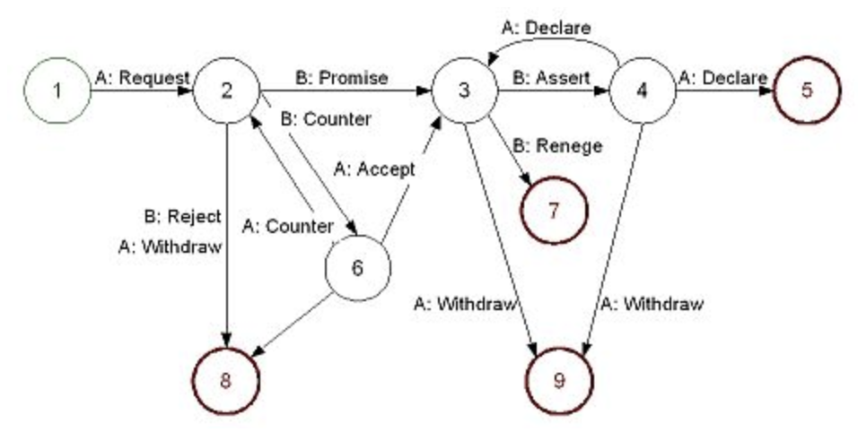

# AWSKRUG #enterprise 소모임 2018.06.11 

개인적으로 기술 파트였던 1,2 세션은 이미지 위주라 제대로 기록할 수 없었습니다 ㅠㅠㅠ...  
다만, 개발자의 길을 얘기해주신 3세션은 많은 내용을 기록할 수 있었으니 참고 부탁드립니다.  

## 1. AWS Messaging Service(SQS, SNS, SES) 살펴보기 - 이정학님

* 시스템 구조: storeFront에서 주문이 발생시 Shipping과 Accounting에 각각 Order 전달
* 이 구조에서는 Shipping 혹은 Accounting이 죽어있다면 StoreFront에서 전달한 데이터는 모두 유실됨

> AWS Outage 발생 (March 2, 2018)

* StoreFront와 Shipping/Accounting 사이에 SNS 를 두는 것으로 해결 가능

### SNS

특징

* Durable Subscribe
* 모든 구독자는 **같은 메세지는 한번만 구독**하는 것을 보장한다.
* 모든 구독자에게 같은 메세지가 한번 간다.
* 순서가 보장은 안된다.

구독 했음을 표시하는 방법

* Auto Ack
* Client Ack

전송 방법

* Pull
  * Subscriber가 SNS Topic을 가져온다
* Push
  * SNS Topic이 Subscriber에게 Push 한다
  * 많은 부분 Push를 사용


### Case #2 구독자가 여러개인 경우엔?

SNS는 모든 구독자가 같은 메세지를 수신하기 때문에 구독자가 여러개 일 경우 같은 메세지가 구독자만큼 처리가 된다.  

* SNS가 Shippin/Accounting에 바로 전달하는 방식이 아닌 SQS를 중간에 둠
* StoreFront -> SNS -> SQS로 전달하는 구조로 개선

### SQS

* Point To Point Model
* 기존엔 선입선출을 보장하진 않았음
* Standard 모드는 많은 양의 데이터를 빠르게 전달 (초당 수백만건) 하기 위해 사용
  * 1회 보장이 안됨
  * 같은 메세지가 여러번 전달 가능
* FIFO 모드는 1회만 전달됨을 보장
  * 초당 트랜잭션이 300건
  * 현재 서울리전 지원안함

## 2. 쿠버네티스 구조에 대한 개요 및 이해 - 윤평호님

쿠버네티스의 용어와 흐름을 이해하는데 도움이 된 영상을 리뷰하는 방식으로 진행

### Cluster Admin 관점

* Replacement
* Plugin
* Config

kube-apiserver

* 모든 명령어의 중추
* 명령어를 받고 저장하고 처리하는 역할
* ETCD: 키와 값을 갖고 있는 데이터베이스를 통해서 API 서버 상태를 저장
  * 고가용성을 위해 ETCD는 3개이상을 권장

kube-scheduler

* pod에 대한 명령 실행
* apiserver와 pub/sub 관계
* 리소스를 확인하여 어느 Node에다 Pod를 추가할지 결정
* Pod이 죽으면 바로 Pod를 다시 생성 (Pod의 라이프사이클 관리)

kube-controller-manager

* namespace를 갖고 있음
* deployment, secret, replica-set, serviceaccount, node 등 관리

kubelet

* kube-apiserver와 서로 Watch
* docker/rkt등과 통신
* Pod이 정상인지 아닌지를 체크

kube-proxy

* kube-apiserver와 연결
* Pod과 어떤 IP로 연결할지 관리

### Network

* pod는 각자 본인의 IP를 가짐
* Network Provider를 통해 각각의 IP간의 통신 지원
* 모든 컨테이너는 NAT없이 모든 다른 컨테이너들과 통신 가능해야 함
* 모든 Node는 NAT없이 모든 다른 컨테이너들과 통신 가능해야 함

### Services

* LoadZbalancer
  * 쿠버네티스가 직접 지원하는건 아님
  * 외부 인터페이스를 재공
* NodePort
* ClusterIP
  * 기본 선택
  * Cluster별로 IP부여

### Ingress 네트워크

* 일종의 방화벽

## 3. 개발자의 길 - 김재완님

* 블룸버그 개발팀 리더
* 정도현님의 요청으로 발표 시작

### 개발자, 그대는 누구인가? - 퍼펙션을 추구하는 여정

개발자의 역할 

* Builder
  * 무언갈 만드는 사람
  * 많은 사람들은 개발자를 Builder로 끝난다고 봄
* Detective
  * 장애가 발생했을때 뭐때문에 났는지, 뭔가 문제인지 발견
  * 범인을 추적하는 일과 디버깅을 하는 것은 비슷함
  * 장애 현장을 즉, 증거를 관리하지 않고 장애를 해결하려고 함
  * 한 길만 고집하면 이런 디텍팅 능력을 갖추기가 힘듬 
  * 버그는 의도하지 않는 기능 (피쳐)
      * 어디에나 항상 존재
  * 미스테리란 없다
      * 모든 것엔 원인이 있다.
      * 바닐라 아이스크림만 사면 시동이 안걸리는 GM차에 신고가 들어옴
      * GM은 소비자를 바보 취급했지만, 몇달동안 신고가 들어와 엔지니어가 방문
      * 엔지니어가 실제 방문해도 바닐라 아이스크림만 사면 시동이 안되고, 다른 아이스크림은 사면 시동이 잘됨
      * 엔지니어가 자세히 관찰해보니 바닐라 아이스크림은 인기가 많아서 줄이 길었고, 다른 아이스크림은 인기가 없어서 줄이 짧았음
      * 줄이 길어 추운 날에 오래 대기하고 있으니 자동차가 시동이 안걸렸던 것 
      * 정확하게 하나하나 따지면서 증거를 모으면 문제 해결에 접근 가능
* Designer
  * 시간이 지나면 개발자도 Designer가 될 수 있다고 봄
  * 코딩 하는 사람이 디자인을 해야한다고 생각
  * **Design is EveryWhere**
  * 코드 디자이너
      * ex) 팩토리 패턴을 만들겠다 => 디자인
  * 시스템 디자이너
      * ex) 아마존 람다가 어떻게 연결되는지 알아야 연계 시스템 설계가 가능 
  * 인터렉션 디자이너
      * UX
      * 사용자들이 어떻게 자신의 시스템을 쓸지 알고, 어떻게 대응을 할지를 알아야 함
      * (확실히 알려면 회사가 망해봐야함)
  * 자기가 디자인해서 구현해야만 잘 됨
      * 남이 디자인한걸 자신이 구현하기는 정말 힘들다.
  * 요구사항을 본인이 이해하고, 머릿 속에 그림을 그린 뒤에 코딩을 해야함
  * 단순한 디자인이 최고
      * SOLID 원칙
      * 원서: Don't make me think (번역: 생각하게 하지마)
      * ```시간이 좀 더 있었다면 편지가 더 짧았을텐데..``` 라는 파스칼의 편지를 상기
  * Mechanicla Sympathy
      * 우수한 드라이버는 드라이빙만 잘하면 됨
      * 최고의 드라이버가 되려면 어떻게 돌아가는지를 알아야함
      * 현대의 많은 기술들이 추상화를 강조
      * 최적화의 키는 기대값을 받는 것 (1ms가 나오겠다고 했으면 1ms가 나오는게 최적화)
      * 계속 100이 나오는건 괜찮지만, 어떨때는 1이 나왔다가 어떨때 1000이 나온다면 최적화가 필요함
      * **최적화는 빠름을 얘기하는게 아니다**. 내가 기대한 값이 나와야 하는 것을 의미
  * Communicator
      * 요구사항을 제대로 이해하려면 커뮤니케이션이 잘 되야함
      * 소통에도 기술이 있음
      * [Conversations For Action](http://coevolving.com/blogs/index.php/archive/conversations-for-action-commitment-management-protocol/) (Understanding Computers & Cognition) 참고
      * 

* Developers Are Engineers
  * 창의적인 솔루션을 만드는 사람
  * 모든 걸 다 만들진 않고, 있는걸 가지고 창의적인걸 만드는 사람
  * 과학자와는 다름. 과학자는 없는걸 증명해야함
  * Feynman Algorithm
      * 문제를 작성한다
      * 굉장히 깊게 생각한다
      * 답을 적는다
      * 여기서 사람들은 2번째인 깊게 생각하는게 어렵다고 생각하지만, 중요한건 1번이다
      * 문제를 어떻게 정의하냐에 따라 해결이 된다.

### Q & A

어떤 사람이 시니어 인가요?

* 개인적인 생각으론 3년 이상 지나면 전부 프로페셔널이라고 봄
* 단지 프로페셔널이라고 다 같은 프로페셔널은 아님
