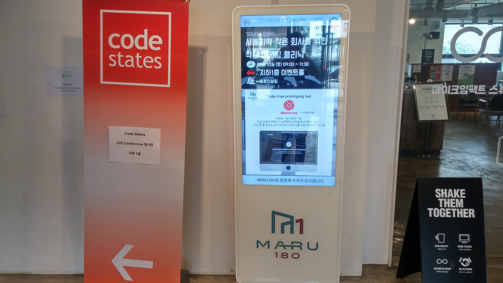
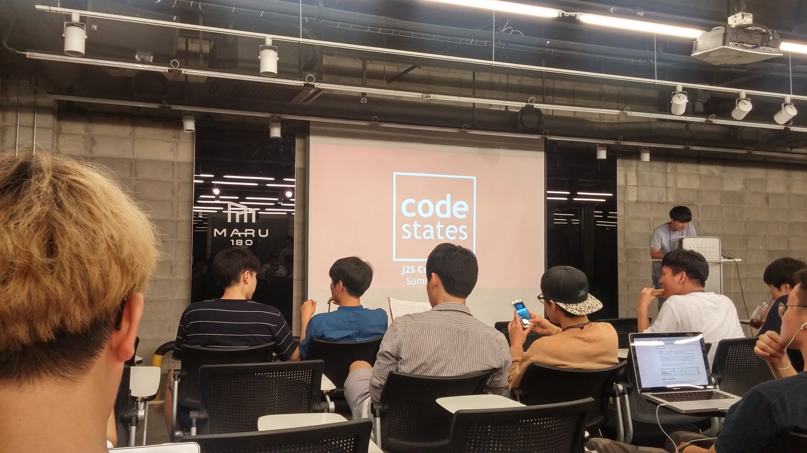
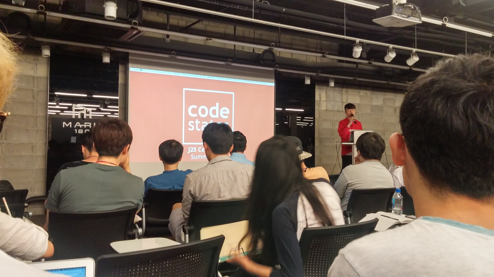
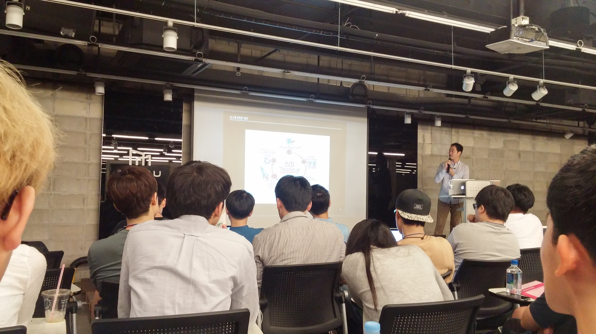
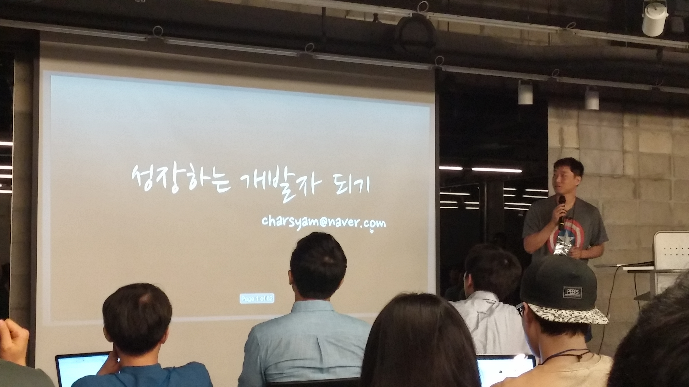
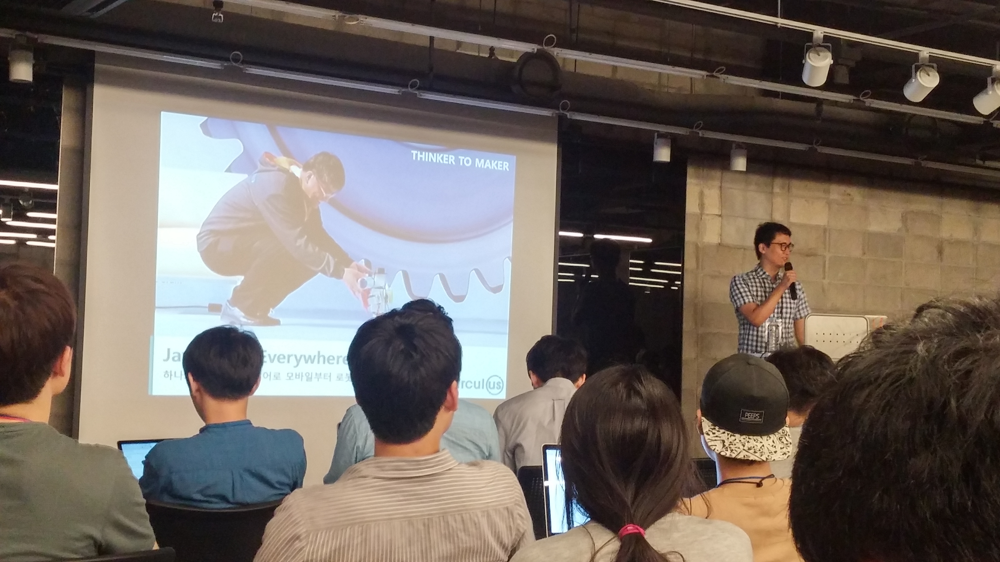
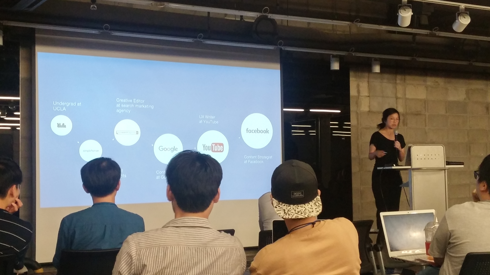
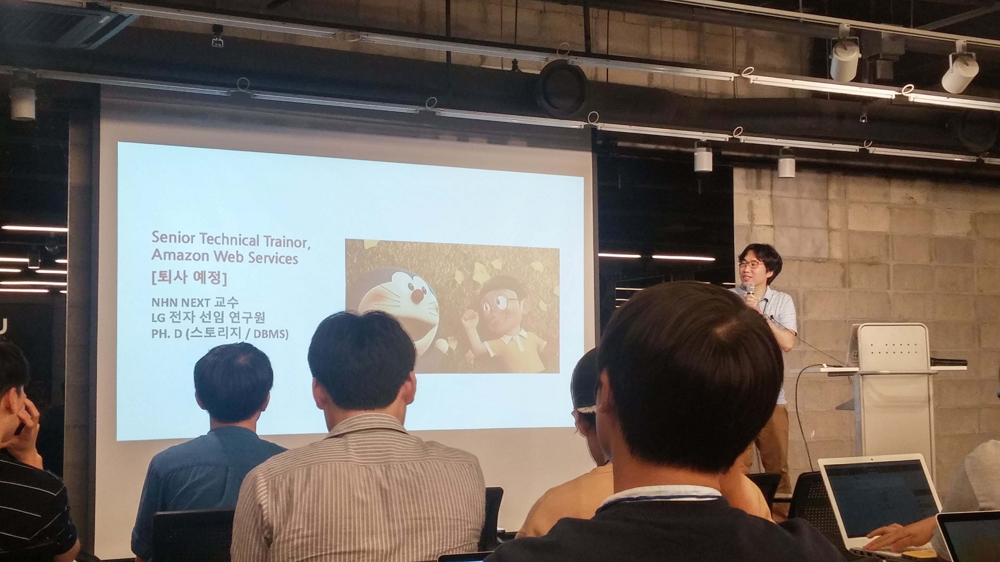

# 2016/09/10 Code States에서 J2S 컨퍼런스 참관 후기!
한참 페이스북에서 핫하게 공유되고 있었던 [Code States의 세미나](https://www.facebook.com/events/1644957542488207/permalink/1671448523172442/)에 참석했다.  
최근에 세미나를 너무 많이 참석해서 이번엔 좀 쉬어야겠다고 생각했는데 연사님들을 보고.....  

강대명님이 계신것을 보고 엄청 고민하기 시작했다  
으으 어쩌지 하다가 결정의 마침표를 찍어준 것이 바로!  

으아니!! 쿠팡에서의 A/B 테스트에 대한 내용을 들을수 있다니!! 이 AB테스트 때문에 얼마나 고민이 있는데 이걸 들으수 있다니!!  

그래서 얼른 페이스북에 가입하고 신청하였다 ^__^  
안되면 어쩌나 조마조마 했는데 아직 쓸 운이 남았는지 신청 접수가 되서 오늘 드디어! 세미나에 참석을 하였다.

요기 마루 180 1층의 가이드를 따라 지하1층으로 이동을 하였다.

10분 일찍 왔는데 줄이 어마어마하다. 내뒤에 서신분들은 못찍었는데 토요일 오후에 여기올 정도로 열정있으신 주니어 개발자분들이 국내에 이렇게 많다. ㄷㄷㄷ 열심히 해야해.. ㅠ
 

어찌됐든 드디어 세미나가 시작되었다! 

아래부터는 세미나 내용을 기록한것이니 천천히 감상하면 될것 같다.

## 0. Code States 소개

(Code States의 공동대표이신 김인기 대표님의 발표)

* 실리콘 벨리의 부트캠프를 경험하고, 이 시스템을 국내에 도입
* Code States에서는 Javascript를 중심적으로 진행한다. React, Angular, ES6 등등
* [부트캠프에 대한 Code States의 생각](https://brunch.co.kr/@yannheo/4)

#### 코스내용

(CodeStates의 공동 대표이신 허양일 대표님)
  - prep-course  - 4주 : 프로그래밍을 처음시작하시는분들
  - pre-course - 8주(온라인/오프라인) : 프로그래밍 입문 레벨 (실력에 따라 바로 다음 코스로 갈수도 있음)
  - immersive-course - 12주(오프라인) : 허양일님의 발표, 프로젝트 및 Job Search
    - FoundVisa 라는 스타트업을 통해 비자문제 해결을 위해 노력중
    - 시애틀, 도쿄와 파트너쉽
    - 직장인을 위해 저녁 & 주말시간 코스 개설

#### 후원사 이야기
  - 쿠팡 : 뭐 무슨 말이 필요하겠는가? 한국의 아마존, 한국속 실리콘벨리, 국내최고의 기술회사 등등 수많은 수식어가 있는 쿠팡이 현재 경력개발자를 아주 적극적으로 채용중이다. 실력에 자신있으신분들은 어서 신청하시길!
  - 퓨처플레이 : 기술기반 스타트업 투자
    - bagel : 스마트 줄자
    - alleys : 네비게이션 비디오
    - 뷰노 : 국내최고의 딥러닝, 뇌 관련 의학
    - ??? (회사명을 못봐서.. 죄송합니다 ㅠ) : 스마트 워치에서 메신저 답장 리스트를 제시하여 보내주는 서비스

## 1. 쿠팡, A/B 테스트 그리고 개발자 - 양병석

(쿠팡의 개발자 양병석님)
* 직장인이 되고 난뒤부터는, 학생일때보다 최신기술에 더 접하기 힘든것 같다
* 랜덤하게 사용자에게 2가지의 버전을 보여주고, 그때의 사용자의 반응을 보고 어느게 더 좋은지 판단하는 기법
* 실패담
  - 휴대폰을 넘어 다음 플랫폼 장악을 위해 구글이 TV를 노림, 안드로이드가 적용된 스마트 TV 시도
  - L사 근무당시 3년 동안 3개의 Google TV 출시
  - 명확하지 않은 고객과 기능
  - 전통적인 방식으로 1년에 1개씩 제품 출시
    - 100만원 이상의 TV를 스마트기능을 위해 교체하지 않음
    - 터치가 아닌 리모컨으로 스마트 기능 구현의 어려움
    - 웹서핑, 검색등을 TV처럼 오픈된 디바이스에서 하고싶어 하지 않음 (자기만의 디바이스에서 하고 싶어함)
    - 이로인해 구글은 스마트 TV를 접고 크롬캐스트로 전환 (영상 공유에만 집중 - 휴대폰, 노트북의 화면을 TV에서 볼 수 있도록)

#### 쿠팡에서의 AB 테스트
* 최소 기능을 만족하는 서비스를 만든다.
* 동시에 수십 수백개 테스트가 동시 진행
* 다양한 테스트를 동시에 진행하는것의 어려움
  - 한페이지에 10개의 테스트가 진행된다고 가정해보자
  - 그럼 2^10 페이지가 노출된다.
  - 스태틱 페이지가 아닌 테스트군에 맞는 다이나믹 페이지 생성
* 비 개발자들이 상황을 볼수있도록 컨트롤타워도 구현
  - 테스트 CMS를 통해 실시간으로 이 테스트로 인해 실 구매가가 0.018% 올랐다 등의 결과를 볼수있음

#### 개발자에게 AB테스트의 의미는?
* 예전처럼 1년동안 하나의 제품을 만드는 시대가 아니다. 변화에 유연한 구조에 대해 계속 고민고민
* 기획자가 의도한 방향이 나중에 어떻게 발전될지를 개발자들도 인지하고 있어야 한다.
* 속도!속도!속도!
* 작은 기능을 개선하고, AB테스트를 진행하면서도 이것이 **결국 어떤 큰 그림을 그리게 될지**, 그리는것을 원하는지에 대해 끊임없이 생각해 봐야 한다.

## 2. 성장하는 개발자 - 강대명

(두말하면 입이 아픈 연예인 개발자 강대명님)
#### 성장이란 무엇인가?
  - 개발실력
  - 커뮤니케이션

#### 개발실력을 키울려면?
  - 공부를 해야합니다 -> 그러나 무엇을 공부해야하는지 모름
  - 의식적인 연습이 필요하다
    - 1만시간의 법칙? -> 1만시간의 재발견
    - 아무리 게임을 많이해도 프로게이머가 될 수 있을까? No!
    - 그냥 하는것은 의미가 없다. 뭘 이루고 싶은지, 그걸 위해 무슨 노력을 해야하는지 의식을 해야한다.
  - 어떻게 연습을?
    - 나의 강점과 약점을 점검해보자
    - 피드백 후, 현재 하고 있는 방법을 수정
    - 효과측정
      - 하지만 아직 본인의 실력에 대한 측정방법이 정립되지 않았다.
      - 알피지 게임의 레벨업과 비슷한것이 개발자의 실력 향상
      - 바로바로 효과가 나타나진 않는다.

#### 학습방법
  - 전문가에게 듣는 방법
    - 세미나
    - 멘토링
    - MOOC

  - 스스로 공부하기
    - 인터넷 튜토리얼 (입문에 사용하기에 좋은것이 많음)
    - 책
    - 가르치기
      - 가장 추천하는 방법
      - 결국 듣는 사람보다 가르치는 사람이 더 많이 배우게 된다.
      - 설명을 하다가, 질문을 받다가 더 많은 지식을 얻게 된다.
    - 스스로의 경험을 더 깊게 바라보기
      - 왜 동작하는지? 왜 안동작하는지?
      - 왜 해결되었는지에 대해 더 깊이 파보기 (옵션을 고쳤다고 되는데 그게 왜 그런지에 대해 더 안찾아보면 성장하는 개발자가 될수 없다.)
  - 우리가 하고 있는 일이 가장 우리가 성장할 수 있는 발판이다.

#### 커뮤니케이션
  - 함께 일하고 싶은 사람인가? 하지만 이건 처음 보는 사람이 알 수 없다.
  - 결국 **다시** 함께 일하고 싶은가? 라는 질문에 대해 본인이 그런 사람인지 고민해보자

#### 나
  - 힘든 환경이라도,  **나에 대한 제어는 내가 한다.**
  - 팀은 코드리뷰를 안하더라도 동료에게 부탁할 수 있다.
  - 팀은 테스트 코드를 안만들어도 나는 만들어 둘 수 있다.
  - 결국 내가 움직여야 다른 사람도 움직일 수 있다.
  - 하루에 한줄이라도 코드를 작성하자.

#### Q & A
* 성장하는 개발자를 위한 책 한권
 - 클린코더, 1만시간법칙의 재발견
 
* 회사에 갇혀 있는 느낌인데 돌파구?
  - 회사 옮기고나서 3개월 안에 잘하는 사람이 되기 위해 노력
  - 동료가 커밋한걸 매일 아침마다 보면서 리뷰를 해준다.

* 어떤 기술을 공부해야할까요?
  - 내가 좋아하는 기술을 선택하고 그 기술에 대해 상위 1%가 되기 위해 노력하자.

* 코드리뷰 방법?
  - **1시간짜리 코드리뷰는 사실상 문법오류나 눈에 띄는 코드 수정밖에 없다.** (맞아요!!!! ㅠㅠ)
  - 개발에 들인 시간과 비슷한 시간을 사용해야 진정한 코드리뷰가 가능하다.

## 3. Javascript is Everywhere - 박종건

(라즈베리파이에서의 Javascript에 관해 국내 선구자이신 박종건님의 발표)

* 요즘은 다양한 언어가 탄생하여 개발시 다양한 프로그래밍 언어가 요구된다.
* 영어처럼 프로그래밍언어도 공통어가 없을까? 라는 질문에 대한 대답이 **Javascript** 라는 결론
  - 모바일부터 로봇까지 폭넓게 사용할 수 있음
* NodeJS의 등장으로 Javascript로 서버가 가능해졌다.
* 왜 Javascript 인가?
  - stackoverflow, Github에서 인기 1등
  - nodejs를 이용해서 하드웨어에서 이용 가능해짐

* IoT 환경에서 모든 부분을 Javascript로 구현하여 생산성 향상
* Node.js의 등장으로 FullStack 개발자라는 용어가 등장

#### Q & A
* Spring/php 를 node로 포팅하는것에 대해?
  - 팀 모두가 node를 잘하면 괜찮다. 근데 그게 아니라면 팀원들의 동의가 있을때에만 진행하는것이 낫다.

* 기기마다 최적화된 언어가 있는데 하나의 언어로 통일하는것에 대해?
  - 결국 사람이 하는것이기 때문에 그걸 유지보수 하는 측면에서 보면 하나의 언어로 통일하는게 괜찮다고 생각한다. 물론 통신장비같은 경우엔 예외다

* 개인적으로 javascript에게 화난적은?
  - 클라이언트에서 할때는 자유도가 높아서 좋아했는데, 하드웨어 할때는 레퍼런스가 없기도 하고 되야하는게 안되는 경우도 있어서 힘들었던 경험이 있다.

## 4. 외국계 회사에서 엔지니어로 성장하기 - 패널 토크 : 정호영(AWS), 손승욱(Asia-Pacific)

(패널토크의 주인공이신 정호영 & 손승욱님)

#### 영어를 얼마나 되야 하나?
  - 문법적으로 훌륭할 필요는 없다. 근데 인터뷰를 볼정도로, 본인의 의사를 표현할 정도는 되야 한다.

#### 학교에서 배우는것과 이런 프로그램에서 배우는 내용이 다른데 전공자는 어떻게 해야하나?
 - 손승욱 : 제가 중요하게 보는 부분은 base 지식을 가장 중요하게 본다.  
   시간이 지나면 지날수록 base가 잘 갖춰져있는 사람과 업무스킬만 가득찬 사람들과 성장속도 차이는 확실히 있다.  
 - 정호영 : 중요하지 않아서 안 와닿는게 아니다. 가르쳐주는 사람이 중요한걸 너무 재미없게 알려줘서 그렇다. 
  자료구조, 알고리즘, 운영체제와 같은 전공지식은 정말 중요하다. 개인적인 시간을 내서라도 공부해야 한다.

#### 비전공자가 이런 프로그램을 통해서 개발을 시작해도 외국계에서 일을 할 수 있나요?
  - 정호영 : 있는데, 긍정적이진 않다. CS분야가 굉장히 독특하다. 몇개월간의 교육으로 해당 업계에 취업할수있다.
  근데 반대로 6개월 배워서 김연아처럼, 추신수처럼 할수있나? 그건 아니지 않나. 마찬가지로 회사에서도 전공자처럼 몇년 배운사람과 차이는 난다.
  그렇다고 전혀 안되는건 아니다. 가능성이 있지만 낮다고 보는게 맞다.
  - 손승욱 :  목표와 과정을 혼동하지 말았으면 한다. 목표는 어느 회사를 가야겠다가 아니라고 생각한다. 그건 과정이다. 어느회사들을 거쳐가는것들이 전부다 과정일뿐이다.
   본인의 삶의 목표를 다시 한번 생각해보는게 좋지 않을까 생각한다.

#### 한국에서의 스펙과 외국에서의 스펙의 차이점은? 어떤걸 준비해야 할까요?
  - 정호영 : 난 15년 동안 게임만 하고 살아서 스펙이란걸 생각해본적이 없다. 전에 NHN NEXT에 교수 신청할때는 웹툰을 그려서 냈다.
  항상 스탠다드형을 원하는것 같다. 여러분 스스로가 내가 얼마나 훌륭한 개발자인지 증명하는것밖에 없다.
  - 손승욱 : 현재 회사는 13번 면접과정을 통해 합격했다. 처음 몇마디 나눠보면 대충 감이 오고, 코딩 인터뷰 과정에서 for loop를 어떻게 작성하는지만 봐도 감이 온다.
  레주메에 들어가는 스펙에 집중하지말고 내공에 집중하자. 레주메는 거의 3분밖에 못본다 스펙 볼시간도 없어서 티가 안난다.

#### 해고가 잘되나요?
  - 손승욱 : 너무 당연하다. 한국에선 그룹개념에 가깝다. 묻어갈수가 있다. 외국계에선 개인을 객관적으로 문서화 되어있다.
  내가 하는일에 빵구를 내면 그 누구도 대신 해주지 못한다. 본인의 시간관리, 업무관리 능력이 굉장히 중요하다.
  - 정호영 : 난 개인적으로 해고가 잘되는 문화가 좋다. 항상 명확한 목표가 정해지는게 좋다. 매니저가 정해준 명확한 목표를 준것을 달성하기만 하면 되니 심플하다.
  국내엔 연봉제이기 때문에 가만히 시간만 지나면 연봉이 오르고, 시간만 보내면 되는게 있다고 들었다.
  외국계에선 나보다 일 적게하는데 연봉 많이 받는 사람 없다.

#### 알고리즘의 중요성?
  - 정호영 : 일단 알고리즘 대회는 잘모르겠다. 퀵소트 3분만에 짜는거 별로 안중요하다. 문제해결능력이 중요한거다.
  - 손승욱 : 저희가 보는건 문제해결능력이다. 인터뷰 과정에서 문제를 풀고말고는 별로 안중요하다. 해결하는과정까지 가는 프로세스를 더 중요하게 본다.
  어떤 특정언어를 쓰는것도 도움이 안된다. 중고등학교 했었던 것처럼 알고리즘 외우려고 하지말고 본질을 익히고 시간이 걸리더라도 구현할수있을정도면 된다.

#### 외국계회사에서 일하면서 가장 힘들었던 점은?
  - 정호영 : 업무강도가 상당히 높다. 철저하게 나를 개인적으로 평가하기 때문에 정말 많은 노력이 필요하다.
  - 손승욱: 외국계에선 성과내는게 전부다. 국내에선 부장님 퇴근전에는 퇴근못하니 낮에 논다는 얘기를 듣는데 그런게 있을수가 없다.
  내가 1년동안 내 기량의 130% 이상을 내야 달성하는 목표를 정한다.
  외국계에 대한 환상은 안가지는게 좋을것 같다.

#### 사내정치
  - 정호영 : 정치는 있는데, 무능력한 사람이 정치로 높은 위치로 가는 경우는 없다. 능력 있는 사람이 정치로 좀더 높은곳으로 가는것을 정치라고 한다.
  - 손승욱 : 이미 정치에 휘말릴 정도면 어느정도 성공을 이룬 위치가 아닐까 생각한다.

#### 마지막으로 하고 싶은 말
  - 정호영 : 보여주기 위해서 노력하지 말라. 내 가치는 상대적인게 아니라 절대적인거다. 남이 결정하게 두지 말라. 남들의 조언을 너무 곧이곧대로 받아들이지 마라.
  한번더 비판적으로 생각해보고 판단했으면 좋겠다.
  - 손승욱 : 경쟁과 협동을 밸런스 있게 했으면 좋겠다. 경쟁은 하되 본인이 갖고 있는 **정보를 토대로 하지말라** 정보는 팀원들에게 공유하고 실력으로 경쟁해라.
실력이란 결국 본인의 탄탄한 기본기를 얘기한다.
잘난척을 연습해라. 내가 어떤걸 회사에서 어떤 효과를 얻었다는걸 잘 표현해야 본인의 실력만큼 평가를 받을수 있다.

## 5. 예비 개발자와 주니어 개발자가 알면 좋을 것들 - 박근우
#### 외교학을 전공한 학생이 왜 프로그래밍을 시작했을까?
  - 논리적인 일을 하고 싶었는데 우연히 파이썬 강의를 듣고 관심을 갖게 됨
  - 프로그래밍 동아리, 인디게임개발 등을 하면서 개발을 시작해봐야겠다고 결심

#### Code States를 통해 깨달은 점들
* 밤새지 말기
* 영어 : 모든정보가 영어로 되어있으니 독해능력은 필요하다.
* 빠르게 배울수 있는 능력
  - 슈퍼주니어? : 러닝커브 깡패! 경험이 적어도 빠르게 배울수있는 사람
  - 지금 얼마나 알고있는건 크게 중요하지 않다.
* 커뮤니케이션
  - 자신이 생각하는것이 항상 틀릴수 있다고 생각하는것

* 기록하기
* 화이트보드 코딩 (자료구조 & 알고리즘)
  - 면접을 위한 것
  - 내가 생각하고 있는것을 계속 얘기해야하고, 문제를 풀기위해 생각도 해야하고, 작성도 해야되서 연습이 필요하다.
  - 도서 : cracking the coding interview 추천
  - 도서 : 소프트스킬 추천
* 만들어보기
  - 김포프님의 [스터디 절대로 하지 마라](https://www.youtube.com/watch?v=4ZcNL96NMIk) 영상 참고
  - 책/이론만 보지말고 결국 사이드 프로젝트로 코드 구현을 하자.
* 함께하기
  - Pyjog/프론트엔드개발그룹/모각코/PyCON/JSCON 등에 참여하기

#### Q & A
#### 비전공자로 걱정하는것은?
  - 전공자에 비해 기본이 부족하여 이를 채우기 위해 노력중이다.

#### 타 학원과의 차이점은?
  - code states는 강사님이 없다.  통과해야할 테스트와 커리큘럼만 있다. 그래서 동료들과 함께 그 테스트를 통과하기 위해 직접 찾아보고 공부하는걸 훈련하는 과정이다.

## 6. UX : User Experience for developers - Connie Wu

(페이스북 본사에서 오신 Connie Wu)

#### 영어공부 열심히 하자^^

* 페이스북 본사에서 오신 Connie Wu님의 발표인데... 영어다 하하하하 단 하나의 글자도 빠짐없이 영어로 발표해주셨다.
* 굉장히.. 좋은 말씀을 하셨을거라 예상해본다.. 
* 많은 사람들이 웃는데 나만 웃지 못하네 하하하하

(이게 바로 나다!)

발표 감사합니다... 

## 철학하는 개발자 (부제 : 정신승리) - 정호영

(이번 세미나 최고의 호응을 일으키신 AWS의 정호영님)

* 우리는 왜 토요일에 여기있나?
  - 더 행복해지기 위해
* 연금술사처럼 나의 신화를 만들어가자
  - 내가 만족할만큼의 이야기
* 또라이 질량의 법칙
  - 어디에나 또라이가 있으니 우린 이런 사람과 살아가는 법을 배워야 한다.
* 외부의 물리적인 압력은 신경쓰지만 내부의 내적통제에 대해서는 신경을 쓰지 않는다.
#### 자존감
  - 무엇인가 할 수 있다고 믿는 믿음
  - 사랑받을 자격이 있다.
  - 자존감이 높은 사람은 회복 탄력성이 높다.
  - 실패해서 복구를 잘하는 사람이다.

#### 자존감을 세우려면
  - **통제할 수 있는 일**의 해결을 먼저 한다.
  - 지속적 발전
    - 습득한 지식을 훈련을 통해 내재화해야만 가치가 있다.
    - 코드리뷰
    - 육체활동 (건강관리)
    - 결국 운동/영어/코딩/독서 가 중요하다.
  - 화를 다스리자
    - 사람은 합리적인 존재가 아니라 합리화하는 존재
    - 화는 순간의 광기이다 참고나면 별거 아니다.
    - 화가 났다는 인정만으로 상황이 호전된다.
  - 미래는 없다.
    - 미래를 위해 현재를 열심히 살지 마라
    - 회사에서 미래를 이야기하는 사람 중에 남아 있는 사람 없다.
  - 적당한 논리력을 갖추자.
    - 지나친 논리력은 좋지 않지만 적당한 논리력은 필요하다.
  - 무지
    - 모르는것을 인정하자.
    - 어떤 현상이 있을 경우 5번의 why를 질문해보자.
  - 에피쿠로스
    - 우리들 각자는 미루다가 인생을 낭비한다.
    - 카르페디엠

#### 책 추천
  - 사피엔스
  - 꾸뻬씨의 행복여행

#### 하고싶은말
  - 행복해지려면 철학(정신승리)가 꼭 필요하다
  - 현재를 즐겨라
  - 탁월해지기 위해서는 **탁월한 노력이 필요**하다
  - 책을 많이 읽자  & 책 안 읽는 사람과 연애하지 마라

## End..
세미나가 끝이 나고, 네트워킹 파티가 진행되었다. But 나는 일이 있어 먼저 건물을 나왔다 ㅠㅠ  
하지만!! 세미나의 원래 목적이였던 쿠팡의 AB테스트는 나가기전 직접 양병석님을 찾아가 여쭤보았다.  
쿠팡에선 어떻게 수십,수백개의 AB테스트를 동시에 하고 있는지,  
그 AB테스트는 비지니스 로직까지 테스트 가능한 것인지,  
분기처리는 어느 Layer에서 하는것인지(예를 들면 L4에서 하는지),  
CMS에선 어디까지 역할을 담당하는지 등등!!  
100퍼센트 다 이해할 순 없었다. 직접 Code를 보진 못했으니 ㅠㅠ 하지만 대략적으로나마 어떻게 구현되었겠다 싶은 감은 잡혀서
우리 회사의 AB테스트 개편 & 개선에 대해 다시한번 고민해볼수 있을것 같다.  
짱짱 감사합니다 양병석님 및 쿠팡 관계자님들!   

> 나도 국비학원 출신이다보니 Code States의 시스템은 확실히 솔깃하게 들렸다.  
비난의 의도는 없지만, 국비학원이라는게 결국엔 **국가에서 수강료를 대신 지불**하기 때문에   
학원의 목적은 한명이라도 더 수강을 시키는 것에만 목적을 두고,  
학생의 목적은 공짜로 돈받으면서 수업듣고 취업도 그냥 시켜준다는 생각에 오는게 태반이라  
정말 양질의 교육과 동료들을 만나기가 힘들다.  
그런 면에서 정말 메리트가 있지 않나 싶다.  
But Java 교육을 듣고 싶은 사람들은 [패스트캠퍼스](http://www.fastcampus.co.kr/dev_camp_jwp/)가 유일한 대안이다. 
기승전 패캠? No No 기승전 자바지기 박재성님!

**어찌됐든 정말 정말 좋은 세미나 개최해주셔서 감사합니다 Code States!!**

