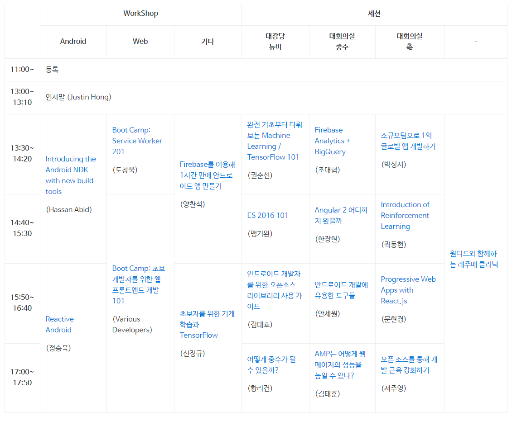
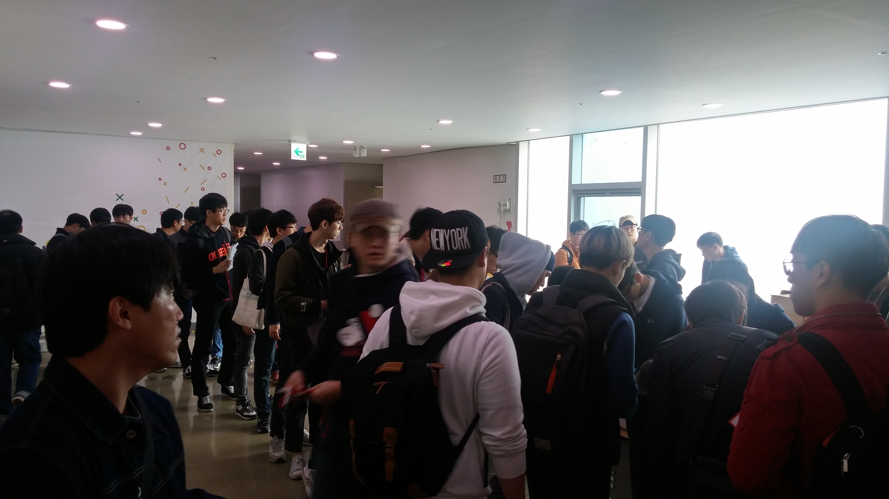
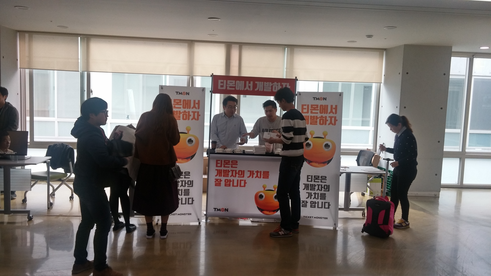
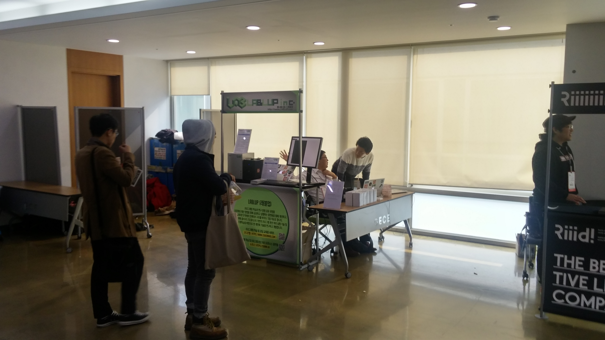
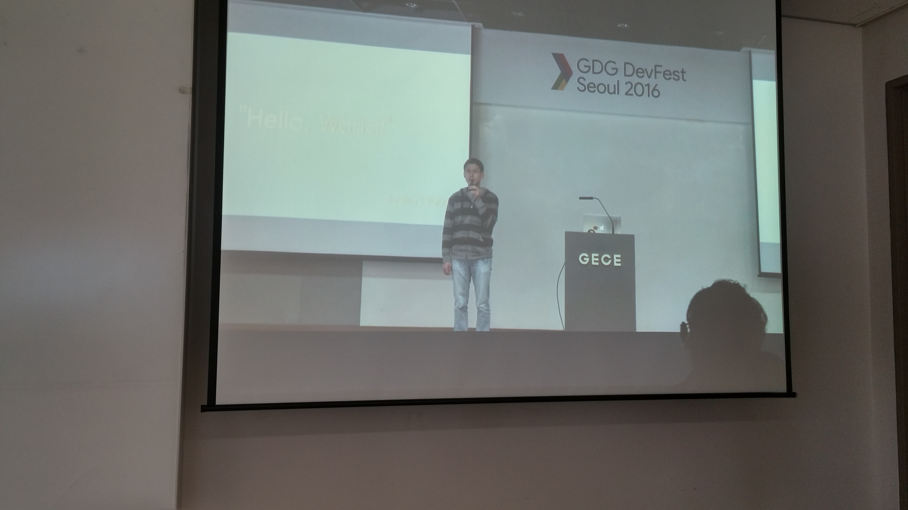
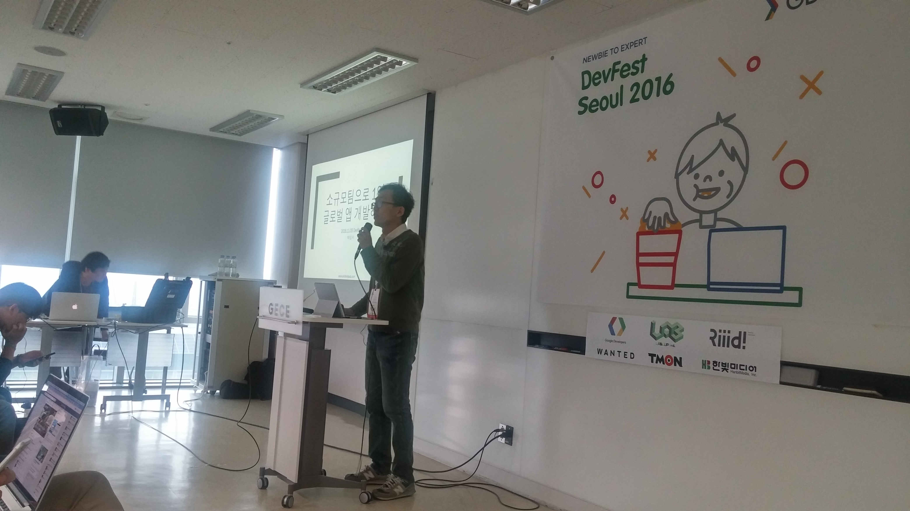
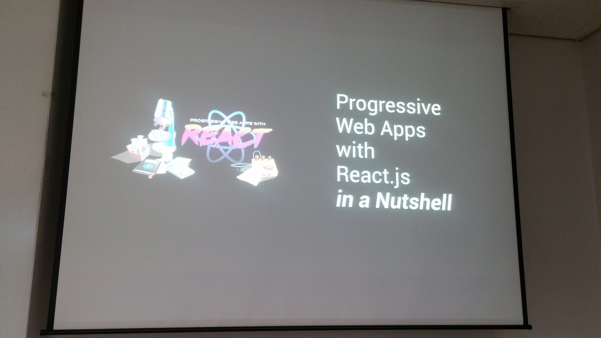
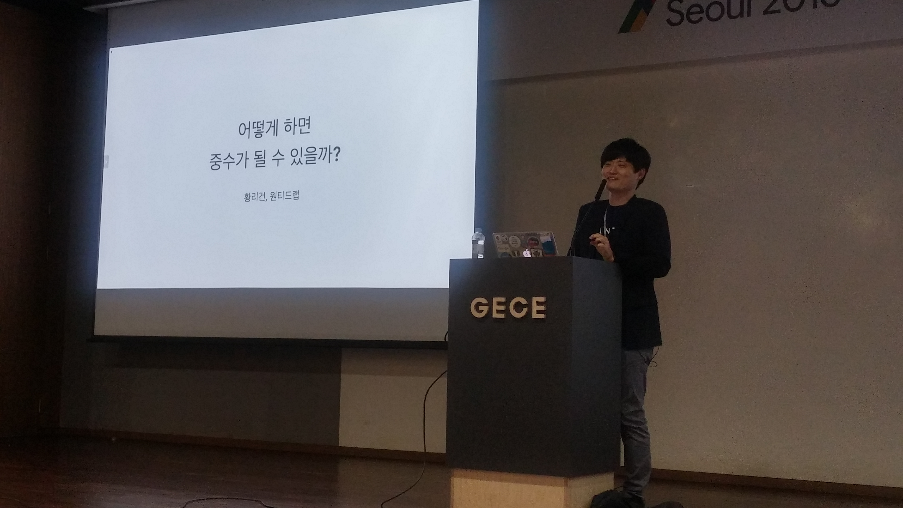
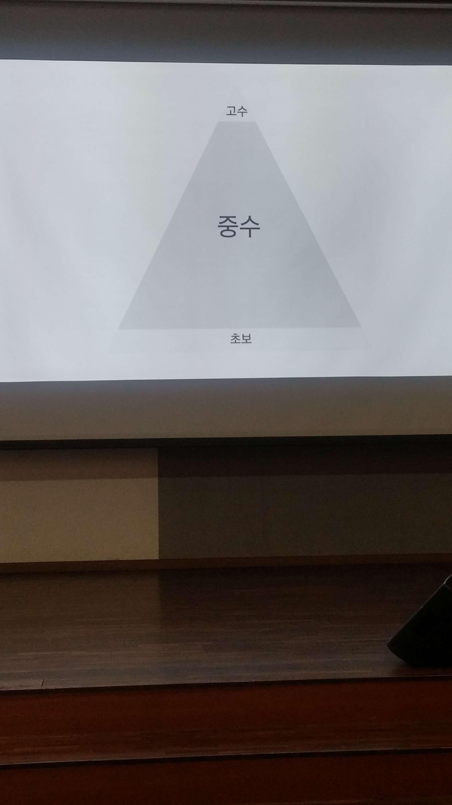

#GDG Dev Fest Seoul 2016 참석 후기
[Google Developer Group의 페스티발](https://festi.kr/festi/gdg-korea-2016-devfest-seoul/)에 참석했다! <br/>
이번엔 나혼자가 아닌 많은 우리 회사 분들이 함께 했다. <br/>
이전 GDG 행사는 Google 관련 제품소개가 많아서 참석하지 않았는데, 이번엔 너무나 다양항 주제로 진행하기도 했었고, <br/> 제일 듣고싶었던 주제가 있어! 참석하였다. <br/>



아쉽게도 원티드에서 진행해준 레주메 클리닉은 참여하지 못했다. <br/>
다행인건 여태 많은 세미나를 돌아다니면서 알게 된 점은 원티드가 참여한 세미나에선 레주메 클리닉이 다 있었다는 것이다. <br/>
혹시나 이직 혹은 취업을 위해 개발자 이력서 첨삭이 필요하다면 원티드에서 진행하는 세미나를 눈여겨 보는게 좋을것 같다 <br/>

당장 이번주 목요일에 [경력 개발자 채용 리쿠르트 행사](https://www.wanted.co.kr/campusrecruit)가 있으니 꼭꼭 참석하길 바란다! <br/>

어찌됐든! GDG 세미나 행사장인 서울대 글로벌센터에 들어서니 정말 정말 많은 사람들이 있었다 ㄷㄷㄷ... <br/>



(초상권 죄송합니다..) <br/>
등록 줄이 너무 길어 나는 이름표를 직접 펜으로 작성해서.... 참석하였다. <br/><br/>
이런 개발자 세미나에서 빠질 수 없는 후원사의 채용 행사도 놓칠 수 없다! <br/>



(가장 핫했던 티몬 채용)


(사진을 찍으려하자 회피하시는 뤼이드)


(눈길을 주시지 않았던 Lablup..)

이런 행사에 올때마다 이젠 잡xxx, 사xx 등에 더이상 의존하지 않고 회사가 직접 뛰어다니는 방향으로 구인이 변해가는 것을 느낀다. <br/>
구인난인 회사에서는 이런 세미나에 후원하여 채용을 적극적으로 진행해보는게 정말 좋을것 같다.<br/>

여러 부스를 구경하다가 세션 시작시간이 다되어 얼른 세션장소로 이동하였다. <br/>

## 인사말 - Justin Hong / 엔지니어링 총괄 디렉터, 구글코리아



(구글코리아 엔지니어링 총괄이신 Justin Hong) <br/>
처음 세션 시작전에 30분정도 메인 후원사인 구글사의 기조 발표가 있었다. <br/>
해당 발표는 모든 세션장소에서 볼 수 있도록 온라인으로 보여주었다. <br/>
기억에 남았던 이야기는 <br/>

* 올해 최대의 주제는 크롬 OS에서 안드로이드 어플이 구동되도록 한것
* 앞으로 크롬북에서는 안드로이드 생태계가 구축될 수도 있음
* Mobile First -> AI First로 변화

위 3가지 정도이다. <br/>
특히나 드디어 안드로이드 게임들을 노트북으로 버그없이 할 수 있는 건가!? 라는 생각에 흥분되었다. <br/>
폰 게임을 잘하지는 않지만, 저사양 폰으로는 확실히 요즘 나오는 스마트폰 게임들을 구동시킬때 버벅임이 심하고, <br/>
가상머신으로 돌리자니 버그가 많아 즐기지 못했던 사용자에겐 좋은 소식일것 같았다. <br/>
이게 대중화되면 크롬OS 전용 PC방이 생길 수도 있겠다는 생각이 들었다. <br/>
인사말 후에 드디어! 본 세션이 시작되었다.

## 소규모팀으로 1억 글로벌 앱 개발하기 - 박상서



(발표자 박상서님) <br/>
1인 기업 혹은 서비스에 관심이 많아서 앱은 개발하지 않지만 첫번째 세션은 박상서님의 발표에 참석했다. <br/>
박상서님은 우리나라 안드로이드 개발에 선구자 같으신 분인데, 다음과 같은 약력이 있다.

* 1회 구글 주최 안드로이드 앱 대상 수상
* 안드로이드 앱 개발자 커뮤니티 (안드로이드 펍) 운영
* 킬러노트 - 글로벌 1억 다운로드 앱

어마어마한 이력을 갖고 계신 분인데, 이번 발표는 개발에 대한 초점 보다는 1인 혹은 소규모 팀으로써 꾸준히 수익을 얻으려면 어떻게 해야하는지? 글로벌 진출은 어떻게 해야하는지에 좀더 초점이 맞춰져있었다. <br/>
다음은 발표 내용이다. <br/>

### 버전별 호환성
* Support library를 써야한다
* theme는 버그 투성이 (버전업할때마다 발생)
  - appcompact-v7을 써야한다.
* 제조사별 호환성
  - 삼성은 QA에 적극적, 모토로라는 제품출시를 적극적
  - 디바이스는 최소 삼성과 구글의 두가지 이상 폰으로 테스트 필요함
* 구글 플레이 서비스 API
  - 애드몹, 구글 애널리틱스, 구글 인증, 파이어베이스 등
  - com.google.android.apk 자동으로 업데이트 함
  - 구글의 불안정한 QA, 과거 버전에서 제대로 테스트 안함
* 릴리즈전 완벽한 문제 해결은 불가능 -> 하지만 관리할 수 있어야 한다.

### 릴리즈과정
* 구글 플레이에서 쉽게 가입 가능한 베타테스팅 기능 추가됨
* APK Staged Rollout 반드시 사용
  - 한번에 절대로 Publish하지 않기
  - 0.5%, 1%, 5%,...100% 로 나눠서 사용자 업데이트를 진행하게 해줌
  - 잦은 업데이트는 언인스톨의 원인 -> 천천히 조심스럽게 올리기
* 컬러노트의 경우 릴리즈에 걸리는 시간 : 최소 2주 ~ 1개월

### 문제 모니터링
* 개발자 콘솔 crashes에 보고된 문제 -> 실제 10배 이상 문제 발생했다고 봐야함
* 사용자 피드백 -> 100배 이상 발생했다고 봐야함
* Crashlytics, Firebase등의 외부 도구가 필요함
  - 실시간 확인이 가능해야 한다.

### 릴리즈 문제 확인 및 해결과정
* 릴리즈 시작은 월요일 오전이 최적
* 실시간 Crash 모니터링 시스템 구축
* 사용자수와 코드 변경정도에 따라 롤아웃 속도 조절
  - 사용자수가 많으면 0.5%만 올ㄹ도 바로 문제 발겨녀되지만 적으면 5%는 올려야 발견할 수도 있다.
  - 시간적 ㅇ유를 가지고 릴리즈 하기
* Runtime Exception 발생시
  - 정확한 문제 파악이 안되는 경우 Crash 방어 처리하고, 해당 문제에 대해 로그 수집 서버에 전송하여 언제/얼마나 발생하는지 모니터링 할수 있도록 해야함
* Runtime Exception 종류
  - 문제 재현이 안되는 경우 특정 버전 및 디바이스에서만 발생하는 것일 수 있음
  - 끝까지 해결해야함

<br/>
### 신규 안드로이드 버전 대응
* 신규 버전 대응
  - 일단 targetSdkVersion 수정 없이 현재 apk 문제 없이 동작하는지 테스트
  - targetSdkVersion과 상관없이 API의 동작 자체가 바뀌는 경우가 있음.

* 구글은 과거버전을 신경쓰지 않고 새로운 버전을 올려줄 것을 원함.
  - 4.4 버전 사용자는 여전히 많고 빠르게 줄어들지 않고 있음.

### 시장 기회
* 글로벌 진출
  - 미국의 상위 앱들은 대부분 미국 외 국가에서 만들어졌다.
  - 마찬가지로 한국 역시 중국 등의 국가에서 만들어졌다.
  - 인도, 브라질, 인도네시아가 성장중이니 주요 타겟으로 봐야함

* APK 사이즈?
  - 작년에 4GB 스토리지 최저가폰이 팔림 (외부앱 설치될 공간이 거의 없음)
  - 올해는 8GB 정도가 최소 용량
  - 즉, APK 사이즈는 10MB 초과하지 않기를 추천

* 글로벌 500만 다운로드시 혼자서는 먹고 살 수 있을것 같음
* 글로벌화
  - 글로벌 사용자 대응의 시작은 번역 작업
  - 번역자들은 대충 번역한다. 번역자에게 맡길시 **최대한 자세하게 코멘트를 추가해야 질좋은 번역을 받을 수 있다.**
  - 데이터 분석과 지역별로 사용자가 원하는 것 파악 가능 -> 구글 애널리틱스, Flurry, 파이어베이스 애널리틱스

* 공략 대상
  - 개발도상국은 광고 비용이 저렴 -> 사용자당 매출도 그만큼 낮다
  - 미국과 일본이 사용자당 매출이 가장 높다 (개발도상국에 비하면 6배이상 높음)
  - 완성도를 충분히 올려 놓은 후에 공격적으로 마케팅 하는 것을 추천
  - 어느 나라에서 잘나갈지 예측하기 어렵기 때문에 주요언어는 모두 번역해두면 좋음

* 수익화
  - 게임/만화/데이팅 제외하고 사용자가 지갑을 열지 않음 -> **내 앱은 살거야 라는 가정은 하지 않는게 좋다.**
  - 광고를 무조건 넣는 것을 먼저 고려해야 한다.
  - 앱 기획 및 UI 디자인에 미리 광고를 고려해야 한다.
  - 네이티브 앱에 **피드형이 많은 이유가 광고 효율이 가장 좋아서** 라는걸 잊지말기

### Q & A
* 앱 홍보는 어떻게?
  - 비슷한 앱이 수백개 있지만 잘만든것 별로 없다.
  - 구글이 잘해주고 있어서 잘 만들면 검색에 잘된다.
  - 구글의 검색광고가 가장 가성비가 좋다.
  - 검색 광고는 초반에 필수다
* 팀원이 5명?
  - 마케팅2, 서버개발자1, 나 이렇게 구성되어 있어서 기획/앱개발/디자인 다 혼자하고 있다.
  - 희망을 드리자면 혼자서 1년 광고 매출로 10억도 찍을 수 있다. 할 수 있으니 시도해봤으면 좋겠다.
* 어느정도 완성도 혹은 사용자가 생겼을때 광고 집행하는지?
  - 일 다운로드 15000, 별점 4.6찍고 나서 광고 집행하는걸 기준
  - 광고 집행했다고 100명중 50명 나가진 않는다. 5명정도 나간다. 그 사람들의 댓글에 가슴이 아플뿐
* 수익 모델은 광고만?
  - 광고 중심이지만 유료도 고려하는것도 좋다.
  - 근데 실제 광고가 90%의 매출을 담당해서 광고를 포기할 순 없다.
  - 앱 기획시부터 무조건 수익화를 먼저 고려해야 한다.

* 번역해서 출시하면 효율이 좋은지?
  - 브라질, 러시아 등은 유럽권이나 포르투칼 보다 훨씬 효율이 좋았음
  - 인구수가 많은데 고유의 언어 가지고 있은 국가는 번역 꼭하길 권장
  - 유럽은 영어 잘하니 영어로만 출시하면 알아서 잘쓴다.


## ES2016 101 - 맹기완


(Javascript 개발자라면 누구나 아실만한 맹기완님의 발표) <br/>
맹기완님은 꾸준히 Javascript와 관련한 스터디를 진행하고 계신다. <br/>
이번 스터디는 끝이 났고 다음에 또 하시게 된다면 참석하면 좋을것 같다. <br/>
(회사 동료분이 최근 스터디에 참석했었는데, 극찬 of 극찬을...)


(내가 듣기엔 거의 이런 느낌!?) <br/>

[발표자료](http://www.bsidesoft.com/2913)가 이미 올라왔기 때문에 발표자료에 작성된 Code와 함께 보면 더 좋을것 같다. <br/>

* 인터페이스
  - 사양에 맞는 값과 연결된 속성키의 셋트
  - 어떤 Object라도 인터페이스의 정의를 충족시킬 수 있다.
  - 하나의 Object는 여러개의 인터페이스를 충족시킬 수 있다.
* Iterator Interface
  - next라는 키를 갖고
  - 값으로 인자를 받지 않고 IteratorResultObject를 반환하는 함수가 온다
  - value와 done이라는 키를 갖고 있다.
  - 이중 done은 계속 반복할 수 있을지 업을지에 따라 boolean을 반환한다
```
{
  next: function() {
    return {value :1, done:false};
  }
}  
```

* Iterable Interface
  - Symbol.iterator 라는 키를 갖음
  - 값으로 인자를 받지 않고 Iterator Object를 반환하는 함수가 온다.

```
{
  [Symbol.iterator]: function() {
    retrn {
      next : function() {
          return {value : 1, done : false}
      }
    }
  }
}
```

### while문으로 삺보는 Iterator
```
//기존 while
let arr = [1,2,3,4];
while(arr.length >0) {
  console.log(arr.pop());
}

// Iterator Interface
{
  arr: [1,2,3,4],
  next() {
    return {

      done : this.arr.length == 0,
      value: console.log(this.arr.pop())
    };
  }
}
```

* 반복자체를 하지는 않지만,
* 외부에서 반복을 하려고 할때
* 반복에 필요한 조건과 실행을
* 미리 준비해둔 객체
<br/>
* 반복행위와 반복을 위한 준비를 분리

* 미리 반복에 대한 준비를 해두고
* 필요할 때 필요한만큼 반복
* 반복을 재현할 수 있음
<br/>
* 직접 Iterator 반복처리기를 구현
```
const loop = (iter, f) => {

  if(typeof iter[Symbol.iterator] == 'function') {
    iter = iter[Symbol.iterator]();
  }

  if(typeof iter.next != 'function') return ;

  while (true) {
    const v = iter.next();
    if(v.done) return;
    f(v.value);
  }
}


const iter = {
  [Symbol.iterator]() {
    return this;
  },
  arr:[1,2,3,4],
  next() {
    retrn {
      done: this.arr.length == 0,
      value : this.arr.pop()
    }
  }
};

loop(iter, console.log);
```

* for.. of는 Iterator를 받을 수 있다. 그전 예제는 Iterable만 가능하다
* class : 기본적으로 생성자(constructor)를 가짐

### Generator

* generator는 while문을 중간에 멈출 수 있다.
* 기존 Iterator와 달리 this를 사용하지 않고 구현이라 코드양이 감소

## Progressive Web Apps with React.js - 문현경



(문형경님 사진을 안찍고 엉뚱하게 발표 자료를 찍었던... 으헝헝 ㅠㅠ) <br/>

문형경님의 실제 React 앱이 있는데 어떻게 프로그레시브 앱에 기능 추가를 하는지에 대한 이야기를 들었다. <br/>
이건 발표시간에 너무 사람이 많이 와서 (초고수 세션이였는데.... 방이 터지도록 사람들이 오셨다. 리액트의 인기를 세삼 깨닫는다.) 방의 열기가 심했다. <br/>
하지만 에어컨은 되지 않아...


(강제 대구행) <br/>
내 고향 대구가 생각나는 시간이였다. <br/>
발표자료는 금방 올려주신다 하셔서 확인되는대로 바로 재공유하겠다! <br/>

### Part1.

* Lighthouse를 통해 본인의 Progressive App에 대한 검증이 가능하다.
  - 크롬 플러그인 제공
  - 모바일에 얼마나 친화적인지 검증
  - 레포트 제공  
* 이제는 모바일 플랫폼이 최우선 타켓 플랫폼
* HTTPS를 이젠 무조건 사용하자
  - Service Worker/ Push Notification을 사용하여 사용자가 좋아하는 앱을 만들기 위해
* WebAppManifest
  - 간단한 JSON 파일
  - 설치가능한 웹앱을 위한 정보 제공

### Part2. Page Load Performance
* 네이티브앱은 로딩중 이란게 없지만 웹앱은 그게 존재한다. 그래서 이를 제거하려고 하는게 Progressive App이다.
* 웹앱이라 하더라도 사용자가 인지하지 못할 정도의 속도라면 충분히 네이티브앱이라고 볼 수 있다.
* Response, Animation, Idle, Load -> Lighthouse에서 검증가능하다
* TTI : Time To Interaction
  - 가장 중요한 성능 지표
* PRPL패턴
  - Push, Render, Pre-cache, Lazy-load
  - index.html을 통해 필요한 걸 읽고 서버에서 바로 밀어주는 방식
  - 하나의 큰 파일을 라우트 기반으로 분리
  - 다른 라우트에 필요한 파일들은 이후에 별도로 호출
  - 렌더링은 클라이언트보다 서버렌더링이 더 좋다. js가 호출안되도 그려지긴 해야된다.
* Webpack2 Tree Shaking
  - ES2015에서 사용
  - Dead Code 제거

### Part3. 오프라인 혹은 네트워크가 안좋은 상황
* Service Worker
  - 백그라운드에서 별도로 동작
  - 오프라인 상태에서 변경 사항을 저장하고, 온라인이 연결되며 같이 전송한다.
* App Shell
  - 네이티브앱과 같이 빠른 로딩을 보여주는 한가지 방법
  - 회소한의 HTML, CSS, JS로 앱의 기본골격 UI를 구성


### Part4. Progressive Enhancement
* 어떤 상황에서도 사용자는 컨텐츠를 볼 수 있어야 한다
* 유니버셜 렌더링
  - 서버에서 생성된 초기 HTML 컨텐츠를 바로 전송
  - 초기 렌더링시 추가 HTML/JS/CSS파일 fetch 제한

## 어떻게 중수가 될 수 있을까? - 황리건


(원티드랩의 CTO 황리건님) <br/>

요우! 가장 기대했던 세션이다! <br/>
황리건님은 세미나에서 진짜 많이 뵈었던것 같다. <br/>
개발자 채용행사, 인사담당자 행사 등 원티드 행사에 자주 참석했던 나로서는 참 반가웠다. <br/>
이번 발표는 원티드의 CTO로 계신 황리건님께서 어떻게 하면 초보에서 중수로 갈 수 있는 지에 대해 이야기 해주셨다. <br/>
좋은 얘기도 많았지만 꿀팁도! 정말 많았다 <br/>
지금 초보라는 생각이 든다면 꼭 아래 내용을 보길 바란다.

### Intro


초보도 많지 않지만, 고수도 많지 않다. 나머지가 다 중수라고 봐야하나? <br/>
최근에 중수가 되기 위해 노력했던 안드로이드 개발의 경험을 얘기 <br/>
초보란? 기술이 부족하고 상황대처에 미흡한 사람

### 안드로이드 초보탈출
* 플래시 개발 경험이 7년 있었지만 현재 쓰는게 하나도 없다. 다만 다음과 같은 것을 배웠다.
  - 디버깅
  - 최적화
  - UI 애니메이션
* MS 에반젤리스트 경험으로 얻은 것
  - 기술선택
  - 잘하는 사람 찾기
  - 커뮤니티 이해
  - 영어 읽기, 듣기

* 기술 잘 선택하기
  - 중요하지 않은 기술에 투자할만큼 개발인생이 길지 않다.
  - 핵심가치에 집중하고 사용자층이 넓거나 빠른 성장이 기대되면서 나에게 맞는 기술
  - 원티드 - 연봉정보를 참고하여 연봉 참고
* 기술로 얻고자 하는 핵심가치가 무엇인가?
  - 개인적으로는 사용자 경험에 가치를 두었다.
  - 성능, 안전성, 데이터, 생산성, 보편성 등 개개인마다 가치가 다를 수 있다.
* 클라이언트 위주의 개발 기술 선택
  - HTML -> 플래시 -> 실버라이트 -> HTML5, 윈도우 앱, 모바일 앱
  - 모든 선택이 옳았다고 볼순 없지만 다 성공했는것 같진 않다.
* 기본기 80, 신기술 20
  - 처음에는 세미나, 커뮤니티때문에 신기술에 쉽게 접근하고 공부하려고 한다.
  - 그러나 **중수,고수는 기본기에 충실하다.**
  - 교과서 선택이 중요하다
  - 현재 구글이 밀고 있는 안드로이드 교과서는 **Udacity** 이다. (**현재 한글자막 지원이 된다.**)
* "보여줄 수 있는" 뭔가 만들자
  - 처음엔 점심 투표 앱을 만들었다.
* 누가 잘하는지 찾자.
  - 최신기술 20은 이 잘하는 사람을 팔로우하면서 얻자.
  - 이 사람들을 통해 요즘 뭘 쓰는지 알자.
* 기술변화를 감지하자
  - 플랫폼의 변화에 대해 잘 쫓아가야 한다.
  - 플래시가 갑자기 사라졌다. 플래시 개발자들은 붕 떠버렸다.
  - 공식블로그 -> 컨퍼런스 -> 에반젤리스트 -> 고수등을 팔로우하자
* 커뮤니티의 활용
  - 잘하는 사람을 찾고 만나기
  - 기초 컨텐츠 좌표 확인, Q&A
  - 다른 사람들은 어떤걸 쓰나 보기
  - 중수 ~ 고수가 되었음을 알리기 (내가 아는 지식의 전파를 통해 나를 아는 사람에겐 더이상 이력서가 필요가 없어진다.)
  - 좋은 동료나 직장 찾기

* 고수가 되려면 실험을 많이 해야 한다.

### 개발자의 상황대처
* 보통 대부분은 이런 일들이 대부분이다.
  - 어떤 프로젝트를 진행하는데 상황과 목적은 있는데, 언제까지 가능할까?
  - 어떤 문제가 있는데 언제까지 해결될까?
* 한때는 말 안하고 개발만 잘하는 사람으로 지냈었음
  - 당시엔 말하는게 낭비라고 생각함
  - 팀장님의 조언 : 커뮤니케이션이 중요
  - 커뮤니케이션 is 동기화 : 변경사항 있으면 모든 사람이 동일한 이해가 있을때까지 동기화
  - 말 한마디에 천냥 코드도 갚는다. 커뮤니케이션 코스트가 개발코스트에 비해 훨씬 낮다
  - 의미없는 코드를 짤만큼 개발 인생이 길지 않다.
* 개발 인생 기간
  - 30대 중반만 되도 코딩 인생 황혼기
  - 한 분야의 장인이 되는데 걸리는 시간 약 10년 -> 많아봤자 2~3개 정도 기술
  - 진짜 의미 있는 것과 의미 있는 기술을 선택해야 한다
  - 내 시간을 투자할만한 분야가 무엇인지 진지한 고민이 필요하다.
* 하지만 기술은 변해도 가치관과 소프트 스킬은 남는다.
  - 상황대처능력, 커뮤니케이션등
  - 가장 인간적인 기술이 가장 오래 쓸 수 있다.
  - 개발자들은 보통 PM이 되는 것을 싫어한다. 코드를 가지고 프로그래밍을 하는 것을 사람을 통해 프로그래밍을 하는 것과 다를바 없다.
* 연기처럼 몸으로 체득한 기술은 정말 오래 간다.
  - 플랫폼, 라이브러리에 대한 기술은 언젠가 사라지겠지만, 인간에 대한 기술, 소프트기술은 오래 간다.
  - 설계, 소통, 분석, 관리 등

### Q&A
* 좋은 개발자란?
  - 집요함이 있는 것 같다.
  - 남들은 모르는데 본인이 만족못해서 더 파고드는 사람
  - 잘하려고 하는 체계적인 접근법이 있는 사람
* 교과서를 잘 찾는 방법
  - 교과서는 초보탈출용이다.
  - 공식 자료가 별로라면 비공식이지만 준교과서에 가까운 교과서를 찾아서 봐야한다.
  - IOS같은 경우 공식홈페이지 자료보다는 스탠포드에서 제공하는 동영상 강좌를 봤었다.
* 30대 중반 넘어서도 개발하시는 분이 많은지
  - 현재는 30대 중반이면 날아 다닌다.
  - 그러나 고민이 많은 시기이다.
  - 전성기이지만, 옮길 곳이 잘 없다. 다음 스탭을 찾기가 힘들다.
* 자신한테 맞지 않는 기술이란걸 언제 발견하게 되는지
  - 개인적으론 코드를 짤때 느껴지더라.
  - 너무 재밌어서 그것만 하게 된다.
* 어떤 점을 어필해서 직군을 계속 변경할 수 있었는지
  - 딱히 어필한건 없다.
  - 플래시 책을 보고 MS에서 실버라이트 MVP 지원을 제안했었다.
  - 에반젤리스트에서 일하다 보니 제품개발이 너무 갈증나 스타트업을 시작했다.
* 프론트와 백엔드 같이 하고 있는데 하면 좋을지
  - 제품에 초점을 맞출것 같다
  - 개인적으로는 프론트엔드에만 했었는데, 백엔드를 하고나니 더 좋은 제품을 만들어 낼 수 있는것 같다.
  - 제품을 만드는데 도움이 된다면 할것 같다.
  - 하지만 회사 취업을 위해서라면 둘 중 하나를 선택하는게 좋은것 같다. 네이버&카카오에 지원하면서 둘다 잘한다고 얘기하면 현실적으로 어려운것 같다.
* 코딩했던 경험이 기획자로서 도움이 될지
  - 무조건 도움이 된다.
  - 기획, PM은 기술을 몰라선 안된다고 생각 한다.
* 비 대중적인 기술에 집중하는 것이 좋은지
  - 본인의 핵심가치에 집중하는것이 더 중요하다
  - 대중적이라고 해서 꼭 따라갈 필요는 없다.
  - 하지만 주변 사람들이 모두 하지말라고 하면 한번 자세히 들어보는것도 좋을것 같다.

## 후기
사람이 너무 많아서 매 세션 이동시마다 복잡복잡했지만, <br/>
그래도 다녀오길 너무 잘한것 같다. <br/>
세미나를 다녀온다고해서 코딩력++ 되는건 아니라고 생각한다. <br/>
결국 뭘 짜봤어야 늘거라고 생각하긴 하지만, <br/>
현재 내가 갖고 있는 생각이나 기준의 환기 역할을 충분히 한다고 생각한다. <br/>
다른 개발자들은 뭘 하려나? <br/>
이런 고민이 있을때 어떤 선택이 좋으려나? <br/>
등등의 생각이 있다면 이런 세미나에 한번 참석해보길 추천한다. <br/>
물론 이거 다녀왔다고 나 실력 늘었다는 생각은 착각이니, <br/>
집가서 코딩+커밋은 꼭 하길!
