# JetBrains Night 2017

JetBrains Night 2017에 다녀왔습니다.  
사전에 JetBrains 관련 커뮤니티 분들과 


## 1. IntelliJ IDEA의 Tip & Tricks

주제가 [2016년도](http://jojoldu.tistory.com/61)와 같아서 내용이 거의 비슷하겠구나 싶었는데, 생각보다 많이 달랐습니다.  

> 위 링크를 통해 한번 보시고 아래 내용을 보시면 더 좋습니다.

모든 단축키는 Mac OS X 기준으로 진행됩니다.

* Structure (```command+7```)

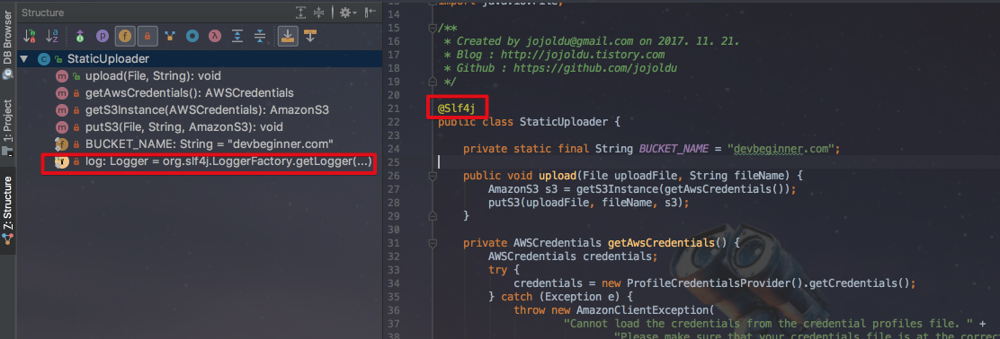

> 해당 클래스의 전체 구조를 보여주는데, 이게 왜 장점인지 궁금해하실텐데요.  
lombok을 적용하고 실제로 잘 적용되었는지, 어떻게 구성되었는지를 이를 통해 바로 확인할 수 있습니다. 

* search에서 ```#``` 를 태그처럼 활용할 수 있음

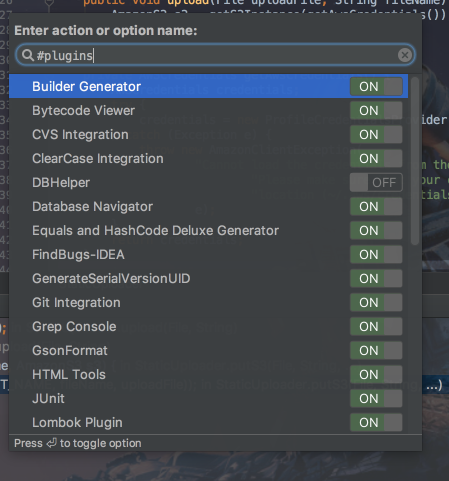

> ```command+shift+a```로 action 검색시, plugins 옵션만 바로 검색하고 싶다면 ```#plugins```로 하면 plugins 옵션들만 바로 출력도비니다.

* 자주 쓰는 기능들은 action 검색 단축키 등록해서 사용하기

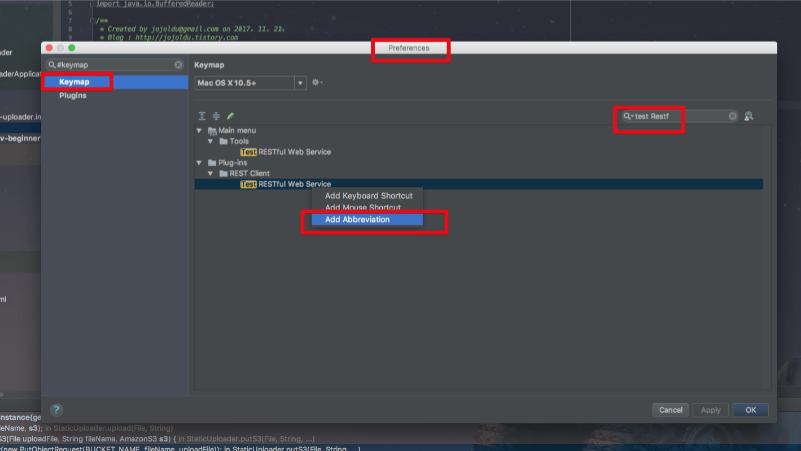

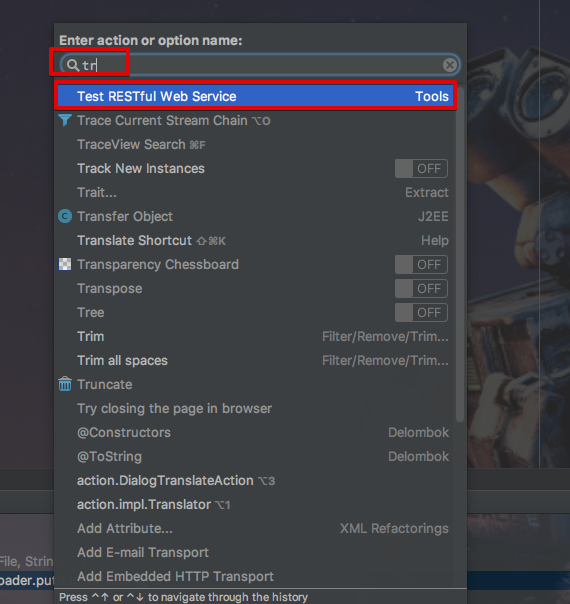

> ```tr```로 Abbreviation 등록하여 쉽게 찾기


* autoscroll 선택하면 파일선택시마다 좌측 프로젝트 화면 변경

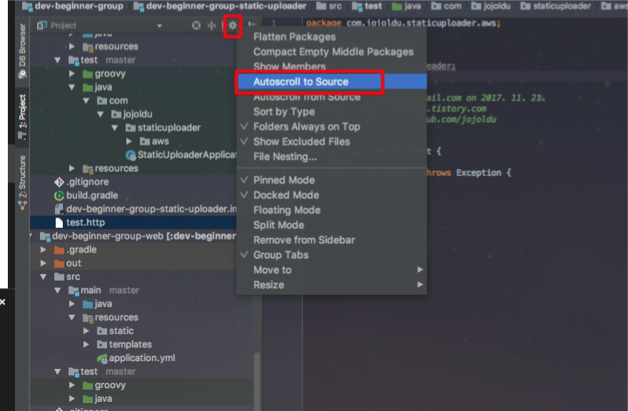

* ```ctrl+shift+space``` 스마트 자동완성

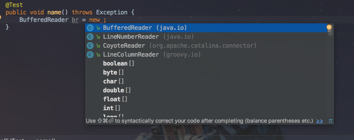

(Basic : ```Ctrl+Space```)

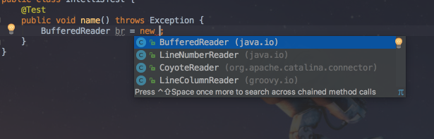

(Smart : ```Ctrl+Shift+Space```)

> 좀더 상세한 차이는 [가이드 문서](https://confluence.jetbrains.com/display/IDEADEV/Completion+features) 를 참고하세요.


* ```option+/```
* 코드에서 JSON 문자열 바로 만들기

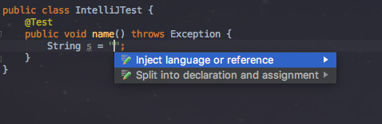

문자열 안에서 ```option+enter``` -> ```Inject Language or Reference```선택후 엔터  

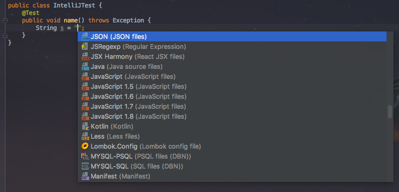

JSON 선택

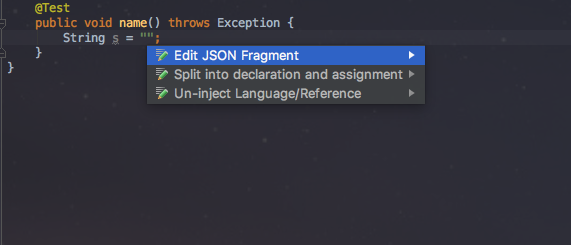

Edit JSON Fragement 선택

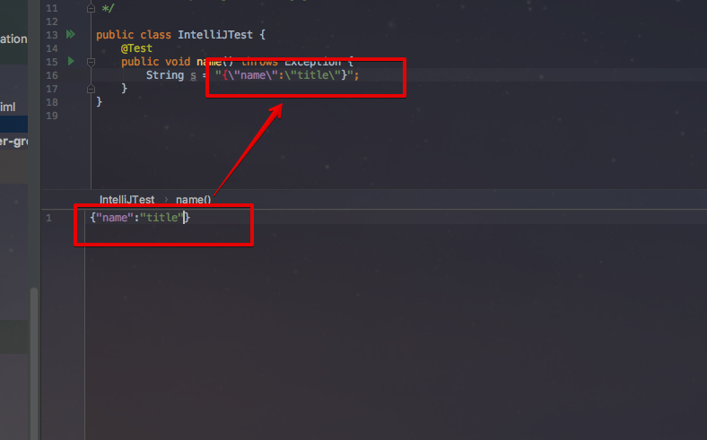

아래 하단 영역에서 JSON 입력시 자동으로 커서가 있는 곳에 ```\```추가한 JSON 형태의 문자열 추가 됨

> 동일한 방식으로 Regex를 선택하면 정규표현식 체크가 바로 가능

* 여러 라인으로 분리된 문자열들 한줄로 합치기

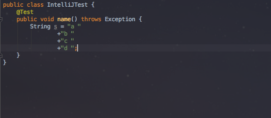

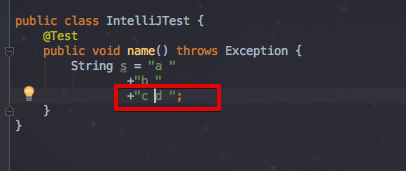
 
> "c" 문자열 뒤에서 ```ctrl + shift + j``` 사용시 바로 아래에 있는 문자열 "d"와 "c"가 한 라인으로 합쳐집니다.

* Refactor 중, 상속 -> 구성으로 변경하기
* Analaze Date Flow 로 현재 변수/필드의 데이터 변경 지점 찾을수 있음
* Duplicates Project로 중복된 코드 찾기
* Structural Search로 원하는 형태의 템플릿 코드들 찾기

```java
try{
    $code$;
}catch(Exception e){
    System.out.println(e.getessage());
}
```

* Replace Structure 로 배드 패턴은 교체할 수 있음
* Stream 디버깅

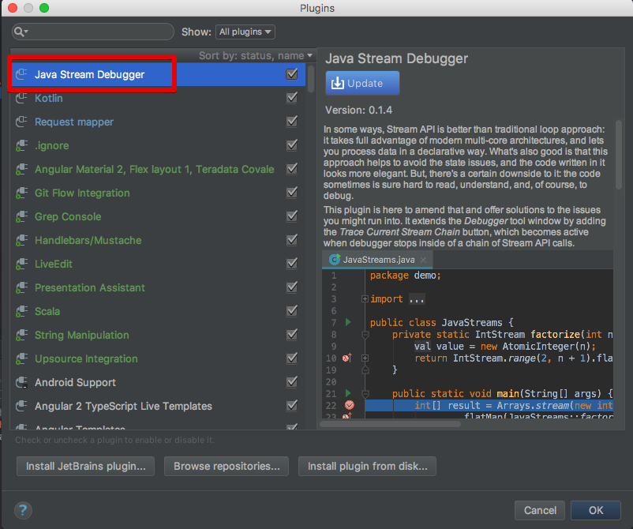

플러그인을 설치하고, Stream 코드에 디버거모드에서 스트림 디버거 버튼(디버거 버튼 가장 우측)을 클릭


스트림 디버거 화면의 각 탭에서 스트림 메소드들의 결과를 확인 가능


> 각 스트림 메소드를 통해 값들이 어떻게 변하는지 실시간 확인 가능합니다.

* JVM Debugger Memory View Plugin으로 메모리 확인 가능
* SQL 문자열로 쿼리 실제 바로 실행 가능
* .http 파일로 Rest 테스트 대상 기록할 수 있음

> 2017.3버전부터 .http 형식이 가능한것 같습니다.

* plugins -> MetricsReloaded
* Advanced Java Folding Plugins : Scala 표현식으로 보여줌

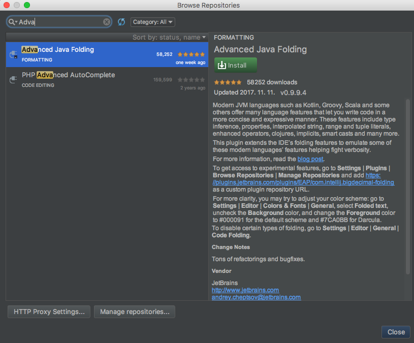


