# JetBrains Night 2017 - IntelliJ IDEA의 Tip & Tricks

JetBrains Night 2017에 다녀왔습니다.  
사전에 JetBrains 관련 커뮤니티 분들과 JetBrains 개발자분들이 모여 간담회 같은 자리가 있었습니다.  
하지만 전 영알못이라.... ㅠㅠ..  

> 영어가 필요한 자리라고 사전에 얘기해주셨으면 자기소개 정돈 미리 준비하고 갔을텐데 라는 아쉬움이 조금 있었습니다.  
  
파이콘 후원때처럼 **개발자 세미나에 대한 지원**이 있으니 관심 있으신 분들은 [김우성님](https://www.facebook.com/realmadman69)께 한번 연락해보시면 좋을것 같습니다!  
  
이번 2017 행사에서는 사정상 세션 1인 IntelliJ IDEA의 Tip & Tricks 만 보고 왔습니다.  
다른 세션은 다른 분들이 해주시지 않았을까!? 하는 기대감으로 세션1만 정리하였습니다.  

## 1. IntelliJ IDEA의 Tip & Tricks

주제가 [2016년도](http://jojoldu.tistory.com/61)와 같아서 내용이 거의 비슷하겠구나 싶었는데, **생각보다 많이 변화되었습니다**. 

> 위 링크를 통해 한번 보시고 아래 내용을 보시면 더 좋습니다.

모든 단축키는 Mac OS X 기준으로 진행됩니다.

### Jetbrains Issue

[YouTrack](https://youtrack.jetbrains.com)에서 JetBrains 툴들의 모든 이슈를 처리해줍니다.  

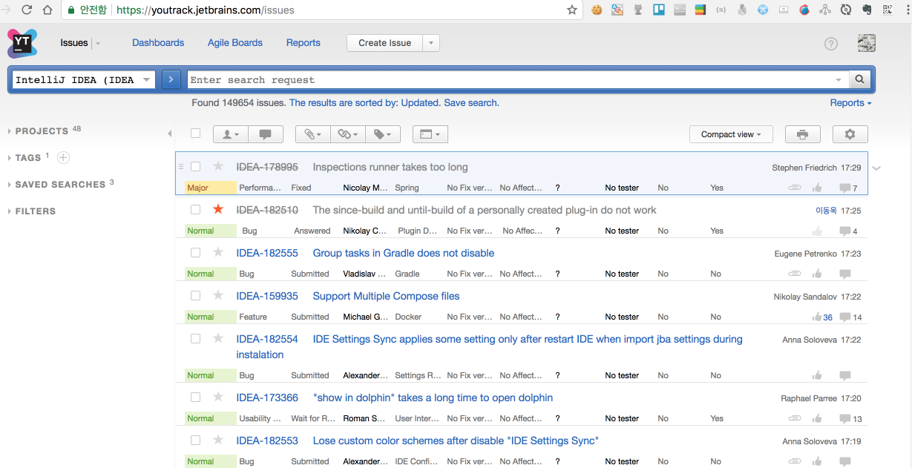

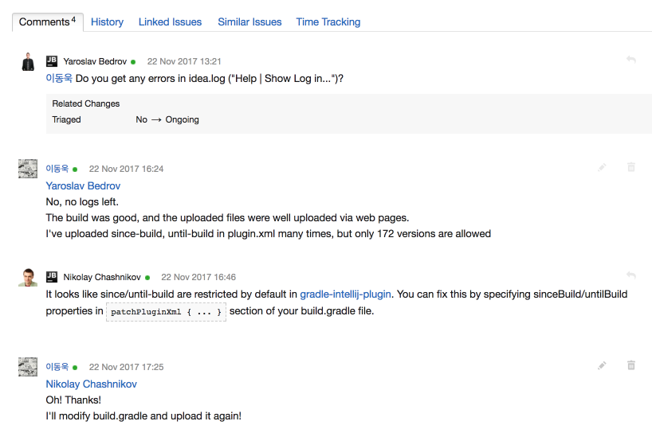

> 굉장히 답변을 빨리 해주기 때문에 개인적으로 이슈가 있을 경우 여기에 올리시는걸 추천드립니다.  
(로그인은 구글계정, 페이스북 계정등으로 OAuth 로그인이니 별도 회원 가입이 필요없습니다.)


### 캐릭터 Progressbar

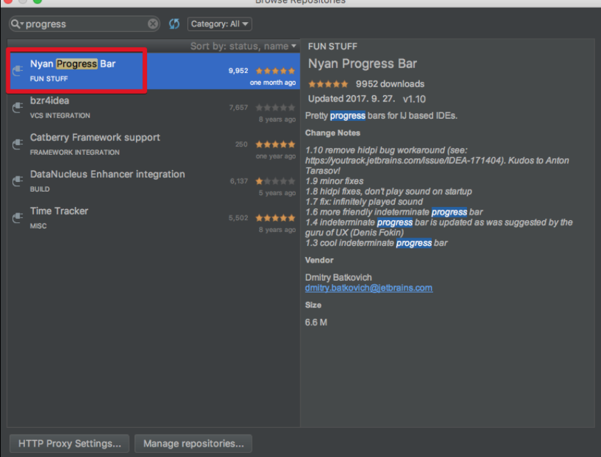

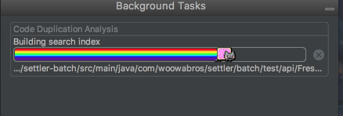


### 클래스 구조 확인 


열린 클래스에서 ```command+7```를 사용하면 됩니다.

> 해당 클래스의 전체 구조를 보여주는데, 이게 왜 장점인지 궁금해하실텐데요.  
lombok을 적용하고 실제로 잘 적용되었는지, 어떻게 구성되었는지를 이를 통해 바로 확인할 수 있습니다. 

### search에서 ```#``` 를 태그처럼 활용


> ```command+shift+a```로 action 검색시, plugins 옵션만 바로 검색하고 싶다면 ```#plugins```로 하면 plugins 옵션들만 바로 출력됩니다.

### action 검색 단축키 등록


> ```tr```로 Abbreviation 등록하여 쉽게 찾기

### 파일 선택시마다 좌측 프로젝트 스크롤 자동 이동


### 스마트 자동완성

일반 자동 완성 외에 스마트 자동 완성이 있습니다.  
단축키: ```ctrl+shift+space```


(Basic : ```Ctrl+Space```)


(Smart : ```Ctrl+Shift+Space```)

> 좀더 상세한 차이는 [가이드 문서](https://confluence.jetbrains.com/display/IDEADEV/Completion+features) 를 참고하세요.


### 마지막 문장만 복사하기

특수문자 ( ``` (,/,{  ``` 등)을 제외하고 마지막 문장만 포커스된 위치에 복사하는 기능
단축키: ```option+/```

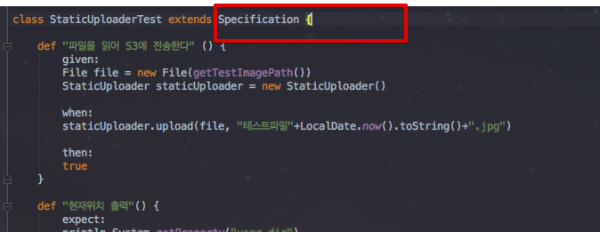

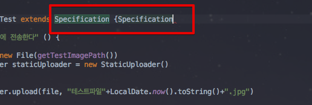

> 중간에 포함된 특수문자는 제외하고 현재 위치를 기준으로 복사&붙여넣기 됩니다.

### 코드에서 JSON String 바로 만들기


문자열 안에서 ```option+enter``` -> ```Inject Language or Reference```선택후 엔터  


JSON 선택


Edit JSON Fragement 선택


> 아래 하단 영역에서 JSON 입력시 자동으로 커서가 있는 곳에 ```\```추가한 JSON 형태의 문자열이 추가됩니다.

> 동일한 방식으로 Regex를 선택하면 정규표현식 체크가 바로 가능

### 여러 라인으로 분리된 문자열들 한줄로 합치기


 
> "c" 문자열 뒤에서 ```ctrl + shift + j``` 사용시 바로 아래에 있는 문자열 "d"와 "c"가 한 라인으로 합쳐집니다.

### 상속 코드를 구성 코드로 변환

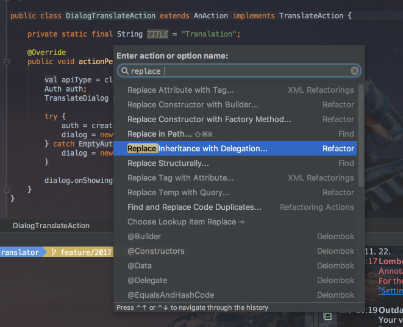

위 클래스에서 ```AnAction```을 상속하는 부분을 Replace Inheritance With Delegation 을 사용하여

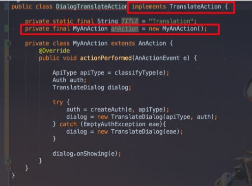

구성형태로 자동으로 전환할수 있습니다.

### Analaze Data Flow 로 현재 변수/필드의 데이터 변경 지점 찾을수 있음

해당 클래스의 필드값이 어디어디서 값이 추가되거나, 수정되는 등 변경포인트 전체를 찾고자할때 쓸 수 있습니다.

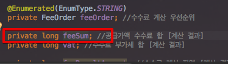

feeSum 필드가 어디어디에서 변경이 발생하는지 찾아보기 위해 포커스를 feeSum에 두고

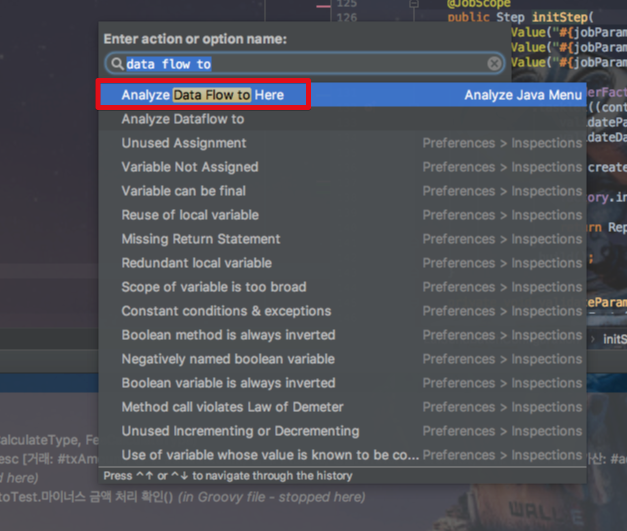

"Analyze Dataflow **to** Here" action 검색을 합니다.

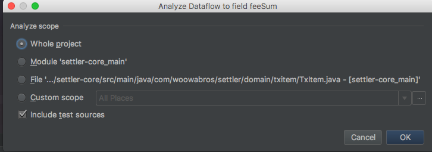

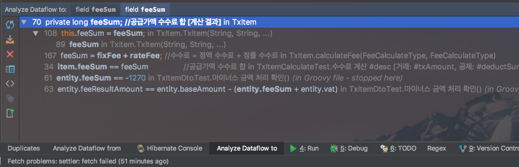

해당 클래스의 feeSum 필드 값이 변경되는 모든 포인트를 찾아줍니다.

> 일반적으로 **setter 메소드 검색만으로는 해당 필드의 변경 포인트를 모두 찾을 수 없습니다**.  
이럴때 Data Flow to Here 기능이 좋은 해결책이 될것 같습니다.

반대로 **해당 필드가 어디어디에 영향을 주는지**도 찾을 수 있습니다.

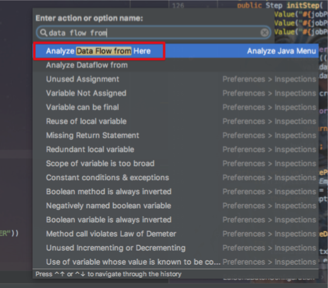

"Analyze Dataflow **from** Here" action 검색을 합니다.

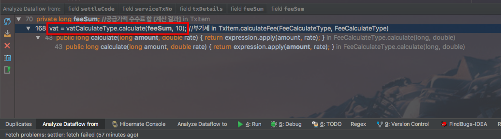

 ```vat``` 라는 필드에 영향을 준것을 확인할 수 있습니다.

### 중복된 코드 찾기


Analyze -> Locate Duplicate로 선택하셔도 되고, 귀찮으신 분들은 ```Command+Shift+a```로 이벤트 검색창을 열어 Locate Duplicate를 입력하셔도 실행됩니다.

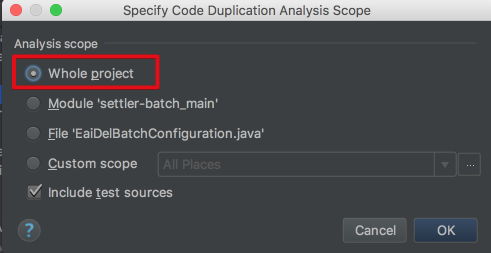

혹시나 Multi Module을 사용하신다면 Module을 선택하시면 해당 모듈내에서만 찾게됩니다.

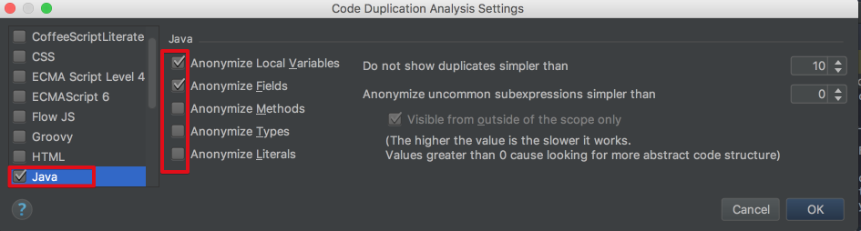

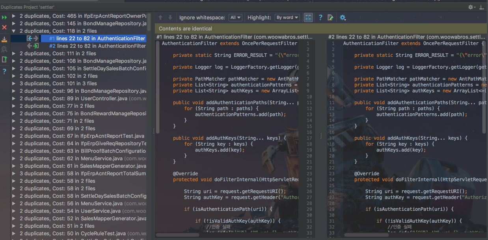

> 단독 모듈내에서 중복된 코드는 소나린트 등을 통해서 찾을수 있는데, 여러 모듈이 모여있는 상황에서는 소나린트등을 통해서 못찾게 되는 경우가 있습니다.  
이런 경우에 전체 프로젝트를 탐색범위로 지정해서 찾은 뒤 공통 유틸 클래스를 공용 모듈에 추가해도 좋을것 같습니다.

### Stream 디버깅


플러그인을 설치하고, Stream 코드에 디버거모드에서 스트림 디버거 버튼(디버거 버튼 가장 우측)을 클릭


스트림 디버거 화면의 각 탭에서 스트림 메소드들의 결과를 확인 가능


> 각 스트림 메소드를 통해 값들이 어떻게 변하는지 실시간 확인 가능합니다.

### JVM Debugger Memory View

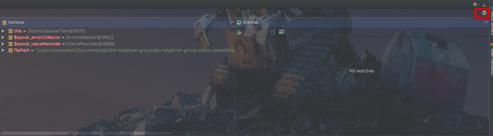

디버그 모드에서 하단 설정화면 가장 우측에 있는 "Restore Memory View" 버튼을 클릭합니다.

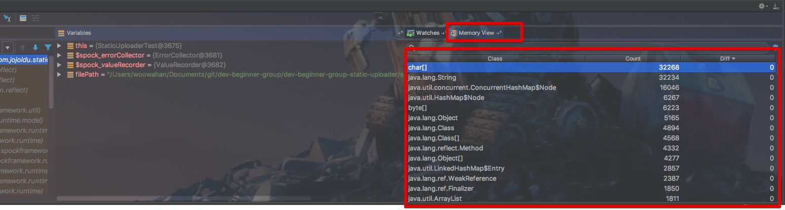

자세한 내용은 [JetBrains 블로그](https://blog.jetbrains.com/idea/2016/08/jvm-debugger-memory-view-for-intellij-idea/)를 참고하세요!

### http Test 

.http 파일로 Rest 테스트 대상 기록할 수 있음

> 2017.3 버전부터 .http 형식이 가능한것 같습니다.  
(사실이 아니면 댓글 부탁드리겠습니다!)  
곧 2017.3 Release 버전이 출시됩니다.  
2017.3 추가 기능에 대해 한번 정리하겠습니다.

* plugins -> MetricsReloaded

### Scala/Kotlin 등 다른 JVM 표현식으로 코드 보기

Advanced Java Folding Plugins 을 설치합니다


설치후 IDE 재시작을 하시면, 기존 코드 화면이 변경된것을 확인할 수 있습니다.

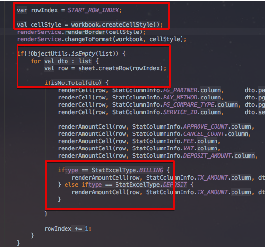


