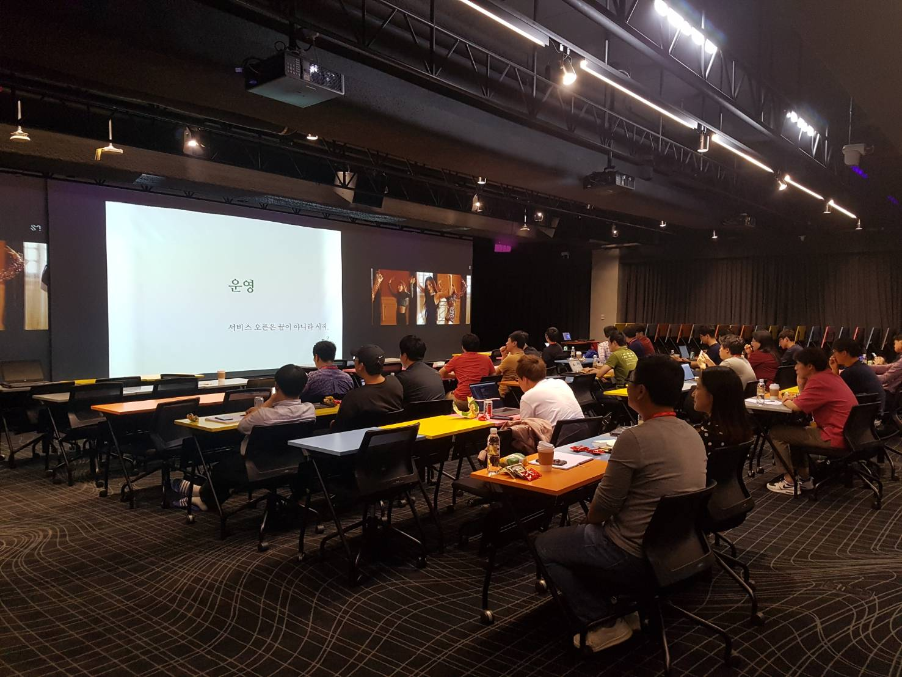
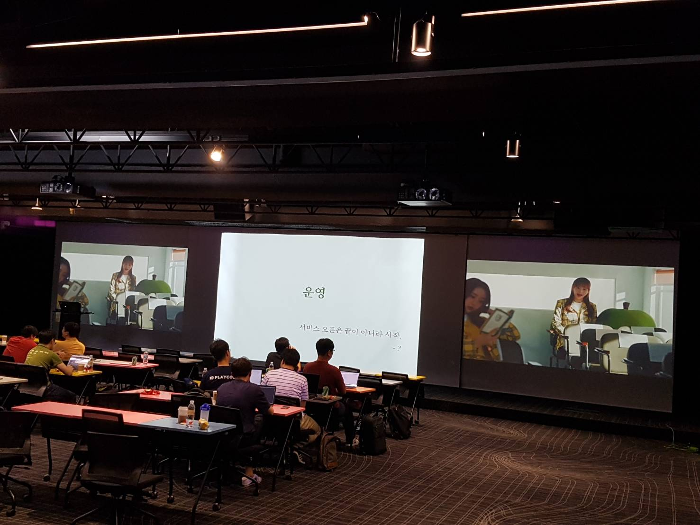
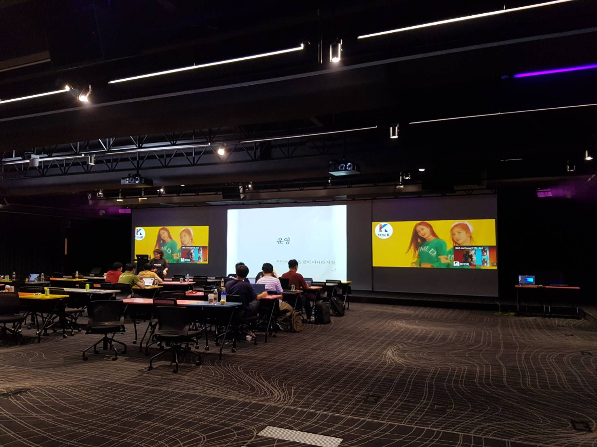
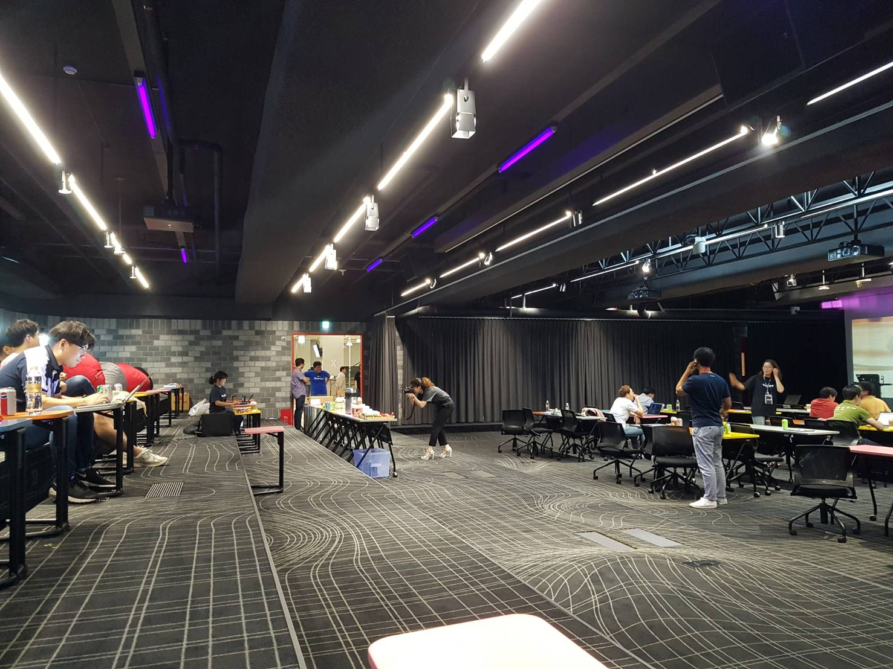

# NHN 엔터테인먼트 안정적인 서비스 운영

안녕하세요?  
어제 NHN Entertainment TOAST팀의 개발 세미나에 다녀왔습니다!  

라고 하고 싶지만 ㅠㅠㅠ  
2시간 교육인데 1시간 밖에 듣지 못했습니다 ㅠㅠ  
  
경기도 광역 버스 탔다가 신갈에 도착해서 부랴부랴 택시타고 
5시에 출발해서 도착하니 7시 30분이네요....

(같이 가신 동료분이 라인으로 하신 말씀)  
  

발표장까지 안내해주시던 직원분이 계셨는데, 굉장히 파이팅이 넘치시는 분이셔서 광역버스 2시간 택시 30분 타고 오면서 지친 것이 좀 회복되는 느낌이였습니다.  
여튼 도착하고 보니 벌써 첫번째 시간은 끝나고 쉬는 시간이였습니다.  

> 아쉽지만 사진으로 대체를..

주신 샌드위치와 음료를 마신뒤 본격적으로 2번째 교육이 시작되었습니다.

## 2. 운영

서비스는 오픈부터 시작

### 메일 발송

* 한통 발송은 쉬움
* 다량 발송은 손이 많이 감
* 코드의 문제가 아니라 운영의 문제
    * KISA 화이트 IP 등록
* 장애: COS 발송 장애등
    * SPF (발송 IP 등록), 수신 서버 등록 등
* 사내 제공 플랫폼이나 PaaS 이용시
    * SMTP 서버 Pool
    * 발송 IP가 막히면 자동으로 IP를 바꿔서 발송하도록 시스템화
  
### 자동화

* 신규서버가 필요하면? => 컨테이너로 해결하자
* 자동 복구
    * 장애시 루틴하게 하는 작업
        * ex: 특정 조건일때 프로세스 재구동 등을 자동으로 수행하도록
        * 대부분의 문제는 데몬을 재실행하면 해결됨 => 그럼 이렇게 간단한 것도 수동으로 해야할까?
        * StackStorm: 자동화 플랫폼
            * 자동 치유 기능 : 특정 조건이면 지정한 액션을 하도록 지원
  
### 배치 작업

* 젠킨스를 쓰자
    * 실패시 알람
    * 과거 작업 이력 조회
    * 여러 서버 묶어서 실행

### 로그 처리

* 수집
    * 주기는?
    * 실시간일 경우 [facebook/scribe](https://github.com/facebookarchive/scribe) (더이상 지원하지 않는것 같습니다.)
* 보관
    * 전금법 관련 로그 12개월, 그외 6개월
* 조회
    * 고객문의 처리를 비개발직군에게 이관할 수 있도록 로그 조회 기능을 잘 구축하길 추천
  
### APM

* Scouter를 사용 중

### 디비

* ORM을 쓰지 않는다면 DBA의 쿼리 검수 필수
    * ORM으로 쿼리 검수 받기는 쉽지 않음
    * 어댑터를 만들어서 TC를 수행하면 쿼리가 쭉 나오도록 해서 검사
        * 곧 **오픈소스로 나올 에정** (!!)
* 동적 쿼리를 사용하지 않는 것을 권장한다
    * **1개의 동적 쿼리는 생각보다 적은 N개의 정적 쿼리로 변경 가능**하다
    * 정적 쿼리로 분리하면 쿼리 관리가 용이해지고, 정적쿼리마다 힌트를 정확하게 줄 수 있다
* 슬로우 쿼리 자동 검출
    * DBA 기준과 개발자 기준이 다를 수 있으니 반드시 협의가 필요하다
    * 입장에 따라 100 ~ 200ms를 슬로우로 볼 수도 있고, 아닐 수도 있음

### 모니터링

* **경고와 장애 수준 분리**가 필요
    * 대부분 장애 수준이 되고 나서야 알람을 받음
    * 디스크 사용율 기준
        * 평상시 사용율이 20%라면 50% 수준에서 경고 알람을 받아야 함: 경고
* 최저값 모니터링
    * 데몬 개수의 최대값 뿐만 아니라 최저값도 함께 알람을 설정 필요
* 주기적으로 수치 점검이 필요
    * 경고,장애,최저값 등은 주기적으로 리뷰 필요함
* 테스트 활용하여 기능 체크
    * 젠킨스를 활용하여 **사용자 인터페이스 레벨의 테스트 모듈**을 주기적으로 돌려볼것
        * 테스트 코드 아님
* 무의미한 알람 받지 않도록 해야함
    * 불필요한 에러로그, 알람등은 남겨서 진짜 문제가 묻히도록 하지 말 것
* 연동 서비스, 서버 모니터링
    * 주기적으로 외부 연동 서비스에 대한 Health Check가 필요
* 알람
    * Slack, Dooray 메신저

### 사례

* 사례 1
    * Disk Full
    * 별거 아닌 원인으로 며칠에 걸쳐 한대씩 장애
    * 놓친 이유: False 알람이 많아 간과
* 사례 2
    * Load는 %가 아님
        * 대기 상태 프로세스 개수
    * CPU 바운드
        * vmstart의 컬럼 r
    * IO 바운드
        * vmstat의 컬럼 b
* 사례 3
    * 50x 에러 페이지
    * **사용자들은 무의식적으로 새로 고침을 반복**
    * 별도 (정적) 서버로 리다이렉트 하도록 설정해서 장애난 서버에 대한 부하 최소화
* 사례 4
    * 상황에 따라 에러가 아닌 척
    * PG 등 서버에서 오류가 났다면?
    * 일단 OK 메세지로 처리하고 이후 로그나 기타 후처리로 결제 처리 한다 
* 로그
    * Debug 레벨의 로깅: 로그를 끄면 속도가 10배 향상
* 타임아웃
    * 디폴트 값 사용 주의
        * 보통 **10ms로 응답할때 응답이 1초 지연되면 동시접속수 100배와 비슷**
    * 보통 디폴트가 얼마인지도 모르고 사용
    * 단위 확인이 필요 (ms인지 s인지)
* 에러 핸들링
    * 실패했지만 그 다음 코드를 계속 실행하는 경우
        * 성공이 아니지만 굳이 실행을 멈출 필요가 없는데 리턴 하는 경우
    * "최근 로그인 시각 업데이트"를 실패했다면 Warn 레벨 로그를 남기고 그 다음 코드를 진행하는 것이 좋음
* 파일/디스크 관련
    * inode가 부족하거나
        * 작은 파일을 많이 저장하고 있을때
    * FD_MAX가 작거나
        * [ulimit 문제 해결](https://jojoldu.tistory.com/287)
* 디비
    * 갑자기 쿼리의 실행 계획이 바뀌어 슬로우 쿼리 발생
        * 쿼리에 힌트를 주어 실행계획 고정
    * 통계 쿼리
        * 캐시 메모리가 지역성이 떨어지는 데이터로 채워져 성능 저하 초래
        * 통계 작업이 빈번하다면 별도 슬레이브 디비 사용
* 배포후
    * 콜드 캐시
        * 캐시에 데이터가 없어 생기는 일시적 과부하
        * 해결) 배포 스크립트에서 웜업까지 진행한다
    * 사용자 단에서 일괄 재구동
        * 클라이언트가 랜덤으로 재구동하도록 설계
        * 해결) 누구는 1분뒤 누구는 3분뒤 등으로 시간대별 분배
* DNS
    * JVM은 DNS 쿼리 결과 캐싱
    * 기본 설정은 JVM 재구동하기 전까지 캐싱 결과 변경 불가
    * TTL 변경
  
### 과부하/장애 대응

* 내결함성
    * 오류가 있어도 정상적으로 서비스
    * 예) 디스크 미러링
* 적절한 퇴보
    * 오류나 특정상황에서 제한된 기능은 동작
    * JS를 못쓰는 환경에서 순수 HTML로만 동작하도록 구현 
    * 중요 기능 우선
        * 서비스 기능을 중요도로 정렬 (아래 예시 참고)
            * 게시판: 읽기 > 쓰기 > 검색
            * 메일: 수신/읽기 > 목록 > 쓰기
        * 장애시 중요 기능을 보호하는 대응
            * 우선 순위 떨어지는 기능을 포기하여 상위 기능 사용성을 유지
            * 메일 서비스에서 API 서버가 매우 바쁠때 웹 서버의 요청은 모두 처리하지만 IMAP 서버에서의 요청 중 50%는 취소하는 식으로 트래픽 조절 가능
    * 정확도 보다는 가용성
        * 캐시 만료 기간 연장
* 재시도 제어
    * 횟수
        * 룰1) 하나의 요청에서 재시도는 3회까지
        * 룰2) 하나의 클라이언트에서 10%이내에서만
        * 룰3) 요청시 몇 번째 재시도인지 담아 요청하고, 실패시 재시도 횟수에 따라 재시도 여부를 응답에 담음
    * 간격
        * 지수 간격
    * 문맥
        * 정말 필요한 재시도인가?
        * 예를 들어 404라면 재시도할 필요가 없는데 계속 하는건 이상함
* 전파
    * 장애가 나면 유관자에게 바로 공유를 한다
    * 메일링 리스트를 이용하여 전파하면 30초면 충분
* 처리
    * 유용한 스크립트를 만들어서 사용한다
        * 특정 일시 N분간 요청수별로 정렬
* 전파가 중요한 이유
    * 다른 서비스 장애 원인이 우리 장애 때문일 수도 있음

### 장애후 대응 - 회고

* 기계적으로 할일
    * xUnit과 같이 개발 TC 보강
    * 개발 TC 보강이 힘들다면 QA TC 보강
* 빠른 장애 대처
    * 원인 진단시 필요한 기능은 스크립트화
* 자동 복구
    * 스크립트화
* 장애 예방
    * 전조 증상에 대한 모니터링 항목 추가

## 마무리

서비스 운영에 관해 전반적으로 다시 정리할 수 있는 좋은 시간이였습니다.  
  
혹시나 전체 발표 내용이 궁금하시다면 [슬라이드쉐어](https://www.slideshare.net/cybaek/201403) 를 참고해보시면 좋습니다.  
  

토스트에서는 정기적으로 세미나를 진행하실 예정인것 같습니다!  
다음 세미나는 자바 성능 튜닝에 관해서 정말 유명하신 이상민님께서 발표를 진행하신다고 합니다.  

꼭 놓치지않고 신청하시길!

> 세미나가 신청이 오픈되면 바로 [페이스북 페이지](https://www.facebook.com/devbeginner)에 공유드리겠습니다.

