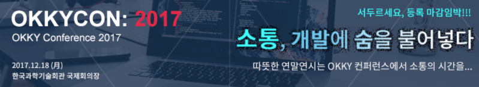
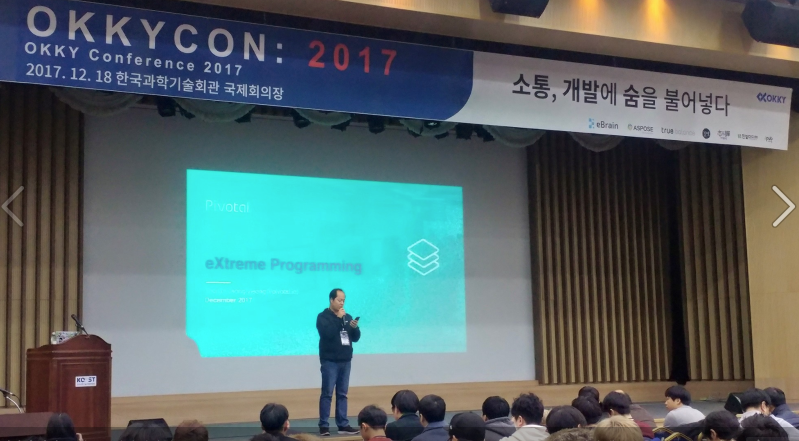
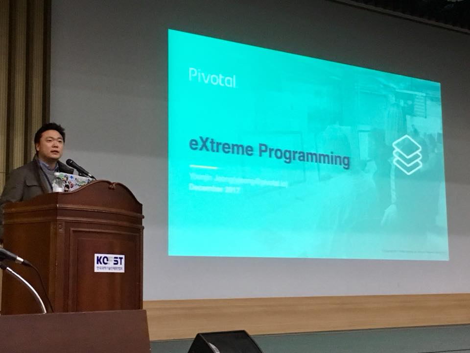
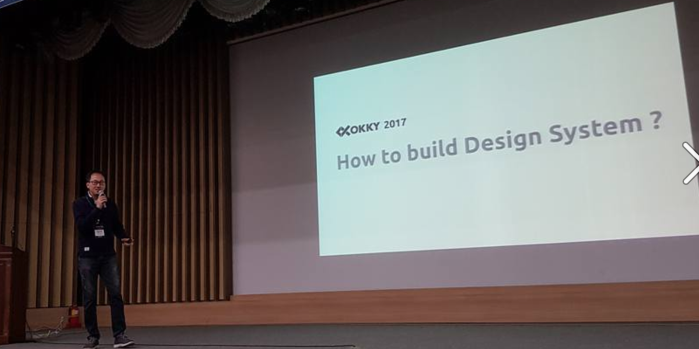
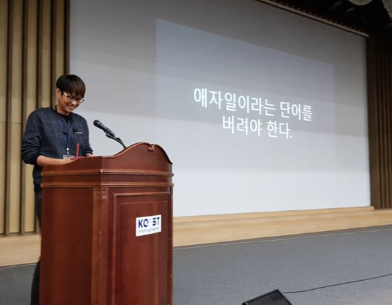
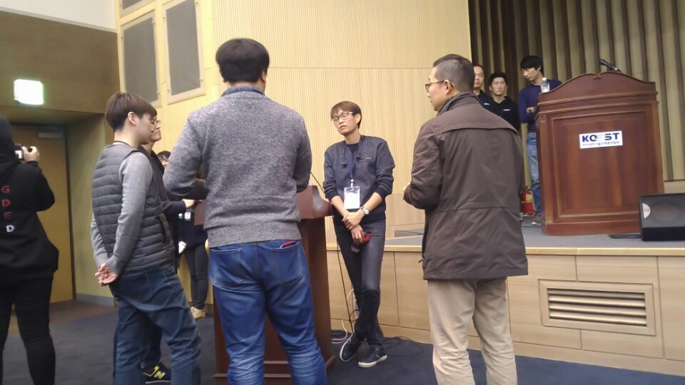
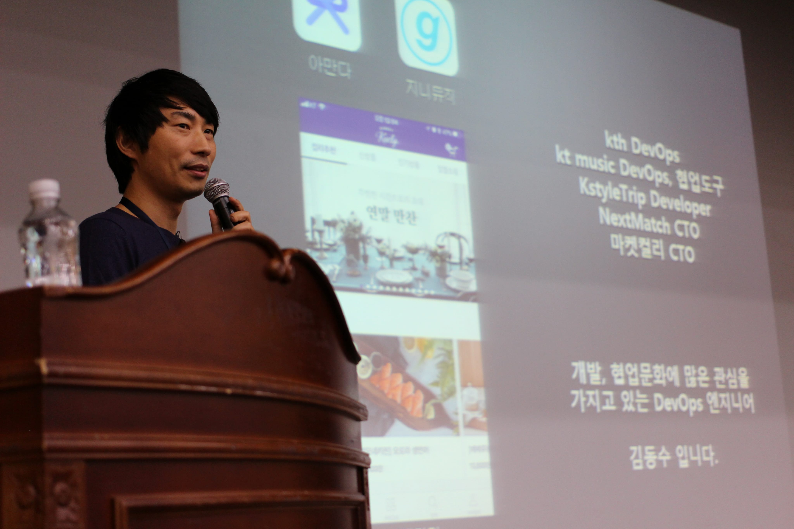
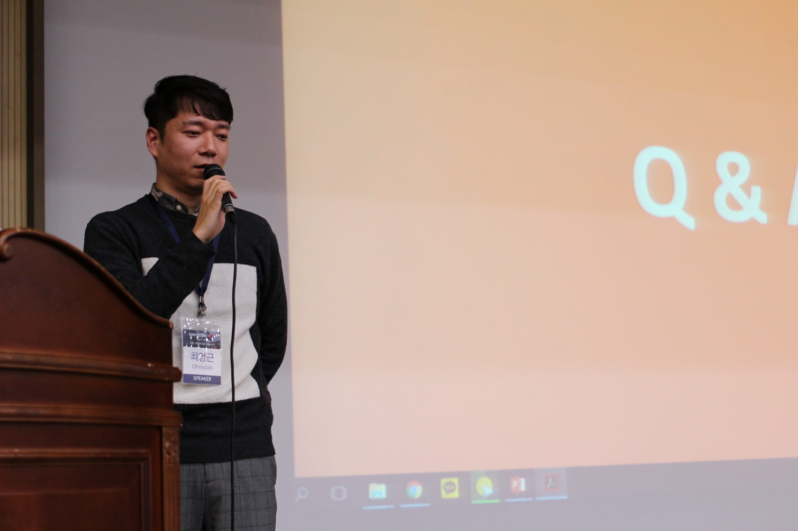
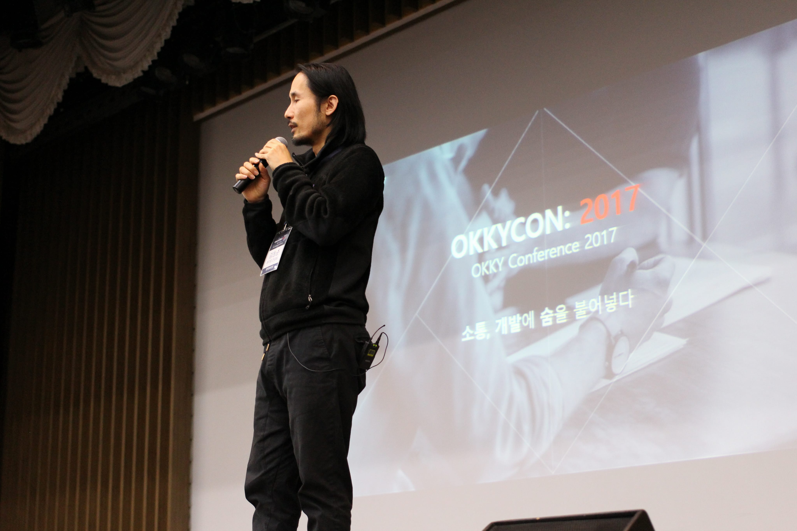

# OKKYCON 2017 참석 후기



OKKYCON 2017에 다녀왔습니다!  
세미나 순서와 연사분들의 소개는 [OKKYCON페이지](http://www.okkycon.com/)에서 상세하게 확인하실 수 있습니다.  
  
눈이 굉장히 많이와 사람들이 오실수있으실까 싶었는데 정말 많은 분들이 와주셔서 깜짝 놀랬습니다.  



믿음님의 기조 연설로 세미나가 시작되었습니다!  
개발자의 커뮤니케이션과 협업에 대한 이야기가 진행될 예정입니다.  
리뷰 작성하고나니 엄청난 스크롤 압박을 보고..  
바로 본문으로 진행하겠습니다.  
유익한 글이 되셨으면 좋겠습니다^^;

## 1. Extreme Programming(XP), 더 나은 소프트웨어 품질을 위한 일의 방법 - 정윤진 (Pivotal)



### 피보탈?

* Apache Tomcat의 코드를 70% 이상을 작성
* 스프링프레임워크 개발자들 전체가 소속
* 기타 여러 오픈소스를 개발/배포 하는 오픈소스 회사

소프트웨어 전문, 오픈소스 전문 회사인 피보탈에서 어떻게 협업을 하는지에 대한 이야기

### Extreme Programming?

* 비지니스 오너 혹은 은행장 등의 분들이 오히려 API에 대한 요구사항이 높아짐
* 문제는 이런 API 형태로 전환하기 위한 필요한 기술, 이런 기술을 구현하는 사람들이 협업에 필요한 문화는 전과 완전히 다름
* 문제는 이런 요구에 대한 제대로된 문화가 잘 없음
  * 구글의 문화를 은행에서 바로 적용할수 있는건 아님
* Agile, Lean, 12 factor, Cloud Native, DevOps, Micro Services, CI/CD
  * 이런 내용들을 안다고 해서 바로 적용할 수가 없음
  * 피보탈에선 이 모든 것을 전부 프로덕션으로 가기 위한것
  * ```It's all about Production```
* Agile
  * 개발에서 배포까지 수행하고 피드백을 받는 동작을 반복하는 것
  * 개발한 코드를 어떻게 지속적으로 프로덕션에 전송할 수 있을까
  * 코드가 계속 커지는 상황에서도 어떻게 그 속도를 유지할 것인가
* Lean 
  * 이 Core Feedback Loop를 "사용자가 원하는 방향으로" 진행하는 것

### A Product Story

* Small Sized / Cross Function Team
  * 풀스택 개발자는 거의 존재하지 않으며, 있다 하더라도 여러분이 데려오기엔 너무나 힘든 존재  
  * 다만, 팀이 풀스택이 될 수 있다고 생각함  

2011년 백엔드/프론트엔드/인프라 각각 1명씩으로 이루어진 팀에서 근무 (+ 사장님 1명)했던 이야기 

* 커스텀 소프트웨어를 만들기로 함
  * 드랍박스, AWS WorkDocs와 비슷한 클라우드 소프트웨어
  * 프론트엔드 개발자분이 **4시간만에 Mock 소프트웨어를 만들어서** 사장님 앞에서 발표
  * 발표현장에서 사장님이 바로바로 피드백을 줌
  * 기획서를 보고 감으로만 하는게 아니라, 실제 눈앞에서 기능을 보면서 바로바로 피드백을 주니 기획이 좀 더 명확하게 진행됨
* 서비스 구조
  * 클라이언트 요청 -> nodejs 서버 -> mongodb에 사용자정보/버켓정보 등록, 오픈스택 스위프트에 파일등록
* 해당 서비스 개발에 대한 상세한 이야기
* N(N-1) / 2
  * 필요한 커뮤니케이션의 횟수
    * 똑같은 이야기를 계속 반복하지 않아도 됨
    * 개발을 하는 시간보다 미팅을 하는 시간이 많아지는 경우가 발생
  * 우리 같은 경우 개발자는 3명이기 때문에 커뮤니케이션 리소스 비용이 굉장히 절약
    * nodejs 파일 전송이 느린점을 개선하기 위해 **오전**에 회의하고 **오후**에 바로 적용
    * 앞단에서 Nginx를 두어서 Nodejs로 갈 request와 오픈스택 스위프트로 갈 request를 분기처리
* 굳이 스크럼을 하지 않더라도, 소규모 인원에선 자연스레 비슷하게 진행됨
  * 실제로 우리팀은 애자일 방법론에 대한 지식이 전무한 상태였지만, 지금 생각해보면 애자일과 유사했음

### 우리의 문제

대부분의 서비스에서 발생하는 문제

* 데이터복제/백업 없음
  * 환경 구축이 제대로 되기 전에 사용자 트래픽이 발생
* 오픈스택의 빠른 발전으로 API문서가 실제 서비스와 일치하지 않음
  * 실제로 문서보다 코드보는게 더 나을때가 많음
* 개발/스테이징/프로덕션 개념 없음
  * 시작부터 오픈까지 3개월만에 완료
* 배포전 테스트 없음 / 테스트 코드 작성 없음

시작하는 서비스에서 발생하는 문제

* 프로덕션에 마구 접속 및 변경을 감행
* 개성이 강한 멤버들의 성격이 자주 충돌
  * 좋을땐 되게 잘되지만, 충돌할땐 답이 없음
  * 3명이 돌아가며 골고루 스트레스 받다보니 3명다 이야기를 하지 않는 상황도 발생
* 서비스가 커지고, 베타로 인해 실 사용자가 발생함에 따라 배포속도가 떨어짐
  * 점점 더 제품화 하는데 시간이 걸리기 시작

### 위 경험에서 얻은 교훈

* 일을 진행하는데 **작은 규모의 팀은 매우 효율적**
* **서로 다른 전문성을 가진 사람들이 팀을 이루면 어려운 문제를 해결** 할 수 있다.
* 자신이 당면한 문제를 즉각 공유해야 해결이 빠르다
* 팀 구성원의 성향이 다르면 감정적 문제가 걷잡을 수 없이 커지는 경향이 있다.
* 스타트업은 제품이 나빠서가 아니라, 보통 팀이 깨져서 무너진다.
  * 하다보면 1명이 팀 배포코드의 50%이상을 담당하는 경우가 있음
  * 자연스레 결과물에 대한 공유가 잘 안되는경우가 많음

### Extreme Programming

* 코드의 크기가 커질수록 프로덕션 배포는 점점 느려지게 됨
  * 이를 해결하기 위해 Test 코드가 필요
* 일정 규모 이상이 되면 테스트 작성을 포기
  * => 애자일은 작은 신규 프로젝트에서만 가능 이라고 생각하는분들이 많음 
* 수천줄의 코드 -> 백만줄의 코드로 늘어나면서 발생할수 있는 문제
  * 업데이트에 무슨 문제가 발생할지 **아무도 모름**
  * 책임/롤백계획서/업데이트해야하나?/QA통과함? 등에 대한 이유로 다들 꺼리기 시작함   
  * 팀에 속해 있지만, 개발은 결국 혼자하게 됨
    * **XP에선 혼자서 코드를 잘못 생성하는 경우를 만들지 않도록 함**

### 피보탈의 업무패턴

* 08:30 아침식사
  * 아침밥 먹으면서 서로 이야기하라고 만든 시간
  * 메일을 쓰지 않음
  * 아침식사시간에 공유할 내용을 전달
* 09:00 스탠딩 미팅
  * 모든 팀이 함께하는 스탠딩 미팅
* 09:05 팀 스탠드 미팅
  * 오늘 내가 누구랑 일할지, 어떤 일을 할지 이야기함
* 09:30 Pair 업무 시작
  * 해당 부분을 잘하는 사람과 Pair를 구성
  * 실리콘벨리의 높은 연봉의 개발자들을 1명씩 일을 시키지 않고, 같이 일을 시키는 이유 
    * 2명이 같이 일하면 품질이 80%이상 올라감    
* 11:30 점심식사
* 13:00 오후 Pair 업무 시작
* 18:00 아무도 없음

### Balanced Team

DB팀, 서버개발팀, 인프라팀, 프론트엔드 팀 등의 서로 다른 스택을 가진 팀의 구성원들 중 **프로덕트를 위해 별도의 팀**을 구성

* 서로에 대한 신뢰가 쌓임
  * 내가 못하는 것을 잘함
* 내가 DB를 잘 못했지만, 팀원들로 인해 배우게 되는 등 몰랐던 점들을 많이 배우게 됨
* 서로 다양한 목소리가 나옴
* 프로덕트 매니저 & 개발자가 **한 PC로 개발**을 하는 상황도 종종 보게 됨
  * 모니터2, 키보드2, 마우스2로 구성

### TDD in Pivotal

* 모든 행동은 테스트로 코딩 되어야 함
  * 모든 행위는 테스트 코드가 있어야 함
* TDD를 하는 이유는 프로덕션 배포를 위함
* QA팀을 두지 않는 이유?
  * QA팀을 통해 테스트를 할경우 문제 발견시 다시 개발팀에게 전달
  * 개발팀은 이미 새로운 서비스/기능을 개발중에 다시 버그수정
  * 이런 일이 반복될수록 **배포가 점점 늦어지게 됨**
* 30분 ~ 3시간안에 완료될 단위로 이슈를 쪼개서 개발/배포

### 피보탈에서 배운 교훈

* 옆자리에 앉은 사람이 코드/테스트를 작성하는 걸 보고 있으면 혼이 나간다
* **프로덕트 팀을 작게 유지하며 페어로 일하는 것은 "다양한 장점이 있다"**
* 두명의 개발자가 앉으면 생선성은 20% 감소하지만, 품질은 80% 증가한다
  * SI에서 특히 인건비에 대한 질문을 정말 많이들 하심
  * **생산성이 높다고 해서 코드의 안정성이 높다고 할순 없음**
* 서로 다른 역할의 구성원이 페어로 일하게 되면 다양한 문제 해결이 가능하다
  * 디자인 & 백엔드 개발자가 같이 일하는 경우가 빈번함
* 팀이 지속적으로 상향 평준화 된다
* "답장 없는 매일 보다는 대화가 더 효율적인 방법이다"
  * **내가 찾으면 알수있는 것을 질문으로 들고가면 혼남**

### 스프링부트의 수장 필 웹이 한말

* 코드를 제품으로서 높은 품질로 제공
* 변화하는 환경에 적응하도록 코드를 작성하라
* 미래에 변경이 쉽도록 코드를 작성해야 한다
* 한줄의 추가 코드는 한줄의 추가 메인터넌스

> 애자일은 1년 걸릴 프로젝트를 1달만에 만드는 방법론이 아님

### Q & A

Q. 메일 보다는 대화를 하라고 했는데, 상황에 따라 당사자가 이해를 못할 경우가 많은데, 이럴때 계속 대화하기 보다는 메일로 남기는게 더 좋을것같은데 어떤지?  
(누군가 반복적으로 잘못된 질문을 하는것을 방지하기 위해 메일을 남기는게 어떤지?)

* 팀내 구성원이 8명정도인데 그 구성원들은 팀 프로덕트에 대한 내용은 구성원이 거의다 알고 있음
  * 본인의 내용만 알고 있는 사람은 거의 없음 
* 소프트웨어 회사이다보니 자주되는 질문은 이슈트래커, 코드를 통해 확인할 수 있도록 구성함
* 페어를 통해 전체가 지식을 자주공유하기 때문에 한명에게 집중포화되도록 하는 상황을 만들지 않음

Q. PM으로서 가장 먼저 점검해야할 것이 무엇인지?

* 첫번째 질문은 "이거 왜 만들어요?"
* 두번째 질문은 "이 프로덕트의 스폰서가 누구에요?"
* 이 2개의 질문을 기반으로 새로운 팀 구성을 시작
* 피보탈팀 & 고객팀으로 구성해서 시작

Q. 원격 근무자들과 어떻게 협업하시는지

* 원격 Pair 도구를 사용
  * 화면과 음성을 공유
  * 오피스에서 오랫동안 같이 Pair한 사람이라는 전제하에 시작
* 최근에 글로벌하게 사업을 진행하다보니, 타임존에 맞게 지사를 개설
  * 피보탈은 글로벌 18개 지역에 둠
  * 200개 기능을 1명이 만들면 인수인계도 부담이 되기 때문에 타임존에 맞춰 스토리를 분산시킴

Q. HR권한을 팀 단위로 주는지, 회사단위로 하는지/ 팀단위로 한다면 회사의 문화와 안맞으면 어떻게 하는지?

* 한국의 스타트업은 사업이 잘되면 가장 먼저 투자하는게 HR
* 하지만 좋은 개발자는 이미 좋은 곳에서 일하고 있음
* 사람이 많아지면 기존의 문화가 깨져버릴경우가 많음
  * 5명이였던 회사에 있던 문화가 신규 채용된 45명의 목소리가 더 커지게 됨
  * 그러다보니 **기존멤버 5명이 본인의 권한을 놓지 않으려고 함**
  * 결정/배포 등을 항상 이 5명을 통해야하다보니 45명이 아무리 개발을 빨리하고 많이해도 속도는 전과 크게 달라지지 않음
* 피보탈에서는 며칠간 피보탈에 직접와서 3~4명과 Pair를 진행함
  * Pair를 통해 채용할지 말지를 결정
* Pair를 통해 **팀간의 기술격차가 현저하게 나지 않음**
* 피보탈에선 개인 랩탑을 기본적으로 제공하지 않음
  * Pair를 위한 아이맥을 제공
  * 내 자리가 어딘지 고정시킬수없음


## 2. 디자이너와 개발자와의 협업을 위한 디자인 시스템 - 김요한 (GS SHOP)




디자이너와 개발자들의 협업은 예전부터 비효율적인 경우가 많았음

### Atomic Design

* 디자인 방법론
* 인풋박스, 버튼 등을 먼저 디자인
  * 이러한 단위를 원자 (Atomic)
* 원자를 모아 분자로
  * 분자를 다시 모아서 새로운 더 큰 단위로
* 컴포넌트는 원자의 집합, 분자의 집합 등 여러 단위릐 집합을 나타냄

### Design System   

* 디자인 시스템?
  * 팀이 제대로 디자인 하기 위한 문서/가이드 라인
  * UI 컴포넌트 등의 라이브러리/패턴등을 가지고 있음
* 대표적인 디자인 시스템 사례
  * Materail Design
    * 구글에서 만든 템플릿이자 UI 가이드
  * Atlassian Design
    * 디자인 컴포넌트를 전부 react 컴포넌트로 개발
    * 쓸려면 import 해서 바로 쓸수가 있는 형태

### Building Design System

* 과연 문서만으로 개발자 & 디자이너간 문제를 해결할 수 있을까?
  * airbnb의 react-sketchapp을 참고하여 개발 시작
* 전통적 방법
  * 디자인 -> 스타일코드 -> 프로덕트
  * 디자이너가 포토샵과 같은 파일로 디자인
  * 퍼블리셔에게 PSD 파일을 전달하여 코드로 전환
  * 개발자가 퍼블리싱된 파일을 실제 프로덕트로 개발
  * 디자인이 변경 될 경우 (1px이라도..) 이 과정을 처음부터 다시 해야함
* 근본적으로 방식이 변경되어야 한다고 생각함
  * 스타일코드 -> 디자인 -> 프로덕트
  * react-sketchapp을 이용할 경우 스타일 코드를 작성하면 렌더링 결과물을 바로 보여줌
* React SketchApp 
  * 코드로 디자인을 할 경우 Real Data를 사용할수 있게 됨
    * Mock 데이터를 쓸 필요가 없음
    * API 가 구축되어 있으면 편하게 구축 가능
  * 여러 사이즈의 동일한 결과물을 코드만 변경해서 생성 가능
  * 다른 나라 언어들을 사용할 경우에도 코드만 변경하면 반영 가능
* **디자인의 요소와 개발 요소를 하나의 코드로 관리** 하게 되면 불필요한 비용이 굉장히 많이 줄어들게 됨
* React는 현재 프론트엔드에서 주도적 역할을 하고 있음
  * 스케치앱에선 Image, Text, View 컴포넌트만 사용하면 됨

### 누가 디자인 시스템을 구축해야하는가?

* 초기엔 개발자가 환경을 구축하고 틀을 잡음
  * 이후엔 퍼블리셔분들에게 디자인 제품을 스케치코드로 제작해달라고 요청  
* 러닝커브가 높음
  * 코드가 어렵다기보다는 동작하는 환경의 이해가 더 어렵다.
  * 그래서 개발자가 먼저 환경과 구조를 잡아야할것
* UI가 직관적으로 생성할수가 없음
  * 코드를 작성해야 화면을 그릴수 있기 때문에 직관적으로 그려나갈수가 없음
  * **직관성은 디자인시스템의 목적이 아닐수 있음**

Airbnb 헤드디자이너의 이야기

> 코드를 디자인 도구로 사용한다.  
단지 레이아웃과 디자인 뿐 아니라 로직과 데이터를 고려한 디자인 자산을 만드는 것이다.  
이를 통해 디자이너와 개발자간의 간극을 줄이고, 더불어 디자인 스펙 문서의 의존성을 줄여 이상을 좀 더 현실로 다가서게 한다.


### Q & A

Q. 디자이너는 코드를 만지면서 만족도를 느끼게 해줘야하는데, 디자이너가 이 맛을 느끼게 하는데 얼마나 오랜 시간이 필요했고,
얼마나 만족했는지 알고 싶음

* 개인적으로는 이상적으로 디자이너가 코드를 작성해야 한다고 생각함
* 현실적으로 불가능하니 퍼블리셔 분들에게 컴포넌트를 다 생성해달라고 요청함
* 주변을 보면 디자이너가 코드를 작성하고 싶어함
  * 하지만 디자이너 주변 분들은 디자이너 분들에게 코드 작성법을 가르쳐주지 않으려고 함
* 디자이너 분들에게 교육을 진행하려고 함

## eBrain HR 컨설팅 소개 - 김재희

* 개발자 전문 리쿠르팅 회사
* 도메인/언어 등의 변경/이직을 원할 경우 어떻게 해야하는지 모르는 분들은 꼭 연락주시길 바람


[ad]

## 3. 애자일은 애자일이란 단어를 버려야 한다 - 신정호 (우아한형제들)



> 애자일을 통해 성공적으로 프로덕트를 출시하신 분들도 계시겠지만, 굳이 이렇게 자극적은 단어를 사용한 이유는 애자일이란 단어에 담긴 형식적인 내용들을 제거하기 위함

* 보행자가 교통사고가 안나는 법
  * 길을 건널때,
  * 좌우를 살피고,
  * 파란불에,
  * 손을 들고,
  * 건널목을 건너면 됨
* 누구나 아는 내용이지만 사고는 여전히 난다.
  * 여러 **다양한 상황이 있기 때문**
* 프로젝트를 성공하는 법
  * 회고/추정/짧은주기의 릴리즈
  * 스프린트 계획 회의, 현황판
  * 테스트 케이스
  * 잘하면 프로젝트는 성공

* 현실성이 낮다
  * 교통사고 안나는 법 == 프로젝트 성공하는 법

### 프로젝트, 스크럼으로 하겠습니다.

* 누군가는 "망했다" 생각한다.
  * 이미 비슷한 경우로 망했던 분들
  * 문제는 애자일 이라고 단정 
* 형식적으로 망하는 프로젝트 징후
  * 맹신
  * 목표없는 작은 주기
  * 의미없는 회의
  * 기준없는 추정
  * 자발적이지 않은 교육
  * 겉치레적인 시스템 평가
    * 이슈갯수를 얼마나 done 시키냐/커밋을 얼마나 했느냐로 성과를 평가한다는 등

결국 손사래 친다.

* 오히려 애자일을 모르는 분들과 함께하는 것은 쉽다
* 반대로 해보신분들과 함께 할때 더 힘이 많이듬
* 문제는 **애자일 형식**에 얽매이는 것임을 상기

형식에 얽매이지 않은 경험 공유

### 역할, 스케줄링, 회고 - 배민 라이더스 TFT, 배민 2.0

1. 역할

* 방법론에서 SM, PMO가 필요하다고 하던데..
  * 중요한건 직책이 아니라 역할
  * 누가 다 파악을 할것인지, 파악을 기반으로 어떤 결정을 내릴 수 있는지, 누가 책임을 질것인지
* 파악
  * 파악을 하지 못하면 예상을 할 수도 없고, 의견을 제시할 수도 없다.
  * 정책, 요구사항 / 통신 프로토콜/ UI,UX진행사항 / 요구사항에 대한 테스트케이스 / 커밋기록/ 현황판 중심 데일리 미팅 등을 겪음
  * 현황판을 사용할 경우 이슈번호와 해당 이슈에 대한 리스크에 관해서만 이야기함

2. 결정

* 내부의 결정은 크게 고민할 필요 없음
* 외부의 도움이 필요한 경우
  * 결정에 필요한 배경과 결정해야할 케이스의 객관식 리스트를 공유
  * 피드백 요청

3. 책임

* 퇴사, 감봉, 시말서...?
* 매 시점마다 파악이 다 되어있었고, 최선의 결정을 했다면 **책임은 없어진다**
  * 부끄럽지 않다면, 각오해도 괜찮아

### 수평적 관계

방법론에서 사람들의 수평적 관계가 중요하다고 하던데...

* 중요한건 수평적 관계가 아니라 부딪칠 수 있는 케이스를 정리하는 것
* 겪은일 1) 기획자 vs 디자이너
  * 와이어프레임 그리지 않음
  * 정책/요구사항만 텍스트로 바로 작성
  * 디자이너는 와이어 프레임없이 자유롭게 그림
* 겪은일 2) 기획자 vs 개발자 vs 품질책임자
  * 나는 이렇게 생각하지 않았는데??
  * 품질책임자는 제품에 대한 센스가 높기 때문에 이들의 책임이 굉장히 중요함
    * 기획자의 언어와 개발자의 언어는 차이가 나는데, 이런 차이를 줄여줄 수 있음
* 겪은일 3) 기획자 vs 품질책임자
  * 정책이 정해져 있지 않은 경우 
  * 상상의 나래를 펼치게 되면 고려해야할 테스트 케이스가 수만가지가 되버림
  * 데일리 정책 회의 진행
* 겪은일 4) 디자이너 vs 개발자
  * 디자이너와 개발자간 구현 목표가 큰 차이가 남
  * 시간상 도저히 요구사항만큼 안나오는 경우가 있어 타협이 필요
  * ToDo List를 생성하여 관리
* 겪은일 5) 최고의사결정자 vs TFT
  * 일정의 문제
  * 명확한 정량적 수치로 상황 공유
    * 목표치는 15%, 현 상황은 8% 등
* 겪은일 6) 포토팀 & 어드민 운영팀 vs TFT
  * 팀 외 협업에서 놓치고 있는게 없는지 계속해서 유관부서에 물어봐야함
* 중요한건 수평적 관계가 아니라 부딪칠 수 있는 케이스를 정리하는 것

### 스케줄링

방법론에는 스프린트 회의, 현황판, 추정, 데일리 미팅이 중요하다고 함

* 중요한건 정량적 파악 (스케줄링)
  * 워킹데이 계산
    * 구정 등 실제 일할 수 있는 기간 계산
  * 휴가 계산
  * 테스트 일수를 예측
  * 개발완료의 기준
  * 늘 어디쯤인지 파악해라   

스프린트 회의, 언제 어떻게 해야하는 걸까?

* 겪은일
  * 회고 1일, 스프린트 회의 1일 하다보면 이틀을 그냥 소모하게 됨 => 회고와 스프린트을 같이 진행
  * 회고에 바로 이어서 스프린트 회의 진행
  * 정책 및 요구사항 발표
  * 구현 이슈 논의
  * 모호한 상황 명확하게 파악 및 결정

스프린트 어떻게 나눠야 하는 것인가?

* 부분 미완성이지만 흐름을 먼저 볼것인가?
  * 정책 및 요구사항이 결정나지 않았을때 일반적으로 사용
* 부분 완성으로 기능을 먼저보일 것인가?  
  * 정책이 완전히 결정났을 경우
* 겪은 일) 
  * 현재 중요한 파트는 어디인가?
    * 기획중심 / 구현중심 / 테스트 중심

### 회고

* 회고는 서로의 감정을 다치지 않고, 보다 나은 스프린트를 위한 준비를 해야한다고 하던데..
  * 서로의 좋은점, 나쁜점을 포스트잇에 기록만 하다가 하루가 끝남
* 회고는 **해결된 것과 해결할 것을 명확히** 하는 시간
  * 스프린트 1에선 무언가 진행된게 없기 때문에 목탄의 이야기를 전달
  * 스프린트 4에선 이미 상당히 진행된 상태이기 때문에 남은 일정, 목표했던 사항들 점검
    * 스프린트 Risk에는 개인의 심리적 안정감을 체크
* 회고의 중요한 시간은 아웃풋을 공유하는 것
  * 모두가 딴생각을 할수가 있음
  * 시연하는 시간을 가짐 (아웃풋 공유)
* 남은일
  * 스프린트가 종료되었지만 완성하지 못한 일들
  * 시간이 지나면 남은 일을 어디까지 했는지 모를텐데?
  * 이때 테스트 케이스를 기준으로 다시 정리
* 회고라는 것이 서로의 감정을 상하게 할수 있는 시간
  * 회고가 끝날때마다 다같이 화이팅을 외침

> 애자일은 말이나 형식이 아닌, 끈질기게 물고 늘어져서 행동으로 보여줘야 되는 것



(발표가 끝나고 많은 분들이 추가로 궁금하신 내용을 여쭤보러 오셨습니다!)

## 4. 협업도구로 제대로 말하기 - 김동수 (마켓컬리)



* 마켓컬리?
  * 2015년 5월 서비스 오픈
  * 밤 11시까지 주문하면 새벽 문앞으로 배송
  * 자체물류센터와 물류시스템 운영
  * 2017년 11월 월 60억 달성, 매월 20% 성장중
  * 130명 이상의 구성원이 여러 협업도구와 노력으로 지속적 개선중

* 협업 도구? (by 위키피디아)
  * 사람들이 협업하는데 도움
  * 협업 도구의 목적은 둘 이상의 개인으로 구성된 그룹이 공통의 목표 또는 목적을 달성하는 것을 지원

### 지금까지 써왔던 협업 도구들

* 경험해본 도구들
  * 우편, FAX
  * 그룹웨어
  * 이메일
  * 문서도구
  * 위키, 이슈트래커
  * GIT
  * 트렐로
  * 이전의 메신저
  * 최근의 협업용 메신저

* 2002년 하나인포테크
  * 유선전화, Fax
  * MS Exchange Server + Outlook
  * MS Office
  * CVS
  * 버디버디, MSN 메신저, 네이트온

* 2006년 지어소프트
  * 휴대폰, Fax
  * MS Exchange Server + Outlook
  * Gmail
  * MS Office
  * SVN
  * Redmine, Jira, Confluence
  * 네이트온, U2 메신저

* 2012년 KTH
  * 휴대폰
  * MS Exchange Server + Outlook
  * Gmail
  * MS Office, Google Cloud
  * SVN, Git
  * Jira, Confluence
  * 파란 메신저, Yammer

* 2013년 KT 뮤직
  * 휴대폰
  * MS Exchange Server + Outlook
  * Gmail
  * MS Office, Google Cloud
  * SVN, Git
  * Jira, Confluence
  * MS Office Communcator (사람들이 굉장히 싫어했음) 

* 2017년 마켓컬리
  * 휴대폰
  * Google GSuite
  * Git(Github)
  * Jira, Confluence
  * Slack

### 협업 도구 도입 사용후기

* 협업 도구에 로그인하는데 까지는 쉬움 (제대로 쓰게 하는 것에 비하면)
* 저항은 공기처럼 어디에나 있음
  * 사람에 따라서 변화가 다 좋은것은 아님 
* 유행따라, 내 실적때문에 바꿀것은 더더욱 아님
* **구성원들의 변화 필요성**이 있거나, 확실히 지금의 문제를 해결할 솔루션이 되는 경우 변경해야 제대로 정착할 가능성이 높아짐
* 변화를 주도하는 사람이 평생 회사에 있을것이 아니라면 **혼자서는 지속적인 발전/유지하기는 불가능**
  * 도입후 지속적인 관심과 요구를 계속 반영해야함

### 협업 도구 변경을 고려하고 있다면

* 무엇이 원활한 협업을 더디게 만드는지 식별
* 구성원들의 요구사항을 잘 수집
* 잘 정착할 수 있도록 영향력 있는 조력자를 만들어야함 (특히 기업문화, 총무팀, 인사팀 등)
* 사용료가 발생하는 경우, 그 가치로 최종 결정권자를 설득

### 협업도구를 평가할 때

* 얼마나 사용하기 쉬운가
* 검색할 수 있는가
* 구성원간 열려 있고 공유가 쉬운가
* 다른 도구와 연동이 원활한가
  * 개발툴, 모니터링툴간의 연동
* **사용료 대비 가치가 충분한가**
* 마켓컬리 도구
  * GSuite
    * 메인계정 저장소
    * 메일
    * 달력
    * 문서
    * 화상회의
  * Slack
    * 검색 용이
    * 개인 생활과 분리하기 위해
  * Github
    * 사용성    

### 협업도구의 발전 방향

* 정보에 대한 접근성이 모두에게 수평적으로 제공
* 검색, 동시작업
* 다른 도구와의 통합/보안을 중심으로 발전중

### 각 도구별 목적

* 전화
  * 긴급상황 전달
  * 텍스트로는 설명이 어려울때
  * **이력이 남지 않음**
* 이메일
  * 회사에 따라 주/부 커뮤니케이션 도구
  * 메일 삭제, 계정 삭제시 대화내용도 같이 삭제되어 백업 필수
* 메신저
  * 메인 커뮤니케이션 도구
  * 빠른 의사소통
  * **퇴근 후에도 업무의 연장이 될 수 있음**
* 문서도구
  * 화려한 문서를 작성하려고 하다보면 핵심에 집중하지 못하는 경우가 있음
* 위키
  * 워드/파워포인트 등 문서작성 도구 대체
  * 동시작업 지원으로 작업효율성 향상
  * 작성자가 퇴사해도 삭제되지 않음

### 마켓컬리 협업 도구 도입 경과

* 2017.05
  * 카카오톡 -> 슬랙으로
  * 4번의 사용법 교육과 메뉴얼 배포
  * 계정생성 및 관리를 총무팀으로 이관
  * 전직원 슬랙 사용중
  * 전 사원 프로필 사진 촬영후 프로필 사진 업데이트

* Jira/Confluence 전사 확대 
  * 메인 문서 도구
  * 4번의 사용법 공유
* 2017.07

### 협업, 소통이 잘되려면

* 상대방이 이해할수 있어야 함
* 단어가 정확
* 날짜도 정확
* 검색이 가능하도록
* 에티켓은 기본
* 사례 1)
  * 용어가 변경됨을 공유
  * 고도몰 솔루션을 사용하니 고도몰이란 용어로 사용하고 있었더니 혼용되는 경우가 발생
  * 고도몰 -> 컬리몰 이란 단어로 변경하여 전체 채널에 공유
* 사례 2)
  * 특정 네트웍에서 서비스가 안되서 제보
    * 접속이 안되요!?
    * 어느 사이트, 어느 URL에서 안되는지 정확히 전달하지 않으면 대화가 계속 우회하게 됨
* 위키 도구 사용
  * 개발자는 반드시 설계를 하고, 동료 리뷰후 개발 시작
  * 다이어그램은 draw.io 또는 노트/화이트보드에 그린 것을 찍어서 사용

[ad]

## 5. 생산성 지향의 커뮤니케이션과 기업 문화 - 최영근 (오마이랩)



* 자기소개
  * 개발 -> 경영/전략/HR
  * 피고용인 -> 고용인 -> 피고용인
    * 고용인의 입장으로 한번 경험해본것이 협업에 굉장히 큰 도움이 됨
  * IT 산업 -> 여행 산업
    * 도메인 지식이 필요한 영역으로 이동
    * 논리적으로는 맞지 않는 단어인데 업계에서 일반적으로 쓰이는 용어등이 있음을 발견

### 소프트스킬의 시대

* 연구자료
  * WSJ 조사결과 92%의 응답자가 소프트 스킬이 기술적인 능력과 동등하거나 더 중요하다고 답함
  * ICMS에선 IT 전문가에게 소프트 스킬이 하드스킬보다 18%더 가치가 있다고 발표
* 커뮤니케이션 == 패시브 스킬
* 90% : 53%
  * 하나의 스프린트로 90%의 기능을 달성하면
  * 3번의 스프린트로 진행하면 53%로 낮아짐
  * 그만큼 소통이 어려움
* 왜 개발자들은 다 안된다고 할까?

### WHY?

* 방법론만 바라보다 목표를 잃게 되는 경우가 많음
* 커뮤니케이션의 목적은 정보 전달
  * 화자가 아닌 **청자 중심**의 전달
  * 우리가 개발자지만, 우리의 대화는 받는 사람이 편한 커뮤니케이션을 해야함
* vs 경영진 (+의사결정자)
  * 왜 경영진은 커뮤니케이션할까?
  * 이분들이 궁금한것은 **의사결정**할 수 있게 정보를 달라는것
  * 신속한 ~~정확한~~ 의사 결정을 할 수 있게 대화
  * 단기적 효과, 숫자의 힘을 무시하지말자
    * 개발자들은 장기적 효과를 바라보는 경향이 있는데, 이대는 단기적 효과가 필요함
  * 집행 요약을 자주 쓰면 권한이 서서히 넘어온다
    * 집행요약: 단기 요약 경영 보고서
    * 참고자료를 다 같이 하기 보다는, 그 요약본 + 본인의 선택을 함께 첨부해서 결정권자가 편하게 결정할수 있도록 제공
* vs 세일즈
  * "고객이 원하잖아요" 에 숨어있게 하지 말라
  * Customer Wants -> Customer Needs로 끌어내야함
    * 목적을 확인후, 현재 안되는 상황에서 우회할 수 있는 방안을 제시

* vs 자기자신
  * 우리는 연구원이 아니다 (대부분)
  * **비지니스 성공이 성과**로 인정받는다.
    * **나 자신의 지적 호기심으로 선택을 하는것은 아닌지 고민**해봐야함
  * 정말 우리 조직의 성공을 위해 필요한 선택인지?

### 관성을 이겨라

* 성문하라 (규칙화)
  * 문서화 시켜서 힘을 주는것 (무언의 압박)
  * Culture Code Deck, 포스터, 캠페인, 회의록
  * 넷플릭스의 Culture Code Deck
    * 우리는 계약관계 (우린 가족이 아니다)
    * 프로페셔널 (우리는 프로 스포츠 팀)
    * 우리의 존재이유는 조직의 비지니스 목표 달성 
  * 유비쿼터스 Language
    * 프로덕트 모든 구성원이 사용할 공용의 단어장
    * 인바운드 API?
      * 우리쪽으로 들어오는 API 인줄알았더니, 입국하는 고객을 위한 API였음
    * OTA에 대한 정의가 서로 달라 같은 의견을 1시간동안 토론을 경험
  * 회의록을 쓰자
    * Goals, Discussion Points, Agreements, Action Items
    * 중요한 비지니스 회의실엔 꼭 위 4가지를 작성할 것
      * 회의중에 연결되지 않은 부분은 Action Items로 기입하여 이후 진행사항을 추적

* 박터지게 싸우자
  * "다 내가 잘되자는거냐? 우리가 잘되려고 하는거지"
    * 자주 말하라. 마법같은 주문이 된다
    * 이기려는 자세가 없어짐
  * 마치 이중인격처럼 설득되면 과격한 리액션과 칭찬

* 업무용 메신저를 카톡처럼 쓰지 맙시다
  * 본인의 편의대로 커뮤니케이션 채널을 활용하지마라

* 정원사는 한명 필요하다
  * 조직문화를 만드는 것은 정원을 가꾸는것과 같다.

### Q & A

Q. 고객들과 회의시에 회의록까지 작성했음에도 다른 이야기를 할때가 있는데, 어떻게 하면 웃으면서 대화를 진행할 수 있을지

* 고객을 이길수 있는 방법은 없을듯해서... ㅠ

Q. 유비쿼터스 랭귀지 방법론

* Deck이 눈앞에 보이지 않으면 아웃데이트 될때가 많음
* 회의시 애매한 단어는 항상 명확하게 정의하려고 노력함
* 애매한 단어가 명확하게 정의 되면 바로 유비쿼터스 랭귀지 페이지를 편집

Q. 사내에서 이야기 되는 정보/아이디어들을 지속적으로 노출시키는 노하우

* 잔디 개발의 경험으로 다양항 커뮤니케이션을 요구하는 고객분들을 만날수 있었음
* 정보의 투명화 수준은 개인적인 생각으론 **오버 커뮤니케이션이 옳다고 생각**함
* 협업 도구들을 별도로 구성하기 보다는 통합 서비스를 사용함
  * 컨텍스트 스위칭 비용이 많이 발생한다고 생각
* 회사에서 전문적으로 커뮤니케이션에 대해 계속 고민해야하지 않을까라고 생각함

Q. 의견을 내는데 있어 심리적 안정감을 얻을 수 있는 방법

* 선택의 책임은 제안자가 아니라, 관리자가 가져야 한다고 생각함
* 심리적 안정감은 윗 사람이 잘해야 가질 수 있음

Q. 내성적인 개발자들을 끌어낼수 있는 방법

* 개인적인 경험 공유
* 내성적인 분들을 끌어내려고 노력했지만 잘 안되었음
* 회고시간에 그럴필요가 없음을 발견
* 내성적이든 아니든 그 사람이 행복하게 개발할 수 있게 해주는것이 좋은 방법임
* 굳이 외향적인 사람들의 필드로 내성적인 사람들을 던지는건 옳지 않았음

Q. 메일 작성팁

* **끝까지 다 안읽는다는것을 전제로 작성**

Q. 정원사들로 인해 커뮤니케이션이 위축되지는 않을지

* 검열과 가이드는 다름
* 슬랙은 사실상 공개채널의 성향이 약함

Q. 회의가 결론이 안날때 어떻게 결정하는지 & 커뮤니케이션

* 회의가 결론이 안나면 억지로 결론내려고 하지 않음
* 어정쩡한 결론을 낼바에는 하루종일 회의를 함
* **맛대가리 없는 절충안은 다 같이 망하는 길**
* 어찌됐든 하나로 결정되어야 함
* 커뮤니케이션 룰을 위반하는 사람은 경고를 줘야한다고 생각함


## 6. 협업의 미신 5가지 - 근거 기반 협업으로 가기 위해 - 김창준 (애자일 컨설팅)



IT업계에 떠도는 5가지 미션에 대한 이야기

### 1. 그 친구는 프로그래밍을 잘하는데 협업을 못해?

* 이 말의 의미는 무엇일까?
* 프로그래밍을 잘하는 기준에 협업이 포함되지 않은것 같음
* 이전 연구에선 뛰어난 사람과 뛰어나지 않은 사람을 구분하는데 쉬운 기준을 세웠음
  * 1명씩 실험실에 두고 문제를 잘푸는지 확인
* 1990년 이후부터 여러명을 데려와 실제 실무에서 하듯이 실험을 시작하니 결과가 다르게 나타나기 시작함
* 7년차로 이루어진 잘하는 그룹 A와 평범한 그룹 B를 모아 신입 개발자에게 조언을 요청함
  * 뛰어난 그룹은 사회적인 요소를 얘기
  * 보통의 그룹은 사회적인 요소를 얘기하지 않음
  * 실제로 성과를 내는 사람들은 협업을 잘하는 사람이라는 결과가 나타남
* 프로그래밍을 잘하는 기준의 변경이 필요하기 시작
  * 프로그래밍은 자판속도가 중요한게 아님
  * 프로그래밍의 개념을 좀 더 넓게 봐야함
* 프로그래밍의 개념에는 협업/소통이 포함되어야 함
  * 프로그래밍과 협업은 분리하기 어려움

### 1-1. 컴퓨터화의 병목 == 사회적 요소

* 알고리즘을 통해 컴퓨터화 하기 쉬운 직업이 어떤 것인지 추출해봄
* 어떤 직업이든 사회적인 요소가 필요할수록 컴퓨터화 하기 어려운 직업임
* 컴퓨터화하기 쉬운 직업일수록 **현재 임금이 낮음**
  * 컴퓨터화하기 어려운 직업일수록 현재 임금이 높음
* 컴퓨터 프로그래머는 컴퓨터화될 확률이 48%
* 소프트웨어 개발자는 컴퓨터화될 확률이 4.2%
* 이 둘의 차이는 협상과 인터랙션
  * 소프트웨어 개발자는 협상과 인터랙션을 많이하지만, 컴퓨터 프로그래머는 이런 행위를 하지 않는 직업
* 내 직업을 보존하는데 있어서도 협업과 소통은 중요한 요소
* 협업은 프로그래밍을 잘하기 위한 필수요소
* 알고리즘 테스트는 판단하기 쉽기 때문에 사용하는데 위험하다고 생각

### 2. 팀의 퍼포먼스는 가장 잘하는 사람이 좌지우지 한다?

* MIT 집단지성 랩에서 굉장히 중요한 발표를 함
* 어떤 문제를 줘도 잘 해결하는 집단이 있는지 연구해봄
  * CQ
  * 어떤 집단은 어떤 문제를 줘도 잘 해결하지만, 어떤 팀은 어떤 문제를 줘도 해결을 못함
  * 재밌는 것은 각 팀의 최고 IQ, 평균 IQ와는 무관하게 결과가 나옴
  * 공감력/말을 골고루 하는 것으로 CQ를 예측할 수 있음

* 구글의 HR팀의 연구 결과
  * 탁월한 팀을 찾는 연구
  * 그 팀의 퍼포먼스는 구성된 개개인이 중요하지 않음
  * 가장 중요한 요소는 심리적 안정감
    * 내가 어떤 질문/의견을 냈을때 비난받지 않는다는 심리적안정감이 있을수록 좋은 퍼포먼스를 발휘함

* 단순한 일일수록 개개인의 퍼포먼스가 중요하지만, 복잡한 일일수록 팀이 중요함

### 3. 전문가들을 모아놓으면 일을 잘한다?

* 전문가를 얘기할때 사회적인 요소를 빼놓을때가 많음
* 협력은 오래한다고 늘지 않음
* 매일 3번씩 평생을 이빨을 닦지만 전문가는 아닌것처럼 그냥 한다고 전문가가 되진 않음
* 2개의 전문가 집단을 두고, 1개의 집단에겐 15분동안 어떻게 협업할지 이야기하고 시작하게 하고, 다른 집단에겐 바로 일을 시작하라고 함
  * 2번째 집단은 오히려 비전문가의 집단보다도 못한 결과
  * 1번째 집단은 전문가 집단 다운 결과를 냄

* 어떻게 협력할지 의식적으로 수행하는 것이 중요함

### 4. 협력을 잘하는 것은 서로 좋은 관계를 유지하는 것?

* 협력 == 인간관계가 좋은것?
* 우리가 생각하는 좋은 관계는 무엇일까?
* 회피적으로 하면서 좋은 관계일 수 있음
* 좋은 예
  * 신혼 부부 시절에 얼마나 많이 싸웠는가 조사를 해봄
  * 15년 후에 이혼한 비율을 확인해봄
  * **신혼 부부 시절에 많이 싸웠을수록 덜 이혼**함
  * 신혼때 안싸운다는 것은 누군가는 참고 있다는것 => 갈등처리가 성숙하지 못하다는것
* 개발팀에서도 자주볼수있음
  * 개발팀장이 팀내에서 항상 좋은 관계를 유지하려고함
  * **부정적인 감정을 얘기할 수 있는 팀이 퍼포먼스가 좋음**
  * 물론 하더라도 감정을 심하게 상하도록 하면 안됨
* 참는 것이 좋은 협력관계가 아님

### 5. 분업을 잘하는것이 협업을 잘하는 것?

* 린스타트업을 발표하면서 린과 스타트업을 발표하고 린스타트업을 발표하지 않으면 어떤지?
  * 한 친구는 린만, 다른 친구는 스타트업만 한다면?
* 실제 현실에서 많이 볼 수 있음
  * 국가별로만 조사하고, 전체조사를 안하는 경우
* 우리 머릿속 **협업은 분업외에는 없다**는 것
* 팀은 구성원들간의 링크가 있는 구조, 워크 그룹은 팀장님을 중심으로 각자 링크가 뻗어져 있는 구조
  * 현실엔 대부분 워크 그룹
* 연구결과 팀이 워크그룹보다 압도적으로 성과가 좋음
  * 일이 불확실할수록 팀의 성과가 훨씬 더 좋음
* 팀이 더 성과가 좋은 이유로 동료간 커뮤니케이션으로 나타남
* 일이 복잡하고 불확실할수록 분업을 세분화하고, 서로 얘기를 안하게 됨
  * 일이 복잡한데 세분화 한다고 복잡함이 줄어들진 않음
* 팀의 효과성을 측정하는 좋은 방법은 상호간의 커뮤니케이션 모니터링
  * 성과가 좋은 팀은 서로 업무가 달라도 참견할 수 있는 팀
  * 분업을 해서 서로 말하는 것을 제거하는 것은 팀의 성과를 낮추는 일
* **분업을 잘하는 것은 협업을 잘하는것이 아니다**.

### Q & A

Q. 팀이 지나치게 나눠져있을때 협업이 잘 안된다고 하셨는데, 어느 정도는 분업되어 있어야 하지 않는지?

* 일단 공감
* 사례 공유
  * 장애가 난 서버 개발자만 혼이 나고, 나머지는 커피마시러 나가는 상황을 봄
  * 그 팀장은 몇달 뒤에 팀 퍼포먼스가 너무 낮아 좌천됨
  * 132번 서버가 죽었다고 했을때 담당 서버 개발자만 혼나는게 아니라, 팀원 전체가 함께 회의를 하고 공유하는것이 더 좋지 않을까 생각
  * 팀원들에게 공동의 목표가 있고, 서로 의지할 수 있는 관계라는 것을 알려주는게 중요
* 왜 캐나다 시절엔 NASA의 성과가 좋을까
  * 당시 청소부에게 당신의 목표는 무엇이니까라고 질문
  * 청소부의 답변은 "인간을 달에 보내는것"
  * 본인의 Task 를 개인의 Task만 보는게 아니라 조직의 Task를 보는것
  * 조직의 구성원의 목표는 똑같아야함 (조직의 목표를 얘기해야함)
* 분업을 하더라도 구성원에게 팀의 목표를 계속 상기시켜줘야함

Q. SI 프로젝트(1회성) 팀에서 어떻게 협업을 하는지

* 굉장히 불리한 상황
  * 팀이 지속되지 않고, 계속 구성원이 바뀌는 상황
* 70:20:10 법칙
  * 팀의 퍼포먼스는 70%가 서로 만나기전에 결정됨
  * 20%는 서로 만나고 컴퓨터 세팅 하는 시기에 결정
  * 10%는 일을 하는 과정에서 결정
  * 우리가 무슨 일을 할건지 등 목표가 퍼포먼스의 대부분을 결정
  * 이미 달리고 있는 중간에 바꾸기가 너무 힘듬
  * 6개월 동안의 프로젝트라면 초반 1주일이 가장 중요한데, SI 프로젝트에선 초반이 가장 널널함
    * 이 시기에 제일 집중해서 모범을 만들어야함
  * 회의의 가치는 내가 모호할때가 가장 높음
    * 다 정리되고 회의를 하면 변경될 요소가 별로 없음

Q. 의견을 내면 그 사람이 일을 하게 되니 점점 의견을 안내게 되는데, 어떻게 하면 팀의 과제로 가져갈 수 있을지

* 사장님이 바뀌어야하니 간단한 문제는 아님
* 좋은 출발은 일단 우리끼리라도 해보는 것이 중요
* 이렇게 하면 심리적 안정감을 얻게 됨
* 누가 뭘 할지 결정은 하지 않고, 아이디어만 쭉 내보는 시간을 가짐
  * 우리 팀에 도움이 될만한 아이디어
* 팀원이 5명이면 일감을 5개를 나눠주기보다는 2개씩 2번 주는게 훨씬 협업에 좋음
  * 각각 1개씩 주면 분업이 되버림

Q. 실수 만회를 얼마나 했는지도 성과측정에 포함시키는게 어떤지?

* 좋은 점과 안좋은점이 같이 있음
* 현재 많은 조직이 개인평가가 다수이므로 실제 적용은 어렵다고 생각
* 성과평가라는게 있긴 하지만, 직장인들에게 얼마나 효과가 있을까?
  * 성과를 좋게 받아 연봉이 올라도 기분좋은 것은 한달~두달밖에 효과가 없음
  * 평가체계에 포함시키느냐 마느냐가 크게 그사람의 하루하루에 영향을 끼치지 않음
* 성과평가하기 이전에 그 문화에 그 사람이 얼마나 만족감을 받는지가 중요함
* 제도를 통해서 변화는 크게 일어나지 않음 
* 조직의 변화는 조직내 개인의 랭크와 관계 없이 발생
  * 인턴이 호주의 대형병원 문화를 변화시킨 경우도 있음   

## 후기

협업/소통에 관해 갖고 있던 생각을 크게 변화시킬 수 있는 기회였습니다.  
특히 김창준님의 발표에서 **분업이 좋은 협업이 아니다**에서 머리를 한대 맞은듯한 느낌이였습니다.  
좋은 연사분들의 좋은 강의를 볼 수 있게 해주신 eBrain 분들께 정말 정말 감사드립니다.  
다음에도 좋은 세미나에서 뵙겠습니다!

