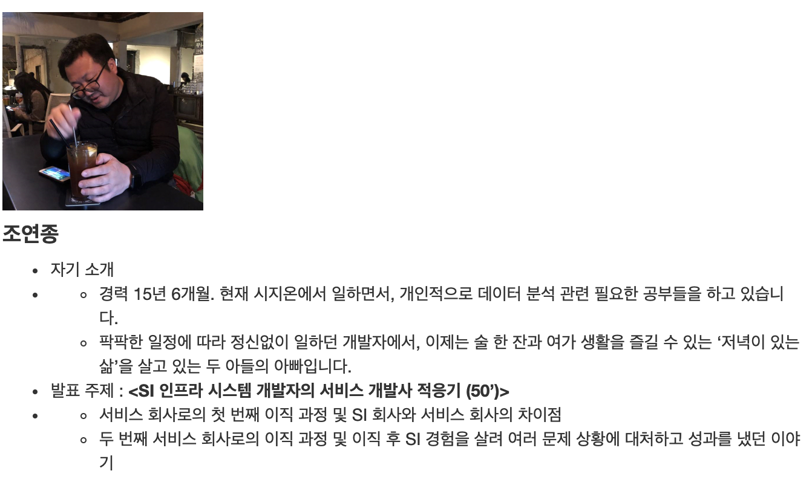
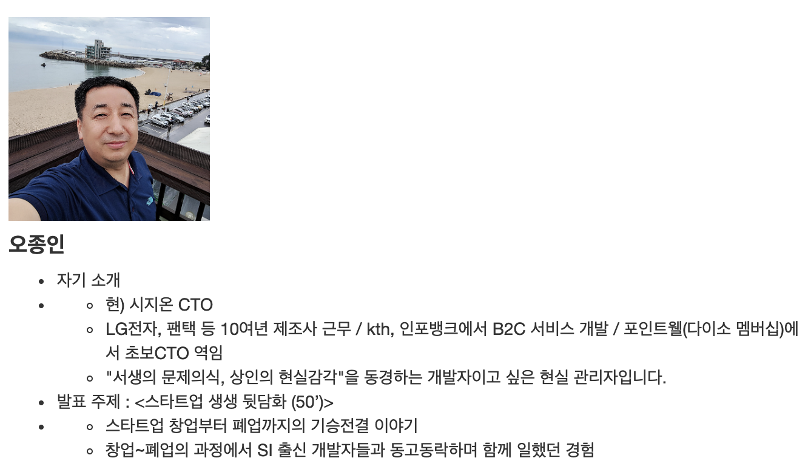

# SI 개발자의 ‘험난하지만 즐거운’ 스타트업 적응기

OKKY에서 진행한 스타트업 취업 시리즈 3탄!

* [SI 벗어나기 세미나(2016년)](https://okky.kr/article/320556)
* [OKKY 취업준비생 Meetup 참석 후기!(2017년)](https://okky.kr/article/394551)

SI 개발자의 ‘험난하지만 즐거운’ 스타트업 적응기 세미나에 다녀왔습니다.  

* [세미나 링크](https://okky.kr/article/542938)

저는 7시 15분쯤 도착했는데요.  
이미 많은 분들이 자리를 잡고 두번째 연사이신 오종인님의 이야기를 듣고 있던 것을 보고 진짜 인기있는 주제임을 실감했습니다.  
  
아무래도 평일 저녁이라 신청하지 못하신 분들도 계실것 같습니다.  전체 내용을 담진 못했지만, 그래도 어떤 발표와 질문이 오고갔었는지 궁금하셨던 분들은 참고해보세요 :)

## 1. SI 인프라 시스템 개발자의 서비스 개발사 적응기

연사소개

### 1-1. 발표

* 서비스 개발자로 느낀점
  * 답답한점
    * 요구 사항이 없다
    * 계획은 없다.
    * 상황에 따라 변한다
    * 검증팀이 없다
  * 좋은점
    * 개발자는 **개발도 잘해야** 한다
    * 고객사가 아닌 **고객이 최우선**이다
    * 배포는 공지후 주간 작업
    * 자택, 휴가 등 눈치 없는 근무 환경
* 서비스 개발을 하고 싶다면 마인드부터..
    * 수동적인 자세 -> 능동적인 자세
    * 실시간 장애 대응
    * 시장은 우리 생각대로 따라가 주지 않는다.
    * 비지니스를 먼저 이해해야 능동적으로 일을 할 수 있었음
    * 생존이 우선이다.
      * 하고 싶은 일보다 **필요한 일을 한다**
      * **고객 입장**에서 생각한다.
      * 지금일이 앞으로 **자신의 연봉을 책임진다**
* 스타트업 회사는 인력 Pool이 넉넉하지 않다.
    * 다양한 요구는 나한테 기회
      * 데이터 분석, 포스 설치
    * Tool 적극적 활용
      * 사내 위키
      * 슬랙 알람
      * 업무는 지라
      * 형상 관리는 Bitbucket
* SI 회사 업무가 서비스회사에서 필요한 경우가 있음
    * 정산 업무
    * 데이터가 틀린데, 왜 틀리죠?
    * 분석하고 검증하는데 도움이 되었음
* 새로운 시작
    * 다시 취업전선으로 뛰어들며 만난 상황들
      * A-Z까지 개발 가능하세요?
      * 개발자 1명인데 CTO 가능하세요?
    * 취업에서 얘기한 메리트
      * 저는 서비스 만들어 봤습니다.
      * 500만 회원 서비스 다루어 봤습니다.
    * 현재 회사는 내가 원하는 모습과 비슷하여 합류
* SI회사보다 서비스 개발자가 더 낫다는이야기는 아님
  * 회사에 도움이 되는 개발자가 좋은 개발자
* 어제보다 좋은 오늘을 생각하며 일하는 중
 
## 2. 스타트업 생생 뒷담화

연사소개

### 2-1. 발표

"스타트업 생생 뒷담화"를 할려고 했지만, 설문조사의 결과를 보니 별로 관심 없어 보임.  
그래서 **설문 조사에 나온 질문을 통해 Q & A를 진행**

### Q & A

Q. 서비스 회사의 특성을 설명해주셨는데, 서비스업의 문화 때문인지 규모가 커서 그런것인지?

* 조연종
    * 서비스가 시작하는 단계를 발표함
    * 이후 어느정도 규모가 커지면 이렇게 급하게 일을 진행하진 않음
    * 안정화 단계에 들어가면 코드리뷰 등을 통해 서비스 안정화를 진행하게 됨
    * 현재 우리 서비스가 어느 단계에 있냐에 따라 달라질것 같음

Q. 요구 사항이 명확하지 않고 소원을 바라는걸 보게 되는데, 스타트업도 실제로 그런지?

* 조연종
    * 갑이 요구하는 것은 어떻게든 쫓아가면서 물어보면 명확하게 정의할 수 있음
    * 하지만 서비스의 고객의 요구는 명확하지 않음
    * 어떻게 쫓아갈 수 없어서 항상 물명확함

Q. 스타트업 및 B2C 개발자에 관해 알고 싶습니다.

* 김수보
    * SI 현장은 분업화
    * 스타트업은 그렇지 않음. 필요한 일을 해야함
    * 익혀야할 스킬들의 차이가 있음
* 이민석
    * SI를 하다가 임베디드 소프트웨어 회사에서 넘어감
    * 스타트업 및 B2C 서비스는 영업이 일을 가져옴
    * 스타트업 및 B2C 서비스에 점점 좋은 개발 프로세스가 생기고 있음 (코드리뷰 등)

Q. 서비스 기업과 SI 기업에서 개발자로 일할때 차이를 알고 싶습니다.

* 오종인
    * 두부자르듯이 구분지울수 있는것은 아님
    * 스타트업들이 개발자가 없어 SI 회사에 일을 맡길때가 있고, SI 외주를 하는 스타트업이 있을 수도 있음    
    * 어떤건 이렇다라고 확실하게 얘기할수는 없다는 것을 먼저 얘기함
* 이민석
    * 요즘 스타트업 동네는 개발자들이 정말 부족함
    * 그래서 SI에 맡기는 일이 종종 있음
    * 기술력이 있는 SI회사는 스타트업들의 외주를 받아서 함
    * 어떤 SI회사는 정기적으로 새로운 기술을 연습하는 운동을 함
    * 이것저것 많은것을 해야하는게 스타트업이라서 역량을 키우는데는 좋다고 생각함
    * SI는 한회사라고 생각해야하고, 스타트업은 **업계 전체에 취업**한다는 마음으로 봐야함
      * 스타트업이 1만개라면 나는 1만개 회사에 취업하는 것
    * 사실 요즘은 개발자가 뭘 하든 굶어죽진 않는 환경
* 김수보
    * 서비스 기업은 SI회사보다는 전망이 밝은 편
    * 스타트업은 스톡옵션이 있으니 대박날 확률이 어쨌든 존재하는 편
    * SI회사는 일감만 존재한다면 계속 일할 수 있음
    * 창업 도전은 절대 사라지지 않음
      * 창업의 아이디어를 만들어 달라는 요청은 계속 있을것
    * 나이 60넘어서는 개발이 아닌 다른일을 하겠다고 하면 SI도 나쁘지 않음
    * 실리콘벨리 도전을 하고싶다면 서비스 기업으로 가야함

Q. 스타트업 취업할때 투자처가 안정적인지 어떻게 확인하는지?

* 이민석
    * 당연히 질문해도 되는 문제
    * 요즘은 그런 내용을 확인해볼 수 있는 사이트도 많음
    * 인터넷에 "무슨무슨 회사 투자" 로만 검색해도 상당히 자료가 나옴

Q. SI와 스타트업에는 어떤 사람이 어울릴지?

* 조연종
    * 신기술에 대해 거부감없이 도입할 수 있는 사람이 스타트업에 어울림
    * 예로 SI 개발자분들 중에 엘라스틱을 써보신 분들은 많이 없음
* 이민석
    * 개발자들을 보면, 젊을때는 호기심이 많아 공부하기엔 스타트업이 좋음
    * 새로운 기술을 봤을때 가슴이 뛰는 시기가 있음
    * 그럴때 스타트업으로 가야함
    * SI에서는 사실 그럴 확률이 낮음
    * SI회사를 다니는 후배나 학생들을 보면 그 회사에 매몰되는 경우를 자주 봄
  
Q. 이직 노하우를 배우고 싶습니다.

* 오종인
    * 이브레인을 통하세요.
    * 컨설팅까지는 무료이니 한번 만나보시길
* 김수보
    * 이사철에 이사해라
    * 봄가을에 취업하기 좋음
    * 스타트업/서비스 기업으로 가실땐 면접에서 **많이 물어보라**
* 조연종
    * 다 개발할줄 알아야 이직할 수 있음
    * 내가 갖고 있는 기술이 서비스에 어떤 도움이 되는지 어필할것
    * 현재 속해 있는 회사에서 했던일/잘했던일/못했던 일들을 정리할 것
* 이민석
    * 현재 스타트업 시장은 개발자가 갑
    * 면접관들은 여러분이 **얼마나 빨리 배우는지**를 보고 싶어함
    * 알고리즘 공부법
      * 쉬운 문제는 무조건 풀어봐야함
      * 어려운 문제는 답을 빨리 보고 문제 푸는 훈련을 하면 됨
    * 요즘은 젊은 분들이 이직기를 정말 많이 씀
      * 그분들의 이직기를 보면 도움이 많이 됨

오종인님의 쉬어가는 스타트업 이야기

* SI 회사 vs 스타트업
    * SI회사는 일반적으로 오라클
    * 스타트업은 MySQL
    * 돈으로 해결할 것이냐, 내가 해결할 것이냐
* 스타트업?
    * 불확실한 환경과
    * 제한된 자원을 바탕으로
    * 빠른 성장을 이루어야 하는
    * 혁신기업
    * 혹독한 환경에서
    * 전문성까지 갖춰야 하는
    * 인적자본 중심의 지식집약적인 조직
    * 자유롭고 재미있는 부분은 극히 일부분
* 성공에 대한 준비와 실패 대비 양쪽을 해야함
    * 간단하게 구성했다가 서비스가 너무 잘되서 서버가 폭파한다면?
    * 서비스가 잘될거라 예상하고 대규모 아키텍처를 구성했더니 고객은 없어서 서버비용이 너무 많아지면?
* 애자일
* DevOps
* 기술 동냥
    * 모든걸 다 알수는 없음
    * 많이 질문 할 것
    * 주변에 잘하는 사람들을 많이 둘것

Q. 취준생으로 스타트업 지원 준비사항

* 이민석
    * 신입을 필요로 하는 문화는 조금씩 사라지는 중
    * 신입이 아닌 취업을 해야함
    * 개인 프로젝트를 해야함
    * 학생들에게 이 이야기를 하면 **기획**을 하고 있음
      * 그럴 필요 없음
      * 잘돌아가는 것을 만들필요가 있음
    * 어느 스타트업이 좋은지 모르기 때문에 커뮤니티에 참가해야해서 사람들이 어떻게 얘기하는지 들어봐야함

Q. Spring 개발자로 회사에 왔는데, 관계 없는 다른 일을 하고 있으면 이직시에 도움이 되나?

* 김수보
    * 회사 생활 대부분이 이렇게 우당탕탕 지나감
    * 같이 고생하는 사람들이 있으면 무엇이든 배울게 있음
* 이민석
    * 지금 하고 있는 일을 블로그에 쓰라
    * 기술적으로 정리
    * 요즘은 깃헙에 블로그를 만들어서 쓰시는 분들이 많음

Q. 질좋은 개발, 협업의 방향

* 김수보
    * SI하다가 서비스에 가면 충격을 받음
    * 체계가 없었음
    * 대신 상대가 뭘 하는지 알아야 의사소통이 가능 함

Q. SM 고급 운영과 스타트업의 과장자리 중 어디가 나을까요?  
월급 차이는 100~200이 차이납니다.  
초기 안정화 되지 않은 스타트업은 SI와 마찬가지로 야근을 많이 하는데, 그럴꺼면 SM 고급 운영 자리가 더 낫지 않나요?  

* 김수보
    * 아마 이 질문에 대한 고민을 가장 먼저 하고 있는 세대가 나인것 같음
    * IT 시장엔 크게 2가지가 있음
      * 기술노동과 제품
    * 기술 노동은 나이 먹으면 못함
      * 나이 먹었는데 과연 젊은 친구들과 비교해서 빨리 배우고, 빨리 개발할 수 있을까?
    * SI는 분업화가 되어 있어 언젠간 시장에서 찾지 않고, 은퇴할 수 밖에 없음
    * 나이 **70까지 꾸준히 월 300~400벌어야만** 하면 어떡하지?
      * 제품을 만들어서 팔아야함
      * 그 제품은 게임일수도 있고, 웹서비스일수도 있음
    * 서비스를 만들어 놀아도 돈이 들어올 수 있는 구조를 만들어야함
    * 어느게 더 낫다고 볼 순 없음
* 오종인
    * 개발에 욕심이 있다면 스타트업으로 가야함
    * 그리고 실제로 스타트업이 더 많은 연봉을 제시할때도 있음 (무조건은 아님)
    * 4대 보험 등을 비롯한 복지로 들어가는 비용까지 고려하면 100~200차이로 프리하면 안됨
      * 300이상 차이나면 고려해볼까말까함
    * Pay로 비교대상은 아님
