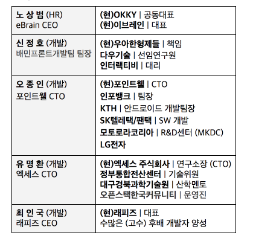
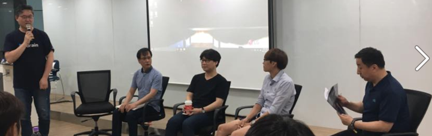
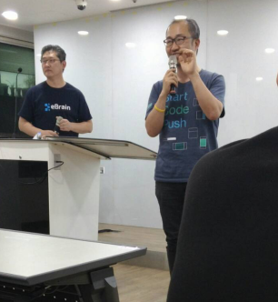

# OKKY 취준생 Meetup 참석 후기

OKKY에서 하는 많은 행사중에서도 특히! 인기가 많은 취업준비생들을 위한 세미나가 개최되었습니다.  
(사정상 못오신 분들이 계시겠지만, 그래도 본인이 목표하는 바가 있다면 이런 세미나는 꼭 시간을 내서 들었으면 좋겠다는 바램입니다.)  
여튼! 못오신 분들을 위해 열심히 세미나속 이야기를 기록하였습니다.  
누락된 부분이 있을 수 있고, 잘못기록된 것이 있을 수도 있습니다.  
양해를 부탁드리며, 시작합니다!  
(공부한 내용을 정리하는 [Github](https://github.com/jojoldu/blog-code)와 세미나+책 후기를 정리하는 [Github](https://github.com/jojoldu/review), 이 모든 내용을 담고 있는 [블로그](http://jojoldu.tistory.com/)가 있으니 참고부탁드립니다.) 

이번 세미나의 연사님들이십니다.

(아주아주 우아한 회사에 다니시는 모 책임님이 계시네요)  

세미나를 몇번 다녀 보신분들은 아시는 분들이 계시겠지만, 다들 정말 주니어 개발자분들을 위해 평소에도 많은 관심을 쏟으시는 분들입니다.  
OKKY에서 연사님들의 메일 주소를 곧! 공개한다고 하시니 평소 궁금했던 점들을 아낌없이 여쭤보세요!  
아래부터는 연사님들의 이야기를 그대로 옮겼습니다.  

## 들어가며 - 노상범

페이스북이나 구글 들어가신 분들이 훌륭한 개발자이긴 하겠지만, 실제로 여러분들에게 큰 도움이 되리라 생각하진 않는다.  
주니어들, 취준생들을 위해 고민하고 노력하시는 분들을 모시려고 노력했다.  

(왼쪽부터 노상범 대표님, 최인국 대표님, 유명환 CTO님, 신정호 팀장님, 오종인 CTO님)  

## 1부 - 등록 시 받은 질문들에 대한 각 멘토들의 답변

### 전공자에 비해 부족한 점을 비전공자가 짧은 시간에 보충하려면 무엇을 해야하나요? 비전공자가 전공자에 비해 장점은 무엇일까요?

유명환

* 2003년도에 가르쳤던 비전공자가 있는데, 현재 나와 같이 일하고 있다.
* 원예학과였던 그 친구는 현재 개발 팀장으로 일하고 있다.
* 흔히 말하는 양산형 개발자의 코스를 밟던 친구였다.
* 개인적인 생각으로는 **전공보다는 적성이 중요**한것 같다
* 짧은 시간에 부족한 점을 보충할수는 없다.
* 김봉진 대표님이 했던 이야기가 생각난다. **그 친구들의 노력을 무시하는건 오히려 역차별**이다.
* 이 달리기가 100M 라면 못이기지만, 80살까지 일하는 것을 생각하면 누가 이길지는 봐야 한다.
* 전공자는 본인의 적성이 맞든 안맞든, 이것저것 많이 보고 듣게 된다. 이런 보고 듣는것도 꽤 중요하다.
* 단, 전공자라고 다 잘하는 것은 아니다. 그래서 우리가 조금만 더 노력을 하면 된다.
* 페이스북을 통해서 최대한 많이 보고 듣는것이 필요하다

### 개발자로 취업하는데 있어 신입이 어느정도의 실력을 가져야 하나요?

오종인

* 채용하는 사람의 입장에서 얘기하고 싶다.
* 일반적이라기 보다는 개인적인 이야기
* 요즘은 경력같은 신입을 뽑고 있다. 이젠 대기업도 신입보다는 경력채용을 선호한다.
* 중소기업은 신입 교육에 대한 경험이 거의 없다.
* 이런 상황에서 취준생에게 필요한 것은 **똘똘함**이다.
* 전공자를 선호하는 이유는 회사에서 **기술과 일을 가르칠때 수고가 덜하기 때문**이다.
* 하지만, 취준생은 **전공자라는 자격에 초점**을 맞춘다. 
* 회사에서 원하는 것은 전공을 했으므로 인한 기반지식에 대한 기대 때문이다. 이때문에 회사와 구직자의 차이가 생긴다.
* 회사와 취준생 모두 서로가 현실적인 이유로 채용한다.
* 누구나 김태희와 결혼하고 싶지만 그러지 못한다. 회사도 아쉬운 입장이다. 절대 취준생이 을이 아니다.
* 인터넷에 나오는 인사팀장 출신들의 이야기는 믿지마라.
* 채용공고를 볼 때, 얼마나 정성들였는지를 꼭 확인했으면 좋겠다. 그렇지 않은 회사는 피해야 한다.
* 교육 시스템이 없는 회사에서 혼자서 살아 남을 수 있는 최소한의 개념을 갖춰야 한다.
  * 네트워크, OS, 데이터베이스 등등

### 스페셜리스트 vs 제너럴리스트, 취준생으로서 가져야할 포지션은? 

최인국

* 남의 떡이 커보이는 친구들이 있다.
* 이 친구는 저걸하네? 저 친구는 저걸하네? 라고 하며 이것저것 유행따라 기술을 배우는 친구들이 있다.
* 개인적인 생각으론 그건 옳지 않다고 본다.
* 회사마다 원하는 기술스펙이 다른데, 이걸 취준생들이 모두 만족할수는 없다.
* 여러분은 **그 중 하나를 내 것으로 만드는 것이 중요**하다
* 나도 많은 언어를 다루지만, 실제로 밥 먹고 살수 있을만큼의 숙련도는 자바뿐이다.
* 또 하나 중요한 것이 **적성**이다.
* 현재 55세임에도 아직 개발할 수 있는 것은 개발이 적성에 맞기 때문이다.
* 소프트웨어가 과연 내 적성에 맞는가를 먼저 생각했으면 좋겠다.
* 하나만 파면 갈 곳이 없을것 같지만, 분명히 있다. 걱정하지 않았으면 좋겠다.
* 개발과 디자인 둘다를 잘하는것은 지금은 좀 어렵다고 본다. 하나를 Sub로 가져가는 것이 좋을것 같다.

오종인

* 스마트스터디의 진유림님을 참고했으면 좋겠다.

### 전체 질문들 중 공통 질문 - 어떤 소양을 갖춰야 하나요

신정호

* 대부분은 명석한 두뇌를 갖고 있진 않을것 같다.
* 일반적인 재능을 가진 분들이 어떻게 좋은 개발자가 되는지에 대해 얘기하고 싶다.
* **나이가 많아져도, 위치가 올라가도 공부를 계속 해야하는 것이 중요**하다.
* 혼자서 다 할 수 있는 레벨이 아니라면, 상대가 하는 이야기를 명확히 이해하는 커뮤니케이션이 중요하다.
* 연차에 관계없이 배울 점이 있다는 것을 인지해야 한다.
* 공부를 한다면, 책을 보는 것을 권장한다. 아래 책들을 추천한다.
  * 객체지향적으로 생각하라
  * 헤드퍼스트 - OOP
  * 클린코드
  * XP
  * 조엘온소프트웨어
* 이 책들을 통해 취업이 잘된다고 할 수는 없는데, **센스를 기를 수는 있다**
* 코딩에 흥미를 키우려면 **보이는 것**을 하는것이 좋다.

### SI 개발자로 시작하는 것은 어떤가

박성철 (깜짝패널)

(뒤에 계시다가 노상범 대표님과 오종인 CTO님의 요청으로 대담에 함께하신 박성철 이사님!)

* 일단 돈을 버는것이 중요하다
* 여기가 취업이 잘된다고 시작하는 것도 나쁘지 않다고 생각한다.
* 사람이 정말 많이 필요한 것이 SI 시장이다.
* SI가 나쁜것이 아니라 **SI 문화가 문제**라고 생각한다.
* 개발자는 계속 성장하는 것이 중요한데, SI 문화는 사람이 계속 성장하기 어렵다.
* 물론 안그런곳도 많은데, 일반적으로 그런 경우가 많다.
* SI에서라도 꾸준히 실력을 쌓는 것이 중요하지만. 본인의 실력을 인정해주지 않는 문화가 있다.
* 그래서 커뮤니티에서 열심히 활동하는 것이 중요하다. 거기서 다른 사람들이 "아 저사람과 함께하면 좋을것 같다" 라고 인정받으면 이후에 많은 기회가 발생한다.

최인국

* SI 프로젝트를 하면서 성장하는 것은 정말 어렵다.
* 환경 자체가 고정/고착 되어 있고 모든 것이 틀에 짜져 있다.
* 특히 대형 프로젝트, 공공기관에서의 프로젝트는 더더욱 성장하기가 어렵다.
* 좀 더 나은 방법을 제안해도 하지말라는 이야기를 더 들을 뿐이다.
* SI를 간다면 대형 SI보다는 중소형 SI를 가는 것이 좀 더 낫다고 생각한다.
* 오히려 좀 더 유연한 개발환경을 갖고 있다.
* 물론 거기간다고 무조건 성장한다고 볼순 없어서 개인의 노력이 필요하다.
* SI를 하다보면 1시간에 끝날 일도, 하루종일 끌기도 한다. 일찍 끝나면 일을 더주기 때문이다.
* 여러분은 남의 일이라고 꺼려하기 보다는 동료라는 생각에 도와주는 것을 좋아했으면 좋겠다.

노상범

* SI도 가도 되는 SI가 있고, 가면 안되는 SI가 있다.
* 개발자가 30명이라고 하는데 책상이 5개밖에 없다면 파견회사다 -> 가지마라
* 대기업 자회사 SI -> 가지마라
* 개발을 배우지 않고, **개발을 관리하는 법을 배운다**.
* 반대로 협력사에 계신 분들이 오히려 나이가 지나도 갈 곳이 많다. 실제로 개발을 그만두지 않고 계속 해왔으니
* 나중에 서비스 회사를 가고 싶다는 목표가 있다면 XX시스템 구축 같은 프로젝트에 참여하기 보다는 웹 에이전시에서 실제 서비스를 만들어보는 것이 더 낫다.

오종인

* 이번에 팀 빌딩을 하면서 SI 개발자 분들을 채용하고 1년 반 동안 정말 많이 싸웠다.
* 10년간 몸에 벤 습관이 정말 무섭다.
* 위에서 무언가 결정해주지 않으면 절대 먼저 움직이지 않더라.
* 누군가가 책임을 져야만 움직인다.
* 서비스는 항상 요구사항이 변경되는데, 이걸 못참는다. WBS 대로 일정이 진행되지 않으면 정말 힘들어 한다.
* SI 시장이 무서운 것은, 거기서 얻은 습관이 무섭다는 것이다.
* 본인이 그렇게 변하면 안된다.

신정호

* 신입사원으로 들어가서 3년간 SI를 시작했다.
* 10개월간 미장도 하면서 정말 개발과 동떨어진 일을 하기도 했다.
* 일정 수준의 노력이 들어가면 유명한 개발자들과 본인이 정말 엄청난 실력 차이가 나진 않는다.
* SI에 대한 단점이 많지만, 본인이 그에 대해 문제의식을 갖고 있고 그걸 깰수있다고 생각하면 괜찮다고 본다.

### 신입으로 돌아가면 뭘 다시 하고 싶으신지

유명환

* 답변을 하기전에, 한가지 말씀드리고 싶다.
* 여기 오신 분들은 정말 잘될것 같다. 
* 이 시간에 여기올정도라면 뭘해도 잘되실것 같다.
* 여기서 우리가 하는 말이 꾸짖음처럼 보일수도 있지만, 오히려 여기 안오신 분들이 더 걱정이다.
* 그러니 너무 걱정하지 않으셨으면 좋겠다.
* 답변을 하자면, 신입일땐 정말 조바심이 심했다.
* 막 바쁠때 오히려 하고 싶은 공부가 생겼던 것 같다.
* 생각해보면 압박감으로 인해 도피하려고 했던것 같다.
* 어려운것은 피한다고 피할 수 있는 것이 아닌것 같다.
* 커뮤니티가 정말 중요한것 같다. 꼭 개발이 아니더라도 같은 고민을 나누다보면 덜 스트레스 받지 않을까 싶다.

박성철

* 신입으로 돌아가도 똑같이 했을 것 같다.
* 전공이 토목공학이지만, 중학생부터 코딩을 시작했다. 친구따라 토목과 갔었다.
* 졸업할때쯤, 토목과 개발중 개발을 선택하게 됐다.
* 졸업하고 사장님과 단둘이서 일하는 곳에 입사하게 됐다.
* 근데 그 사장님은 미국에서 프로그래밍을 하셨던 분이라 그분께 정말 많은 것을 배웠다.
* 첫 회사는 정말 중요하다.
* 프로그래머로 성장하고 싶다면, 그런 회사를 한번 찾아봤으면 좋겠다.
* 의외로 그런 회사에서 급성장할수 있다.

### 개발자에게 좋은 회사는 어떻게 알아볼 수 있는지 + 이런 곳은 피해라

신정호

* 첫 회사에서 사람에게 크게 데였다.
* 퇴사하는 자리에서 "신정호씨는 프로그래머 못할꺼다" 라는 이야기도 들었다.
* 그래서 다음 회사를 고를때 연봉이 천만원이 차이났지만, 연봉이 더 적은 회사로 갔다.
* 그 회사가 따뜻한 사람이 있다고 느꼇기 때문이다.
* 그건 면접에서 인사담당자와 채용담당자와 이야기하면서 알 수 있었다.
* 사람이 좋아야 한다.
* 면접을 볼 때, 감각을 세워서 여긴 따뜻하구나 라는걸 느끼면 가도 된다고 생각한다.

유명환

* 사장을 하면서 사람을 뽑고, 보내는 것을 경험해봤다.
* 나간 친구들의 공통된 이유가 **배울게 없어서** 란 이유였다.
* IT개발자들이 야근한다라는 이야기 정말 많이 한다.
* 야근이 정말 많은 의사들이 야근이야기를 하진 않는다.
* 야근이 좋다라는 이야기가 아니다.
* 개발자는 공부해야할게 많다는 것을 알았으면 좋겠다.
* 좋은회사의 기준은 일 자체가 쉽다 어렵다가 문제가 아니라, **사람을 인정**해주는 것이 중요하다고 생각한다.
* 우리처럼 계속 공부해야하는 직업은 자존감이 있어야 공부를 한다.
* 인정받고 인정하는 문화가 있는 회사를 들어가는 것이 좋다고 본다.

### 신입은 뭘 모르는지 모르는 경우가 많다. 그런 분들에게 공부팁은?

최인국

* 배우는 분들에게 요구하는 것이 똑같은 걸 3~4번 만들게 한다.
* 그 과정에서 만든건 항상 지우고 다시 만들게 한다.
* 그분들에게 항상 다른 코드가 나오도록 공부를 유도한다.
* 공부를 하는 위치에서는 절대 복붙하지 않았으면 좋겠다. 한자한자 다 타이핑했으면 좋겠다.
* 인터넷에 있는 내용을 사용하더라도, 본인이 직접 타이핑하라
* 똑같은 결과를 도출하는데, 서로 다른 방법으로 구현하는것이 좋은 방법이다.

### 사수 혹은 멘토는 어떻게 만날수 있을까

유명환

* 커뮤니티 강추

오종인

* 궁하면 통한다.

## 2부 - 자유로운 Q & A

### 현직 기획자인데, 개발자로 전향을 하고 싶다. 외국에 나가고 싶어서 그런 방향을 정했는데 옳은 결정인지

박성철

* 우리나라 기획자의 롤에 동의하지 않는다.
* 개발자들은 기획자가 시키는것만 한다는 방식이 옳다고 생각하지 않는다.
* 기획자와 개발자가 항상 같이 논의하고 결정을 하는 것이 옳다고 생각한다.
* 본인의 성향이 어디에 더 가까운지가 중요할것 같다.

### 스프링을 주력으로 공부해야할지, 자바를 주력으로 공부해야할지, 포트폴리오에 Git 주소만 써도 될지

최인국

* 취업을 위해 스프링을 공부하는 것은 반대한다
* 입사후에 스프링을 공부해도 된다. 대부분의 회사가 사용한다.
* 스프링 또한 프레임워크일뿐이다.
* 아주 작은 것이라도 **본인만의 프레임워크를 만드는 것이 중요**하다고 생각한다.
* 스프링만 공부하면 SI 입사할때는 좋을것 같다.

오종인

* Github 주소만 넣으면 보는 입장에서 수고가 많이 든다.
* 간략 요약을 포트폴리오에 추가하는 등, 이걸 보는 입장에서 수고가 덜드는 쪽을 선호할것 같다.

박성철

* 실제 현업의 기술 vs 기본기냐에 대한 질문인것 같다.
* 빨리 습득할 수 있는 기술을 익혀서, 그걸 기반으로 넓혀가는 것을 추천한다.
* 큰 틀에서 조금씩 경험(전반적인 경험)하고 이런게 있구나 라고 경험한 뒤에, 필요할때 그 부분을 깊게 들어가는 것을 추천한다.
* 센스라고 얘기하는데, 전반적인 것을 인지한 상태에서 그 기술이 필요한 때에 그걸 공부하는게 더 중요한것 같다.
* 사람마다 매번 평가 기준이 달라지기 때문에, 정도는 없다.
* 본인에 맞는 회사가 나타날때까지 Try 하는게 좋은것 같다.
* **나를 만드는것이 더 중요**하다.

오종인

* 그 프로젝트로 본인이 어필하고 싶은게 뭔지 보여주는게 중요한것 같다. 
* 경력있는 신입을 원하는 게 아니라, 경력같은 신입을 원한다.

신정호

* 어떤 회사에 들어가고 싶어 토이프로젝트를 막 했다고 가정하자.
* 근데 많은 사람들이 토이프로젝트를 한다.
* 차라리 직접 그 회사의 서비스를 만들고 그걸 포트폴리오로 기록하고, 만들면서 궁금했던 것을 질문하는 것이 더 낫다고 생각한다.
* 이미 다른 사람들이 진행하고 있는 일을 똑같이 진행하면 변별력이 없다고 본다.
* 그 회사에 근무하고 있는 사람을 커뮤니티에서 찾아 직접 연락해보는 것도 좋다고 본다.

### 어떤 기준으로 적성에 맞다고 판단하셨는지

유명환

* 코딩할때 결과가 나오면 재밌다.
* 개발자에게 필요한 여러 능력이 있지만, 개발자에게 가장 중요한 능력은 **호기심**이라고 생각한다.
* 왜 안드로이드에는 main메소드가 없지? 와 같이 궁금증이 있어야 한다.
* 결과가 나오면 재밌다. 
* 근데 이 재미가 진짜 나와 적성이 맞는지 확인하려면, 이게 왜 이렇게 된거지 라는 궁금증이 있느냐 마느냐로 본다. 
* 그래서 남을 가르치는것이 효과적인 공부법이다.
* 내가 뭘 모르는지 정확히 알게 된다.

### 신입 개발자의 나이 기준은

박성철

* 나이를 5년 단위로 보고, 1년 단위로는 잘 안본다.
* 그냥 신입으로 보지, 몇살이구나로는 안본다.
* 뒤늦게 개발을 시작한걸 인정하고, 불리한점이 뭔지 찾아보고 개선해야한다고 생각한다.
* 공채 신입보다 연봉이 낮은 경력자들이 있다. 이걸 가지고 비교하고 자책하는것만큼 바보같은일이 없는데 그런 사람들이 많다.
* 내가 하고 싶은 일이 뭔지 명확하다면 그길로 계속 갈 수 있지 않을까 싶다.

오종인

* 유명한 대기업에 몇개 내고 자존감 얘기하는건 좀 안맞는 것 같다. 
* 나이는 정말 안중요하다.
* 개발자가 정말 부족한 시대이다.

### 대학원 석사 & 박사 졸업자에 대해서 어떻게 생각하는지

박성철

* 석사 & 박사때 연구한 내용이 회사에 필요하다면 인정받는다고 생각한다.
* 근데 이력서를 보면 본인이 연구한 방향으로 이력서 내는 분들이 거의 없다.
* 대부분이 타이틀을 따려고 한 경우가 많았고, 그런 경우 인정 받기 힘들다.
* 오히려 학교 다니는동안 커리어가 쌓이지 않았기 때문에 손해일수 있다.
* 진짜 본인의 커리어에 맞는지 보고 진학하는게 좋다고 생각한다.

노상범

* 개발자 포지션에 대부분 석사 & 박사가 필요한 경우가 별로 없다.
* 아주 정해진 포지션(데이터사이언티스트, 통계등)외에 거의 뽑지 않는다.
* 실력이 가장 중요하다.

### 마무리

오종인

* 이야기를 듣기보다, 하고 싶은 이야기를 많이 했던것 같아 죄송하다
* 다음에 또 이런자리가 있으면 더 깊은 이야기를 했으면 좋겠다.

신정호

* 여러분들이 다음엔 여기 앞에서 이야기할 수 있었으면 좋겠다.
* 이후에 열심히 공부해서 다시 이런자리에서 만날 수 있었으면 좋겠다.

유명환

* 재미가 중요하다
* 재미가 있으면 에너지가 생겨서 계속 하게 된다.
* 어떤 일이든 10년하면 잘하게 되있다. 근데 10년이상 하기가 쉽지 않다.
* 재미가 없으면 꾸준하기가 힘들기 때문에 재미있는 분야를 찾았으면 좋겠다.

최인국

* 군제대후, 학교를 그만두고 고졸로서 개발자 생활을 하는 친구가 있다.
* 근데 그 친구가 지금 목표는 다시 학교로 돌아가 공부하는 것이다.
* 그 친구가 다시 학교가서 필드에 돌아오면 몇살이 될지 생각해보자
* 당장 지금 내 눈앞에 결과가 나오지 않는다고 포기하지 않으셨으면 한다.

박성철

* 우리가 지금까지 속았다고 생각했으면 좋겠다.
* 뭔가 좋은 직장에 가면 다 해결될것이라는 거짓말을 듣고 살았다.
* 정말 똑똑한 분들이 바보같이 사는것을 많이 봤다.
* 그 분들은 좋은 회사에 가는 것이 목표였으니, 회사에 합격후 바보같이 살게 된 것이다.
* 격변기인 지금, 우리나라의 어떤 기업도 10년 이내에 망할수 있다.
* 직장을 보고 선택하는 것이 정말 바보같은 선택이다.
* 내가 가고 싶은 길이라면 좀 돌아가는 길이라도 가는 것이 좋다고 생각한다.
* 특정 그룹에 속하는 것이 목표이면 그 목표를 달성후 삶이 힘들어진다고 생각한다.

노상범

* 스티브잡스가 투자를 받기 위해 200군데를 돌았지만 다 퇴짜를 맞았다.
* 스티브잡스의 그런 악착같은면이 조금 있었으면 좋겠다.
* 이렇게 이메일을 공개했을때 실제로 연락하는 분들은 거의 없었다.
* 소프트웨어 업계만큼 후배들을 위해 도움을 주려고 노력하는 분야는 거의 없다고 생각한다.
* 이런 혜택을 취하려면 좀 더 활동적이여야 한다.
* 정말 많은 개발일들이 있다. 조금만 실력을 쌓으면 된다.

### 후기

> 쉬는 시간없이 쭉 진행되었음에도 예정 시간보다 늦은 10시가 되어서야 끝났습니다.  
그만큼 시간가는줄 몰랐던 시간이였던것 같습니다.  
**이 세미나를 위해서 대구에서** 올라왔다는 학생분이 계셨는데, 보면서 아 참 저런 열정적인 분들이 많이 계시는구나 하고 반성하게 되었습니다.  
요즘 매너리즘에 빠지신 분들이라면 (전 아직 즐겁게 개발중입니다!) 한번 취준생의 모임에 슬쩍 참가해보시는건 어떨까 하는 생각이 들었습니다.  
여튼! 좋은 에너지 얻고 갈 수 있었습니다.  
다시한번 세미나를 준비해주신 OKKY 운영진분들께 감사의 말씀 드립니다!
감사합니다!
