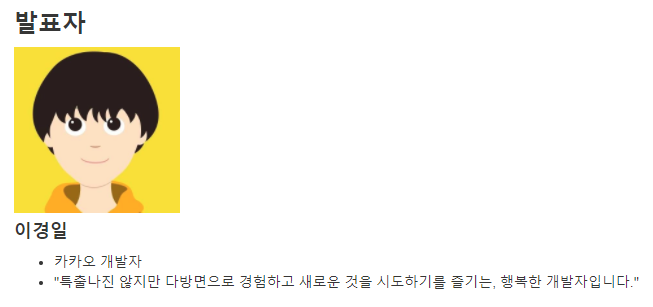
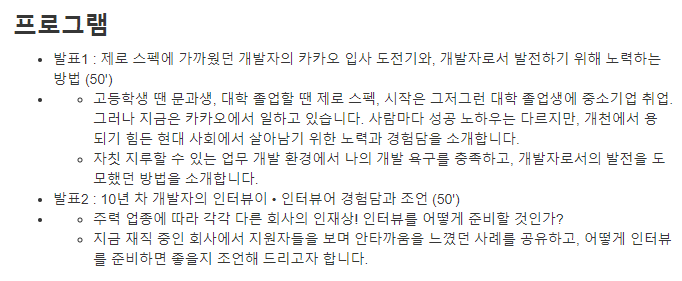
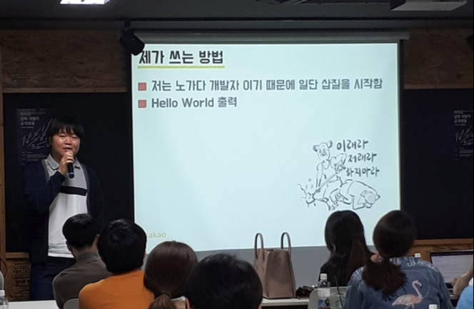

# 제로 스펙에 가까웠던 듣보잡 개발자의 유명 IT 기업 도전기

안녕하세요?  
3월 29일! 오늘 카카오의 이경일 개발자님의 개발 공부방법과 이직에 관한 이야기를 들으러 eBrain 사무실을 방문했습니다.  

이경일님의 경우 이전에 스프링캠프 2017에서 [발표](https://www.youtube.com/watch?v=bsPBVoxBhq0)도 하셔서 어떻게 경력관리를 하셨는지 굉장히 관심이 갔습니다.  
  
> 여담이지만, 오늘 발표에서 IOS를 하시다가 백엔드로 가신걸 듣고 진짜 놀랬습니다

세미나 상세 내용은 [링크](https://okky.kr/article/449208)를 참고하시면 될것 같습니다.  

오늘 발표 세션은 크게 2가지인데요

두 세션 모두 취업준비중인 학생/주니어 개발자에게 큰 도움이 되리라 생각합니다.  
오늘 세미나의 대상은 아시겠지만, **대학생부터 3년차 이내의 주니어 개발자**입니다.  
꼭 3년차 이내가 아니더라도, 이직을 생각중이신 많은 분들에게 큰 자극이 될것 같습니다.  
  
자! 그럼 발표 내용 시작하겠습니다.

## 1. 유명 IT기업 입사 도전기와, 개발자로서 발전하기 위해 노력하는 방법

(발표자 이경일님)

* 스펙이란 무엇일까요?
  * 학교, 학점, 영어성적, 어학연수, 자격증, 돈
* 오늘 할 이야기
  * 이런 스펙을 하나도 가지고 있지 않은 제 이야기
* 저의 스펙
  * 그저 그런 4년제 컴공
  * 학점.. 차마 여기에 쓰기 민망할 정도
  * 정보처리 기사 자격증 하나
  * 어학연수 X
  * 영어 X
  * 돈 X
* 할 이야기..
  * 유명 IT 기업에 들어가기 위해 한 노력은 **대학생부터 시작**
* IT를 시작한 계기
  * 고등학생때는 문과였지만, 스타크래프트 길드 형들이 길드 홈페이지 제작을 맡겨서 **나모웹에디터**를 시작
  * 원래 꿈은 역사 선생님 이었지만, 이걸 계기로 컴퓨터 계열을 꿈꾸게 됨
* 대학에서는
  * 컴퓨터 동아리에 가입해서 열심히 활동을 시작
  * 리눅스, Apache, PHP, MySQL 등등
* 첫 사회 생활
  * 졸업한 동아리 선배가 다음에 입사하게 되서 D&Shop의 Javascript & HTML 알바를 제안
  * 알바가 끝난후 아쉬워서 네이버 블로그 스킨 알바를 찾아서 시작
* 알바를 시작하면서 유명 기업의 지원들의 스펙을 발견하고 충격
  * 병특 하시는 분들이 전부 다 엄친아..
* 대학교 2학년때 사회물을 너무 빨리 알게됨
  * 이대로 있으면 취업을 할수있을까를 심각하게 고민
  * 학교에선 10년전 녹화 내용으로 강의하니 더 답답한 마음
* 내 스타일을 알게 됨
  * 몸으로 하는걸 더 즐김
* 나의 고민
  * 내가 사회에 나가서 그들과 경쟁할수 있을까?
  * 전략을 세움
* 전략
  * **경력으로 밀어붙이자**
  * 가능하면 실력까지
  * 그때부터 학교 생활은 포기 (교수님께 야간으로 학교생활을 하겠다고 얘기)
      * 단, 출석일수가 모잘라서 학점에 큰 손해를 봄
  * 흙수저라 돈이 없으니, 돈도 벌자
      * 차를 사자
      * ~~회사 끝나고 학교 가기 위해~~
      * 사실 차를 겁나 좋아함
* 지원 시작
  * 취업하기 전까지 학교를 가지 않겠다고 생각하고 일단 학교에 가지 않음
  * 잡코리아를 보면서 개발자 뽑는 곳에 닥치는대로 지원
  * 현실은 시궁창
      * 당시 어떤 회사도 대학생(고졸)을 뽑지 않음
      * 지금은 다름
      * 대학 안나와도 잘나가는 분들이 많음
* 전략 수정
  * 좀 돌아가는 길을 택함
  * 쇼핑몰을 공략하자.
  * 쇼핑몰은 개발요소도 있지만, **상품 등록을 해야하는 알바생도 필요하니** 이쪽을 노리자.
  * 단, 할줄 아는 언어가 PHP라서 회사가 꼭 PHP를 쓰는 곳들만 지원
  * 중고 컴퓨터 쇼핑몰 회사에 합격
      * **상품 등록 알바로 시작**
      * 개발자는 개발팀장님 1명뿐
      * 개발팀장님께 계속 나의 개발 의지/능력 어필
      * 하고 싶다고만 해서 시켜줄일 없으니, 그동안 개발했던 소스를 들고 가서 코드리뷰를 가장한 능력 어필
      * 업무의 일부로 개발일을 드디어 하게 됨
* 이것을 시작으로
  * 또 다른 비공식 경력을 쌓을수 있게 됨
  * 하지만 학부 재학 기간과 겹쳐서 어느 회사도 경력 인정을 해주진 않음
* 비공식 경력의 덕을 봄
  * 아사달 취업 - PHP
  * 가비아 이직 - ASP, C# 
  * 위 회사로 이직할때 이 비공식 경력을 굉장히 흥미로워 해줘서 쉽게 합격함
* 전환점
  * 스마트폰에 관해서 알게 됨
  * 해외 직구로 폰을 구함
  * 안드로이드 개발 서적을 구입 -> 스도쿠 개발
  * 아이폰 3GS 국내 출시
  * Objective C 공부하는 겸 앱 개발
  * 개발한 앱들을 앱스토어에 등록
  * 다찾아주마 앱 - 대한민국 앱스토어 무료 앱 1위
  * 다찾아주마 앱 - 안드로이드 출시
* 조직내에서 방법을 찾아봄
  * **앱 개발이 재밌어서 국내 앱스토어 1위를 회사에 알림**
  * 아직 시기상조라고 이야기 들었음
  * 그 이야기에 충격을 받아 퇴사
  * 앱이 대세가 될거라는 믿음을 갖고 있었음
* 면접을 보러 다님
  * 서버: cafe24
      * 최종 면접에서 사장님께 모바일에 대해서 어떻게 생각하는지 물어봄
      * 지나가는 유행일뿐 중요하게 생각하고 있지 않다는 답변에 입사를 포기함
      * 아마 당시에 모바일 태동기라 그렇게 생각하신듯
  * 모바일: 이노에이스, NHN i&s, 인포뱅크
  * NHN이 결과가 늦어져 일단 인포뱅크에 먼저 입사
  * 하지만, 서버팀의 인원이 부족해 서버팀에서 개발을 하게 됨
  * NHN에서 합격 연락이 와서 바로 회사를 옮김
* 여기서 하고 싶은 말
  * 어찌됐든 한단계 높은 회사로 이직할수 있게된 이유
  * 새로운 분야에 관심을 가졌기 때문
  * "난 이분야에 관심있어요"는 그냥 **그 기술이 핫하다라는 말과 다를바 없음**
  * 결국 행동으로 옮겨야함
  * 물 들어올 때 노 저어라
  * 트렌드를 빠르게 파악하고 **행동**하라
  * 개발자가 하는 행동은 역시 개발뿐
* 어떻게 행동하나?
  * 사람마다 방법이 다를 수 있음
  * 본인이 흥미 있는 분야를 찾아라
  * 해당 분야에서 만들어 볼만한 서비스를 생각하라
  * 외부에 오픈을 한다는 생각으로 개발
* 제가 쓰는 방법
  * 노가다 개발자이기 때문에 일단 삽질을 시작함
  * Hello World 출력
  * 토이 프로젝트 제작
  * **도메인 구입후 서비스 런칭**
      * 각 포털의 자동완성을 다같이 보여주는 서비스
      * 브라우저별로 JS 컴파일 여부를 확인해주는 서비스
      * 등등을 개발하고 커뮤니티에 몰래 공개
* 요즘 드는 생각
  * 암호화폐?
  * 블록체인 기술이 기회라고 생각
  * 모바일을 접했을때와 같은 느낌
  * 열심히 준비해 두면 취업에 유리할꺼라고 생각
* 한번 더 온 전환점
  * 당시 NHN 센터장님: "PHP 할줄아는 사람 없음?"
  * 할줄 안다고 했다가 팀을 옮기게 됨
  * IOS 개발자로 입사 했는데 서버 개발팀으로 옮기게 됨
  * 이때 Java & Spring 을 접하게 됨
* 생활 서비스 개발팀
  * 윙버스 - 혼자서 담당
      * PHP 개발자가 나혼자라서 ㅠ
      * 혼자서 하다보니 되게 오너십이 생김
  * 윙스푼 - 팀원들과 같이 함
      * Java & Spring
* NHN 회사는..
  * 대한민국 IT를 선도하고 있는 회사라고 생각
  * **주니어까지는 정말 도움 된다고 생각함**
  * 되게 체계적으로 되어있어서 주니어에게 큰 도움이 된다고 생각
  * **실력 있는 개발자들이 정말 많음**
  * 그분들께 직접 물어볼 수 있음
* NHN를 퇴사한 이유
  * 더이상 성장하지 않는 모습을 발견
  * 너무 체계적이라 개발자가 하는 일이 따로 있고, **각 영역이 분업화가 잘되어 있어서 할수있는게 제한적**
  * 욕심을 채울수가 없었음
  * 개발자라고 **자바 코드만 짜고 있으면 안됨**
  * 이 코드가 서버에 올라가서 어떻게 돌아가는지 이해 없이 작성만 하고 있으면 안됨
* 내가 가장 많이 성장한 회사
  * CJ O Shopping
  * 최강의 복지 : CJ 전계열사 임직원 40% 할인 카드
  * 임원(SK컴즈 출신)의 **개발 조직성장**과 **IT내재화 의지**가 강했음
  * 막상 입사했을때 모든게 다 외주가 하고 있어서 **구축된게 하나도 없었음**
  * 코드가 이미 10년이 지났어서 (자바 1.4) 좌절
  * 대용량 트래픽 대응이 힘들었던 현실
  * 리더들의 강력한 지지
      * IT기술을 내재화하고 현 상황을 개선함 목표
      * 최대한 운영 이슈를 윗 분들이 커버해주시고, 기술 내재화를 할 수 있도록 지원
      * 하나도 없다보니 뭘 개발해도 회사에 도움이 되는 상황 (모니터링, 로그수집, 캐시 솔루션 등등)
* 여기서 하고 싶은 말
  * 아직 긁지 않은 복권을 찾아봐라
  * 기술 내재화를 원하는 기업은 많다.
  * 물류, 유통 등을 노려보길 추천 -> 대부분 SI 외주가 많음
  * 카카오 커머스도 아직 긁지 않은 복권
  * 내가 만들고 싶은 것이 조직에 꼭 필요한가?
  * 먼저 조직에 제안하라 (상처받지 마시길)
  * **개발의 왕도는 없다**.
      * 얼른 파일럿 만들고, 승인이 떨어지면 본격적으로 개발 진행하면 됨
      * 그래도 컨벤션은 지키자
  * 상사와 발전 가능한 방향으로 의논하자
  * 개발자 세미나에 참석하자
      * 당장 적용할 기술 보다는 **영감**을 얻어라.
* 다시 이직을 결심
  * 개발자로서 다시 한계를 느낌
  * **유통 회사는 결국 개발자는 스텝**, 갑은 MD
  * 개발자에게 중요한건 결국 **자극**
  * 자극을 주는 상대가 근처에 있는게 중요
  * 항상 비지니스 캐쥬얼 복장으로만 다녔어야함
* 다음카카오 아니면 안 간다고 결심
  * **당시 가장 입에 많이 오르내리는 IT 개발 전문회사**
  * 다음 카카오에 관해 조사하기 시작
      * 무조건 주변에서 좋다고 얘기한다고 지원하지말고 직접 조사해볼것
  * 전국민이 쓰는 서비스라 무궁무진한 가능성이 있다고 생각
* 다음 카카오 커머스 플랫폼 개발자로 입사
* 카카오에 입사후
  * 개발자의 천국이라고 불릴만한 회사
  * 수평문화, 영문이름(대표님도 영문명으로 부름)
  * 실제로 뛰어난 개발자들이 많았음
* 카카오 이야기를 하기 전에
  * 아일랜드 감자 이야기
  * 아일랜드가 워낙 가난해서 감자를 재배해서 먹었는데, 미국에서 슈퍼 감자를 가져와서 아일랜드가 배불러졌지만, 미국 감자에 치명적인 바이러스가 있어 전염병이 돌게 됨
  * 카카오는 정해진 언어, 정해진 가이드가 없음
  * 자바에서 치명적인 오류가 있어서 문제가 발생할 경우, 그래도 리스크 최소화
  * 회사에서는 리스크이지만, 개발자에겐 큰 장점이라 생각함
* 카카오에 일하면서 즐거운 이유
  * **나 빼고 다 잘하고** 개발자를 존중, 가치를 인정
  * 다들 꼰대가 안되려고 노력
  * 이전에는 항상 출근 체크를 해서 출근했었지만, 여기선 그런게 없었음
* 카카오를 퇴사함
  * 딱히 이직을 생각한 것은 아니었음..
  * 쇼핑하듯이 회사의 채용 공고문을 자주 봄
      * 어떤 회사의 어떤 기술을 쓰는지 자주 확인
  * 네이버의 **메인 플랫폼 개발자** 채용 공고를 봄
      * 항상 대용량 트래픽을 경험 못해봤었던 것의 갈증
      * 모든 네이버 서비스의 시작점인 네이버 메인
      * **대용량 트래픽을 처리하는 방법을 경험**해보고 싶었음
* 네이버 입사
  * 대용량 트래픽 대응에 관한 해법을 기대를 많이 했음
  * 네이버에 메인 서비스는 정말 중요한 서비스라서 아직 입사한지 얼마 되지 않아 신뢰가 없는 상황에서 뭘 시도하기 쉽지 않았음
* 여기서 하고 싶은 말
  * 내가 조직에서 무언가를 하고 싶다면?
  * **동료를 내 편으로 먼저 만들길**
  * 동료조차 설득 못했는데, 바로 상사로 가는건 잘못
* 그 뒤로는
  * 조직의 이슈를 해결하며 나의 본분에 충실
  * 카카오에서 했던 자유로운 개발자로서의 시도가 계속 생각남
* 다시 카카오로
  * 남들이 나보고 미친놈이라고 함
  * 갔다오면서 동료를 설득하는게 얼마나 중요한지 깨달음
  * 나의 관심사를 업무에 녹이며 일을 하고 있음
* 정리
  * 현실을 인정하고 방법을 찾아라
      * 회사에서 내가 하고자 하는 일을 못하고 있는데 1년 채우고 이직하는건 주니어일수록 손해
      * 최대한 빨리 이직하던가, 인사팀에 얘기해서 해결
  * 트렌드를 빠르게 파악하라 
  * 행동하세요
      * **책만 보지 마세요**
      * 누군가에 꼭 평가 받으세요
  * 절대 늦었다고 생각하지 마라
  * 개발자 행사에서 영감을 얻자
* 개발자로서 발전하기 위해 노력하기
  * 당신은 지금 회사 업무를 만족하고 있나요?
      * 10명 중 9명은 아닐것이라 예상
  * 내가 좋아하는(잘하는) 개발을 하자
  * 오픈소스에 기여하자
  * Github에 올린뒤 주변의 실력 있는 개발자에게 리뷰를 요청하라
      * 페이스북, 커뮤니티 등에서 사람을 찾아보기
      * 그냥 링크를 드리면 누구도 안봐줌
      * 내가 만든 소스 중에서도 특히나 어떤 부분을 어떤 이유로 어떻게 고쳤는지 설명과 함께 작은 부분을 요청
  * 내가 만든 오픈소스를 업무에 적용을 해라
  * 이키가이
      * 좋아하는일, 잘하는일, 돈되는일, 세상에 필요한일 모두가 겹치는 일
      * 내가 만든 오픈소스를 업무에 적용하는게 이키가이
  * 내가 만든 오픈소스
      * [illuminati](https://github.com/LeeKyoungIl/illuminati)
      * 별좀...
  * 업무시간 중 20%는 자기 개발을 위해 사용하라
      * 공개적으로 20%를 자기 개발에 쓰겠다고 하면 안됨
      * 나의 성장이 회사의 성장에 도움이 됨
      * 당장 프로젝트가 급한 경우엔 집이나 야근을 하면서 자기 개발에 사용해보기
  * 회사에서 진정한 동료를 찾아라
      * 나와 케미가 맞는 동료를 찾자
      * 나와 바라보는 방향이 같은 사람
  * 질문을 두려워하지 말자
  * 내가 어려우면 남도 어렵다
  * 선배들에게 조언을 구해라
  * 자신감을 갖자
  
## 2. 10년 차 개발자의 인터뷰이 • 인터뷰어 경험담과 조언

* 2번째 발표가 더 중요하다고 생각

### 2-1. 10년차 인터뷰이

* 디자인시안, 쇼핑몰 솔루션, 도메인, 서버를 다루던 회사
  * 면접 총 2번, 각 30분
  * 기술면접에서 PHP와 MySQL에 관하여 물어봄
  * DB의 이해
      * innodb, myisam 차이
  * 쿼리 작성 질문
* 기업용 솔루션, 웹하드, 도메인, 서버를 다루던 회사
  * 복지가 좋았던 회사
  * DB 쿼리 작성 문제
      * index 관련 문제
* NHN i&s - 공통 인프라 서비스 회사
  * 분위기 좋고, 네이버의 체계를 배울수 있는 회사
  * 필기시험 1번, 면접 총 2번
  * ios관련 메모리 release 문제, API 연동시 보안 문제
  * 당시에 면접 질문이 너무 날카로웠음
* 커머스 회사
  * 대기업의 복지, 공짜로 식당에서 밥
  * 기술 면접이라기 보단 프로젝트 위주로 PT
  * 기획자가 사이가 좋았어서, 기획자에게 먼저 제시했던 기능 & 프로젝트 PT
* 카카오
  * 보통 1차는 1시간인데 저는 1차 2시간, 2차 1시간
  * **2차 면접도 기술** 면접 (개발자의 조직장이 들어옴)
  * 주로 내가 했던것 위주로 디테일 하게 기술셋 물어봄
      * 손으로 종이에 다 그려보면서 면접장에서 설명할수 있도록 연습해서 감
  * 면접 Tip
      * 마지막으로 궁금한 것이 있다면? 이란 질문에 어떻게 대답할지?
      * 없습니다, 혹은 본인이 어필할 수 있는 방법을 얘기 (이상한 얘기하지 말자)
* 네이버 - 포탈
  * 전화면접, 1차면접 3시간, 2차 1시간
  * 3시간의 면접 시간중 **2시간을 화이트 보드에 코딩** 작성
  * 카카오는 본인이 했던 것을 제대로 잘 이해했는지 물어보는 반면 네이버는 기본기 (자료구조, 알고리즘)을 봄
      * 3년차든 10년차든 손코딩 연습을 꼭 해보시길
  * 뛰어난 개발자, 공유를 잘하는 개발자가 많음
  * 업무에 사용하는 기술에 관한 이해도
* 면접을 많이 보다보니 느낀점
  * 회사가 원하는 인재상은 2가지로 나뉠수 있음
  * **업무 도메인 지식이 뛰어난 개발자**, **기술이 뛰어난 개발자**
  * 업무 도메인 예
      * 커머스 개발자 공고라고 한다면 상품, 주문, 배송, 클레임, 정산, 리포팅 등등의 도메인 경험자 우대
      * 상품 도메인 이해도 (상), 기술지식(중) vs 상품 도메인 이해도(하), 기술지식(상)
      * 이러면 전자를 선호
  * 명확한 타겟팅이 필요
      * 구인 공고에서 어떤 업무 도메인을 원하는지 파악
  * 도메인 지식이 뛰어난 개발자를 원하는 회사
      * 커머스, 금융, 결제, 정산 등
  * 개발지식이 뛰어는 개발자를 원하는 회사
      * 원천기술을 연구개발 하는 회사
      * 네이버 랩스 등
  * 자신의 도메인/기술 이해도가 어느정도 인지 냉정하게 파악이 필요
  * 긴장하면 막상 생각도 안나고 말문도 막힘
  * 3년차건, 20년차건 면접전에 공부는 필수
      * 코딩 테스트는 꼭 미리 해볼것
  * 이력서에 거짓이 없어야 한다
  * 인생은 시험의 연속이니 적응해야함
  * IT 업계 트렌드를 놓치지 말자
      * 올 초에 IT 업계에 핵폭탄이 하나 떨어졌는데 어떤 이슈일까요? => 멜트다운
      * 이 이슈로 성능이 30% 하락된 게임 서버를 개선해야하는데, 이미 코드가 2004년에 개발되서 소스로 최적화가 힘들다면 어떻게 해결할까요?
      * 정답은 없지만 긴장 풀기용
  * 평소 업무시 영혼 없이 개발하지 말자
  * 면접도 경험이다. **1년에 한번 정도는 면접을 보자**
  * 개발자는 계속 공부(개발)하는 사람
      * 본인이 목표하던 회사에 합격했다고 더이상 공부하지 않는 사람이 되면 안된다.
  * 면접관에게 꾸준한 모습을 보여줄수 있어야 한다.
      * 블로그, Github이 꾸준하게 관리 되있으면 가산점

### 2-2. 인터뷰어로 활동하며 경험한 안타까운 사례

* 어떤 기술에 관심있어서 어떤 일을 경험했는지가 더 중요
* 이력서에 소설을 써놓은 지원자
  * 단순 if문 정도 추가한 수준이라면 안쓰는게 좋음
* 노쇼
  * 노쇼는 해당 면접관들은 기억
* 전 단계 면접에서 대답 못한 질문을 또 못함
  * 전 단계에서 못대답한 질문을 다시 찾아보지 않았다는 건 굉장히 감점
* 열심히 회사가 시키는 일만 했던 지원자
  * 제너럴한 기술은 회사가 안쓰더라도 자신의 시간을 내서 공부
* 자신이 사용했던 기술에 관해서 이해가 없던 지원자
  * 자신이 사용한 스프링 버전 조차 모르던 지원자가 있었음
* 어디서 들은건 있었던 지원자
  * 깃헙에 커밋날짜가 하루밖에 안된다던지

### 2-3. 이스터에그 - 현직 1차 인터뷰어들의 면접에 관한 조언

> 각 면접관 님들의 익명성 보장을 위해 숫자로 면접관님들을 표기했습니다.  
양해 부탁드립니다!

* 1
  * 주니어는 어떤 기술셋을 많이 알고 있나 보다는 **기본기와 문제 접근법**
  * 스마트함 위주로 판단
  * 왜 이런 기술을 사용했는가 장단점을 비교, 설명을 할수있어야함
* 2
  * 알고리즘 자료구조는 면접에서 빠질수 없는 주제
  * 벼락치기로 공부하기 보다는 평소에 꾸준히 조금씩 준비
* 3
  * 면접관이 본인보다 반드시 더 잘할거라는 생각을 하지 말것
  * 면접을 위해 공부하지말고 평상시 기술에 관해 꾸준한 관심과 학습을 이어갈것
* 4
  * 현업에선 비슷한 경험의 경력직을 원함
  * 경력에 맞거나 비슷한 일을 할 수 있는 공고에 지원하길
* 5
  * 호기심을 가져라
* 6
  * 면접은 언제나 신입사원 같은 마인드로
  * 잘난척 하지말고 겸손하게 충실하게 답변
* 7
  * 이것저것 유행을 따르지말고, 자신만의 경쟁력을 갖춰야함
  * 진행했던 프로젝트의 전체적인 그림을 이해가 필요
  * 기존 구성원들과 조화로운 커뮤니케이션이 중요
* 8
  * 지원하는 회사의 서비스를 직접 사용해보고, **개발자 관점**에서의 피드백을 준비
  * 서비스를 분석해보고 비효율적인 구조나 보완해야할 기술에 관해 의견을 피력하면 좋은 결과가 있을 것
* 9
  * 주니어라면 문제를 해결하고자 하는 의지가 중요
  * 본인이 사용한 기술을 **왜 쓰는지**, **어떻게 동작하는지** 꼭 찾아보도록 하자
* 10
  * 본인이 해당 분야에 관심이 있고, 공부나 개발을 꾸준하게 하고 있다는 것을 보여주는 것이 중요
  * 말 뿐만 아니라 근거가 필요
* 11
  * 어설프게 아는 것을 잘 아는것처럼 꾸며 말하지 말자
  * 이력서에 적은 것은 다시 한번 확인 해볼것
  * 왜 당사에 지원을 하게 되었는지, 입사를 하게 된다면 어떻게 일을 하려고 하는지 스토리 만들어 볼것
* 12
  * 자신을 어필하는 기술이 개발 능력만큼 중요
  * 화려한 언변과는 다름
  * 자신의 프로젝트에 얼마나 애정을 갖고 주도했는지 어필
* 13
  * 사소한 것도 그냥 넘어가지말고, 끝까지 알아내고 공부하자
  * 면접관은 그 지원자가 사소하게 넘어간 부분에서 끝까지 물어본다
* 14
  * 말뿐인 개발자가 되지말자
  * 면접관에게 근거를 들어 어필하자
* 15
  * 이력서에는 반드시 **직접 한 일**과 **잘 아는 기술**만 작성하자
  * 면접자의 신뢰가 깨진다
* 16
  * 면접에서는 구체적으로 자신만의 경험을 신뢰감으로 줄 수 있도록 이야기하라
* 17
  * 자식을 습득하고, 개발스킬을 향상시키는것과 어떤일이든 꾸준히 하는 모습을 보여주는 것이 중요
  * 정말 본인이 관심 있고 흥미를 가지는 부분에 대해서는 깊게 파헤쳐 보는 것이 중요

### 2-4. 이스터에그 - 현직 2차 인터뷰어들의 면접에 관한 조언

* 1
  * 마음가짐과 말만으로는 면접관을 설득할 수 없다
  * 사실적인 근거가 필요
  * 기술뿐만이 아니라 협업, 오너쉽도 개발자의 역량이다
* 2
  * 자신만의 서비스를 만들고 배포하고 운영해본 경험이 중요하다
  * 개발자 최고의 스펙은 자신만의 서비스
  * 이 서비스에 관한 구조를 화이트 보드에 직접 그리며 설명할 수 있도록 평소에 연습해보는게 중요
* 3
  * 본인의 분야에 정말 최고의 전문가가 되겠다는 마음가짐이 중요
  * 자기 분야에 관한 명확한 자기 색깔을 가지길
  * 기획/비지니스 파트와 커뮤니케이션이 유연해야함
* 4
  * 본인이 한 일과 역할을 구체적으로 어필
  * 성장하지 않는 개발자는 필요없음
  * 어떤 일을 하려고 했을 때 하지 못했던 것은 감점 요인이니 언급하지 말자
* 5
  * 개발을 **좋아서 하는지, 먹고 살기 위해 하는지** 고민해보자
  * 좋아해서 한다면 면접관에게 증거를 들어서 어필하자  
  * 자신에게 어울리는 회사에 들어가야 한다
  * 솔직한 자기의 역량과 개발 스타일을 밝히고 적합한지 확인하자
  * 연봉협상편
      * 본인이 대표라면 나같은 개발자를 이 연봉에 채용하겠는가?
      * 무조건 많이 받는다고 좋은건 아니다
      * 다음번 연봉 조정까지 조직장을 미안하게 만들어라
* 6
  * 개발자는 단편적 기술 지식을 조합하는 사람이 아님
  * 문제를 정확하게 정의하는 사람
  * 문제를 효과적으로 해결하는 사람
  * 본인은 이런 사람이라는 것을 면접관에게 어필
* 7
  * 문제 해결 능력이 가장 중요
  * 문제의 해결을 위해 어떻게 접근하는가 자신만의 방법을 면접관에게 어필하자
  * 질문에 모두 정답을 말할 필요는 없다
  * 현업에서 바로 사용할 수 있는 수준의 질문을 던지는데, **단순히 해봤다**정도라면 감점요소다
* 8
  * 회사에선 혼자 보다는 구성원간 협업고 희생, 이해/소통/설득하는 기술을 주로 보게 된다
  * 경재보다는 협력한다는 자세 필수
* 9
  * 본인이 작성한 코드는 면접관에게 올바르게 설명할수 있어야 함
  * 컴퓨터 공학의 기초를 얼마나 잘 갖추고 있는지가 중요
  * 어떤 기술이던 재빨리 이해하고 실무에 적용할 수 있는지를 면접관에게 어필
* 10
  * 요즘은 2차에서도 화이트 보드 코딩을 하는 곳이 많다.
  * 본인이 짠 코드를 면접관 앞에서 본인이 다시 리뷰를 꼭 해보길
  * 면접장에서도 본인이 짠 화이트보드 코드가 마음에 안들면 고치려는 자세가 중요
* 11
  * 면접관이 원하는 정답만을 찾지말고 꾸미지 않은 자신이 이야기를 하자
  * 지원하는 회사의 사업분야에 관한 이해를 하고 면접에 임하라
  * 왜 당사에 지원했는지 명확하게 이유를 얘기할수 있어야 함
* 12
  * 눈빛이 중요
  * 항상 답변할때 면접관과 아이컨텍을 하자
  * 채용 공고를 자세하게 읽어보고 본인에게 맞는 공고에 지원하는게 가장 중요
  * 단순히 저 회사를 들어가고 싶다고 해서 아무공고에나 지원하지 말자

## 3. 마지막

* 카카오 경력 개발자 공개 채용 4/4 마감!
* 카카오 커머스에 꼭 내주세요
* 기존의 경력 수시 채용 방식과는 완전히 다른 방식
* 1차 면접에서 면접관 2명을 번갈아가면서 2번을 봄
* 최종도 동일한 방식
* 다른 회사 갔다가 다시 카카오로 돌아올만큼 좋은 회사
* 2년 이상이면 누구나 지원 가능

## 4. Q & A

### Q. 신입이 이직 이력서를 쓸때 팁?

* 본인이 했던 프로젝트 소개
* 고민이 고민했던 기술들을 정리
* 2~3줄내로 작성, 그이상은 잘 안봄
* 무조건 실무/기술 위주로 작성할 것

### Q. 프로젝트 팀간 불화를 어떻게 해결하는게 좋은 답변일지?

* 사람간의 감정 트러블은 이력서에 잘 안씀
* 가급적 기술적으로만 접근하는게 좋음

### Q. 스타트업 CTO는 어떤지?

* 매니징을 해본적이 없어서 자신은 없음

### Q. 투잡으로 돈이 들어오는게 좋은데, 기술적으로 공부를 위해 포기해야할지

* 물론 돈을 벌려고 일을 하기는 함
* 너무 큰 차이가 나는게 아니라면, 본능을 따라가길
* 투잡하는게 커리어로서 도움이 된다면 하시되, 그게 아니라면 빨리 포기하고 하나를 선택하시길

## 4. 노상범 대표님의 짧은 커리어 팁

* 뼈를 깎는 고통이 2~3년 정도가 필요
* 좋은 회사로 가신 대부분의 분들은 누구나가 겪었던 것을 봄
* 처음부터 좋은 회사 가긴 어려움
* 그렇다고 갈때 까지 계속 미취업할껀가? vs 다른데 가서 돌아서 갈지?
* Player가 많은 영역을 선택하는 것도 우회하기 좋은 방법
* 자신의 장점과 성격에 어울리는 도메인 선택이 필요

## 5. 남은 OKKY 세미나 소개

* 4/12 뇌를 자극하는 커리어 FAQ (참가 신청 진행 중)
* 4/14 블록체인과 개발자
* 4/19 서버개발자가 맛본 vue.js 이야기
* 4/25 개발자를 위한 구글 검색 노하우
* 4/28 국비지원교육을 성공적으로 졸업해서 취업하기
