# Spring Camp 2017 1부

스프링캠프 2017 행사에 다녀왔습니다!  
이번 행사는 토/일 이틀간 진행되는 아주 큰 행사였습니다.  
KSUG (한국스프링사용자모임)이 10주년이 되는 해이기도 해서 정말 행사에 많은 준비를 쏟으셨다는게 느껴지는 날이였습니다.  
해마다 이렇게 행사 준비해주시는 KSUG 일꾼 분들 정말 감사합니다!  
  
행사장은 잠실 삼성 SDS 서관 지하 1층이였습니다.  


행사장으로 내려가는 에스컬레이터에서 벌써 많은 사람들이 있는 것을 확인할 수 있었습니다.  

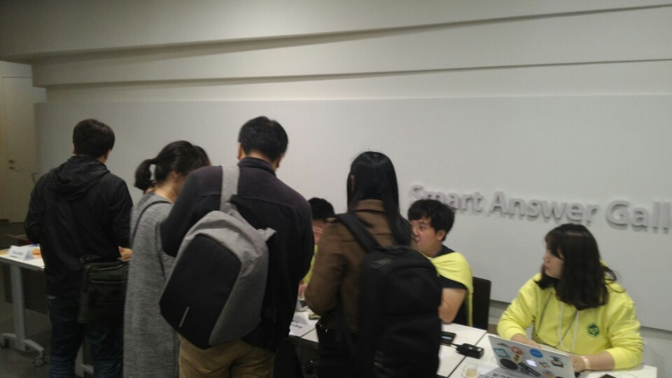

참가자 등록을 하고,


오늘 세미나 순서를 확인하였습니다.  
리액티브가 당췌 뭔가 하는 생각으로 왔기 때문에 오늘은 A트랙만 들을 계획이였습니다.  
(주제가 다 좋아서 트랙 둘다 들을 수 있었으면 정말 좋을텐데 하는 생각만 가득했습니다. ㅠ)

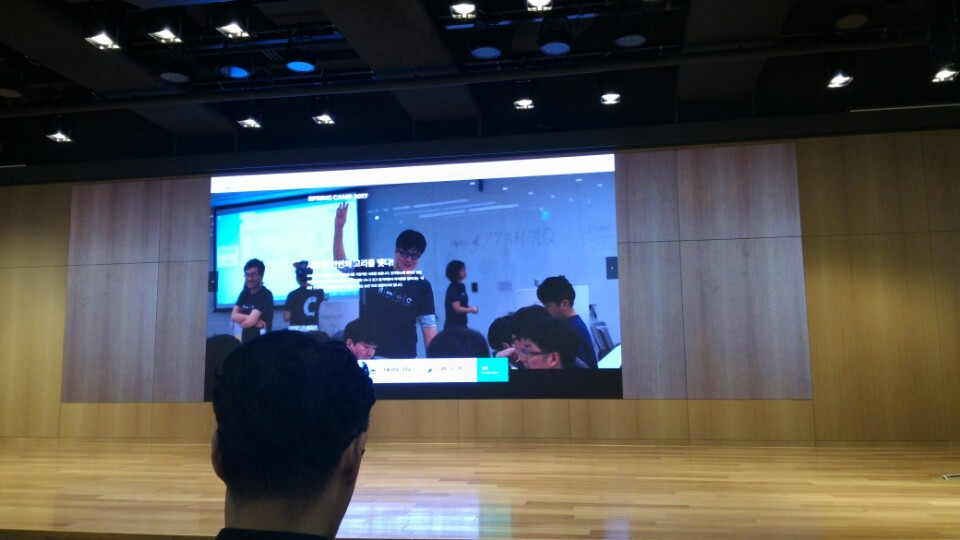

운이 좋게도 앞 줄에 앉을 수 있었습니다.  
본의 아니게 ㅠ... 자주 뵙게될 앞자리에 앉으신 분의 뒷모습입니다..  

세미나는 박성철 이사님의 Overview로 시작하였습니다.  


(이사님 화이팅!)   

## Overview


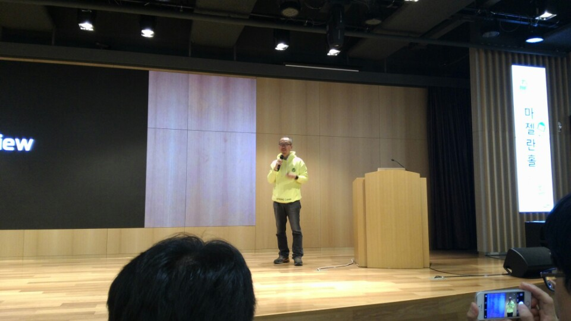

(Overview를 시작하시는 박성철 이사님)  

* 최근 사내에서 대표님이 앞으로 300년 뒤 미래가 어떻게 될지 생각하려면 **300년 이전엔 어땠는지 보는것이 좋다**란 이야기를 하셨다.
* 나는 300년 이전까지는 잘모르겠어서 **35년 전엔 어땠는지**에 대해 공유하고 35년 뒤엔 어떻게 될까 잠깐 이야기 하려고 한다.

### +-35년

초창기 

* 컴퓨터에 대한 지식이 전무하던 시절  
* 당시 컴퓨터라하면 거대한 기계를 얘기했었음  
* 삼성, 금성, 하이콤, 스폿라이트 등에서 소형 컴퓨터를 출시하게 되었음  
* 가격이 너무 비싸서 사진 못하고 책으로만 컴퓨터 공부를 계속 함  
* 시간이 지나 아버지께서 애플 PC를 구매해줌  

대학시절 

* 대학에 가서는 모뎀을 구매해 사설 BBS를 이용하고 천리안, 하이텔 등을 사용  
* 시간이 조금 지나니 CD-ROM이 등장하여 대용량 저장소를 이용하게 됨  


* 이때부터 컴퓨터는 **미디어**로 다가오게 됨  
* 멀티미디어를 지나 인터넷이 등장하게 됨  

휴대용기기의 등장

* PDA 등이 또 등장하여 손에 들고 다니는 PC의 시대가 시작함   
* 아이폰이 등장하면서 완전 충격을 받게 됨  
* 여기에 사용된 기술은 새로운게 하나도 없는데, 새로운게 하나도 없는 아이디어 들을 모아 새로운 것을 만들었다는 것에 정말 놀라웠다.  
* 그리고 이젠 내 몸에 PC를 착용해서 다니고 있는 시절이다.  

35년 동안의 내 경험을 이야기했다.  
예전에는 컴퓨터가 구석에 있었다.  
멀티미디어 시대가 오며 컴퓨터가 집의 중심이 되었다.  
인터넷 시대가 되서 컴퓨터는 개인의 소유가 되었다.  
누구나 한 사람씩 한메일을 가지게 되었다.  
그리고 이젠 누구나 스마트폰을 가지고 있다.  
  
점점 컴퓨터가 일상의 일이 되었다.  
컴퓨터가 점점 생활에 스며들고 있다고 생각한다.

### 프레임

사람은 친밀도에 따라 접근을 허용하는 범위가 다르다.  
난 컴퓨터를 이 접근 범위와 관련해서 생각한다.  
예전에는 소프트웨어를 만들고 하드웨어를 만들면 잡지나 티비에 기고하고 광고해야만 알릴 수 있었다.  
인터넷이 되며 내가 만든 제품은 소셜 스페이스 영역으로 가게 되었다.  
그리고 이젠 누구나 스마트폰을 갖고 있기에 그 사람의 정보와 취향을 수집하여 점점 퍼스널 스페이스로 넘어갈 수 있게 되었다.  


컴퓨터에 데이터를 저장만 하던 시절에서 **새로운 비지니스를 창출**하게 되는 시기가 되었음

### +35년? 나는?

그동안의 기계는 단순한 역할만 해왔는데, 이젠 너무나 성능이 좋아져 **이전에 인간이 하던 일을 기계가 하기 시작**했다.  
  
**외주**  

* 비 본질적 : 우리 회사의 본질과 관계가 없어야 한다.
* 전문적 : 우리가 하기엔 많은 비용이 필요한 전문적인 일
* 일시적 : 한번하면 다시 안하게 될 일

이제는 소프트웨어가 회사의 본질이 되어야 하는 시기가 되었다.  
  
**소프트웨어 프로페셔널에 대한 책**

* 소프트웨어 개발 - 스티브 맥코넬
* 소프트웨어 장인정신 - 피터 맥브린

최근에 2가지 책이 더 나왔다

* 클린 코더
* 소프트웨어 장인

시간이 다되었는데,  
다들 **커뮤니티 활동을 통해서 정보 교류**를 하며 프로페셔널이 되어 번영했으면 좋겠다.  
  
이제 본격적으로 발표가 시작됩니다!  
최대한 정리한다고 했지만, 저의 기반지식이 얕아 잘못 작성되었거나 부실한 내용이 있을 수 있습니다.   
참고 부탁드립니다 ㅠ

## 프로세스와 스레드, NIO 그리고 리액티브 스트림(Reactive Stream) - 부종민

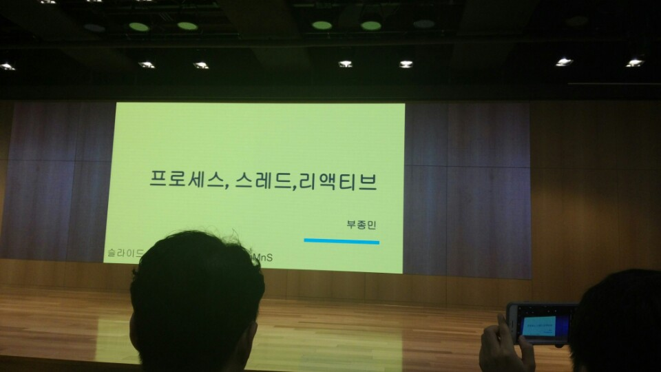

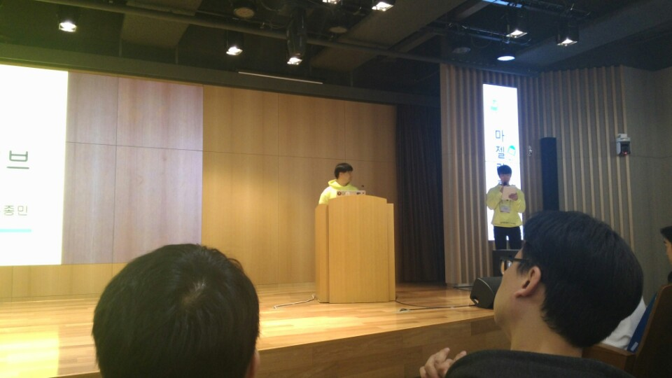

카카오에서 다음 시작페이지를 개발하시는 부종민님의 발표!

* 프로세스, 쓰레드, 쓰레드풀, 자바비동기 API, NIO를 다룰 예정

### 들어가며

프로세스, 쓰레드 등을 딱히 몰라도 현장에서 일하는데 지장이 없어서 그동안 신경쓰지 못했음  

### 쓰레드 일반

* 프로세스 : 독립된 실행의 단위
* 과거 : CPU는 프로세스가 독점, memory는 프로세스가 메모리 공간을 자유롭게 사용
* 현재 : CPU는 os의 스케줄러에 의해 time slice만큼 실행


컴파일에서 코드, 데이터로 관리되던 것을 런타임에서 힘,스택,코드,데이터로 관리하게 됨  

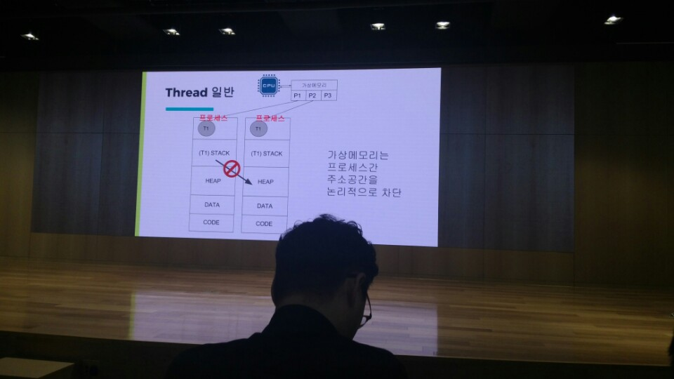

* 가상메모리를 통해서 프로세스를 관리
* 그리고 이렇게 여러 프로세스를 동시에 관리하는 것을 **멀티 프로세스**라고 한다.  

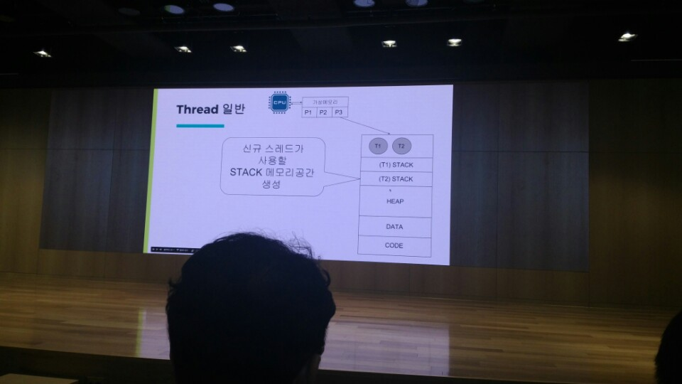

* 새로운 쓰레드를 만들때 신규 쓰레드가 사용할 stack 메모리 공간 생성

**쓰레드의 장점**  

* 프로세스를 만드는 것보다 저렴
* 쓰레드들간 힙 메모리 공간 공유

**멀티프로세스 vs 멀티쓰레드**  

* 캐시 측면에서 멀티쓰레드가 성능이 더 좋다. 자원공유가 되기 때문
* 이런 이유로 전통적으로 멀티쓰레드 방식을 선호
* 쓰레드풀 : 쓰레드를 미리 만들어 놓고 **재사용**하는 것

### 쓰레드 in JVM


추상화 레이어가 늘어나며 비용이 증가하게 됨  
* 쓰레드 생성 비용이 OS + JVM으로 됨
* 컨텍스트 스위칭, 가비지 컬렉션 등
* 성능 최적화를 생각한다면 OS 쓰레드보다 더 신경써야함

### 자바 Async API

**비동기가 필요한 상황**

* CPU 자원을 많이 사용하는 코드들 중 분할 가능한 코드는 병렬화해서 시간 단축
* HDD, 네트워크 카드등 I/O 자원은 느리다.
* I/O 작업 요청한 스레드는 I/O 작업의 완료를 대기한다.

### 비동기 코드가 어려운 점


(간단한 비동기 코드)

* 실행순서를 놓치기 쉽다.
* ```Runnable```은 결과가 void라서 아래와 같이 힙 영역에 저장하는 방식을 사용하게 됨
* 헌데, 이럴경우 쓰레드들 간의 작업 동기화가 필요하다. (결과값 호출 타이밍이 결국 비동기 작업이 끝난 다음이 보장되어야 한다.)


* 이를 위해 ```map.wait```를 이용하여 대기 후, 결과값이 생성되면 ```map.notify```등을 이용해서 알린다.
* 대기/알림 코드의 반복을 피하기 위해 추상화 클래스를 추가하였다 (```Future```)

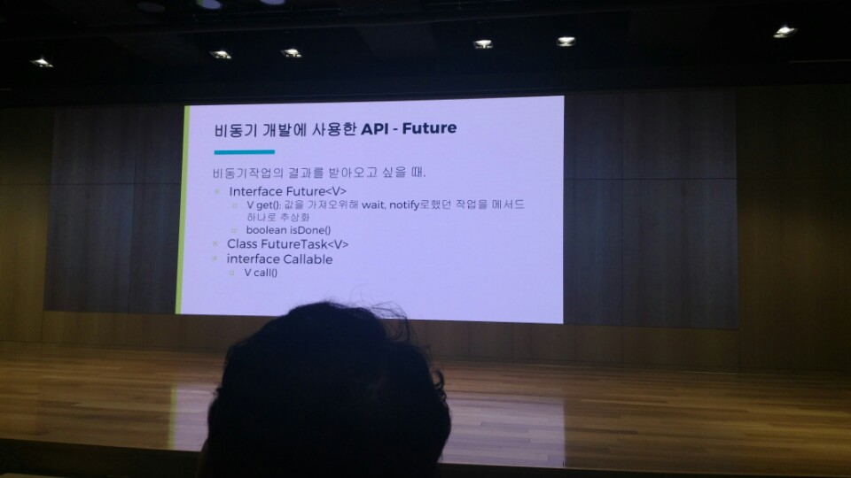

### 느낀점

* 쓰레드를 직접 사용하는건 쉽지 않다. (지식 + 경험)
* 내가 직접 제어하지 않아서 어려움이 많았다.
* 쓰레드 풀에 대한 이해가 필요했다.
* 쓰레드 풀 내의 쓰레드가 전체 사용중인 경우 큐에 대기 중인 요청들은 처리 시간이 이전 테스트가 끝나야 처리되기 때문에 응답 지연시간이 증가 된다.

### 자바 비동기 프로그래밍 ver.2


* 기존 Future의 단일 작업 처리 문제를 Java8의 ```CompletableFuture```을 사용

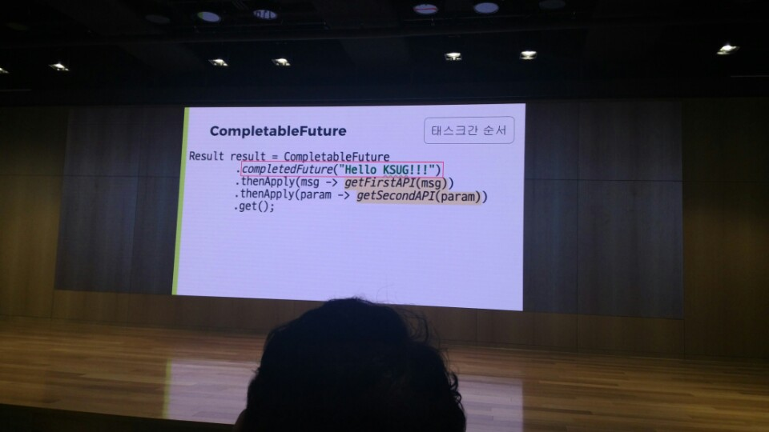

* 순서가 보장 됨


* 조합이 가능하게 됨

### Event Programming

* CompletableFuture나 NIO는 이벤트 발생 -> 처리하는 방식
* 이벤트 : 프로그램에 의해 감지되고 처리될 수 있는 동작이나 사건
* 이벤트가 발생한다는 전제를 깔고 이벤트를 처리하는 코드를 작성
* 이벤트 세상에서 절차형으로 프로그래밍하려고 하니 오히려 어려운게 아닐까? 라는 의문
* 웹 개발에 활용할 프레임워크? Spring5 MVC, Play framework, AKKA-http


## Async & Spring - 이일민(토비)

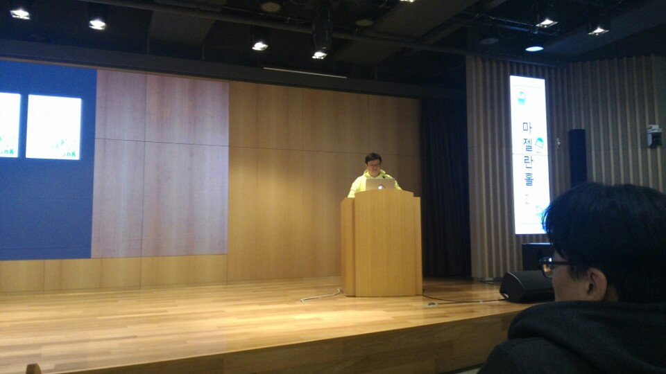

여러분이 한권씩 갖고 계신 그! 토비의 스프링의 저자이신 토비님이십니다.

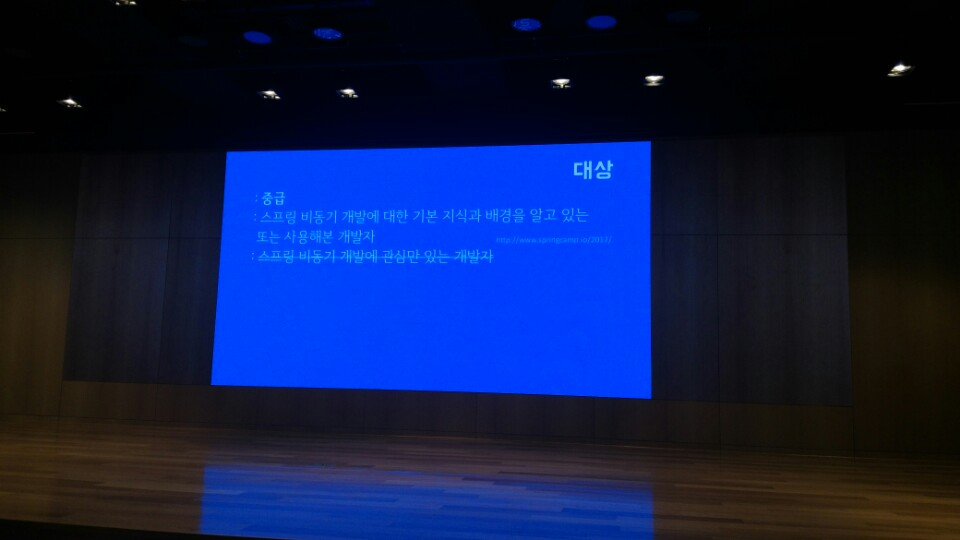

(중급 개발자를 위한 시간이라 중급이 뭔지 보여주시는 토비님 ㅠ)  
  
**스프링 비동기 개발을 위해 알고있으면 좋을 기술들**  

자바

* Future/Executor
* BlockingQueue
* ForkJoinTask
* CompletableFuture
* Flow

서블릿

* 서블릿 3.0 Async Processing AsyncContext
* 서블릿 3.1 Non-Blocking IO
* 서블릿 4.0 

### 동기 + 비동기

* 비동기 : 함께 시간을 맞추지 않는다.

**동기**  

* A와 B가 시작시간 또는 종료시간이 일치하면 동기
* A가 끝나는 시간과 B가 시작하는 시간이 같으면 동기

**블록킹, 논블록킹**

* 동기, 비동기와는 관점이 다름
* 내가 직접 제어할 수 없는 대상을 상대하는 방법
* 대상이 제한적 : IO, 멀티쓰레드 동기화

### @Async

* 선언된 메소드는 해당 메소드를 호출한 곳과 서로 다른 쓰레드를 가진 상태가 된다.
* ```@Async```는 리턴 타입이 void, Future, CompletableFuture등만 가능하다. (일반적인 String등이 리턴타입이 될수 없다.)

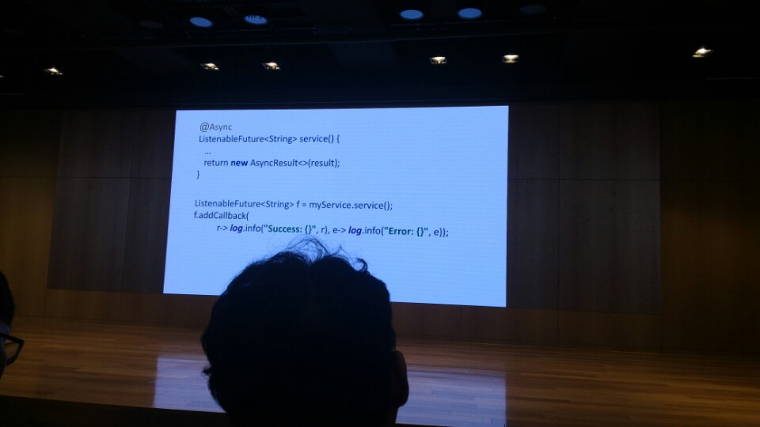

* 앞의 ```log.info```는 async가 성공했을때, 뒤의 ```log.info```는 실패했을때 실행할 메소드를 나타냄

**SimpleAsyncTaskExecutor**  

* @Async가 사용하는 기본 TaskExecutor
* 쓰레드풀을 사용하지 않고, 매번 새로운 쓰레드를 생성한다. 사용후 버려지는데 이렇게 사용되면 엄청난 낭비가 된다.
* @Async를 본격적으로 사용한다면 실전에서 사용하지 말것
* Executor, ExecutorService, TaskExecutor를 빈으로 등록하면 걔를 쓰레드풀에서 관리되도록 함
* 하나만 존재해야하지만, 둘 이상이 필요하면 이름을 이용해서 사용한다. (```@Async("myExecutor")```)


* 정답은 10개
* core를 채우고 queue를 채운뒤, max pool만큼 늘린다.

### 비동기 스프링 @MVC

**Callable**  

**WebSyncTask** 
* Callable에 타입등을 지정하여 초과시 Exception 발생

* DeferredResult
  * 임의의 쓰레드에서 리턴값 설정 가능
  * Callable처럼 새로운 쓰레드를 만들지 않음
  * 다양한 비동기 처리 기술과 손쉽게 결합

* DeferredResult + @Async = ListenableFuture
* ListenableFuture에서 비동기의 작업 결과를 다음 비동기 작업의 파라미터로 념겨줄 수 있는 방법이 없다.
* 이럴때는 다시 콜백 + DeferredResult 방식으로 돌아가야한다.
* 하지만 이러면 콜백의 중첩이 발생한다는 단점 -> ListenableFuture에서 해결방법이 없음

**CompletableFuture**  

* 함수형 스타일 접근 방법
* 중복되는 예외처리를 한번에
* 비동기 작업의 조합 및 결합을 지원

### 비동기 논블로킹 API 호출

* restTemplate 은 동기+블로킹 방식
* API 호출 작업 동안 쓰레드 점유
* 컨텍스트 스위칭이 2번씩 발생함

이로인해 스프링에서 AsyncRestTemplate 을 지원

* 1초 걸리는 restTemplate 요청을 100번 요청해야할 경우 기존은 100초

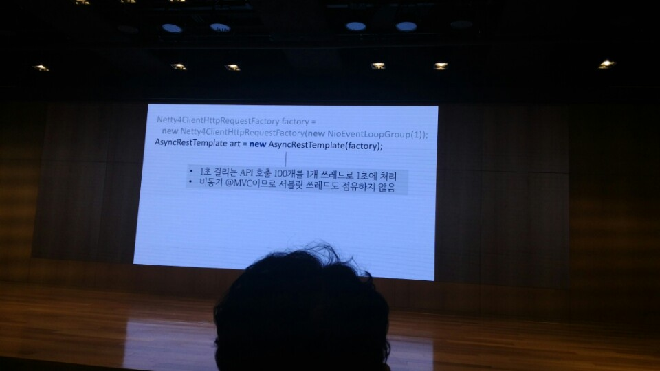

* asyncRestTemplate은 거의 1초만에 처리가능
* 하지만 요청하는 순간에 쓰레드가 100개가 생성되버리는 단점이 있다.
* 논블로킹 IO HttpClientFactory를 써야만 한다(ex : Netty 등)
* 이러면 서블릿 쓰레드도 점유하지 않는다.

**AsyncRestTemplate은 ListenableFuture로만 리턴**  

* 스프링 이슈 트래커에서는 재주것 CompletableFuture로 만들어 써라고 함
* 필요하면 확장해서 써야함 (아래 참고)

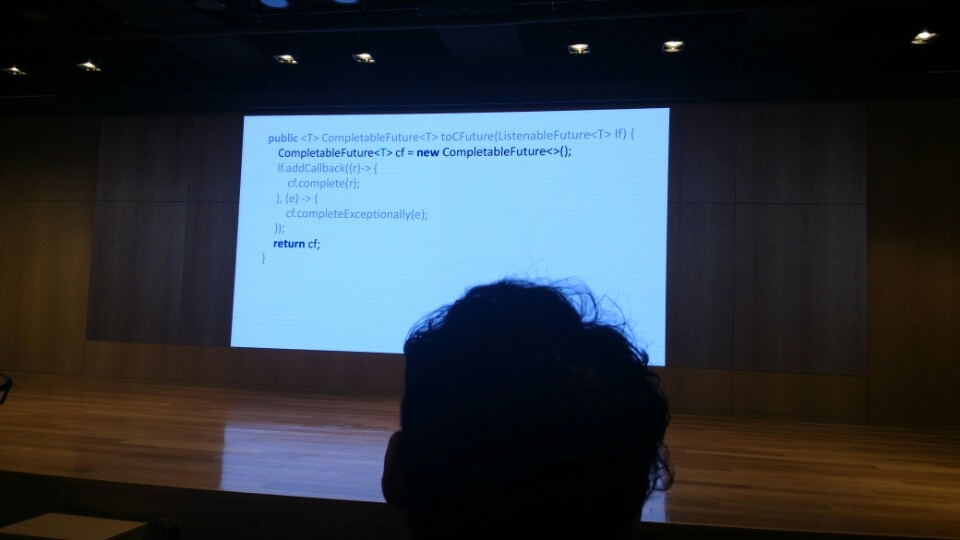

### 잘알고 쓰자

비동기 작업과 API 호출이 많은 @MVC앱이라면 

* @MVC
* AsyncRestTemplate+논블록킹 IO 라이브러리
* @Async 와 적절한 TaskExecutor
* ListenableFuture, CompletableFuture

TaskExecutor(쓰레드풀)의 전략적 활용이 중요

* 스프링의 모든 비동기 기술에는 ExecutorService 의 세밀한 조정이 필요

비동기 스프링 기술을 사용하는 이유

* IO가 많은 서버앱에서 서버 자원의 효율적으로 사용해 성능을 높이려고
* 서버 외부의 이벤트를 받아 처리하는 것과 같은 비동기 작업이 필요해서

단점

* 잘못쓰면 코드는 복잡해지고
* 디버깅 힘들고
* 잘모를경우 아무런 혜택도 받을 수 없다

리액티브와 관련해서 토비님의 발표가 연속으로 있었기 때문에 다음시간도 토비님의 발표를 들었습니다!

## Spring Web Flux - 이일민(토비)


* 스프링 5.0 WebFlux 소개와 개발방법

spring-WebFlux

* 구 Spring-Web-Reactive
* 스프링5의 메인 테마는 원래 JDK9 였는데, 이제는 WebFlux로 변경되었다.
* 스프링 리액티브 스택의 웹 파트 담당

용도

* 비동기-논블록킹 리액티브 개발에 사용
* 효율적으로 동작하는 고성능 웹 어플리케이션 개발
* 서비스간 호출이 많은 마이크로서비스 아키텍처에 적합

2가지 개발방식 지원

* 기존의 @MVC 방식 (@Controller, @RestController, RequestMapping)
* 새로운 함수형 모델 (RouterFunction, HandlerFunction)

새로운 요청-응답 모델

* 서블릿 스택과 API 에서 탈피
* 서블릿 API는 리액티브 함수형 스타일에 적합하지 않음
* 새로운 추상화 클래스 : ServerRequest, ServerResponse

지원하는 웹 서버/컨테이너

* 서블릿 3.1+ (톰캣, 제티)
* Netty (비동기-논블록킹 IO 웹 서버)
* Undertow (비동기-논블록킹 IO 웹 서버)

### 함수형 스타일 WebFlux

스프링이 웹 요청을 처리하는 방식

* 요청 매핑 (URL, 헤더 등을 참고하여 어느 핸들러에게 보낼지 결정)
* 요청 바인딩 (핸들러에 전달할 웹 요청을 준비 :URL Path, 헤더, 쿠키, 바디 등의 데이터를 Java Object로 변환)
* 핸들러 실행 (전달받은 요청 정보를 이용해 로직을 수행하고 결과를 리턴)
* 핸들러 결과 처리 (핸들러의 리턴 값으로 웹 응답 생성)

RouterFunction

* 함수형 스타일의 요청 매핑

HandlerFunction

* 함수형 스타일의 웹 핸들러 (컨트롤러 메소드)

함수형 Web Flux가 웹 요청을 처리하는 방식


* 요청 매핑 (RouterFunction : 어떤 핸들러가 이걸 실행할지 결정)
* 요청 바인딩 (HandlerFunction)
* 핸들러 실행 (HandlerFunction)
* 핸들러 결과 처리 (HandlerFunction)

WebFlux 함수형 Hello/{name} 작성


* HandlerFunction을 먼저 만들고
* RouterFunction에서 Path 기준 매핑을 호출
* req.pathVariable 에서 name 추출
* 로직 적용후 결과값을 Mono에 담는다.
* 웹 응답을 ServerResponse로 만든다
* ServerResponse의 빌더를 활용해서 응답코드, 헤더, 바디등을 만든다.

RouterFunction의 등록

* RouterFunction 타입의 @Bean으로 만든다.

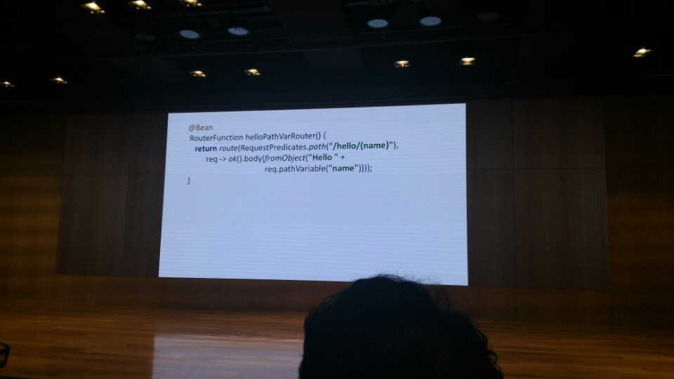

좀더 간단한 코드로 줄이면

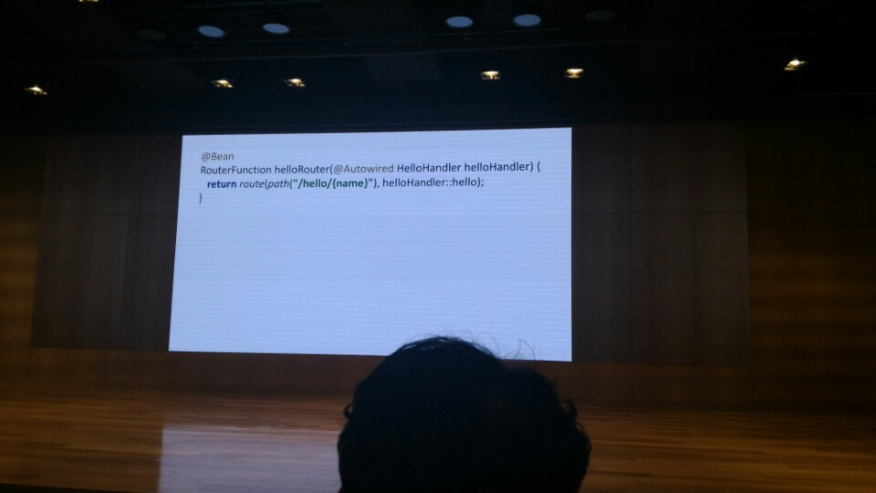

* 이럼 뭔가 핸들러 하나당 URL을 하나만 할당하는것처럼 보인다
* 핸들러 내부 로직이 복잡하다면 분리한다.  

RouterFunction의 조합

* 핸들러 하나에 @Bean하나씩 만들어야 하나
* RouterFunction의 andRoute() 등을 활용할 수 있음


* 타입레벨 - 메소드 레벨의 @RequestMapping처럼 공통의 조건을 정의하는 것이 가능
* RouterFunction.nest()


**WebFlux 함수형 스타일의 장점**  

* 모든 웹 요청 처리 작업을 명시적인 코드로 작성가능
* 함수조작을 통한 편리한 구성/추상화에 유리
* 테스트 작성의 편리함 (핸들러로직, 요청매핑, 리턴값까지 단위 테스트 가능)

**WebFlux 함수형 스타일의 단점**

* 함수형 스타일의 코드 작성이 편하지 않으면 코드 작성과 이해 모두 어려움
* 익숙한 방식으로도 가능한데 뭐하러??

### @MVC WebFlux

@MVC WebFlux

* 어노테이션과 메소드 형식의 관례를 이용하는 @MVC 와 유사

ServerRequest, ServerResponse

* WebFlux의 기본 요청

@MVC 요청 바인딩과 Mono/Flux 리턴값

* 가장 대표적인 @MVC WebFlux 작성 방식

@ResponseBody 리턴값 타입

* ```T```
* ```Mono<T>```
* ```Flux<T>```
* ```Flux<ServerSideEvent>```
* ```void```
* ```Mono<void>```

### WebFlux와 리액티브 기술

WebFlux만으로 성능이 좋아질까?

* 비동기-논블록킹 구조의 장점은 블록킹 I/O를 제거하는데서 나온다
* HTTP 서버에서 논블록킹 IO 는 오래전부터 지원

개선할 블록킹 IO

* 데이터 엑세스 리포지토리
* HTTP API 로출
* 기타 네트워크를 이용한 서비스

**JPA - JDBC 기반 RDB 연결**

* 현재는 답이 없다.
* 블로킹 메소드로 점철된 JDBC API

**Spring Data Jpa** 

* 인터페이스 메소드의 리턴타입을 CompletableFuture로 하면 사용할 수 있음

**본격 리액티브 데이터 엑세스 기술**

* 몽고DB, 카산드라, 레디스 등
* ReactiveCrudRepository를 상속받아야 함

논블록킹 API 호출은 WebClient

* AsyncRestTemplate의 리액티브 버전

함수형 스타일의 코드가 읽기 어렵다면 다 풀어서 써보자. 오히려 더 이해하기 쉬워 보인다.  
  
**비동기-논블록킹 리액티브 웹 어플리케이션 효과를 얻으려면**

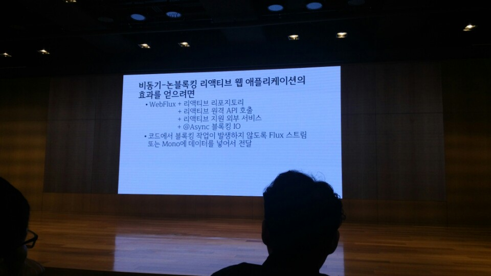

**리액티브 함수형은 꼭 성능때문에 써야하나?**

* 함수형 스타일을 연습하게 되어 간결하고 조합하기 편한 코드가 작성
* 데이터 흐름에 따른 다양한 오퍼레이터 가능
* 연산을 조합해서 만든 동시성 정보가 노출되지 않는 추상화된 코드 작성 가능
* 데이터 흐름의 속도를 제어할 수 있는 메커니즘 제공

**꼭 NIO에서만 도움이 되나?**

* 시스템 외부에서 발생하는 이벤트에도 유용
* 클라이언트로부터의 이벤트에도 활용

## Spring Cloud Data Flow - 정윤진

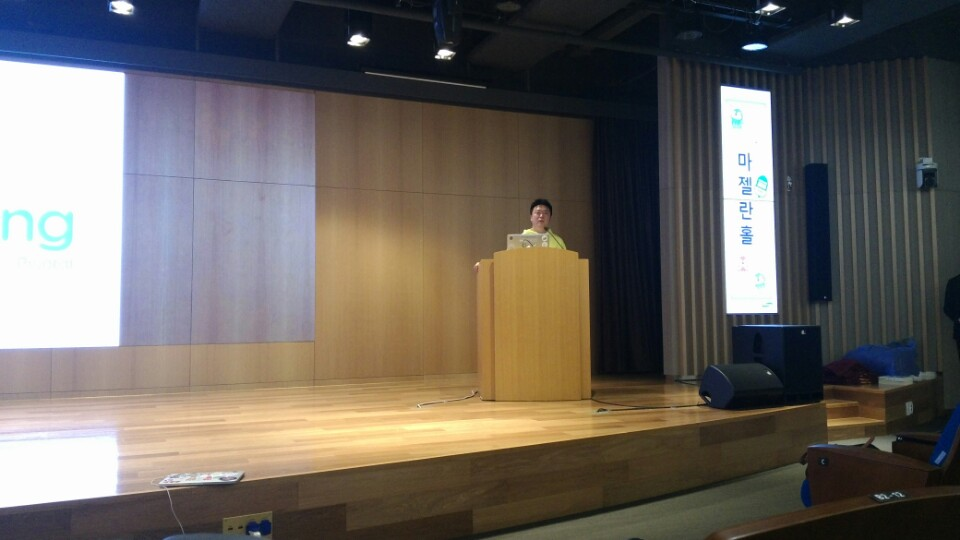

스프링 프레임워크를 개발하는 피보탈에서 근무하시는 정윤진님의 발표!  
개인적으로 피보탈은 어떻게 개발하고 일하시는지 궁금했기에 듣게 되었습니다.  

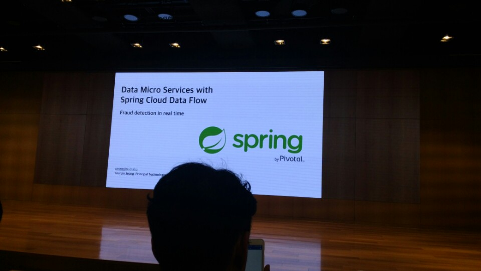

데이터와 어플리케이션을 분리해서 보는 현상과 해결에 대해 이야기할 예정

실제 코드가 배포되기 전까지 우리의 코드는 사업가치가 0이다.  
이를 해결하기 위해 여러가지 방식이 등장한다.

* 워터폴
* 애자일
* 린
* CI
* CD (지속적인 배포)

아이디어->개발->배포->사용자테스트의 주기가 짧을 수록 더 좋은 서비스가 나올 확률이 높다.  
데브시스터즈의 사례처럼 일주일에 몇번의 배포를 한다.  
그리고 대부분의 모바일 게임의 생명주기가 3개월인 것에 비해 쿠키런은 3년을 운영중이다.  

### 데이터 마이크로 서비스

리눅스 명령어를 보면 파이프를 통해 1개의 기능만 하는 명령어들을 조합하여 복잡한 일을 처리한다.  
결과가 마음에 안들거나 다른 결과를 원하면 중간 중간 명령어들을 교체만 하면 된다.  
이와 마찬가지로 스프링 클라우드 데이터 플로우가 스프링부트 어플리케이션, 텐서플로우, 클라우드 서비스들을 조합해준다.  

**기존 Data Pipeline**  


* 대부분의 회사는 이 형태를 큰 덩어리로 만들어서 관리 한다.  
* 그러다 보니 중간 과정 변경이 필요한 경우 큰 변경이 필요하다.  
* 처음 만들어진대로 계속 사용하거나 똑같은 덩어리를 복사해서 사용할 수 밖에 없다.

**스프링 클라우드 데이터 플로우**  


이를 확장해서


* 내가 만든 각각 스프링부트 어플리케이션을 등록하고, 데이터에 대한 파이프라인을 각각 만들고 deploy를 하면 내가 지정한 클라우드 서비스에 각각 배포가 된다.
* [참고](https://cloud.spring.io/spring-cloud-stream-app-starters/)


## 비동기 어플리케이션과 모니터링으로 밀당하기 - 이건희

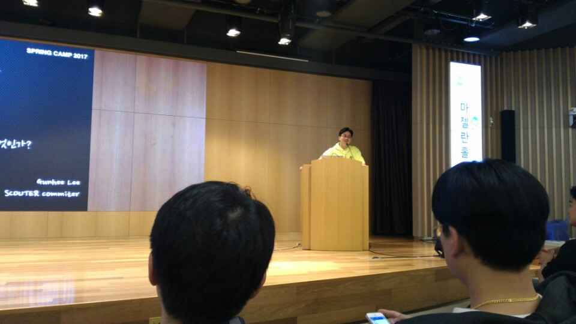

오픈소스 APM Scouter의 제작자이신 이건희님의 발표입니다!  
지인 중 APM에 큰 관심을 갖고 있는 분이 계시는데, 그 분덕에 이런 APM에 관해 알게 되었고 발표도 듣게 되었습니다.


이야기할 것

* 어플레케이션 모니터링과 APM
* APM 의 구현 원리
* 모니터링을 위한 context 전파
* 비동기 어플리케이션 모니터링의 어려움
* 비동기 어플리케이션과 모니터링으로 밀당하기

### APM

성능메트릭 + 원인을 찾기 위한 + a  
  
BCI : APM을 구현하는 기술

* bytecode에 직접 변경을 가해 소스코드의 수정없이 원하는 기능을 추가하는 기술
* premain()만 기억하자.
* premain() : main() 전에 수행된다.

### Trace Context

측정에 필요한 정보를 전부 담는곳  
그러나 이를 어떻게 전달하지? -> ThreadLocal

* Thread에 의존적인 변수를 제공한다.
* 같은 Thread이면 set된 값을 어디서든 사용할 수 있다.

### 비동기 어플리케이션 모니터링은 왜 어려운가?

블럭킹 서블릿 어플리케이션의 문제점?

* Thread per request
* 비용/속도가 많이 든다

장점은?

* 이해하고 디버깅 하기 쉽다
* 쓰레드가 하나의 작업을 처리
* 스택은 정확한 스냅샷을 남길 수 있다.

비동기 모니터링의 목표는?

* 기존 어플리케이션 모니터링에서 제공하던 동일한 view로 볼 수 있게 하는 것
* 그럴려면 컨텍스트가 제대로 전파되어야 한다.

비동기 서블릿이 어려운 이유

* 요청한 쓰레드와 응답하는 쓰레드가 달라서 추적이 어렵다.
* 즉, ThreadLocal을 통해 context를 전파할 수 없다.

InheritableThreadLocal

* child 쓰레드가 생성될 때 부모 쓰레드의 값을 전닫해줌
* 하지만 이걸로 해결할 수 없었다.
* 결국 알아서 전달하라는 logback의 메뉴얼을 확인

### 비동기 어플리케이션 모니터링과 밀당하기

1. 파라미터를 활용해 context 전달하기  

2. Runnable & Callable

* 생성과 run이 서로 다른 쓰레드를 사용
* 생성자에서 this를 key로 컨텍스트에 저장
* run 메소드에서 this로 컨텍스트를 가져온다

3. 람다식은 어쩌지?

* 람다 바디는 이너클래스가 아니다
* 람다 바디는 private method가 된다.
* 익명 클래스 로더에 의해 로드된 클래스는 transform() 대상이 안된다.
* Spring securityContext등을 전파하는 방법을 믿어보는 걸로!


## 후기

아직 다음날이 남아 있지만, 오늘만 하더라도 정말 좋은 시간이였습니다.  
한 자리에서 다 뵙기 힘든 분들을 보게 된 것도 너무 좋았고, 회사 일만 하다보면 전혀 관심을 못가지게 될 자바에서의 리액티브 개발에 대해 알게 되었습니다.  
보면서 Javascript의 비동기 처리(Promise, async)가 계속 생각이 나면서, 굳이 새로운 언어에 대해 관심을 갖기 보다는 현재 제가 사용하는 언어와 프레임워크에 집중하는 것이 결국 같은 길로 가는구나라고 새삼 깨닫게 되었습니다.  
확실히 국내에서 **백엔드 어플리케이션 개발자를 위한 세미나**는 스프링캠프밖에 없는것 같습니다.  
앞으로도 스프링캠프가 오래오래 운영되었으면 좋겠습니다.  
항상 고맙습니다.


