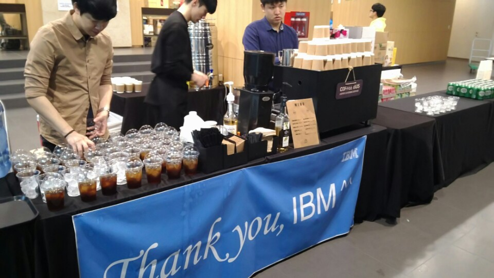
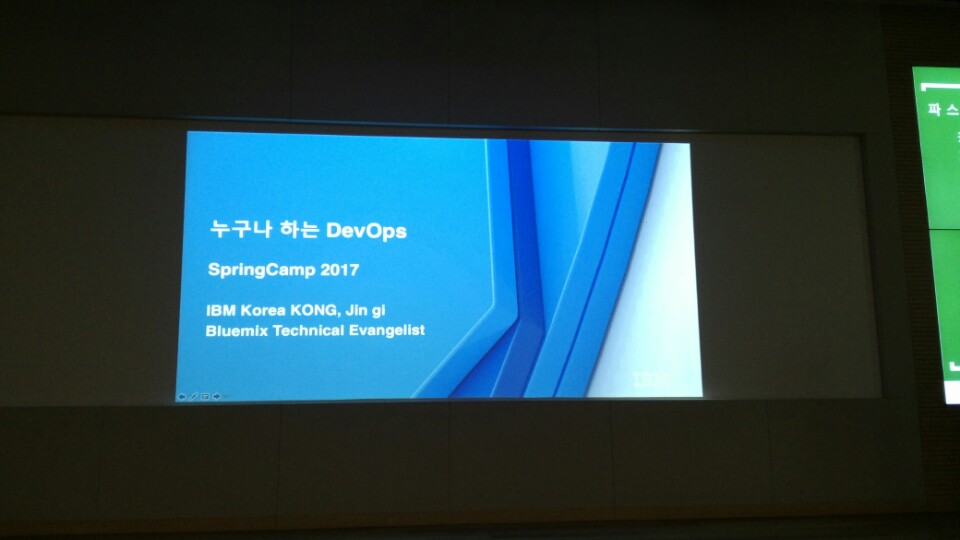
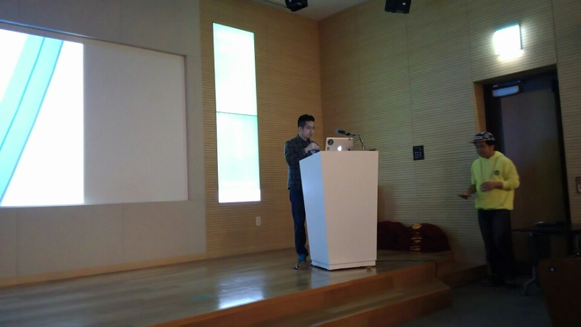
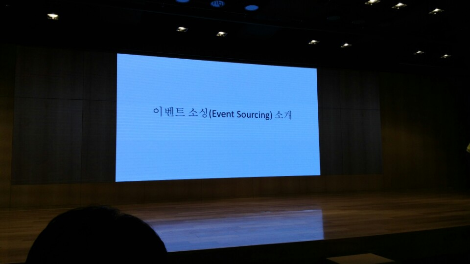
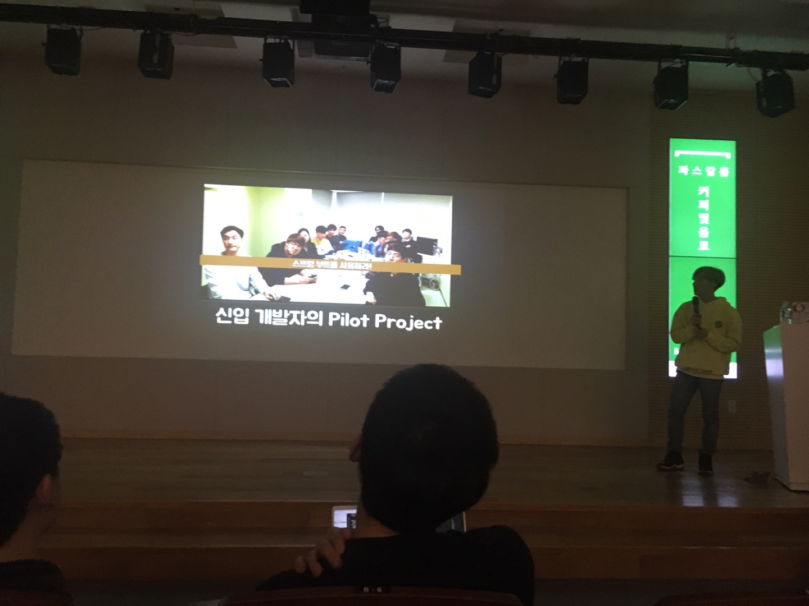
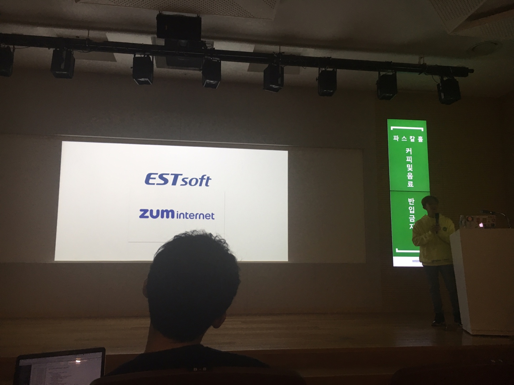
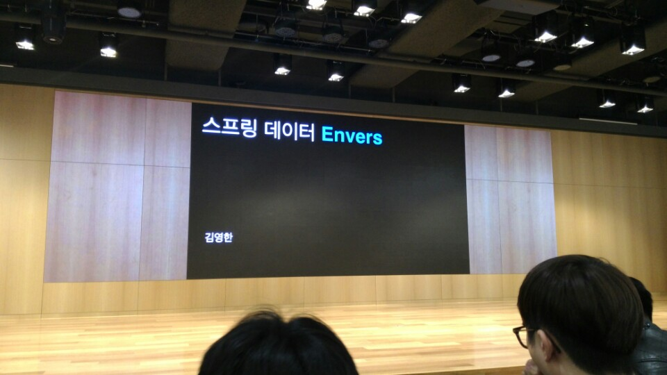

# Spring Camp 2017 2부

스프링캠프 2017의 2부를 다녀왔습니다.  
오늘은 지인 분들의 발표가 많아 더 재밌게 들을 수 있었던것 같습니다.  

스프링캠프에는 항상 이렇게 커피를 제공해주십니다.



맛있게 아이스 아메리카노를 **다 마시고** 입장하였습니다.  
(세미나실 내부에서 절대 음식 반입이 안됩니다.)  


## 누구나 하는 Devops - 공진기





(IBM에서 근무하는 공진기님의 발표입니다.)  
  
Devops에 대해 이야기 해보려고 함  

* Devops가 무엇인지
* Devops를 어떻게 하면 되는지
* IBM에서 어떻게 하는지
* 기술적인 것도 있지만, 팀 내에서 Devops에 대한 합의를 이끌어내는 방법도 얘기

Devops란?

* 개발 + 운영? 아니다
* 개발 및 운영이 유기적으로 진행되는 것
* 자동화를 통해 품질, 속도, 효율성 증가 / 비용, 오류 감소
* 단, 개발/시스템/아키텍처에 대한 깊은 이해 필요 (큰 그림을 그릴 수 있는 개발자가 필요)
* 높은 구축 비용
* 유지보수 문제

### 애자일과 DevOps

애자일

* 아이디어를 빨리 구현, 확인하여 피드백을 통한 빠른 사이클이 애자일
* 단지 방법론일 뿐

devops

* 개발과 배포, 관리를 개선하는 프로세스가 DevOps
* devops는 애자일을 둘러싼 더 큰 그림

왜 DevOps가 뜨는가?

* 자동화 기술과 도구의 발전 (젠킨스, 트라비스)
* 클라우드 플랫폼 확장 (IaaS, PaaS, Container)
* 마이크로 서비스 아키텍처의 유행
* 시장의 요구에 따라 빠른 개발과 변경이 필요 (피드백의 빠른 반영)
* 비용이 감소하진 않음 (비용감소 한다는 말은 영업용 멘트)

### Devops Method - Culture

개발자에게 Devops  
장점

* 기술부채 감소
* 개발스킬 증대
* 좋은 개발도구 사용

단점

* 업무강도 증가 (유닛테스트 등등)
* 러닝커브 
* 도구의 파편화

그래도 DevOps  
레거시

* 대규모 업데이트의 영향을 최소화 하기 위해 새벽 배포
* 버그 추적과 전체 롤백

등의 문제를 해결하기 위해 Devops로 가긴 가야함

### Devops Method - Issue

이슈 전달 방법  

기존

* 구두
* 이메일
* 엑셀/워드 등

DevOps

* redmine
* jira
* Github Issue
* Trello

### Devops Method - Code

* git 사용이 필요함 (SVN, CVS에서 어서 넘어가길 추천)
* IBM의 경우 9개월만에 200+팀과 10000+ 사용자가 Github Enterprise 사용

### Devops Method - Delivery

**CI**

* 코딩 스타일
* 유닛 테스트
* 코드커버리지
* 정적 분석 (FindBugs)
* Functional Test
* UX test (셀레니움, PhantomJS 등)

**CD**

* 젠킨스, 트라비스
* Infrastructure 자동화 (Ansible 등)
* 빌드 (Mave, Gradle, Grunt 등)

### Devops Method - Run

이전에 캠핑에 가기 위해서는 내가 모든 것을 다 챙겨가야만 했다.  
하지만 최근엔 카드만 있으면 모든걸 다 캠핑장에서 구매해서 사서 쓰면 된다.  
마찬가지로 기존의 IT서비스에서 IaaS, PaaS, SaaS 등이 현재 대부분의 서비스를 지원해준다.

### Devops Method - Manage

관리 방법론 / 도구

* Fast recovery (뉴렐릭 등)
* 오토스케일링

### Devops Method - Learn

사용자가 원하는 것?

* A/B 테스팅
* 잘 모르겠으면 다 구현해보고 사용자의 반응을 보자
* 인사이트 도구를 통해 반응을 살핀다


## 이벤트 소싱 소개(이규원) - 이규원




(여태 봤던 세미나 중 가장 재밌었던 시작이였습니다.  
강연 중 사진 촬영하지말고, 강의 발표 URL만 촬영하는 시간을 갖고 이후에는 해당 강의 자료를 보자 라고 얘기하시고 촬영 포즈를 잡은 모습입니다.)  

Rx와 MVVM처럼 닷넷에서 시작했던 이벤트 소싱 & CQRS이 점점 타 언어영역에서도 관심을 갖기 시작함  

### 이벤트 소싱 개념

오해 

* 이벤트 드리븐 설계로 착각하시는 분들이 많다
* 이벤트 소싱은 데이터를 저장하는 개념이지, 메세지 주고 받는 개념이 아님
* 둘의 궁합이 잘 맞을뿐이지 그게 핵심은 아니다

기존

* 기존은 아이템의 최종 상태를 DB에 저장한다.  
* 한 사용자가 동일한 상품을 넣었다가 뺐다, 그리고 며칠 뒤에 또 넣었다가 뺐다
* 이 사용자가 이런 행위를 했다는 거을 기록하지 않으면 상품을 광고하기가 쉽지 않다.
* 이런 로그를 남기는 것은 도메인의 완전한 상태를 남기지 않는다.
* 상태를 기록하는 행위와 로그를 기록하는 행위는 트랜잭션을 걸지 않는다.
* 그래서 데이터 유실의 가능성이 있다.

이벤트소싱

* 상태를 기록한뒤 -> 로그를 남기는게 아니다
* 이벤트를 기록하고 -> 상태를 남긴다
* 도메인에서 발생하는 모든 상태를 기록하는 방법
* 장바구니에 항목을 담아라는 명령을 받으면 장바구니에 담는다는 이벤트를 남기고 이를 이벤트 저장소에 저장 -> 이벤트 핸들러를 통해 상태를 저장

이벤트 소싱 상세

* 이벤트 소싱에서는 왼쪽의 이벤트가 저장 대상
* 장바구니 항목을 빼면 아이템이 삭제 되는게 아니라, 장바구니 아이템이 삭제되었다는 이벤트가 추가 저장됨
* 이벤트는 절대 **삭제/수정**되지 않는다. 오직 추가만 된다.
* 이런 이벤트를 저장하는 시스템을 우린 사용하고 있다. : **Git**

### 데이터 영속

* 이벤트 저장소는 수많은 이벤트 스트림으로 구성됨  
* 그 스트림 계층은 도메인 계층으로 이루어짐(애그리거트와 같은)

명령 & 이벤트

* 명령(Command) : 검증 대상, 즉 실패할 수 있음
* 이벤트 : 이미 지나간 돌이킬 수 없는 대상, 즉 검증 대상이 아님
* 이벤트는 이름을 지을 때, 과거형으로 짓는다.

이런 이벤트를 통해서 도메인 오브젝트를 복원해야한다.

* n 버전의 도메인 상태는 도메인의 초기값 + 0 ~ n까지의 이벤트의 합이다.
* 특정 버전의 상태를 복원하는 것은 해당 버전의 이벤트까지만 로드하면 된다는 것이다.

이벤트 기록 & 복원 과정

* 명령 입력
* 명령 프로세서로 이벤트 발생
* 발생한 이벤트를 이벤트 저장소에 저장 및 이벤트 핸들러로 도메인 오브젝트 생성

데이터베이스 저장 방식

* key : ObjectId + Version
* value : 이벤트 타입 + 직렬화된 Payload

100만개의 이벤트를 가지는 도메인 개체

* 이를 복원하려면 성능상 이슈가 발생한다
* 다시 복원의 공식을 생각해보자 
* 1 <= m <= n : m일때의 상태값 + m~n까지의 이벤트의 합과 동일하다를 이용
* 이벤트가 많이 쌓이면 이벤트를 스냅샷찍어 복원 성능을 보장한다.
* 스냅샷 DB 구조 - key : ObjectId, value : version, 직렬화된 상태값

### CQRS

재고가 10개 미만인 상품 목록이 필요하다.  
이론적으로 이벤트소싱이 CQRS에 종속되지 않지만, 실제로 사용하려면 CQRS와 조합해서 사용해야만 한다.  
  
CQS : 커맨드 쿼리 세퍼레이터

* 개체를 2 메소드 그룹으로 나눈다
* 질문에 답하는 그룹, 상태를 변경하되 리턴값이 없는 그룹
* 하나의 메소드 그룹이 하는 것은 한가지이기 때문에 더 좋은 코드가 된다.
* 도메인 오브젝트에 조회를 하는 코드와 상태를 변경하는 코드를 한곳에서 하다가 너무 괴로워서 시작하게 됨

CQRS : 개체 자체를 책임을 분리한다 (변경과 조회용 개체로 나눈다는 말)

* 커맨드사이드 : 이벤트 스토어에 이벤트를 저장하고 이벤트를 쿼리사이드로 보낸다 
* 쿼리 사이드 : 오로지 조회만 신경쓴다. 조회의 편의성만 신경쓴다. 정규화도 안한다. 정규화는 커맨드사이드에서 담당한다.
* 이벤트스토어와 조회모델은 1:1 관계는 아니여도 된다 M:1 해도 된다.
* 하나의 이벤트 스토어에 대해 조회 모델은 하나일 필요 없다. RDB, NoSql등으로 여러 관계를 맺어도 됨

### 주의점

* 러닝커브
* 과도한 엔지니어링 (필요한 부분에만 적용하자)
* 유일성 제약이 어렵다
* 도구가 부족하다

### 구직

규원님께서 이번 발표로 스프링캠프에서 최초라는 타이틀을 가지신게 많으신데, 그중 하나인! 구인이 아닌 구직을 얘기하셨습니다.  
(구직 광고를 캡쳐못했네요 ㅠㅠ)  
  

잡부에서 CTO까지, 대기업에서 스타트업까지 풍부한 경험이 있으신 [이규원님](https://www.facebook.com/gyuwon.yi?fref=ufi)을 원하시는 분들은 어서 연락을 해보세요!

## Implementing EventSourcing & CQRS (구현부) - 심천보

심천보님의 발표는 시작부분을 촬영하지 못했습니다. ㅠㅠ...  
죄송합니다 심천보님 ㅠ 강연이 끝나고 깨닫게 되어서 ㅠㅠ...  

앞서 이규원님의 발표에서 연속되는 부분으로, 실제 이벤트 소싱과 CQRS를 구현한 코드를 설명하는 시간이였습니다.  

### 이벤트소싱

어플리케이션의 **모든 상태 변화**를 **순서에 따라 이벤트로 보관**한다.  

### 데이터 저장방식의 새로운 패턴

**전통적인 데이터 저장 방식**

* 먼저 조건에 맞는 행을 찾고, 업데이트 쿼리르 통해 값을 변경
* 이런 방식은 이전의 상태를 알 수가 없다.
* 그래서 이력 테이블을 별도로 관리하고 있다.
* 하지만 비지니스가 확장 될수록 이력 테이블은 점점 증가하고 복잡해진다.

**이벤트로 저장**

* 추가만 있으면 절대 수정/삭제는 없다
* 이벤트 식별자, 이벤트 타입, 버전, 발생시간, payload로 관리

**이벤트 조회**

* 도매인 객체의 이벤트 핸들러 메소드를 이벤트 순으로 순차적으로 적용한다.
* 하지만, 매번 조회때마다 이벤트를 실행해야 한다.
* 즉, 10,000개 이상의 이벤트가 저장되어있다면 10,000개 이상의 이벤트를 replay해야한다
* 이런 성능상 이슈를 해결하기 위해 **스냅샷**을 한다.
* 보통 in memory 저장소를 사용한다. (이벤트 스토어와 분리된 저장소에 저장한다.)

**이벤트소싱의 성능**  
100만개 계좌를 대상으로 최근 일주일 안에 거래 정지된 계좌를 찾는다면?

* 이를 위해 CQRS 패턴을 사용함

### CQRS

* 명령과 조회의 책임 분리
* Commands : Writes
* Queries : Read
* 상태변경을 처리하는 커맨드 모델과 데이터 조회 쿼리 모델을 분리해서 구현한다.
* 이벤트 소싱에서 사실상 필수

### 이벤트 소싱 구현

처리 흐름

* 리퀘스트를 통해 커맨드 객체 & 유효성검사
* 생성된 커맨드 객체를 통해 서비스 클래스(커맨드 핸들러) 호출 
* 이벤트 핸들러에서 조회 메소드를 호출 한다 (애그리거트 생성 -> 이벤트 조회 -> 스냅샷조회&병합 -> 이벤트 replay)
* 이벤트 객체 생성
* 이벤트 핸들러를 통해 이벤트 저장 및 스냅샷 저장
* 이벤트 영구 저장소에 저장

커맨드 객체 구현

* 우리가 흔히 사용하는 DTO 클래스가 커맨드 모델이라고 봐도 무방
* 단 불변 상태를 유지할 수 있도록 **별도의 setter를 생성하지 않는다**.

커맨드 핸들러 (서비스 클래스) 구현

* 도메인 객체 생성, 로딩 및 도메인 로직 호출
* 이벤트 핸들러 호출

이벤트 핸들러 - 조회 메소드 구현

* 스냅샷 조회하여 결과가 있으면 스냅샷 결과값 다음부터의 이벤트들을 로딩하여 병합
* 스냅샷이 없으면 모든 이벤트 호출
* 이벤트 replay 메소드 실행

도매인 객체 구현

* 연관된 Entity와 Value Object의 묶음
* 데이터 변경시 한 단위로 처리됨
* 이벤트를 Domain 객체에 반영하는 handler method 구현
* 객체 상태 일관성 보장을 위한 Version 을 필드로 갖고 있음

만약 이벤트 소싱에서 상품의 수량을 동시에 변경한다면?

* 상품 애그리거트에 수량 및 버전을 동시에 갖고 있음
* 사용자 A와 B가 동시에 상품을 조회하면 둘다 10개씩 있는 것으로 확인
* 사용자 A가 먼저 업데이트를 하면 사용자 A의 버전과 상품의 마지막 버전이 일치하기 때문에 업데이트 성공
* 하지만 사용자 B는 버전 5일때 조회했기 때문에 업데이트 실행시 상품 테이블은 사용자 A로 인해 버전이 이미 6이 되어 서로 버전이 다르므로 업데이트 실패시킨다.

이벤트 저장소 구현

* 신규 등록이 아닌 경우 버전 확인 후 처리
* 버전이 맞을 경우는 저장
* 맞지 않을 경우 처리 안함
* 버전이 맞다면 이벤트 객체를 직렬화해서 저장

이벤트 퍼블리셔 구현

* 이벤트를 서비스 외부로 발행
* 일반적으로 메세지 큐로 Producing

이벤트 프로젝터 구현

* 생성된 이벤트를 조회 모델 전용 DB로 Projection을 위함

### 이벤트 소싱의 장/단점

이벤트 소싱 장점

* 관계에 대해 고민할 필요 없음
* 모든 변경 사항에 대한 완벽한 이력 저장
* 이벤트를 차레로 검사하면서 디버그 가능
* 이벤트는 저장 명령만 존재하기에 성능상 좋음

단점

* SQL 위주의 개발성향인 경우 적응하기가 힘듬
* 복잡하지 않은 모델엔 적합하지 않음
* 도구가 부족하고 성숙되지 않은 기술 (Axon, Eventuate등의 프레임워크가 등장하긴 함)
* 운영시 불편하다 (일반적 쿼리로 조회 안됨)

사실 이벤트 소싱은 MSA 환경이 아니면 적용할 필요 없음

### 이벤트 소싱 적용된 MSA

MSA 장애 전파

* 특정 도메인에서 발생한 장애가 타 도메인으로 전달하지 않는다는 장점이 있다.
* 하지만 이는 실제 전파가 안된건 아니다. 장애가 나서 사용자에게 전달은 됐기 때문이다.
* 하지만 CQRS는 Command 서비스가 장애가 나도, Query 서비스는 이상이 없기 때문에 사용자에게 장애가 전달되지 않는다.

### Q & A

이벤트 소싱을 적용하기 좋은 사례는?

* 국내는 없는걸로 알고 있다.
* 해외도 이베이 코리아에서 적용한 게 있다고 들었지만 어떤 곳에 적용했는지 자세히 나와있지 않아 있다.

데이터 분석시에 사용할 수 있을지?

* 상태 변경에 대해 비동기로 우리가 갖고 있다.
* 만약 사용자 이벤트에 대해 통계를 보고 싶다면 그 통계용 조회 모델을 만들어서 사용하면 되지 않을까 생각한다.

이벤트 소싱의 생산성과 장단점은?

* 조회를 위한 모델 구현부가 많다
* 하지만 구현은 임계치가 있어서 어느 임계치에 도달하면 그 이상 구현에 부담은 적다고 본다.
* 일대사를 한다고 보면 어느 시점에서 장애가 났다고 하면 이벤트 소싱이 적용된 경우 그 지점까지만 이벤트 replay를 통해 복구해서 처리하면 되기 때문에 큰 장점이라고 본다.

## 스프링 부트를 대하는 자세 - 권용근



(전 직장 동료이자 제가 정말 본받으려고 하는 동생인 용근님의 발표였습니다.)  
  
스프링부트를 좀 더 알고 쓰자에 대해 이야기 하려고 함

* 신입 파일럿 프로젝트를 수행하면 항상 스프링부트를 사용하지만 스프링부트를 사용하지 않은것처럼 config와 의존성이 사용되는것을 발견하였다.
* 신입 개발자 뿐만 아니라 나 역시 스프링부트의 기본 설정에 대해 몰라서 당황한적이 있었다.
* 그래서 제대로 스프링부트를 알고 써보자라고 생각하고 발표를 시작

### 스프링부트란?

* 아주 작은 설정의 변경만으로 당신의 웹 어플리케이션을 실행시키는 것이 스프링부트의 주제

스프링부트에 대한 오해

* 대용량 트래픽에선 좋지 않다
* API 서버에서만 사용할 수 있다
* 스프링부트를 하면 스프링을 몰라도 된다.

스프링부트

* 스프링이 아닌 **스프링을 지원하는 도구**
* 변경이 거의 없는 설정은 스프링부트에서 미리 설정해놓음
* 변경이 필요한 부분은 개발자가 직접 변경하면 됨

왜 스프링부트를 이해해야할까?

* 스프링부트가 설정을 대신 해주기 때문에 문제가 발생했을때, 우리가 설정한 부분만 찾아보게 됨
* 하지만 이것만으로 해결 못하는 경우가 많다.
* 스프링부트를 이해하면 좀 더 많은 부분을 찾아 해결할 수 있다.
* 웹에 있는 많은 자료들 중에서 **레거시를 걸러낼려면 현재 사용하는 기술을 잘 알아야 한다**.

### 스프링부트를 대하는 자세 - 권용근

방법

* 레퍼런스 가이드
* 도서 (스프링부트 코딩 공작소, 스프링부트 프로그래밍 입문)
* 릴리즈 노트 
* **직접보자**

의존성 코드 쫓아가보기

* starter 의존성 아래에 있는 pom.xml에는 starter 의존성에 포함된 다른 의존성들이 무엇인지 확인할 수 있다.
* spring-boot-dependencies를 가보면 보장되는 버전들이 명시되어있어, starter 의존성을 통해서 우리가 버전 호환성을 신경쓰지 않아도 된다.

조건에 의한 Auto Configuration

* exclude : 자동 설정 후보군 대상에서 제외
* @Conditional : matches가 true면 Bean으로 등록
* 후보군 대상을 Conditional.matches를 통해 실제 설정으로 등록

Properties

* 스프링부트는 Java config보다 더 간단히 Properties나 Yml 설정을 선호한다.



제 전 직장이자, 발표자이신 용근님께서 근무하시는 줌인터넷에서 개발자 채용을 하고 있습니다.  
포털, 검색, 대용량 트래픽을 경험하고 싶으신 분들은 [채용사이트](http://www.estsoft.co.kr/Default.aspx?wbs=5.0.3&sg1=&sg2=&sg3=&sg=&occupation=dev)를 참고하셔서 지원해보세요!

## 엔티티 히스토리를 편리하게 관리해주는 Spring Data Envers - 김영한




(우리에겐 [JPA 책](http://book.naver.com/bookdb/book_detail.nhn?bid=9252528)의 저자로 더욱 유명하신 김영한님의 발표)  
  
데이터의 변경이력을 관리하다보면 같은 작업을 반복할때가 많다.  
이런 엔티티의 히스토리를 관리하는 Spring Data Envers를 소개하려고 함

### 데이터 관점의 공통 관심사

누가? 언제? 데이터를 변경했나?가 공통 관심사  

* 등록일, 수정일, 등록자, 수정자가 모든 테이블에 포함된다. => 지루한 반복
* 각 도메인 테이블의 변경이력 테이블을 꼭 남겨야 함 => 지루한 반복

### 스프링 데이터 Auditing

* AUditing : 감독하고 검사
* 누가 언제 데이터를 생성하거나 변경햇는지 감사
* spring data 기본 기능
* 등록일, 수정일, 등록자, 수정자를 어노테이션으로 지정할 수 있음
* 매 클래스마다 어노테이션 지정이 귀찮으니 @MappedSuperClass를 선언한 BaseEntity 클래스를 만들어 이를 엔티티 클래스에서 상속 받도록 한다.

### Envers

* 하이버네이트 핵심 모듈
* JPA 스펙에 정의된 모든 매핑 감사
* 엔티티의 변경 이력을 자동 관리

변경이력 관리 방식

* XXX 테이블 -> XXX_AUD 테이블로 이력 관리
* 히스토리를 계속 쌓는 방식으로 관리
* REV == 리비전 식별자
* REVTYPE( 0: 등록, 1: 수정, 2: 삭제)

특정 DB 트랜잭션 안에서 함께 변경된 내역을 추적하고 싶다면?  
예) 새로운 할인정책과 그 때문에 함께 변경된 상품들 추적

* revinfo 테이블 : Revision은 트랜잭션 단위로 관리 된다.
* 이를 통해 해당 트랜잭션 시점에서 발생한 revision을 조회하면 된다.

### Envers - 고급기능

필드 변경 여부 관리

* ```@Audited(withModifiedFlag = true)```
* AUD 테이블에 필드마다 수정 상태 컬럼 추가
* 필드의 수정여부를 검색 조건으로 사용 가능

같은 트랜잭션에서 함께 변경된 엔티티를 검색  
  
  
기타 어노테이션

* targetAuditMode = NOT_AUDITED : 연간관계가 있는 엔티티는 관리하지 않겠다.


### Spring data Envers

* Spring data jpa 의 확장모듈
* 하이버네이트 Envers를 편리하게 조회하도록 도움
* RevisionRepository 인터페이스
* 편리한 메타데이터 조회

단점

* 복잡한 조회 -> 하이버네이트 Envers 직접 사용
* 버전업이 잘 안되는 편
* 스프링 데이터가 지원하는 Querydsl 관련 기능과 함께 사용하려면 코드를 약간 수정이 필요하다


## 후기

스프링 캠프로 즐거웠던 주말이 모두 끝났습니다.  
A/B 트랙의 주제가 모두 좋아 선택하는 것이 아니라 한 트랙을 버린다는 것이 너무 어려웠던 것 같습니다.  
다행히 선택했던 모든 세션을 정말 재밌게 들어서 내년까지 또 어떻게 기다리나 생각만 가득합니다.  
개발자들의 즐거운 축제인 스프링캠프가 오래오래 운영되길 바랍니다.  
너무너무 감사합니다.

### 추가


아! 그리고 제가 근무하고 있는 우아한형제들에서도 적극적으로 개발영역 전부분에서 채용중입니다.  
관심 있으신 분들은 아래 링크를 참고하셔서 신청 부탁드립니다.

* [채용사이트](https://recruit.woowahan.com/#/job)
* [기술블로그](http://woowabros.github.io/)

끝까지 읽어주셔서 정말 고맙습니다!