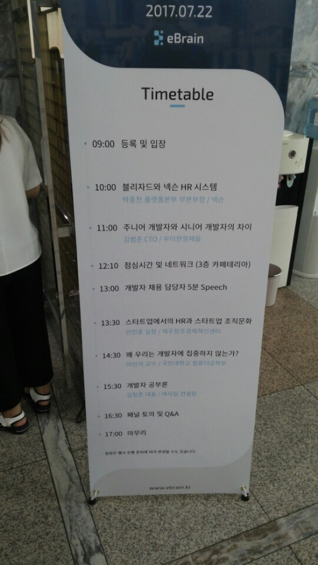
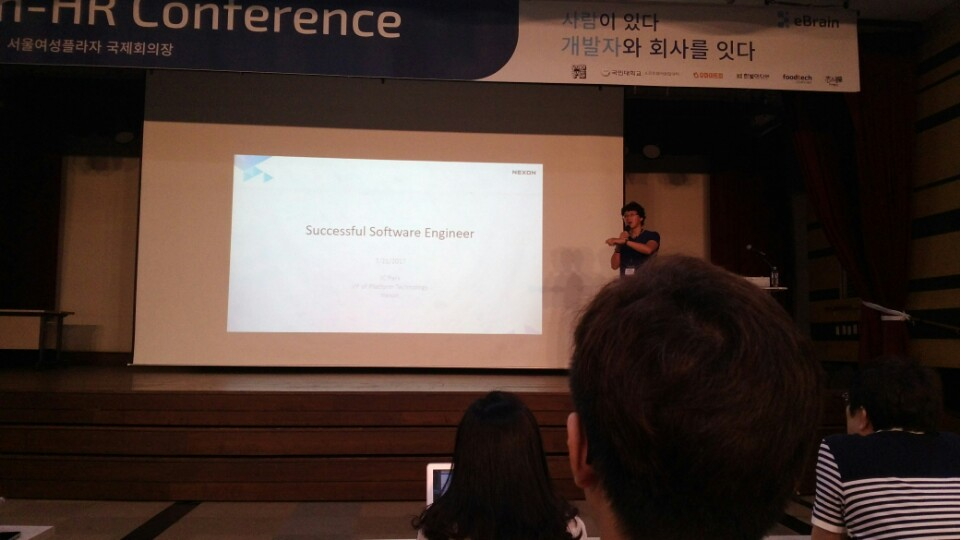
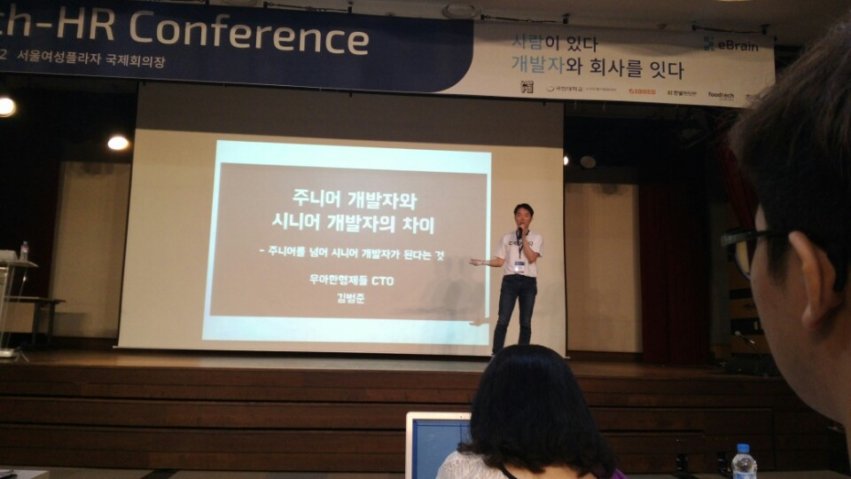
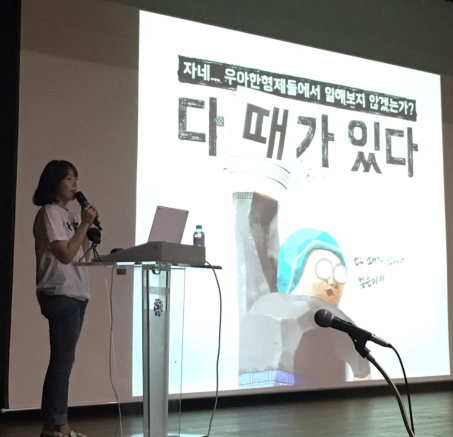
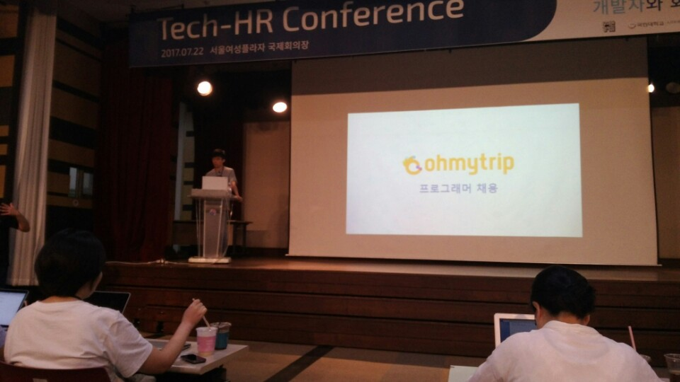
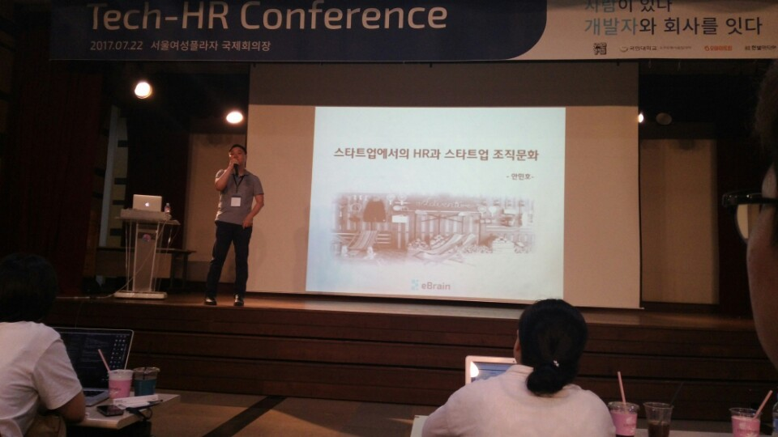
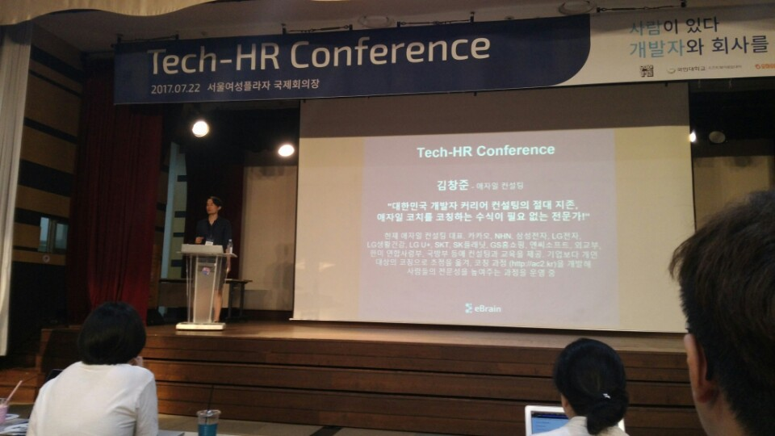

# Tech HR 컨퍼런스 참석 후기

eBrain에서 주회하신 [Tech HR 컨퍼런스](http://techhr.kr/)에 다녀왔습니다!  
  
연사분들 한분 한분이 개발자로 살면서 한번쯤은 이름을 들어봤을만큼 대단하신 분들이라 얼른 컨퍼런스 날이 오길 바랬습니다!   
(집이 이사해서 대방역까지 1시간 30분이나 걸렸네요 ㅠㅠ...)  
  
오늘 발표 순서는 아래와 같습니다.



혹시나 못오셨을 분들을 위해 최대한 발표 내용을 정리하였습니다.  
부족한 내용은 곧 영상이 올라올 예정이니, 조금만 기다려 주세요!

## 1. 성공하는 소프트웨어 엔지니어 - 박종천



넥슨에서 본부장님으로 계신 박종천님의 발표입니다.  
(박종천님은 이미 이전에 [개발자가 익혀야할 9가지 기술](https://www.youtube.com/watch?v=fHyTA-UIcqs)라는 레전드 영상을 남기셨습니다.)

### HR 시스템

보통 HR 슬로건은 Attract -> Develop -> Engage 과정을 거침

* Attract
  * 블리자드에서 채용을 할때는 크게 어려움을 못느꼈지만, 넥슨에선 채용하기가 너무 힘들다는 생각을 하게 됨
* Develop
  * 채용한 인원을 발전시켜야함
  * 해당 언어 사용자가 시장에 없다면, 통계/수학과 친구들을 뽑아 1년 동안 가르치기도 함
  * 이번 채용에서도 300명 중 5명을 뽑아 3달간 공부만 시키기도 했음
  * 채용이 되면, 거기서부터 **다시 시작**임을 명심
* Engage
  * 회사의 동료들과 가장 많은 대화를 함
  * 즉, 회사 구성원들간의 연결이 잘 되어야만 오래 갈 수 있음

개인적으로 HR은 아래와 같은 6 과정이라 생각함 

* 고용
* 평가
  * 평가는 굉장히 중요함
  * 일을 잘하는 사람이 못하는 사람보다 덜한 평가를 받게 해선 안된다
  * 연차로 승진이 아니라 실력으로 승진하는 제도가 필요함
* 구분
* 보상
* 교육
  * 짜르는게 중요하지 않다. 재교육이 필요하다
  * 인력은 항상 부족하다.
  * 세상은 이미 IT 세상으로 넘어가고 있음
* 복지
  * 기본적인 복지 시스템이 갖춰있어야 함
  * 보상과는 다름

### 고용

* 레주메
  * 내가 왜 이회사를 오고 싶은지
  * 이 회사에 어떤 것을 기여할 수 있는지
  * 왜 나를 뽑아야하는지
  * 이 3가지만 필요함
* 코딩테스트
  * 잘하는 사람을 뽑고자 하는게 아님
  * 못하는 사람을 걸러내기 위한 과정
  * 이걸 통과했다고 내가 **잘한다고 생각해선 안됨**  
* 기술 인터뷰
  * 기술 리뷰
* 팀 인터뷰
  * 우리의 문화와 잘 어울리는지 확인  
  * 팀내의 모든 사람이 싫어하지 않지만, 그 중 1명은 면접자를 좋아해야만 채용이 된다.  
  * 단 한명도 나를 매력적으로 못느끼게 하는것도 문제
  * 질문의 답만 해선 안된다. 면접자 & 면접관이 서로 질문이 오가야 한다.

개인적으로 면접에서 보는 부분은

* 빨리 배울수 있는지
  * 어차피 기술이 너무 빨리 변하기 때문에 빨리 배우는 능력이 중요하다 생각함
  * 개인 시간에 무얼 하는지, 누굴 만나는지, 어떤 책을 보는지 등을 확인
* 부지런한가
  * 똑똑하면 게으른 경향이 있는데, 게으르기 때문에 좀 더 똑똑하고 효율적인 방법을 찾는것 같음
  * 단, 극단적으로 게으른지를 확인
* 착한가
  * 내 일을 잘되기 위해 다른 사람을 헤코지 하는 경우를 종종 보게되서 이를 꼭 확인
  * 인터뷰를 하면서 말을 자꾸 바꾸거나, 숨기는게 있는게 보인다면 뽑지 않는다.
  * 미래에 대해 묻는건 아무 의미가 없다. **과거는 거짓말을 하지 않는다**.

### 구분

어떻게 조직 구조를 나누는지

* Assistant
  * 이제 막 대학을 졸업한 레벨
* Associate
  * 일을 주면 그 일을 잘해주는 사람
* Mid level 
  * 일을 찾아서 그걸 해결하는 사람
* 시니어
  * 일을 만들고 이를 분배하는 사람
* 리드 개발자
  * 한번도 안해본 일을 줘도 견적을 낼 수 있고 이를 해결하는 사람
  * 한번도 같이 일 안해본 사람들과도 결과를 낼 수 있는 사람
* 구루
  * 본인이 하지 않은 일에 대해서도 **책임**을 지는 사람

### 평가

평가는 **항목별로 명확히** 해줘야 한다  
몇 등 인지가 중요한게 아니다.  
아래 7개에 대해 평가해야 한다.

* 생산성
* 얼마나 안정적으로 일을 해결해내나
* 팀워크
* 제너럴, 도메인 지식을 많이 알고 있는가
  * 제너럴 지식 : 세상이 어떻게 돌아가는지
* 코드의 안전성
* 코드가 깔끔한가
  * 내가 짠 코드를 다른 사람이 봐도 칭찬할만한가
* 시스템을 잘 디자인 하는가

위 3개는 상사들이 좋아할 항목이지만, 뒤의 4개 항목이 안받쳐주면 앞의 3개를 잘하기가 어렵다.  

* 앞의 3개만 잘하면 입만 산 개발자
* 뒤의 4개만 잘하면 말을 안듣는 개발자
* 7개 다 잘해야 한다

돌아가서 팀에서 각 항목별로 가장 잘하는 사람을 찾아보고, 그 사람을 따라가보자.  
(나보다 못한 사람을 찾지말자. 위안 받지 말자.)  
물론 평균적으로 그 사람이 나 보다 못할 수 있지만, 항목별로 보면 더 잘하는 것이 있다.  
반대로 나도 이 7개중 하나는 가장 잘하는게 있어야 한다.  
  
사람을 잘 보기 위해 1대1 면담을 진행해서 아래와 같은 항목을 점검한다.

* 생산성
* 성장
  * 사람을 다시 뽑는데 드는 비용이 너무 커기 때문에 현재 있는 사람을 성장시키는게 훨씬 낫다
  * 하지만 그 사람이 시장의 발전 속도를 못따라가면 큰일이다.
  * 공부하는 속도가 시장의 발전속도보다 느리면 정말 위기다. 위기감을 느껴야 한다.
  * 코볼부터 시작해 현재까지 배운것 중 95%는 버리고 5%만 쓰고 있다. 세상이 계속 변하니 어쩔수 없다.
  * 이 회사가 10년을 갈지, 10년 뒤엔 내가 이 회사에 있을지, 10년뒤에 난 무얼 하고 있을지 고민 해보자.
  * **하는 일마다 성공하면 그 사람은 항상 쉬운 일만** 한다고 봐야 한다.
  * 실패가 많을 수록 그 사람은 항상 한계에 도전하는 걸로 봐야 한다.
  * 계속 실패만 한다면, 회사에서 좋지 않으므로 이를 시스템으로 커버하도록 구축되어 있어야 한다. 
  * 쉬운 일을 시작하면 끝이 없다.
  * 쉬운일은 언제든지 시작할 수 있으니 항상 어려운 일을 선택하자.
  * **고생의 총 량이 현재의 내 실력**
* 행복
  * 평생에 걸쳐 이루고 싶은 목표가 있는데 현재 하는 일이 그 목표에 도움이 되는지를 꼭 봐야 한다.

### 엔지니어

여러 종류의 개발자들이 있지만, 관계없이 특히 클라우드 공부를 많이 하시길 추천  
모든 소프트웨어 개발자들이 과학, 기술, 엔지니어링, 수학에 관심을 가져야 한다고 생각  
  
### Critical Thinking

시키는 일을 그대로 받아들이는 것이 아니라, 질문의 질문을 이어가서 질문의 앞뒤 영역을 늘리는것

### 어떤 일을 잘하기 위해서 무엇이 필요한가

* 재능
* 연습
* 기회
  * 30년 안에 2~3번의 기회는 오는데, 기회만 보고 있다면 온 기회들을 다 놓친다.
  * 재능과 기회를 계속 닦아야 한다.
* 예전 채용 기준은 똑똑함을, 다음은 열정을, 최근엔 끈기있는 사람을 원한다.
* 결국 꾸준하게 연습하는 사람은 결국 성장함

> 세상은 성공과 성공하지 않은 사람으로 나누는게 아니라, 배우는 사람과 배우지 않는 사람으로 나눈다.

## 2. 주니어 개발자와 시니어 개발자의 차이 - 김범준



(우아한 김범준 CTO님의 발표!)  
  
어떤 개발자가 시니어 개발자라 할 수 있는지, 이런식으로도 바라볼 수도 있구나란 생각으로 봐주셨으면 한다는 말씀과 함께 발표를 시작

* 시니어
  * 어떤 의견은 시니어가 될 수록 본인의 의견을 얘기하기 보다는 다른 사람의 의견을 듣는 사람
  * 반대로 시니어가 리드를 해야 하는 사람이란 의견도 있음
  * 즉, 사람들이 바라보는 시니어는 추상적이란걸 알 수 있음

* 시니어는 경험 많은 개발자?
  * 10년 이상 경험을 가진 개발자?
* 그럼 스시 장인이 되려면?
  * 1년차 : 청소와 같은 허드렛일만 진행
  * 2년차 : 위와 동일
  * 3년차 : 위와 동일
  * 이런 경우에 나는 **3년의 경력을 쌓았는데 진짜 3년의 경험이 있는가?** 란 의문이 생김
  * 즉, 경력이란 숫자는 그 사람의 실력을 얘기해줄 수 있는 지표가 될 수 없다. 
  * 진짜 실력이 되려면 2년차에선 다음 일을, 3년차에서 그 다음일을 해야만 한다.

* 시니어 개발자
  * != 10년 이상 경험을 가진 개발자
  * != **1년의 경험을 10번 반복**한 개발자
  * == **10년동안 다양한 경험**을 통해 성장한 개발자

> 같은 시스템을 계속 발전시키지 않고, 운영 업무만 계속 반복된다면 그 기간을 경력이라고 할 수 있을까?  

### 1만시간의 법칙?

* 몇십년간 걸었으니 난 걷기의 도사인가?  
  * 의도적 수력이 필요하다. 
  * 아무생각 없이 걷는다고 해서 걷기의 전문가가 아니다.
* 의도적 수련
  * 학습을 하기 위한 목적
    * 내가 **아는 걸로 빨리 해결**해버린다면 그건 **학습을 위한 시간으로 볼 수 없다**.
    * 코드리뷰를 하는 그 시간은 내가 학습하는 시간이 된다.
  * 적절한 피드백
    * 물론 혼자서 어마어마한 실력을 쌓는 케이스도 있지만, 성장을 위해선 적절한 피드백이 필수
    * 꼭 나보다 엄청난 실력자가 아니여도 되지만, 피드백을 받는게 중요하다.
    * 그렇다고 회사에서 시키는 일을 안할수는 없지 않은데 어떡해야하나
* 회사에서의 의도적 수련
  * PT에서 중량을 조금씩 늘려가는 것처럼
    * 얼른 일을 끝내고 쉬기 보다는 기존엔 기능만 만들었다면 테스트 코드를 작성해보고, 전수 테스트 코드를 작성해보고, 다른 언어로 동일한 기능을 만들어 보는 등
    * 즉 회사에서의 일에 나만의 도전 과제를 만들어서 진행해보자
  * 또다른 방법은 그 일을 진행하는데 패널티를 줘서 진행해보자
    * 한 팔로 팔굽혀 펴기를 하는 등과 같이
    * 테스트 코드 작성을 넘어 TDD로 진행해보기
    * 60만큼의 힘으로 원래의 퍼포먼스가 나오도록 해보는것

### 시니어 개발자 == 실력이 뛰어난 개발자?

그럼 실력이란?  
: **일이 되게끔** 하는 사람  
  
주니어의 실력은 부여한 일을 잘하면 되지만, 시니어는 일이 되게끔 해야 한다.

* 주니어
  * 테스크
  * 코드/문서
  * 일정
* 시니어
  * 프로젝트
  * 실질적 성과
  * 일정 + 리스크

우리가 미스코리아를 뽑는게 아니기 때문에, 코드가 이쁘기만 해선 안된다.  
본인의 경험을 통해 사전의 리스크를 찾아 에방하는 일이 필요하다.

* 정말로 이 사업이, 이 조직이 원하는게 뭐야?
* 내가 정말 이 코드를 작성하는게 맞아?

란 고민을 하는 사람

### 우아한형제들 기술조직

> 코드 덩어리가 아닌 '가치'를 만들고, 스스로의 '가치'를 높이며 일한다.

주니어라면 본인의 코드에만 관심을 갖지만, 시니어는 본인이 만든 것의 가치에 관심을 가진다.

### 시니어 개발자 == 일 잘하는 사람?

시니어의 일이라?  
: 개인이 아닌 팀의 일과 성과  

시니어의 성과와 성장은 무엇인가

* 꼭 팀장이 아니라도 **자기가 속한 팀의 일과 성과가 시니어의 일**이 된다.  
* 이력서에 중급으로 표기할 수 있는 언어가 10개 더 늘었다고 해서 그게 시니어의 성장이라고 할수 있을까?  
* 시니어가 될수록 테크니컬한 부분의 성장을 얘기하는게 아니다.  
* 시니어는 결국 어쩔수 없이 누군가를 이끌어 갈 수 있어야 한다.

좋은 시니어란

* 결국 자신의 경험을 나눠줄 수 있고,
  * 사내 세미나를 했다고해서, 발표를 했다고 해서 끝이 아닌 
* 그를 통해 동료들을 변화시킬수 있으며, 
* 변화가 성과로 이어지게끔 하는 사람
  * 예전엔 한달에 1번씩 발생하던 장애가 이젠 분기에 1번, 반기에 1번씩으로 장애 발생율이 줄어든것과 같이 실제 성과로 이어지게 하는 사람

### 정리

* 의도적 수련을 통한 발전에 익숙하고
* 코드가 아닌 '가치'를 만들어 낼 수 있으며
* 동료를 변화시키고 성과로 이어지게 하는 사람

### Q & A

* 우아한 테크캠프 합격 기준은?
  * 사람이 평가하기 때문에 100% 완벽하다고 볼 수는 없다.
  * 면접 당시의 면접관과 면접자의 핀트가 조금 어긋나면 잘 안될 수 있다.
  * 코딩테스트 점수가 그 사람의 실력이라고 생각하지 않는다.

* 우아한형제들의 사업 확장은 어떤 비전을 바라보고 있는지
  * 실제 업소의 주문이 대부분 우리 회사를 통해 진행 되기 때문에 그 데이터를 통해 그 업소에서 필요한 물품을 예측 가능하면 할 수 있는 일들이 많다.

* 우아한형제들에서 다양한 경험을 어떻게 지원하는지
  * 티맥스에서 팀장으로 일할땐 둘씩 묶어 페어프로그래밍을 시키고, 페어 멤버를 주기적으로 변경시키며 다양한 경험을 쌓아줬다.
  * 우아한 형제들에선 솔루션이 아닌 서비스이다보니 쉽지 않음
  * 본인이 다른 팀에서 일하고 싶어 할때 이에 대한 지원을 하고 있음
  * 회사의 사내스터디가 활성화 되어 있음
  * 회사에서 직접 자바지기 박재성님, 코드스쿼드등을 통해 유료 교육을 제공하고 있음

* 훌륭한 시니어를 채용할 수 있는 방법
  * 코딩 테스트의 결과가 아닌 작성한 코드를 보고 기본적인 실력을 평가
  * 사실 가장 중요한건 면접에서 이 사람이 어떤 태도를 가지고 있는지 확인
  * 오픈마인드, 겸손을 갖고 있어 어떻게 하면 더 성장할 수 있는지, 어떻게 하면 주변을 통해 배움을 얻을 수 있는지 생각하는지 확인

* 시니어가 주니어에게 교육을 할때 시니어가 주니어의 열정과 실력을 확인할 수 있는 방법
  * 사람의 의지라는건 다른 사람이 변화시킬수 없다.
  * 아무리 회사 사람이 좋고, 회사에서 하는 일이 좋아도 여기에 계속 있으면 더이상 성장을 못할것 같다면 이직을 했다. (3번의 이직 참고)
  * 정말 성장하길 원하는 주니어가 많다는 점을 시니어를 뽑을때 많이 어필함
  * 좋은 주니어가 없으면 시니어가 성과를 내기가 너무 힘들다는 것을 좋은 시니어들은 알고 있음
  * 좋은 동료가 있는 회사가 어딘지에 대해 많은 어필이 필요함

* 다양한 경험을 쌓기 위해 이직을 하고 싶은데, 이직을 하기 위해선 자격요건이 필요한 아이러니한 상황을 어떻게 해결할 수 있을지
  * 앞으로 30년 일 한다고 봤을때, 그걸 정말 잘하기 위해서 1~2년은 투자할 수 있다
  * 지금 이 회사가 싫다고 떠나고 싶어하면 오히려 잦은 이직만 진행하게 된다.
  * 패스트캠퍼스, 인프런, 유다시티 등 본인이 배우고자 하면 얼마든지 배울 수 있는 기회가 있으니 여길 이용해서 본인의 실력을 쌓는게 중요
  * 이직은 2가지 동기가 필요하다고 생각한다.
  * 여길 **떠나고 싶어하는 이유**와 바깥에서 **날 끌어당기는 이유** 2가지가 다 만족해야만 이직해야 한다고 생각한다.

## 채용홍보

오후 발표가 시작되기전 잠깐 3개 회사의 채용 발표 시간이 있었습니다.   
### 우아한 형제들 - TechHR팀 홍지인



우아한 형제들의 TechHR 팀 소속이신 홍지인님께서 우아한 형제들의 채용에 관해 소개하셨습니다.  


* 업계 최고 수준의 대우
  * 개발 신입 기준 **연봉 5,000만원**!!!
  * 정말 회사에서 좋은 개발자를 뽑기 위해 최선을 다하고 있음을 공식적으로 이야기한 것

* 주 35시간 근무제!
  * 편한 회사가 아닙니다. 일하기 좋은 회사입니다.
  * 돈의 가치도 중요하게 여기지만, 구성원의 시간의 가치를 가장 중요하게 여기고 있음

내가 만든 코드에 집중하기 보다, 가치에 집중하고 싶으신 분들은 언제든 아래 메일주소로 연락 부탁드립니다.

```tech_recruting@woowahan.com```

* 24시간 CTO님이 대기하고 계신다는!?

> 이브레인에서 많은 개발자분들을 추천해드리고, 현재까지 퇴사자가 1명도 없었다는 소식!

[개발 블로그](http://woowabros.github.io/)
[채용 페이지](https://recruit.woowahan.com/#/job)

### 오마이트립



MS MVP이시자, 오마이트립의 CTO이신 이규원님께서 직접 오마이트립 채용을 소개하셨습니다.  
(하필 우아한형제들의 발표 바로 뒤에 하게 되어 나가리가 되었다는 엄살!? 과 함께 시작하신 이규원님)

* 채용 첫날부터 "당신들은 소프트웨어 만드는 방법을 모른다" 란 얘기를 했지만 여전히 잘 다니고 있음
* 대표님부터 시작해서 테크회사로 가기 위해 큰 의지를 갖고 있는 상태

입사후 현재까지의 변화


실제로 이규원 CTO님은 열심히 개발자를 채용중입니다.  
아직 많은 인력이 있지 않은 상태이기 때문에 CTO님 바로 옆에서 개발과 일을 배울수 있는 기회! 

[기술 블로그](https://ohmytriptech.github.io)
[채용 페이지](https://ohmytriptech.github.io/recruit/)

### eBrain


발표를 진행해주시는 노상범 대표님  
  
eBrain에서 채용을 하는 이야기가 아닌, 개발자들이 고민이 있을때 eBrain에 연락해주길 바라는 내용을 전달

* 우리나라에도 개발자를 위한 회사가 하나쯤은 있어야하지 않을까 하는 마음에 시작한 회사
* 대한민국 최초의 개발자 전문 매니지먼트
* 국내 최대 개발자 커뮤니티 OKKY 운영중
* 앞으로도 개발자를 위해 준비하고 있는 것이 많기에 기대해주셨으면 함

> 개발자인데 앞으로 어떻게 해야하지, 어떻게 경력을 쌓아야하지, 어떻게 조직을 꾸려야할지 고민인 분들을 위한 eBrain

[eBrain 페이스북 페이지](https://www.facebook.com/ebrain.inc/)

## 스타트업에서의 HR과 스타트업 조직문화 - 안민호



오후 첫 세션은 카카오 소속이시자 제주혁신센터 실장님으로 계신 안민호님께서 스타트업에서의 조직문화에 대해 질답 식으로 진행해주셨습니다.

### #1 내부호칭은 영문호칭이 좋을까요? 아니면 한글 호칭이 좋을까요?

* 수평문화에 대한 고민? == 커뮤니케이션에 대한 고민
  * 빠른 의사결정을 위해 영문 호칭을 사용
  * 수평문화를 만들기 위한 이유만 있던것이 아님
  * Philip, 민호님, 실장님 이 3중 가장 빠르게 의사소통 할 수 있는 방법은 무엇인지 생각해보면 쉬움

### #2 팀원들에게 어떻게 오너십을 갖게 하나요?

* 지분을 주면 되겠지만 스타트업에서 정말 어려운 일
* 대기업은 많은 돈을 주지만, 그 효과가 오래가지 않는다.
* 스톡옵션도 상장하기전까진 쓰레기에 불과
* 회사의 비전과 개인의 비전이 맞지 않으면 오너십을 가지기 어렵다.

### #3 조직간(개발/기획/운영) 경쟁?

* 개발자는 제품을 만드는 사람이며, 기획자는 제품을 그리는 사람이라 성향이 같을순 없다.
* 회사가 커짐에 따라 자연스레 발생할 수 있는 문제

### #4 아름다운 이별의 방법은?

* 해고 통보는 법정에까지 갈수 있기 때문에 아름다울 수 없다.
* 우리가 알고 있는 좋은 회사들은 채용과정이 굉장히 까다롭다.

### #5 왜 창업하려고 하나요?

* 창업을 장려하는 분위기
* 취업이 안되면 창업이란 분위기로 흐려지는것 같은데, 취업 안되면 창업도 잘 안되는게 현실
* **아이디어만 갖고** 창업하면 대부분 실패
* 카카오톡 김범수 의장의 사례처럼 **빠르게 실패한 기업이 살아남는다**

### #6 대기업 or 스타트업?

* 대기업을 가면 작은 것을 하게 된다.

* 타이어 조립만 전문적으로 할 수 있다.
* 반대로 스타트업은 전체 프로세스를 다 다루게 되고 짧은 시간에 많은 경험을 쌓게 된다.
* 본인의 성향에 맞게 지원

> 이 부분이 개인적으로 공감이 좀 안됐던 것이 대기업에 가서 전문성을 쌓을 수 있나? 라고 물음표가 있습니다.  
관리하는 법, 프로세스 정리에 관해서라면 모를까 현재 기술을 이끌고 있는곳이 대기업인가라고 생각하면 물음표입니다.  
말씀하신 대기업이 네이버/카카오/구글/라인 같은 곳이라면 동의하지만 일반적인 그룹사를 얘기한다면 개인적으론 동의할 수 없는 부분이라 추가로 남깁니다.

### #7 CEO? CTO?

* 내가 맡은 역할만 하겠다고 하면 스타트업에선 힘들다
* 어차피 앞으로는 빠르게 변화가 일어나는데 다양한 경험을 해보는건 큰 도움이 된다.
* 개발만 하겠다고 버틸순 없다.

### Q & A

* 좋은 스타트업을 고르는 법
  * 기업가치나 핵심이 내가 추구하는 방향과 같은지
  * 성장 가능성
  * 첨언) 채용공고가 성실하고 재밌게 썼는지 확인해볼것

## 쉬는 시간 - 노상범 대표님의 개발자 연봉 테이블 이야기

* SI를 제외하고, 솔루션/서비스 기업을 기준으로 보면 지난 1년 반 동안 개발자들의 평균 연봉이 20% 이상 오른것 같다.
* 전문가 분들을 보면 연봉 8천, 1억인 분들을 만나게 된다.
* 왜 이런일이 생기는 걸까 라고 생각해보면 개발자를 찾는 스타트업들이 늘어서 그런것 같다.
* 개발자들에게 정말 좋은 시간이 오고 있지 않은가 생각중이다.


## 4. 왜 우리는 개발자에 집중하지 않는가? - 국민대 이민석 교수님


> 노상범 대표님께서 가장 존경하시는 교수님

잠깐 대학교 자랑을 하며..

* 국민대 소프트웨어 단과 대학의 경우 입학시 등록금의 절반을 지원
* 소프트웨어 특기생을 입학시 4년간 등록금 전액 지원

### 소프트웨어

세상의 많은 회사가 자신들을 소프트웨어 회사라고 얘기함  

* 예전에는 소프트웨어가 업의 생산성을 도와주는 도구
* 현재는 업의 가치 그 자체가 됨
  * 소프트웨어로 매출 자체가 올라감
* 소프트웨어가 회사의 가치 그 자체기 때문에 개발자가 중요한 시대
* 모든 회사에서 개발이 중요하며, 개발자가 중요하다
* 소프트웨어 즉, 개발의 자국은 **신뢰와 공감이라는 결코 쉽게 얻을수 없는 사회적 자산 위에서 찍힌다**.

### 정작 개발자들은 어디에 집중할까?

* 직장에서 가장 중요한 것은? (미국 통계)
  * 새로운 기술 습득
  * 제품에 관한 결정권 : 이건 내가 만든거야
  * 회사의 방향성에 맞는 일
* 이직을 할때 가장 중요한 것은?  
  * 연봉
  * 워크앤라이프
  * 훌륭한 동료
* 업무 이외의 주당 코딩 시간
  * 1 ~ 2시간 : 25%
  * 2 ~ 5시간 : 25%
  * 5 ~ 10시간 : 20%
  * 10 ~ 20시간 : 9%
  * 20시간 이상 : 5%
  * 0 시간 : 15%

* 지금도 이직을 생각하나?
  * 찾고 있지만 기회가 오면 : 60%
  * 지금이 좋음 : 25%
  * 이미 구직 활동중 : 15%

* 개발자에게 집중한다 함은 위의 통계 참고가 필요 (미국/한국 관계없이)
  * 연봉
  * 이직
  * 개인의 삶
  * 학습욕구
  * 핵심기술
  * 맥북프로!?

모든 회사가 개발자를 찾고 있다.  
**여러분이 갑** 이다.  

### 개발자에 집중하는 것은 회사가 해야 한다.

현실은 늘 위기라고 얘기한다.  
하지만 이건 개발자 당신들 잘못이 아니다.  

* 개발자들끼리 모이면 항상 첫 말은 한풀이다.
* 그 서비스가 얼마나 잘되었는지, 좋은 서비스인지에 대한 이야기는 거의 하지 않는다.
* 개발자는 최고의 퍼포먼스를낼수는 있는데, 출근하려고 할때 한숨부터 나오는 이유는 회사에 가면 나를 도와줄 사람이 없기 때문
* 점심먹고 그냥 퇴근하고 싶은 이유는, 다시 출근하는것 같기 때문
* 회사를 결국 떠다는 이유는 회사가 싫어서가 아니라 바로 그 인간이 싫어서

우리나라 문제의 중요한 한축 (개인의 권리와 삶을 무시하게된 계기)

* **열심히 일해야만 좋은 세상이 올것**이라는 세뇌를 받은 상사들이 많기 때문
* HR (Human Resource)을 강화하기 시작
* 프로젝트가 성공하면 개발자들과 회식한번하면 스트레스가 해소된다고 생각하는 분들이 너무 많다.
* 특히 대기업에서 HR을 익히고 온 사람들은 개발자들을 **관리의 대상**으로만 보는 경우가 많다.
* 미인대회 선발하듯이 항상 등수로 평가하려고 하고, 이미 잘하는 사람들을 경쟁시키려 한다.
* HR은 결국 개발자들을 잘 케어해줄 수 있어야 함

그렇게 까지는 아니라도, 개발자가 최고의 퍼포먼스를 내려면

* 퇴근하려고 할때 마음이 편해야 함
* 회사일 잊고, 다른 것에 몰입할 수 있기 때문
* 물론 중요한 배포가 있을 경우는 예외
* 가끔 노는 날에도 출근하고 싶어야 함
  * 회사보다 재밌는 곳이 없기 때문
* 회사를 떠나기 싫어야 함
  * 동료들과 같이 떠들면서 먹는 소고기가 맛있기 때문

사장님, CTO, 개발자, 기획, 마케팅, 총무, 영업맨들을 개발자에 집중하는 훈련을 받은적이 없음

* 사장님이 하실일은 누구를 실망시켜야할 지를 결정하는 일
  * A와 B중 버려야할게 무엇인지 결정하는 일
* CTO님께서 결정하실 일은 개발자가 어디에 집중해야할지 결정하는 일
* 개발자는 개발에 집중해야 함

### Q & A

* 대학생을 뽑을때 가장 중요하게 보시는 점은?
  * 학교는 회사와 달리 이 사람이 정말 소프트웨어를 배울 수 있느냐에 더 중심을 둔다.
  * 소프트웨어를 해서 세상을 바꿀 열정이 있느냐
  * 고등학교때 할 수 있는게 뻔하기 때문에 배우는 속도가 얼마나 빠른지에 관심을 가진다.
  * 구체적으로 뭘 하고 싶은지는 중요하지 않다.

* 개발자들이 HR에 대한 신뢰가 거의 없다. 만약에 교수님께서 인사팀에 있다면 어떻게 그 장벽을 허물것인지
  * 개발자들이 가장 보람을 느낄때는 다른 개발자들을 도울때다
  * 그 회사에서 커뮤니티 활동을 하는 것을 지원하는 것이다.
  * 개발자들이 커뮤니티 활동을 하는데 시간을 지원하고, 법인 카드를 지원하는 등 적극적으로 지원하는 것이 좋다.

* 개발자들이 새로운 걸 하고 싶은데 회사의 방향과 상충될때가 있는데 이럴때 어떻게 하면 좋을지?
  * 전형적인 소프트웨어 회사들이 하는 행사가 사내 해커톤
  * 가족들을 초대해 개발자는 프로토 타이핑을 하되, 가족들은 펜션에서 놀게 하는것
  * 대신 해커톤이 끝나고 발표할 때는 같이온 가족들 앞에서 발표하도록
  * 가족 구성원들에게 내가 하고 있는 일이 무엇인지, 소개할수 있고 자부심을 느끼게 할 수 있도록


## 5. 개발자 공부론 - 김창준



애자일 컨설팅의 대표이시자 국내 최고의 애자일 코치이신 김창준님께서 개발자 공부론에 대해서 발표하셨습니다.

[프로그래밍 어떻게 공부할 것인가 영상](http://mindscale.kr/course/how-to-learn-prg) 참고

추가로 이 강좌를 정리하신 분이 계셔서 첨부! - [링크](https://github.com/Gyubin/TIL/blob/master/ETC/how_to_study_programming.md)

### 첫번째 이야기

질문) 큰 수술을 맡길 의사를 선택해야하는데, 정보는 경력과 연차밖에 정보가 제공되지 않는다. 어떤 의사를 선택할까?
* 5년차/15년차 중 누구를?

하지만 실제 조사를 해보니 **연차가 높을 수록 사망률이 더 높았다**.  
이 조사는 환자의 상태가 비슷한 경우를 대비해 조사했음에도 연차가 높을수록 사망률이 더 높았다.  
마찬가지로 심리치료사도 경력이 많을수록 심리치료를 더 잘 못하는 결과가 나왔다.  
더 많은 사례, 더 많은 표본을 기준으로 해도 동일한 결과가 나온다.  
개인의 발전이 업계의 발전을 추월하지 못한다라는 결론  
의사와 같은 경우 한번 배우고 나서 이후에 계속해서 공부를 잘 하지 않는 반면, 최근 졸업한 친구들은 최근의 내용을 배우고 졸업한 상태이다.  

* 실력과 경력이 비례하지 않다는것은 수많은 연구로 확실시
* 즉, 저 사람의 경력은 실력을 평가할때 전혀 쓸모가 없는 지표라는 것
* 경력이 쌓이도록 가만히 있어봐야 절대 실력이 늘지는 않는다는 것

즉, 실력을 키우고 싶다면 작정하고 쌓아야 한다는 것

### 두번째 이야기

개발자는 공부를 해야한다는 강박을 느낀다.  
근데 공부하면 실력이 늘까?  
그렇지 않다.  
공부 방법을 공부해야 한다.

* 흔한 개발자들의 공부법
  * 요즘 핫한 키워드들을 모아 그 기술의 베스트 셀러를 골라 처음부터 읽어본다.
  * 동영상 강의를 찾아본다.
  * 혹시나 자격증이 있다면 자격증도 준비한다
  * 사람을 모아 스터디도 진행해본다. 스터디는 챕터를 나눠 발표준비를 한다.

* 학습방법 마다 효과 차이가 엄청나게 남
  * 우리가 현재하는 학습방법은 학교에서 했었던 방식과 별 차이가 나지 않음
  * 개발자들은 항상 책의 순서대로 진행
  * 학교는 항상 교과서가 있고, 시험범위가 있는데 개발자들도 한개의 책만 보고 마는 경우가 많음
  * 개발자들은 책을 다읽었다, 연습문제를 다풀었다 라는 개념으로 공부하려고 함
  * 즉, 학교를 졸업했음에도 개발자들은 학교에서 썼었던 방식을 고수하고 있음

* 이 학습 방법은 효과적일까?
  * 이런 방식은 공부해야할 대상이 명확할 경우에만 효과적
  * 하지만 업무에선 시험 범위가 없음
  * 불확실성이 너무나 높은게 업무와 개발
  * 이럴 경우 위 학습방법은 전혀 효과적이지 않음
  * 파이썬 책을 보면 파이썬을 학습했다고 생각하는데 전혀 다른 이야기임

소프트웨어는 야생학습이 필요하다.

* 야생학습은 비순차적
* 야생학습은 범위가 한정적이지 않다.
* 야생학습은 명확한 평가가 없다.
* 야생학습은 혼자서만 진행하지 않는다.

실제로 사용할때는 여러개가 합쳐져 사용되는데, 책을 통해 배우는 것은 단락마다 구별되어 있어 차이가 남

### 야생학습은 어떻게 해야하는가

* 학습을 시작할때 의미있는 프로그램을 개발하는 것을 목표로 해야한다.
* 책은 보조가 되어야 하며, 책에 종속적으로 진행하면 안된다
  * 특히 책은 잘 설계되어있지 않는다.
* 실제 업무 환경과 흡사한 환경으로 해야 의미가 있음
* 특히 실수를 많이 한 학생들이 응용력이 좋은데, 책을 통해 진행하면 실수를 할 수가 없다.
  * 실수에 대한 훈련이 현실에서 필요한데, 실수 훈련이 전혀 안된다.
  * 책에 있는 대로 따라 치기만 하면 전혀 학습이 되지 않는다.

### Q & A

* 야생학습을 대학교에서 하려면?
  * 공부의 목표를 분명하게 하려는 경향이 있음 (이 과목의 점수를 몇점 받겠다 등)
  * 그것보다는 내가 이걸 공부해서 궁극적으로 무엇을 하고 싶은지 고민하는게 더 필요
  * 파이썬을 배워서 내가 뭘 하고 싶을지 생각하는것이 더 낫다.
  * 회사에선 누군가 나를 이끌어 주지 않는다.
  * 본인이 주체가 되어야 하는 것을 명심

* 커리큘럼이 잘 짜여진 책이 있다면 어떤 책이 있는지? 이유는?
  * 공부 != 책읽기
  * 편혐한 공부방법
  * 엑설레이터 C++ 란 책을 보며 감탄의 메일을 보냈을 정도로 
  * 많은 C++ 책들이 C언어를 설명하고 나서 C++을 진행하는데 완전 학교 수업과 같은 방식으로 소개했지만 그 책은 STL부터 시작함
  * 챕터가 끝날때마다 간단한 성적평가 프로그램이 만들어지는데, 챕터가 지날때마다 그 프로그램이 업그레이드 되어감
  * 학습 커리큘럼을 만들때, 만들고 싶은 프로그램의 순서를 정하는게 더 효율적이다.

## 패널토론


좌측에서부터 OKJSP를 OKKY로 리뉴얼 해주신 정병태님, 삼성 SDS HR 조남호 수석보님, 이민석 교수님, 김창준 대표님, 김동수 CTO님, 이규원 CTO님

### 1. 기초기술 vs 응용기술 중 어떤것이 중요한지 어떻게 판단하고 습득할 수 있는지

이민석 교수님

* 책을 보고 진도를 따라 가는 것은 무조건 나쁜 방법이라 생각함
* 학교에서 진짜 많은 실험을 하고 있음
  * 첫 언어를 뭘로 선택해야할지 등등
* 근데 실험결과는 어떤걸 배워도 똑같다
* 어느 언어든 한 언어를 배우면 문법적인 요소는 끝이난다.

김동수 CTO님

* 언어에 대한 부심은 버리는게 좋다.
  * 자바 개발자들이 PHP는 구리다
  * C 개발자들은 웹이 구리다 등등
* 실제 그 업무에서 가장 필요한 언어를 선택하는 것 뿐
* RestAPI를 사용한다면 왜 이런 프로토콜이 되는지

### 1-1. 취준생인데 자바가 취업이 잘되는걸 알고 있지만, 내가 스칼라를 공부하고 싶으면 어떻게 해야 하나

김동수 CTO님

* 전 회사인 아만다는 레일즈로 되어있었음
* 신입은 개발 언어를 어떤걸 경험했다는 크게 중요하지 않음
* 핵심이 무엇인지 알고 있다면 언어는 중요하지 않다고 생각한다.

이규원 CTO님

* 공부의 기준이 회사의 업무를 기준으로 한다면 돈 주는 곳의 언어를 선택하면 된다.

조남호 수석보님

* 대기업의 경우 이미 아키텍처, 컨벤션들이 모두 정해져있지만 
* 매니저를 설득할 만큼의 실력이 있다면 모를까 안된다면 회사의 룰을 따르는 수밖에 없다.
* 그게 싫다면 이직해야 한다. 

김창준 대표님

* 알고리즘 논란에 대해 잠깐 이야기하고자 함
* 라틴어 가설 : 라틴어가 체계적이라 라틴어를 배우면 모든 언어를 잘할 수 있다란 가설
* 알고리즘도 이와 비슷하다. 만병 통치약처럼 사용한다.
* 알고리즘이 돌파구/해결책이 될 수 없다.
  * 이미 연구 결과가 도출됨
* 구글의 수석 연구원이 이미 발표한 이야기는, 프로그램이 대회에 입상한 사람들이 입사후 실적이 더 좋지 못하다는 결과
  * 짧은 시간에 혼자서 문제를 해결하는 것에 대한 연습이 되어있는 것이 아닐까
* 알고리즘을 하면 내가 하는 일이 다 잘되지 않을까 하는 환상을 심어주는 선배들이 많은데 그렇지 않다.

### 2. 왜 한국의 개발자들은 타국에 비해 대우를 못받는걸까

조남호 수석보님

* 대학 후배들을 만나면 대기업이 항상 공공의 적이 된다.
* IT는 노동자의 권리를 지켜주기 위한 단체가 없다고 생각한다.
* 어릴때부터 코딩 교육을 권장하기 보다는 이미 현업에 있는 개발자들의 권리를 지켜줄 단체가 잇어야 하지 않을까 생각

이규원 CTO님

* 좋은 결과를 만들어내지 못하기 때문이라 생각
* 아주 많은 비중을 차지하는 이유는 **환경**때문
* 200개가 넘는 보안 프로그램이 설치되어 3분마다 툴이 뻗어버리는 상황에서 개발하면서 정말 인생의 암울한 시기를 보냄
* 조금씩 더 나은 환경에서 일하고자 노력했다
  * 여기가 더 좋은 환경인지 하나하나 발품해서 찾아보고 프리랜서 생활을 함
* 개발자 개인의 역량도 중요하지만, 회사 전체 문화가 변해야만 한다.

김창준 대표님

* 부부상담에서 최악의 상황은 서로 이혼할수 없는 상태이다.
* 지금 불행한데도 헤어지지 못하는게 가장 큰일
* 회사가 나쁜 처우를 받음에도 나가지 못하는건 정말 큰일이다.
* 우리나라의 미덕중 하나가 참을성인것 같다.
* 이 회사를 나가면 내가 살아남을수 있을까란 불안감에 계속 남아계신것 같다.
* 작게라도 자기가 할 수 있다란 자신감을 얻는게 중요하다.


### 2-1. SI프로젝트를 진행하면 무리한 일정에 완수하지 못한것에 대해 죄책감을 느끼는 것은 꼭 개발자이다. 첫 단추가 잘못된 경우인데 이것때문에 자존감을 잃는 경우가 많다. 어떻게 자존감을 회복하는지

이민석 교수님

* PM욕을 하면 된다.
* 특히 우리나라의 경우 PM이 정말 말도 안되는 이유로 PM 역할을 한다.
* 작은 회사일수록 PM이 너무 못한다.
* 가장 기술력 있는 사람이 PM이 되는게 아니라, 위의 압박을 막아주고 일정을 관리하는 것이 PM이다.
* 일정을 준수하지 못했다면, 제대로 뽑지 못한 회사의 잘못이고 지키지 못한 PM의 잘못이다.

이규원 CTO님

* 내가 하고 있는 일에 대해서 시작적 근거를 남겨야 한다.
* 그런 근거 없이 시간이 없다고 얘기하는것과 근거를 가지고 이야기하는 것은 설득력의 천지차이이다.
* 내가 하고 있는 것을 기록하지 않으면, 진척되고 있는지 알수가 없다.
* TDD의 경우에도 아무리 작은 경우라도 테스트 코드를 작성하지 않으면 앞으로 나갈수가 없다.
* 이 지루한 과정을 하면서도 즐거운것은 하나하나 처리되가는 과정이 눈에 보이고 얼마만큼 진척된것인지 알 수 있기 때문이다.

김동수 CTO님

* 자기가 만든 것에 만족하려면 짧게 짧게 만들어야만 한다.
* 로그인 기능을 만든다고 일주일의 Task를 할당하면 이걸 보는 팀장님이나 다른 분들이 알 수가 없다.
* 최대한 작게 나눠 반나절 Task 들을 여러개로 만들어 진행해야 현재 상태를 알 수 있다.

김창준 대표님

* 회사의 직원들이 언제 가장 동기를 얻는지 조사를 해본 결과
  * 설문조사는 불확실함이 많기 때문에 수천개의 일기를 통해 조사
* 그 결과는 진척이 되고 있다는 것을 알때마다 에너지가 증가함을 알게됨
* 일주일간 백엔드 개발을 하겠다고 잡으면 그 사람은 일주일간 진척이 없는 것이다.
* 인디게임 개발자들을 조사해보면 서버구축/클라이언트구축 등으로 Task를 나누지 않는다.
  * 박스 한개 생성, 박스 이동 기능 등 잘게 쪼개서 만들고 있다는 느낌을 많이 가지려고 한다.

### 3. 비 IT인들이 개발자와 대화하려면 어떻게 해야하나

김동수 CTO님

* 커뮤니케이션은 모든 회사에서 중요하다.
* 듣는 사람의 눈높이에 맞춰 얘기할 수 있는게 잘하는 사람이다.
* 슬랙의 배포 메세지만 보더라도 "메인페이지 이슈 배포" 란 메세지는 기획자, CS 운영자분들은 전혀 모른다.
* 반대로 비 IT쪽에선 개발자에게 무조건 "안되요" 라고 얘기하면 전혀 소통할 수가 없다.
* 듣는 사람이 다시 물어보지 않도록 말을 해주는게 중요

이민석 교수님

* 최근에 비 IT 전공자에게 소프트웨어 교육 기회가 많아짐
* 비IT인에게도 스크래치와 같은 교육용 소프트웨어라도 경험하게 해주는게 어떨까 생각

### 3-1. 비 IT에서 개발자를 평가할 수 있는 방법은?

김창준 대표님

* 평가하거나 뽑으려고 하면 잘하는 것이 뭔가에 대한 모형이 먼저 있어야 함
* 모형이라함은 같은 상황에서 잘하는 사람과 못하는 사람이 어떻게 행동하는지 연구해야 함
* 면접에서 만약 말도 안되는 일정이 요구 되면 어떻게 할것인가 라고 질문하면 누구나 설득해야 한다는 대답을 할 수 있다.
* 하지만 과거에 했던 프로젝트를 토대로 과거에 어떻게 했는지에 대해 물어보면 이는 위조하기가 쉽지 않다.
* 이런식으로 자료를 계속 모아 좋은 개발자에 대한 모형을 만드는것이 필요하다.

## 후기

> 후기를 정리하면서 다시 한번 내용을 곱씹어 보는데 좋은 내용들이 정말 많았던것 같습니다.  
아마 오신분들 대부분이 그렇게 느끼셨을것 같습니다.  
개인적으론 어떻게 시니어가 되어야할지,  
어떻게 공부해야할지 많은 생각을 할 수 있는 기회가 되었던것 같습니다.  
세미나는 영상이 올라와도 잘 안보는 경향이 있으신데 이번 세미나는 영상으로 꼭 보셨으면 합니다.  
너무 좋은 세미나 잘보고 왔습니다!
