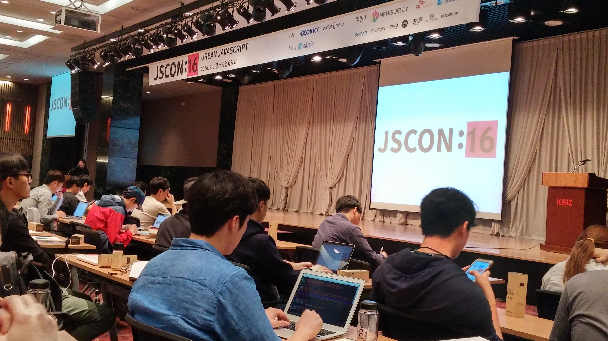
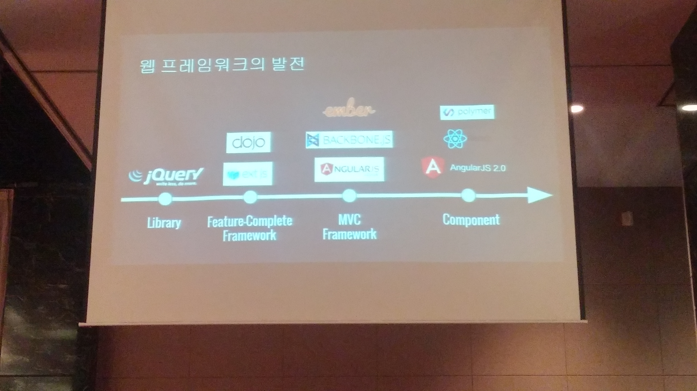
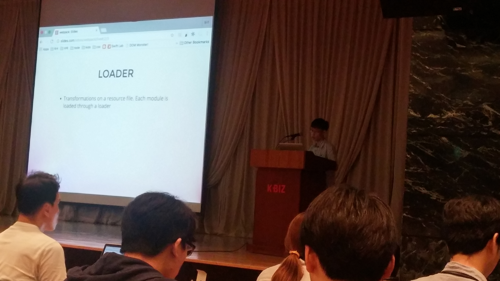
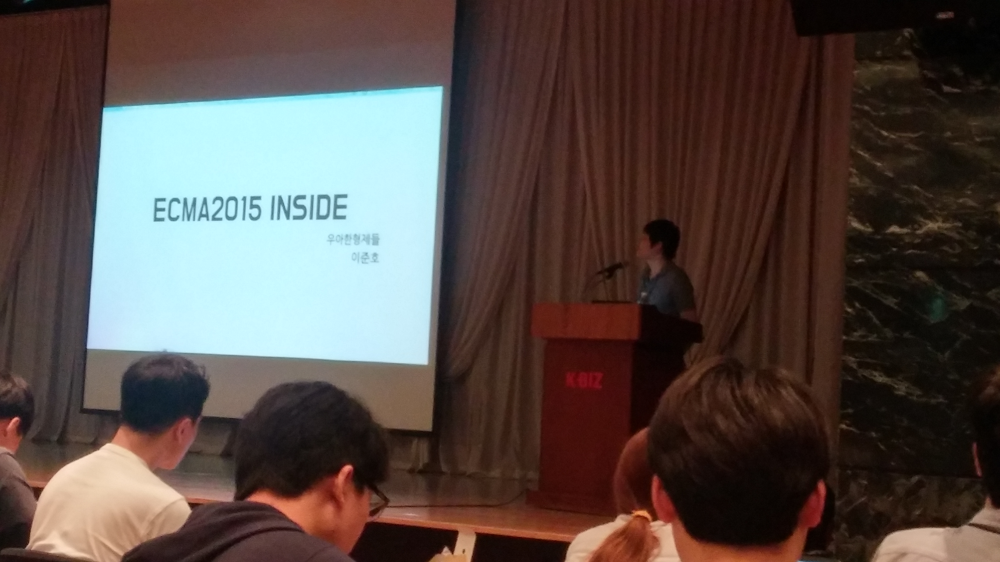
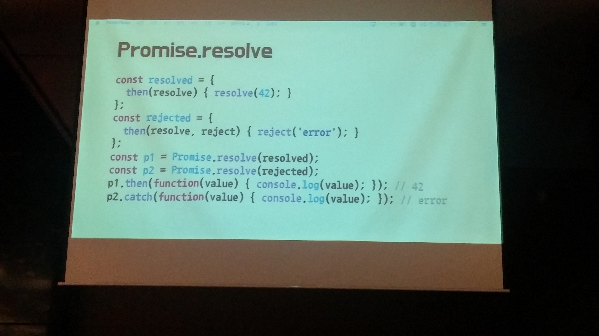
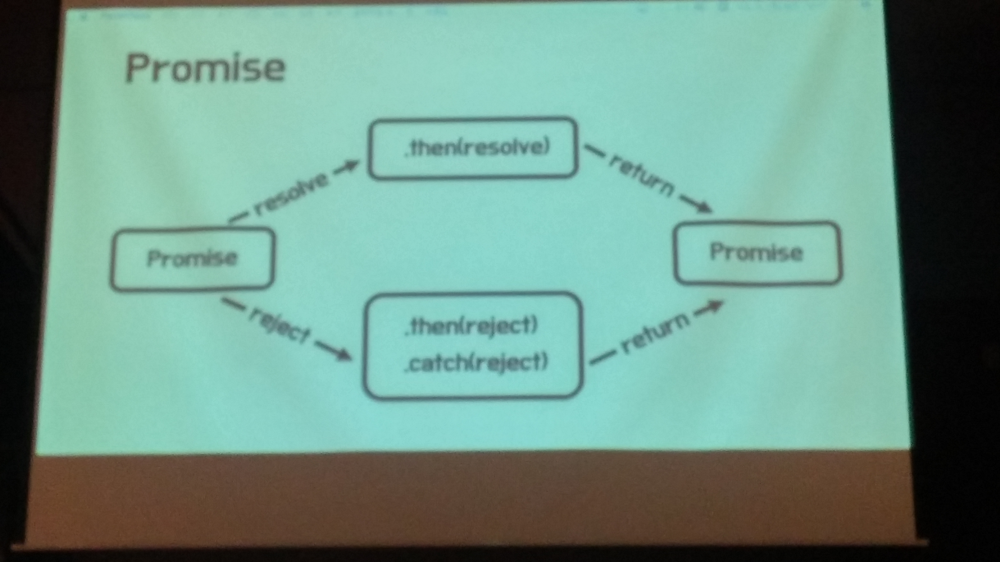
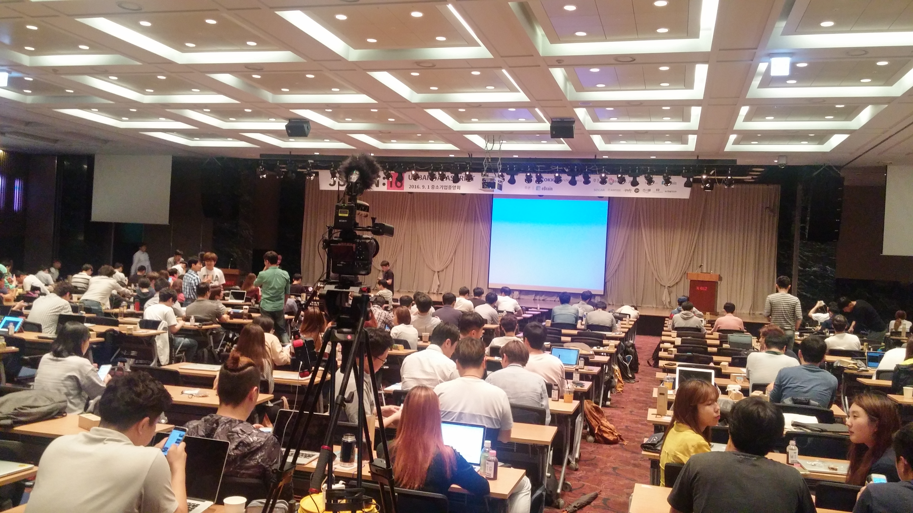
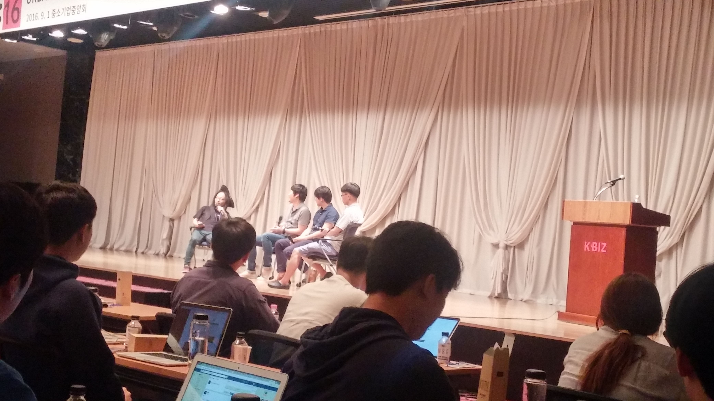
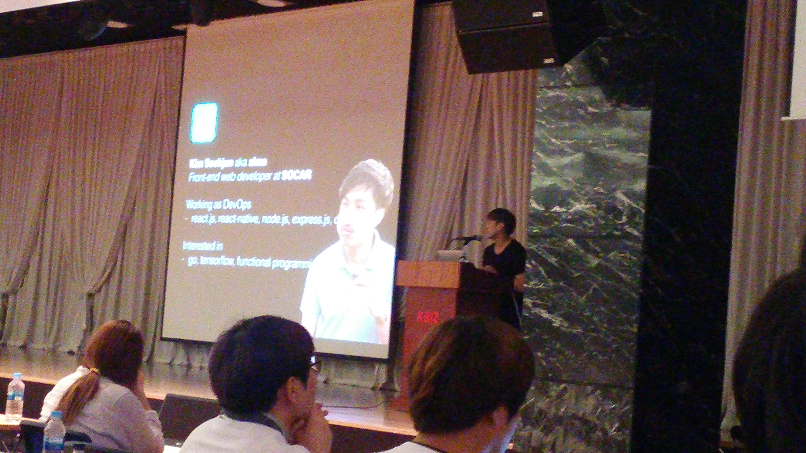
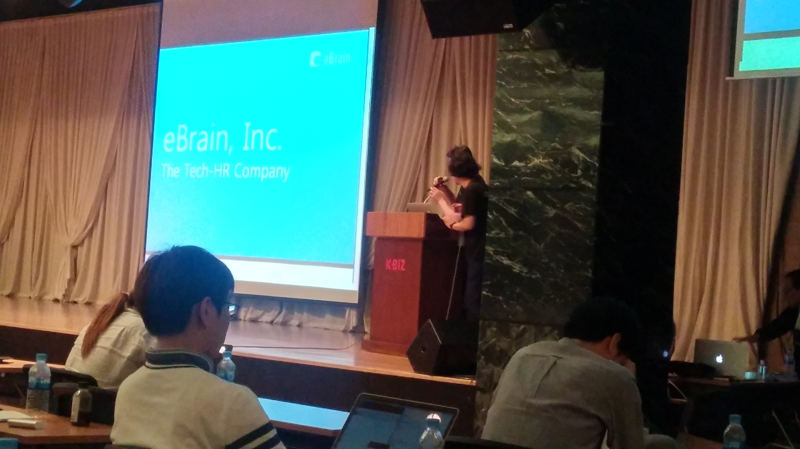

# JSCON 2016 후기
작년에 JSCON2015를 참석하고 (회사지원으로 공짜라서 더 그런걸까!?) 굉장히 재밌었던 경험이 있어 올해도 개최만 기다리다가 바로 신청했다. <br/>
경력관리 세미나와 같이 토크보다는 **기술전달이 대부분**이라 관심없으신 분들은 크게 재미를 못느낄수도 있을 후기임을 먼저 말씀드린다.



(사진속에 남자들만 있지만 여성분들이 굉장히 많이 참석하셨다. 역시 프론트엔드분야는.. 좋다!?)
* PyCon의 열기를 이어 2016년 09월 01일 JSCON2016 개최! (둘의 관계는 1도 없다는것은 함정)
* 회사차원에서 지원받아 **공짜 + 꽁연차**로 참가!
* 행사 관련 내용은 [공식홈페이지](http://www.jscon.io/)에서 확인 가능하다
* 하필이면 오늘 AWSOME Day와 최범균님의 DDD 유료 강의가 다같이 있는 날이라 아마 많은 분들이 선택과 고민의 시간이 있었으리라 생각한다 ㅠㅠ
* 세미나는 전부 촬영되었기 때문에 조만간 영상이 올라올 예정이다. 영상이 올라오기전까지 가벼운 마음으로 보면 될것 같다. 

## Angular2 Component & Reactive - 고재도(비트파인더)


* 프레임워크에서 플랫폼으로
  - 단순한 프론트엔드 프레임워크를 넘어 플랫폼화 하려는게 angular2의 기조
  - 2에서 새로 추가된 혹은 1에서 이어져온 기능들
    - DI, Decorators, Zones, Compile, Change, Render
    - Material, AngularMobile, Universal
    - Anglar CLI, Language Services, Augury(디버깅)

* Angular1의 문제
  - 모바일에서 쓸수가없다.
  - 프로젝트가 커지면 관리가 어렵다.
  - $Scope가 어렵다
  - Directive로 설정해야할게 많다.
  - 느리다

* Angular CLI
  - ng라는 커맨드가 생성
  - ngService로 테스트서버 자동 생성
  - 직접 써보니 업데이트때마다 변경이 너무 많음
  - Systemjs -> Webpack으로 변경됨
  - 러닝커브가 높아 도입시 고민해볼것
  - ng new 프로젝트명 하면 자동 환경 구축
  - 받는 즉시 git init 되어 있음
  - 현재 버전에서는 package.json에서 TypeScript가 2.0으로 고정시켜야 webpack 버그가 발생하지 않는다.

* TypeScript
  - MS의 오픈소스
  - 다른 Precompile과 비슷 (순수 js그대로 사용도 가능하며, js의 슈퍼셋 역할)
  - ng serve를 통해 서버를 올리면 자동 compile
  - js의 가장 큰 차이는 TypeScript는 타입이 존재한다.
  - Type Annotation을 통해 컴파일 단계(코딩하는 단계)에서 타입 정의가 가능하다.
  - 타입기반의 컴파일 언어들이 가지는 장점을 가져왔다.
  - ES6, TypeScript, Dart는 컴파일이 가능하다.

* 웹프레임워크의 발전

  - jquery : 모든 브라우저에서 동일한 js를 사용하기 위해 탄생
  - backbone, angular : 프론트엔드에서 MVC 패턴을 사용하기 위해 탄생
  - 현재는 Component기반으로 흐름이 변경됨 (react, Angular2 등)

* Component
  - View와 Logic으로 구분되어 있음
  - class를 Logic으로 보고, Html을 View로 보자
  - angualar1의 template directive + controller = angular2 Component

* Reactive
  - 비동기 데이터 스트림을 가지고 하는 프로그래밍
  - Observables : 연속적인 stream 처리
  - 1에선 Ajax후 Promise를 리턴하지만 2에선 Observable를 리턴함
  - stream 프로그래밍이 가능함 (filter, map, subscribe 등등)

## Webpack 실무 적용전략 - 임형주(레진코믹스)



* Webpack?
  - static 리소스들의 bundle 도구
  - 기존의 grunt/gulp를 대체
* 기능 & 장점
  - cli, api, config
  - bundle
  - async loading
  - HMR (브라우저 재시작없이 모듈 교체 가능)
  - loader & plugins
  - transfer (babel, typescript, jsx)
  - code splitting (중복코드 추출)
  - 내부적으로 캐싱기능을 잘 구현되어 있어 성능이 좋음

* 단점
  - 러닝커브가 높음
  - 문서화가 부족함

* Why?
  - ECMA2015 때문에 사용하기 시작
  - Webpack vs Browserify
    - 모듈숫자가 webpack이 적어 의존성 이슈가 적음

* Why NPM?
  - 많은 프론트 엔드 프로젝트들이 npm으로 넘어가고 있음
  - Bower의 문제가 계속 제기됨
  - npm-check-update를 통해 버전관리를 진행 (updtr, GreenKeeper)

* 사용사례
  - 명시적 선언
    - providePlugin을 통해 $는 jquery임을 전역선언을 해야 bundle 오류 수정가능(bootstrap는 jquery가 $글로벌 선언되어이음을 가정하고있어서)
  - noparse : webpack이 parse하지 않도록 선언 가능
  - locale : 특정 locale만 불러올수 있음

* babel
  - babel-loader시에 node_moduels혹은 bower_components 폴더는 exclude해야 불필요한 loading을 막을수있음
  - Loose Mode 는 6.14.0에서 표준모드로도 IE 9,10에서 오류가 안생기게 됨
  - CommonChunck : 공통 유틸 혹은 vender들만 별도로 bundle 되도록 할수가 있음

* Tip
  - sass, url 등등의 loader를 통해 다른 static 리소스들도 bundle 가능
  - resolve 위임문제가 발생할수 있기 때문에 resolve.alias를 사용하여 rename으로 해결하자
    - ex: angular-ui-select.js
  - handlebar-loader를 사용하면 미리 compile 해야하는 일을 직접할필요 없음
  - npm with webpack을 사용해서 start일 경우 dev모드로, build일 경우 production 으로하면 grunt/gulp 필요가 없어짐
  - sourccemap의 경우 서버사이드에서 특정 사용자 혹은 특정 IP에서만 접근할 수 있도록 제한둘것

* Future (V2 예정)
  - 1의 경우 commonjs로 처리 -> 안쓰는 모듈도 호출
    - 2에선 안쓰는건 삭제해줌
  - 모듈 호출의 경우 동적으로 로딩되도록 지원

* 실습
  - [Github](https://github.com/odyss009/webpack-sample) 참고


## ECMA2015 Inside - 이준호(우아한 형제들)



* Intro
  - ECMA6가 아닌 ECMA2015로 출시 (매년 버전을 발표하겠다는 의지?)
  - ECMA5까지의 완벽한 상위호환

* 대표 신규기능
  - Promise
  - Generator

* Promise
  - 내가 언젠가 일을 끝내면 그 약속을 진행할게
  - 실제로 new Promise 하지 않고, Promise.resolve를 사용

  
  (Promise의 resolve 샘플코드)

  - thenable 객체를 전달해주면 Promise 객체로 취급하자 (**덕 타이핑** : 좋은예제닷!)
  - Promise는 체이닝 객체
  - Promise.all은 Promise 객체 전부가 수행되어야 다음을 실행
    - Promise.all 내부에 있는 Promise 객체들을 순차적으로 수행시키려면 어떻게 해야하나??
  - Promise의 흐름
  
  

  - 비동기제어 : callback depth 제거가 가능
  - Job Queue
    - Micro Queue 라고도 불림
    - JobQueue를 가지고 있는 Event Queue가 끝나면 진행 
    - 즉, 그래서 다음 EventQueue가 이전 EventQueue의 JobQueue가 끝나기전까지 수행이 안됨 
  - 예외처리가 어렵다
    - Exception이 발생시 어디 Promise 객체에서 발생한지 알기가 힘들다.
  - 취소불가

* Generator
  - Iterable / Iterator
    - Symbol.iterator라는 key를 주면 Iterator라고 취급
    - for of를 통해 순회 가능
    ```
    arr=[1,2,3]
    iter=arr[Symbol.iterator](); //덕 타이핑
    iter.next().value() // 1
    iter.next().value() // 2
    ```
  - Generator
    ```
    function *Gen() {
        yield 1;
    }
    ```
  - yield : Generator가 yield를 만나면 제어권을 다음으로 념겨줌 (While문이 멈춤)

* 실습
  - [Github](https://github.com/shallaa/async) 참고


## 점심식사 및 토크타임



오전에 아메리카노+빵으로 배를 채웠더니 오전 마지막발표가 끝난 시간인 1시가 되었을땐 배가 너무 고팠다 ㅠㅠ <br/>
많은 이야기가 있었지만 나는 나눠준 도시락을 진짜 숨도 안쉬고 먹었다. <br/> 
점심식사 후에는 오전에 발표하신 3분의 연사님들과 진행자분간의 Q & A가 진행되었다. 각 연사님들께 1개씩 질문이 돌아가게 되었다.


* Angularjs1도 러닝커브가 높았는데 2는 더높은 러닝커브가 있는것 아닌가? 그럼에도 써야하나?
  - 고재도 : 꼭 써야할 필요는 없다. 시대의 흐름으로 보인다. 인터렉션이 더 많아지고, 복잡해지면 질수록 이런 도구를 써야하지 않을까 싶다. angular1이 나왔을 당시를 생각해보면 jquery로 다되지만 1을 써본 사람들은 다 만족했었던것을 고려하면 된다.

* Webpack이 대세인듯한데, grunt/gulp가 있는데 굳이 써야하나?
  - 임형주 : 기존에 grunt 환경이였다. 근데 build가 너무 느렸다. grunt 최적화할까 webpack 쓸까 고민했는데 webpack을 시도해봤다. 기존 내용을 마이그레이션 하는게 힘들었긴 한데 서드파티 플러그인들이 잘 제공되고 있어서 그 고비만 넘기면 좋아보인다.

* ECMA2015는 표준이 된지 1년이 넘었는데도 브라우저에서 핵심 기능들이 잘 지원하지 않고 있다. ECMA의 렌딩 시점을 언제라고 예측하시는지?
  - 이준호 : 일단 현재 상황은 많은 브라우저에서 지원되고 있다. 2015 적용되고 하면 공부한다는건 너무 늦은것처럼 보인다. 

## react.js 실 서비스 적용하기 - 김태희(쿠팡)


* 쿠팡의 신규 서비스인 [호텔예약](http://travel.coupang.com/)에서 react를 도입
* 첫 도입시도
  - Server side 템플릿 기반을 클라이언트 기반으로 변경해보자
  - 신규 서비스가 아니라서 기존팀들의 환경적용의 문제
  - gulp를 통한 rebuild가 너무 오래 걸림
  - deploy process 문제
  - 제일큰 문제는 IE7!
  - drop후 jquery + handlebar로 포팅

* 신규 프로젝트
  - 상황
    - 호텔예약 서비스를 신규로 시작하게 됨
    - 단독 프로젝트라 우리팀만 환경 설정만 하면 됨
    - async render 영역이 많아짐
    - 개발자들의 요구사항 : IE 7드랍하자, 모던하게 개발하자, 도구좀 써보자
  - 여러 서드파티 툴
    - babel
    - webpack
      - 의존성 추적이 되서 js패키지 리팩토링을 겁없이 할수 있었음 (의존성 잘못되면 build가 깨짐)
    - nightwatch 를 통해 테스트
    - react develop tool (크롬, 파폭만 지원)
    - esdoc : jekins build를 통해 자동생성
    - ESLint
      - jsx 지원
      - 일관된 코딩 스타일 유지
      - 일부 에러 사전방지 효과
 
  - 아키텍처
    - 기존에 SprngMVC 프로젝트에 포함되어 있던 client resoource를 모두 별도의 프로젝트로 분리
    - 사내 nexus에 npm publish해서 다른 프로젝트에서도 npm install 사용 가능
    - 동일 파일을 java 프로젝트외에도 사용 가능
  - React Ajax Best Practice
    - 1번 Root Component가 다같이 내려주는 방식이 데이터 흐름 파악하기가 쉽다
    - 번거롭긴 함

  - Component Tree
    - 실제 그리는 영역별로 Component 가 쪼개져 있어 고쳐야할 영역이 명확해짐
    - 쪼개진 Component 별로 재사용이 수월

  - propTypes
    - Component를 구성하는 데이터를 규정할수 있음
    - Compile 단계에서 미리 오류 검증 가능
    - 가독성이 높아짐

  - 좋아진 점
    - state와 props를 통해서만 Component끼리 데이터가 흘러서 데이터 흐름파악이 용이해서 좋다.
    - propTypes를 통한 type checking
    - 일관된 this context
    - state update시 알아서 화면이 바뀌므로 rendering에 신경 쓸 부분이 줄어들었다.
    - 팀내 코딩 컨벤션이 자연스레 생김
    - 팀내 다른 개발자가 작성한 Component를 가져다 쓰기가 매우 쉬워졌다.

  - 개성되어야할 점
    - 개념전환 및 익혀야할 기술이 많아졌다.
    - 개발할 때 서버를 두대 띄어야 한다.
    - 단순한 Dom 조작으로 해결될 문제도 복잡하게 처리해야 되는 경우가 생김
    - input 처리 
    - 0.14 기준 react가 자동으로 만들어주는 span의 문제
    - build에 사용된 npm modules의 완성도가 떨어져 삽질
      - 어느날 뜬금없이 빌드가 안되는 경우도 있었다.
    - windows7 문제
      - npm2.x 를 쓸 경우 node_moduels 의존성의 긴 경로명 때문에 문제를 일으킨다
      - 일부모듈은 windows7에서 정상작동 안한다.
      - 전체적으로 watch 성능이 떨어진다.

  - Tips
    - Client Side Rendering 숙명
      - 화면 깜빡임
      - server side rendering 하는곳에서 wire frame이라도 잡아두어야 함
    - Ajax Control 문제
    - 0.14는 IE8까지, 0.15는 IE9부터 지원

  - 궁금한것
    - request가 너무 많지는 않은지?
    - 속도는 괜찮은지?

## React Native in Production - 김석준(쏘카)



* Why?
  - 이미 쏘카가 크고 복잡한 어플리케이션이기 때문에 비슷한 코드 사용하기가 위험함
  - 제로카와 쏘카가 오버랩되는 부분이 없음
  - 기능은 최소화, 빠른 배포가 필요한 상황
  - 6:4의 안드로이드와 IOS 점유율이라 안드로이드만 할순없었음
  - 프론트 개발자 2명이서 진행했어야 함 (둘다 react 경험이 있음)

* 장점
  - react + redux + es6 = Awesome!
  - Flexible layout
  - No compile, Hot reload
  - javascript 기반이라 lodash, moment, accounting(통화 관련 포맷) 패키지들을 다 쓸수있음
  - CodePush
  - Unit Test (유닛테스트 하기가 굉장히 쉬움, Integration Test는 어려움)

* 단점
  - 네비게이션 api 문제
  - 문서화가 거의 안되어있음, 잦은 업데이트
  - 네이티브 모듈 관련해서는 네이티브 개발자가 필요하다
  - 네이티브앱이 거의 대부분 더 빠르다

* 권장
  - redux와 code push를 사용하자
  - API를 최대한 추상화 하자
  - 컨테이너 개념을 적극적 사용하자 (Component wrapping이 얼마나 되어있는지 확인이 힘들다)
  - npm private registry를 사용하자
  - setState를 조심스럽게 사용하자

* 비추
  - react native 패키지를 믿지 말자
  - Component nesting은 위험하다


## spring과 nodejs의 공존 <시즌2> - 장동수(카카오)


* 모든 자료는 [SlideShare](http://www.slideshare.net/iolo/javaspring-nodejs-2)에 존재
* as-is
  - Spring velocity deprecated
  - React Isomorphic Rendering는 그림의 떡

* Rhino (라이노)
  - java6부터 지원
  - java로 만든 javascript 엔진
  - very slow

* Nashorn (나즈혼)
  - java8부터 지원
  - 라이노에 비해 빠르고 쉬움
  - Java에서 나즈혼을 이용하여 react render 스크립트를 호출해서 템플릿을 끝내고 완성된 html을 전달하는 방식

* ScriptTemplateView
  - Spring 4.2 부터 지원
  - ejs를 java의 템플릿엔진으로 사용 가능하게 됨

* Spring + Nodejs
  - Http요청은 java가 받고, 이에 대한 view는 api통신으로 express에 요청해서 렌더링된 String을 받아 전달해준다.

* J2V8
  - Java6에서도 구동됨
  - Java <-> Javascript 타입 매핑이 어려움
  - 디버거가 Node용
  - Best Practice & Antipatterns가 아직 존재하지 않음


## eBrain(이브레인) 소개



  - [개발자전문 HR](http://www.ebrain.kr/)
  - 개발자들의 멘토이자 행동하는 양심이신 [노상범 대표님](https://www.facebook.com/sbroh)의 짧은 발표
  - 개발을 잘하는것과 개발커리어를 잘쌓는것과는 다른 이야기
  - 개발 경력 2년이상되면 헤드헌터 한분정도를 알고지내면 좋다.
  - 어차피 **돈은 고객사에서 지불한다.** 크게 부담가지지 말고 앞으로의 경력관리, 고민등이 있다면 연락하자.
  - 네이버에선 검색안된다. 구글에서 검색 고고

## 오후패널 토크 타임


* react로 해결이 안되는 이슈 해결을 어떻게 하는지? 
  - 김태희 : 실제로 jquery ui를 적용해야하는경우가 있었는데, react를 껍데기로만 쓰고 jquery로 그냥 해결했다. 억지로 react에 맞게 해결하려고 하면 배보다 배꼽이 더 큰 상황이 오기 때문에 유연하게 사용하는게 낫다.

* UI 테스트 자동화는 비용이 너무 많이 드는것에 비해 실질적인 품질 향상이 안되는데 본인만의 노하우?
  - 김석준 : 실제로 UI테스트를 안한다. 단위테스트에만 집중한다. 코드 한줄바뀌는데 비용이 너무 많이 든다.

* Java와 Javascript가 만나 오히려 문제가 되는경우는 없을까? 예를 들어 쓰레드의 경우 어떻게 처리되나?
  - 장동수 : 쓰레드마다 인스턴스가 별도로 전달되서 나즈혼까지는 적용할만 하다.


## 후기
먼저 벌써 3번째 컨퍼런스를 주관해주신 ebrain 분들께 감사하다는 말씀을 드리고 싶다. <br/>
10명이하의 스터디를 진행만 해봐도 이정도 규모의 인원이 참석한 세미나를 주관하는게 얼마나 힘들지 상상이되서 더 감사의 말씀을 드리고 싶다.<br/> 
하루종일 했던 세미나였지만 정말 재미있게 볼수 있었다! (여자친구한테 카톡답장을 2시간뒤에 했을정도!?)

* **전 도시락 맛있게 먹었습니다.** 노상범 대표님^^;
* 같이 온 사람들끼리 서로 사진도 찍고 그동안 못본 사람도 우연히 만나서 이야기도 하는 등 재밌는 프로그래밍 축제였다.
* 발표 주제도 좋았지만 발표를 위해 중간중간 설명해주시는 내용들이 너무 좋았다.
  - npm-check-update, 덕타이핑, react develop tool 등등
* 발표하신 분들이 대부분 **개발자 출신의 프론트엔드 개발자분**들이시다보니 프로그래밍언어를 한번 해본 사람들은 강연내용에 대해 공감과 이해를 할 수 있었겠지만 그게 아닌경우엔 공감대 형성하기가 어렵지 않았을까 싶다
* css와 관련된 sass & less는 국내 큰 세미나에선 보기가 힘들구나!?
* 참석자들과 발표자분들간의 Q & A 없이 진행자분과 발표자분간의 Q & A만 있어서 아쉬웠다.
  - 아마도 여러 컨퍼런스에서 참석자들이 질문을 안하는 경우가 많아 그렇게 기획하신건가 싶기도 하다.
  - 쿠팡의 김태희님께 서버사이드 렌더링없이 Ajax로 클라이언트 렌더링으로 전부처리하면 request가 엄청 많아졌을텐데 얼마나 늘었는지 여쭤보고 싶었는데..
* 내년엔 새로운 기술 트렌드를 소개하는 발표보다는 **새로운 기술을 도입 못한 상황에서** 최대한 트렌드에 맞게 개발한 사례에 대한 발표가 있으면 회사에 적용해볼수 있지 않을까 라는 생각이 들었다.
  - 우린 IE 7/8을 못버릴꺼야....

  