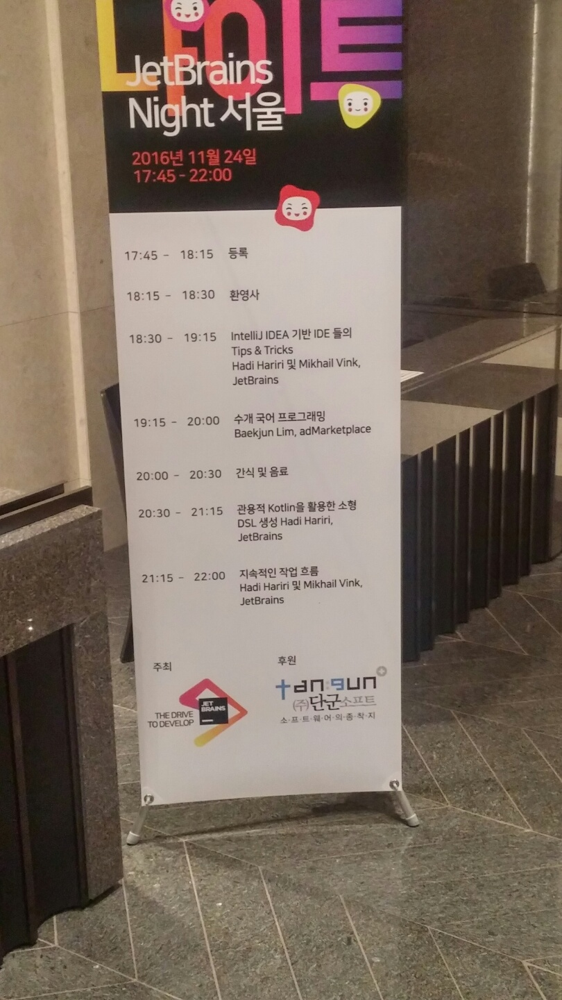
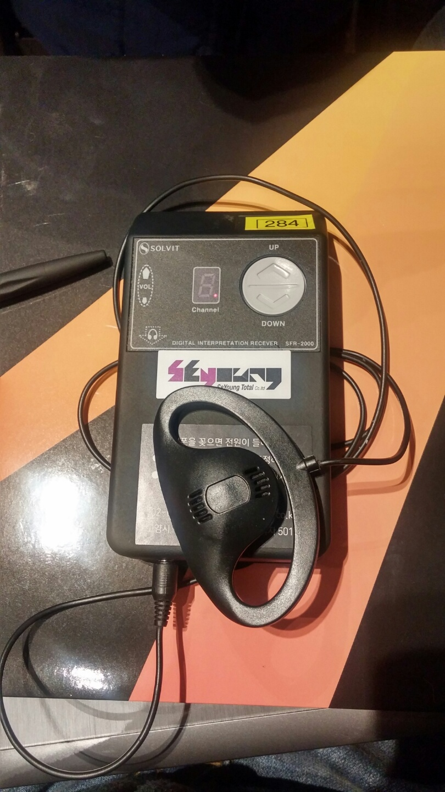
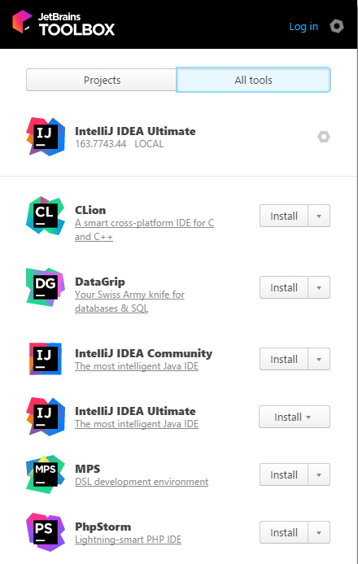
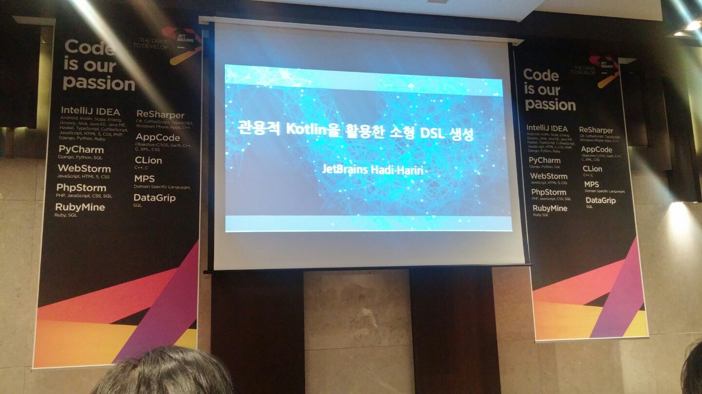

# JetBrains Night 서울 참석 후기!
[JetBrains Night 서울](https://www.jetbrains.com/languages/kr/jetbrains-night-2016/)에 참가하였다! <br/>
(혹시나 다른 세미나 정보도 알고 싶다면 내 [Github](https://github.com/jojoldu/review)를 star 하시거나, [블로그](http://jojoldu.tistory.com/category/%ED%9B%84%EA%B8%B0/%EC%84%B8%EB%AF%B8%EB%82%98)를 feed 받으시면 된다! 꾸준히 세미나 참석하여 후기를 남기고 있다.)<br/>
[페이스북 JetBrains 사용자그룹](https://www.facebook.com/groups/1821879151380372/)에서 일정이 올라온 것을 보고 바로 신청을 하였다.<br/>
zum.com에 합류하고 나서 올해부터는 IntelliJ를 사내 개발 Tool로 열심히 사용중 이였는데 (회사에서 직접 구매해줬다. 1년에 50만원이나 하는...)<br/>
"어떤 기능이 있는지 알아야 더 활용할 수 있을 것 같은데.." 라는 생각과 임백준님의 발표도! 있기에 퇴근후 바로 양재역으로 달려갔다. <br/>



(입구에 들어서면 보이는 간판) <br/>
<br/>


(입구의 관계자분들) <br/>
<br/>

참가자 등록을 하려는데 오오옹??? <br/>
통역기를 주었다!!! 우앙 짱짱



(난생 처음 세미나에서 받아보는 통역기!) <br/>
깜짝 놀랬다. 확실히 기업 제품 세미나라서 그런가? 되게 친절하다는 생각이 들었다. <br/>
영어발표는 영어를 모르는 사람에겐 참 힘든 시간인데 통역기를 준비한다는 것에 새삼 놀라웠다. <br/>
<br/>
이번 후기는 사실 비 JetBrain계열의 제품을 사용하시는 분들에게는 도움이 되지 않을것 같다.<br/>
이클립스, 넷빈즈(아직 사용하시는 분들이 계시는지 모르겠네) 혹은 SublimeText나 Atom 으로 개발하시는 분들까지? <br/>
만약 그렇다면 2번째 챕터인 **임백준님의 발표**만 봐도 무방할것 같다. <br/>
이제 본격적인 후기를 시작하겠다!

## 1. IntelliJ 기반 IDE들의 Tips과 Tricks - Hadi

(발표자 Hadi님!) <br/><br/>
1번째 시간에는 IntelliJ 기반 IDE을 좀 더 스마트하게 사용하는 방법에 대해 이야기하는 시간이였다. <br/>
영어 발표라 울렁증이 도질것 같았지만! <br/>
우리에겐 통역기가 있으니깐^^ 호호 <br/>
자세한 내용을 전부 담을순 없으니 키워드를 보고 검색해서 사용해보시면 될것 같다. <br/>

### Jetbrains Tool Box



* JetBrain 제품들을 관리하는 데스크탑 앱 ([링크](https://www.jetbrains.com/toolbox/app/) 참고)
* IDE들의 힙사이즈 변경와 같은 설정변경을 config파일 수정 없이 할 수 있음
* 각 IDE들의 버전 확인 및 업데이트를 한눈에 보고 할 수 있음

### 단축키


(이 한장으로 모든 것이 설명될듯하다)

* backgrond로 IDE 배경 지정할 수 있음 (투명하게 해서)
  - 스타트업에서 사용하면 간지팡팡
  - [사용하는 방법](https://www.jetbrains.com/help/idea/2016.2/setting-background-image.html)


(이런식으로 background 지정!)

* 파일 혹은 클래스 찾기
  - 검색어 입력시 특수문자에 따라 추가 검색이 가능
  - ```클래스명 : 숫자```로 하면 그 라인으로
  - ```/```로 하면 폴더로
  - ```클래스.변수명``` : 해당 클래스의 변수로

* shift 더블 입력
  - 모든 것을 검색
  - 최근 파일, 르래스, 심볼, preference 등등 모든 것
  - 즉, File -> setiings -> 원하는 설정 역시 한번에 해결할 수 있게 된다.
* 축약어 등록
  - key map에서 검색하여 test rest 찾아 변경해보기

* 파일 탭 사용하지 않기
  - settings의 Editor tabs의 Placement를 none로 변경하여 새 탭 생기지 않도록 변경
  - ctrl+e로 최근파일 검색하는 것을 추천


* view 모드
  - view탭 하단에는 프레젠테이션 모드, 풀 스크린 모드가 있다
  - 용도에 맞게 화면 사용하기


* ideaVim
* 멀티플 커서
* 새파일
  - ctrl+n
  - 꼭 프로젝트 스트럭쳐에 커서가 있어야 할 필요가 없다
* 스마트 컴플릿
  - shift+ctrl+space
* HippieCompletion
* Inject
  - alt+enter -> inject -> json or regex 등등

### code refactoring
* 코드에서 alt+enter -> replace를 통해 일반 코드를 람다식으로 변환할 수 있음
  - 즉, 문법을 배우는데 좋은 교육방법이 될 수 있다.
* 상속을 구성으로 하기
  - refactor를 통해 상속 코드를 **구성** 형태로 변경할 수 있다.

* Analyze
  - Data flow를 통해 데이터 주고 받는 흐름 확인가능


### 디버깅
* new Class level
* 브레이크 포인트 우클릭 후 more
  - 한줄라인을 끊어서 브레이크 가능
  - 브레이크 관련 설정 다 볼 수 있음
* shitf+ctrl+p을 통해 코드별 타입을 확인 가능

### JVM
* memory view
  - count instance를 볼 수 있음

### 플러그인
* rest client을 통해 크롬앱 없이 REST API 테스트 가능

### 생선성 향상
* Help -> productivity guide
  - 생산성 가이드라인을 보며 자주 사용한 단축키 확인
  - 사용하지 않는 단축키들은 어떻게 사용하는지 확인하여 연습

> 꿀팁이 너무 많다!!!! 4개의 챕터 중 가장! 좋았던 시간이다. <br/>
위에 있는 내용들은 꼭 한번 검색해서 본인 IDE에 사용해보길 권장드린다.

## 프로그래밍 언어의 선택 - 임백준
MS tech day에서 했던 폴리글랏 프로그래밍에서 했던 이야기를 다시한번 정리한 시간


(2번째 발표중이신 임백준님!)<br/>

### 폴리글랏 프로그래밍
* 새로운 언어를 1년에 하나씩 학습하며 생각의 환기를 하자
* 새로운 언어를 배우며 새로운 아이디어와 개념을 배우는 것
* 하나의 언어를 깊이 아는 것보다 새로운 언어를 빠르게 학습하는 능력이 중요하다
* 하지만 **다수의 언어를 의미없이 훑는 사람은 랭퀴지 정키**이다.
  - 자기가 잘하는 언어 1~2개를 가지고 있으며 넓히기
* 언어는 결국 도구이다 핵심은 문제를 해결하는 것
* 결국은 자바프로그래머가 아니라 프로그래머가 되어야 한다

### 언어의 백가쟁명
* 시스템 프로그래밍 : go, rust, 모던 C++, 구 C++, C
* 자바스크립트* : 커피스크립트, 타입스크립트, Dart, Scala.js, Elm, 코틀린
  - 특히 요즘 JVM 코드들은 JS 컴파일까지 지원하는 방향으로 가는듯
* 스크립트 : 파이썬, 루비, 그루비, 파워쉘, 배쉬
* CLR - C#, F#, VisualBasic
* OTP - Erlang, Elixir
* 기타등등

### 폴리글랏과 여행
* 여행을 가는 이유는?
  - 결국은 돌아오기 위해
  - 내가 진짜 사용하진 않겠지만, 다른 언어를 해보며 현재 내가 **사용하고 있는 언어에 대해 다시 한번 생각해보는 기회**가 될 수 있음

### 엘릭서


* 문법적으로 루비를 닮은 동적언어
* 얼랭 VM에서 동작
* **동시성과 분산컴퓨팅**에 적함 - 프로세스, 액터, 에이전트
* 코드 핫스왑
  - 내가 돌리고 있는 프로세스 kill없이 끼워넣을 수 있음
* 매크로를 통한 메타프로그래밍 : 나쁜코딩
* 피닉스 프레임워크
  - 루비의 레일즈와 같이 굉장히 생산성이 좋은 웹 프레임워크
* 유닉스의 파이프와 같은 기능

### 에음 Elm
* 하스켈, ML 영향을 받은 정적 타입 체크 함수 언어


(에음의 함수형 코드) <br/>

* 불변
* 지속 데이터 구조
* 모듈 시스템
* **자바스크립트의 대안**
* 떠오르는 테크 스택 : 에음 프론트엔드 + 엘릭서 백엔드
* 아주 순수한 expression 언어
* 시간여행 디버깅
  - 자신이 원하는 때로 디버깅 가능


### 하스켈
* **순수 함수 언어**
* 타입 유추
* 지연
* 현대 함수형 언어들의 맏형

### 이드리스 Idris
* 순수함수언어
* 종속 타입 dependent types
* C언어와의 인터페이스
* 들여쓰기가 문법의 일부
* 타입을 리턴할 수 있음
  - 값만 리턴하는게 아님
  - 타입에 사이즈도 지정할 수도 있음 (List의 길이를 10으로 지정해서 리턴할 수 있음)

### 코틀린 Kotlin
* 정적 타입 언어
* 자바, 스칼라, 그루비, C#의 영향을 받은 간결하고 실전적인 언어
* 안드로이드 개발에서 많이 사용됨
* 자바 바이트코드와 자바스크립트로 컴파일

### 모던 C++
* 람다
* 자동 타입 추론
* 단일 초기화 문법
* 동시성 라이브러리 - 쓰레드, 프라미스, 퓨처

### 마무리
에음을 회사 업무에서 사용하지 못한다고 해도, 에음을 공부하고 그 패턴을 내면화하면 많은 것을 얻게 된다. <br/>
즉, 이런 **새로운 언어를 통해 본인의 주력언어에 대한 안목이 넓어진다.**

## 간식타임
2번째 발표가 끝이나고 간식 타임이 진행되었다. <br/>


(간식을 기다리는 분들)<br/>

별 기대를 안했는데 왜이렇게 줄이 긴거지 싶었는데... <br/>


(과일, 샌드위치, 과자 등등!) <br/>

간식 퀄리티가 으허허허 너무 좋았다! <br/>
내가 좋아하는 메론에 파인애플까지 있어서 3접시는 먹었던것 같다. <br/>
간식때문이라도 다음에 또 와야겠다는 생각이 들 정도였다. <br/>
간식 타임이 지나고 3,4 번째 발표가 진행되었다. 건물 주차장 마감시간으로 인해 3,4 발표는 쉬는시간 없이 이어서 바로 진행되었다.

## 3. 관용적 Kotlin을 활용한 소형 DSL 생성 - Hadi
자바와 스칼라로 어려움을 느꼈던 부분을 해결하기 위해 JetBrains에서 제작한 것이 Kotlin이며, Kotlin에 대한 간략 소개를 한 시간이다.



(Kotlin 발표 역시 Hadi님께서 진행해주셨다.) <br/>

### 함수
* Optional
* 함수형언어처럼 사용 가능


* 아래와 같이 인자지정이 가능하다


### 클래스
* 스칼라와 같은 var, val개념이 존재
  - var : 변수, val : 상수를 나타냄

* 클래스 앞에 ```data class Customer{...}``` 으로 하면 data로 클래스를 바라 볼 수 있음
  - toString을 오버라이딩 할 필요가 없다.


* 확장
  - 느낌이 Javascript의 prototype 같음


### Gradle
* Gradle은 코틀린을 도입하기로 함  
* 그루비도 여전히 쓸수 있지만, Gradle 스크립트가 코틀린으로도 작성할 수 있게 될 예정

### 다른 예
* async/await, yield 등 사용 가능

## 4. 지속적인 작업 흐름 - Hadi
상당히 흥미로운 발표였던 4번째 시간이다. <br/>
이 발표는 JetBrains의 제품소개 시간이였지만, 그 목적이 와닿았다. <br/>
**IDE에서 작업 중 다른 작업창으로 떠나는 것은 결국 작업의 흐름을 끊는 행위**이기 때문에 모든 작업을 IDE에서 할 수 있도록 하는 것이 생산성에 좋다는 것이다.

### JetBrain 제품소개
아래 3개는 10명 이하의 사용자는 공짜이며, **IntelliJ 기반 IDE에서 호환**이 된다.

* TeamCity
  - CI 서버 툴
  - 젠키스와 비슷
  - 빌드 파이프라인을 시각적으로 볼수있음
* Upsource
  - 코드 관리
  - 강화된 검색기능
  - 인텔리J의 코드 인스펙션이 웹 콘솔에서 가능
  - find usages 가 웹 콘솔에서 가능
  - 코멘트를 인텔리제이에서 확인할 수 있음
  - 즉, 코드리뷰를 위해 IDE를 벗어나지 않아도 된다.

* YouTrack
  - 이슈트래커

## 5. 마무리


(경품추천 시간)<br/>
<br/>
JetBrains의 세미나였기 때문에 경품은 모든 제품의 1년 라이센스 5장이였다!!! <br/>
그결과는?


(안될놈은 안돼...)<br/>

그냥 남이 받는걸 구경이나 해야지^^

> 기대했던 것보다 훨씬 즐거운 시간이였다. <br/>
보통 기업 제품관련 세미나는 홍보가 대부분인 경우가 많았는데 이번 세미나의 경우엔 몰랐던 Tool의 꿀팁들 소개도 많았고, 중간 타입에 제품과 무관한 임백준님의 발표가 감초 역할을 톡톡히 해주셨던것 같다. <br/>
그리고 마지막 4번째 시간은 IDE의 목적에 대해 다시한번 상기시켜 준것이 괜찮았던 것 같다. <br/>
난 기존에 SourceTree + IntelliJ를 조합해서 사용중이였는데, 4번째 발표로 IntelliJ에서만 개발을 시도해봐야겠다는 생각이 들정도였다. <br/>
라이센스 놓친것은 너무 아쉽지만!! 잘 보고 온것 같다

**끝!!**   
