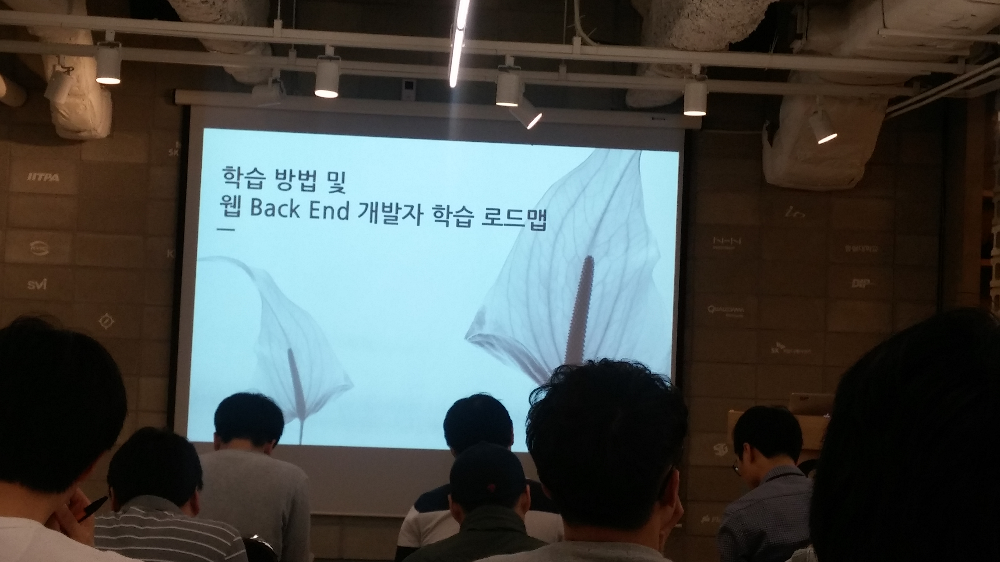
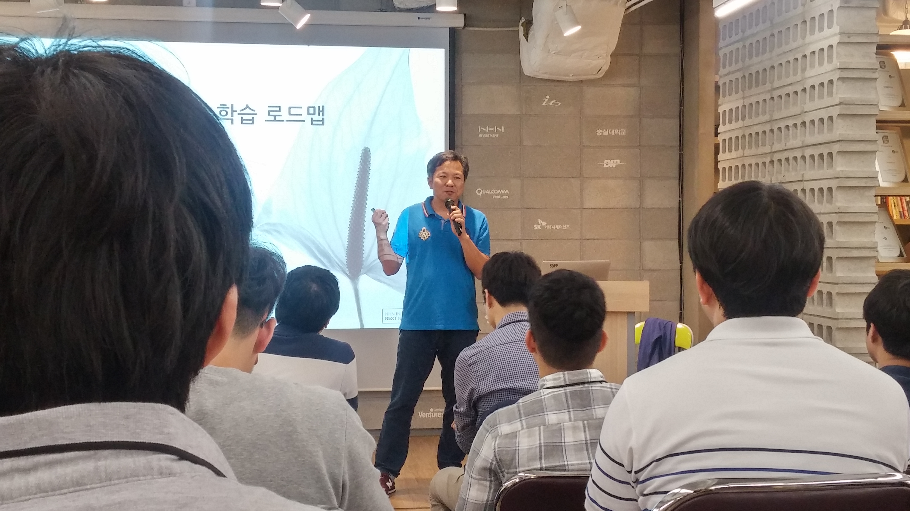

# 학습방법 및 웹 백엔드 개발자 학습 로드맵

[OKKY에서 진행한 10월 세미나](http://okky.kr/article/351776)! 자바지기 박재성님의 백엔드 개발자의 학습 로드맵 세미나에 참석하였다.  
자바지기님과는 [패스트캠퍼스의 인연?](http://www.fastcampus.co.kr/dev_camp_jwp/)으로 항상 발표하실때는 참석해서 좋은 이야기를 들어야겠다고 생각했었는데 빠르게 그 기회가 다시와서 기쁜 마음으로 참석했다  
많은 분들이 아시겠지만 자바지기님은 2012년에 자바 웹 개발자의 학습 로드맵 관련 발표를 해주셨다 ([영상](https://www.youtube.com/watch?v=3mgMwObtaQ0) 참고)  
혹시나 영상을 안보신 분들은 꼭 보시길 바라며, 오늘의 발표 주제는 영상에서 발표한 내용의 다음 이야기와 지속적 학습을 할 수 있는 방법에 대한 이야기이다.
세미나 영상은 아마 곧 유투브에 올라올것 같다! 그전까지는 아래 후기로 아쉬운 마음을 달래면 좋을것 같다

### 소개

(발표를 시작하신 박재성님)

* 커뮤니티로 가자. 온라인 활동도 좋지만 오프라인활동을 해야 큰 도움이 된다.
  - 요즘 많은 오프라인 커뮤니티가 활발하지 않다.
  - 그들은 우리를 기다리고 있다. 
* 4년간 NEXT에서 학생들을 교육중
  - NEXT의 교육과정을 책에 적극 반영하였다. 그래서 친절하진 않다.
  - 다만 고생한만큼 얻는다.
* 비전공자 (농학 전공)
  - 다른 사람의 성공 모델을 그대로 사용하지말자. 본인만의 스타일로 바꿔보자
  - 책에 있는 내용 그대로 받아들이지말고 자신만의 방법으로 진행해보자.

### 프로그래밍을 배우는 것이 어려운 이유는?

* 자신감과 숙련도
  - 따라하기까지는 쉽다.
  - 그러나 실제로 개발해야할때는 자신감이 급락한다.
  - 위 단계가 생각보다 길어 많은 사람이 여기서 포기하게 된다.
  - 그러나 일정시점에 도달하면 프로그래밍에 재미를 느끼게 된다.

* 교재
  - 무수히 많은 초보교재
  - 고수들의 자료도 많지만 중수를 위한 교재는 거의 없다.

* 각 레벨별 알아야할 지식의 범위
  - 초보에서 중수로 넘어가는 시점에서 알아야할 지식의 범위가 폭발적으로 늘어난다.
  - 4년간 기초를 쌓았던 전공자와 달리 기초가 없는 비전공자(전공자지만 공부를 안했던 경우 포함)는 이때 가장 큰 벽을 느끼게 된다.

* 각 단계별 학습 방법
  - 1단계 : 다양한 초보강의를 검토한후 하나를 선택해 학습, 이때는 하나를 선택해 반복하는게 여러강의를 듣는것 보다 낫다
  - 2단계 : 같이 학습할 동료를 찾자. 다른 사람의 코드를 읽자. 작은 코드라도 빌드하면서 디버깅에 대한 두려움을 제거하자.
  - 3단계 : 하나의 목표에 집중. 안드로이드 개발자/자바백엔드개발자 등 하나에 집중하자 이것저것 하는 것은 너무 힘든 시기이다.
    - 교수님 역시 전공자와 비교하지 않고, 프레임워크에 집중해서 습득후 기초의 중요성을 깨닫고 기초를 습득
  - 4단계 : Best Practices를 찾아 연습. 이단계를 극복하기 위한 핵심은 피드백을 받는게 중요하다. 코칭을 해줄 멘토나 동료를 찾는 것이 핵심

### Q & A
* 시간이 얼마나 걸릴까?
  - 직장을 다니는 중이라면 2년정도 걸릴것 같다. 다만 누군가 로드맵을 제시하고 피드백을 줄 수 있는 사람이 있다면 이 기간을 더 줄일 수 있다.

* 잘하고 싶은 것과 현재 회사에서 맡은 일이 다르면 어떻게 하나?
  - 본인이 생각한 커리어와 회사 방향이 다르면 때려칠 수 있는 용기도 필요하다. 근데 이게 모든 상황에서 때려치는게 해결책이 될수는 없으니, 
  그런 상황이라면 회사의 일에 더 집중하자. 요즘은 언어간 장벽이 무너지고 있는 시기라 본인이 Java를 좋아 하는데 Javascript를 잘해야 하는 상황이라면 Javascript를 열심히 하면 Java를 더 잘하게 된다.

* 풀스택 개발자가 되어야 하나?
  - 초반에는 풀스택을 지향하되, 초급에서 중급으로 넘어갈때는 본인만의 한가지 무기를 꼭 가지고 있어야 한다.

* 지속적으로 열정을 끌어내는 방법은?
  - 항상 프로그래밍 책만 보진 않는다. 전공과 전혀 다른 책을 보면서 휴식을 취하고 다시 공부를 한다. 진정한 성장은 회사의 프로젝트와 무관하다.
  본인만의 학습 시간을 확보해서 공부하는 것이 진짜 본인의 성장에 도움이 된다.

* 여러번 이직하셨는데 이직할때 기준은? 한단계 성장한다는 것을 좀더 자세히
  - 경력이 적을때는 내가 성장할 수 있는지를 중요하게 봄. 경력이 쌓이고 나서는 어느정도 돈을 쫓았지만, 삶의 즐거움을 잃어가는걸 알게되서 다시 성장에 초점을 맞춤
  - 현재가 편하기 때문에 거기에 머무르는게 많은데, 불편한걸 해야 성장하는데 그러질 못한다. 익숙하지 않은 패턴을 오히려 더 연습해야 한다. 

### 현재 역량에 깊이를 더하는 방법
* 이펙티브 자바
* 토비의 스프링
* 자바 ORM 표준 JPA 프로그래밍

### 객체지향, 테스트, 리팩토링을 통한 clean code
* 켄트벡의 TDD
  - TDD를 못하더라도 단위테스트라도 작성해보자
* 리팩토링
  - 처음부터 디자인패턴을 공부하진 말자.
  - 쓰레기 코드에 단위테스트를 적용후, 리팩토링을 진행하자
  - 디자인패턴을 공부해도 어디에 쓸지 모르는 경우가 많다.
* clean code
  - 유지보수하기 쉬운 코드를 작성하는 지침들
  - 우리나라 특성이 유지보수를 너무 가볍게 본다
  - 처음부터 새로 만드는 것에만 관심이 있지만, 한 서비스를 스톱없이 10년간 유지하는게 처음부터 새로 만드는것보다 훨씬 더 어렵다
  - 내가 5년, 10년 쓸 코드라는 애정을 가져야만 한다.
  - 서비스 출시에만 신경쓰면 한단계 업그레이드 할수 없다. 쿠팡, 우아한 형제들등 기술부채를 해결하기 위해 많은 고수개발자들을 채용하는것을 생각해보자

### 빌드, 배포, 운영
* 성공으로 이끄는 팀 개발 기술
* 리눅스 커맨드라인 완벽 학습
* 그림으로 배우는 HTTP Network
* 성공과 실패를 결정하는 1%의 네트워크 원리
* 그림으로 공부하는 IT 인프라 구조
* 많은 책을 읽는 것은 중요하지 않다. 한권이라도 제대로 읽는 것이 중요하다. 
* 자신의 스타일에 맞는 책을 찾는 것도 학습의 시작이다. 추천책이 아닌 자신만의 책을 찾자

### 어떻게 학습할 것인가?
* 프로그래밍 학습은 악기 연주 혹은 운동 연습과 같은 방식으로 접근해야 한다
  - 항상 짜릿하게 공부할수는 없다.
  - 즉, 운동처럼 경기가 재밌으려면 **수많은 지루한 연습** 이 있어야만 한다.
  - 회사에서 즐겁게 개발하기 위해서는 많은 지루한 학습 시간이 바탕되어야만 한다.
* 의식적인 연습이 필요하다
  - 내가 약간 불편하다고 생각하는 그 단계를 연습하는 것
  - 혼자서는 이런 편안함을 깨는 것이 어렵다. 함께 해야만 편함을 깰 수 있다.
* 1만시간의 재발견 참고

### 어떻게 학습을 지속할 것인가?
* 어떻게 다음 단계로 넘어갈 수 있을까?
  - 우리는 최소 8시간은 회사에서 일해야 한다.

* 학습에 집중할 수 있는 환경 조성 (1~2년)
  - 술자리 참여하지 않기
  - 애인 만들지 않기
  - 취미 활동 끊기
  - 꾸준히 운동하기(체력이 좋으면 운동도 하지 마라)
  - 이렇게 극단적인 방법을 제시하는 이유는 우리가 학습에 사용할 수 있는 시간이 너무 부족하기 때문이다.
  - 비전공에 기본도 부족한 우리가 시간도 투자하지 않으면 어떻게 따라갈 수 있는가

* 같이 학습할 동료 찾기
  - 역량이 비슷해도 괜찮다.
  - 정말 찾기 힘들면 온라인 커뮤니티를 활용하자

* 피드백을 받을 수 있는 방법을 찾아라.
  - 멘토 역할을 해줄 선배가 있다면 최고
  - 온라인에 자신의 코드를 공유하고 질문해라.

* 의식적인 연습을 지루하고 재미없다. 
  - 스스로 동기부여하고, 인내하는 연습을 해야한다. 
  - 주변사람이 아닌 자기자신에 집중하자.

* 삶을 훌륭하게 가꾸어주는 것은 행복감이 아니라 깊이 빠져드는 몰입이다.

더 많은 사람이 자신의 일을 사랑하고 일 속에서 몰입경험을 함으로써 행복한 삶을 살았으면 좋겠다.

### Q & A 2
* 어떻게 하면 나와 맞는 사람을 만나 스터디를 진행할 수 있을까?
  - 사람을 구하는 방향을 바꾸자. 나보다 잘난 사람보다는 나와 성향이 비슷한 사람을 찾자. 
  - 나와 성향이 맞는 사람을 찾으려면 나를 드러내야 한다. 맞으면 계속 같이 가는거고, 아니면 그만보면 된다. 

* 디자인패턴 vs 리팩토링, 새로 들어오게된 개발자들이 나보다 더 잘할경우 어떻게 해야하나
  - 리팩토링을 끊임없이 하다가 디자인패턴을 보면 더 큰 깨달음을 얻지만, 반대로하게 되면 스트레스만 늘수도 있다.
  - 새로온 친구들의 역량을 흡수하는게 맞고 상향 평준화를 가려고 해야 한다

* 학습방법을 좀 더 극단적으로 가져가는건 어떤지(회사를 때려치우고 공부만)
  - 학생때 공부 잘되던가? 목표가 없는 경우 잘 안된다. 
  - 회사의 문제를 내가 학습한걸 바탕으로 해결할 경우 더욱 열의를 가질 수 있다.
  - 혼자서 1년을 공부하는건 열정을 이끌어가는것이 정말 어렵다. 매일 정해진 시간에 학습동료들을 만나 시간을 투자하는게 좋을수도 있다.

* 리팩토링 노하우
  - 글쓰기를 잘하는 것과 비슷하다. 1차적으로는 좋은 글을 많이 보듯이 좋은 코드를 많이보자
  - 지루하겠지만 똑같은 코드를 반복적으로 개발해보자. 단, 설계를 계속해서 변경해보자.
  - 그러려면 그 밑바탕에 테스트 코드가 있어야 한다.
  - 리팩토링은 결과는 같은데 코드가 다른거다. 즉, 테스트코드가 받침이 되어야 한다.

* 맥을 쓰면 진짜 효율이 좋아지는지?
  - 터미널 환경에 익숙해지기 위해서이다. 백엔드 개발자라면 어쩔수없이 UI보다는 터미널에 익숙해야하는데, 윈도우는 터미널 친화적이지 않다.
  - 허세로 맥북을 쓰는게 아닌, 뭐든 터미널로 작업을 할 수 있기 때문에 백엔드 개발자라면 맥북을 쓰는게 실력향상에 도움이 된다.

### 후기
> 오늘 세미나에서 가장 와닿았던 것은 "프로그래밍이 운동처럼 경기가 재밌으려면 **수많은 지루한 연습** 이 있어야만 한다."는 것이었다.  
대학생 시절에 잘하진 못했지만 농구 동아리 활동을 했었다 (운동신경이 워낙 없어서 연습만 참여하는 수준이였다)  
그때는 점프슛을 잘하고 싶어서 매일 아침마다 수업시간전까지 연습했었다. 
재미는 하나도 없었다. 혼자 공던지고 주워와서 다시 던지고 줍고. 그걸 1~2시간씩 매일 반복하는게 재미 있을리가.... 
근데 어느순간 대회에서 연속으로 점프슛을 성공시켜 결승까지 가게 되었다. 그때부터는 연습이 너무 재밌었다.  
만약에 점프슛은 잘하고 싶지만 연습은 재미없어서 **경기만 죽어라 나갔으면 과연 점프슛 실력이 늘었을까?**  
 
개인 개발을 하지 않고, 회사에서 일만 하는게 그런것 같다.  
연습은 하지 않고 경기만 하는것.  
점프슛을 잘하고 싶으면 경기에 나가지 않는 시간에 **점프슛만** 연습하듯이  
프로그래밍도 Java를 잘하고 싶으면 순수 Java만으로 반복적으로 코드를 작성해보고,  
vi에디터를 잘하고 싶으면 vi에디터만으로 계속 사용해보는게 실력을 진짜 늘릴수 있는 방법인것 같다  
 
믿고 보는 자바지기님의 세미나였다.  
JSCON에 이어 좋은 세미나를 개최해주신 OKKY의 운영진분들께 정말 감사를 드리고 싶다.