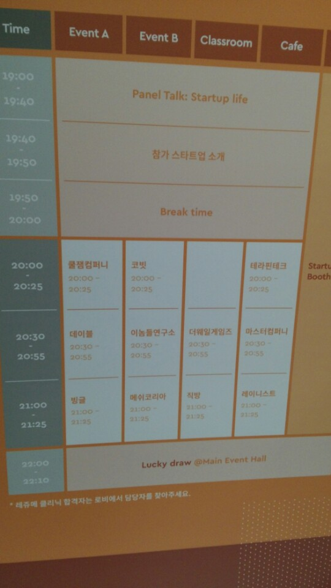
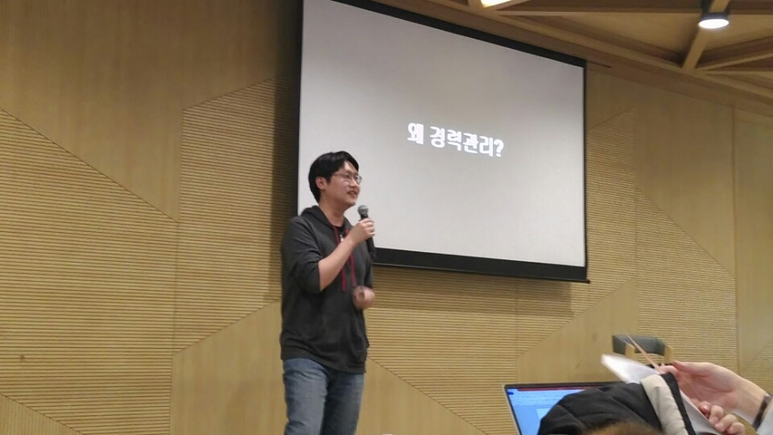
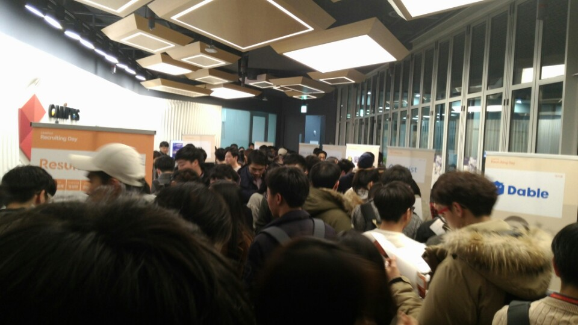
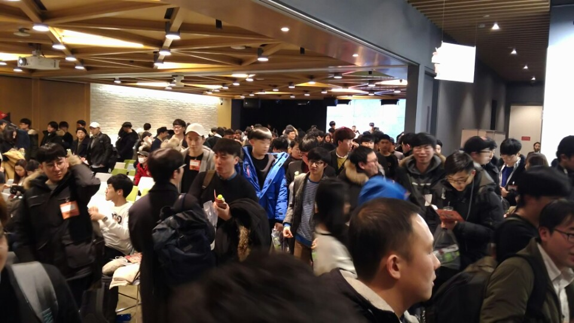
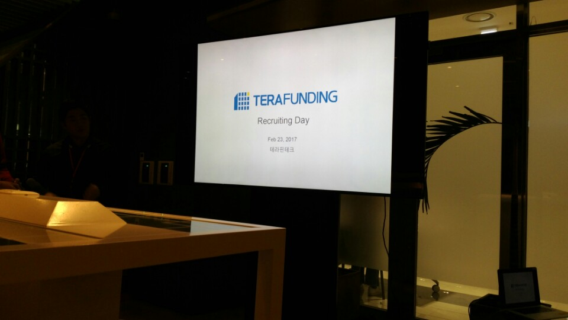
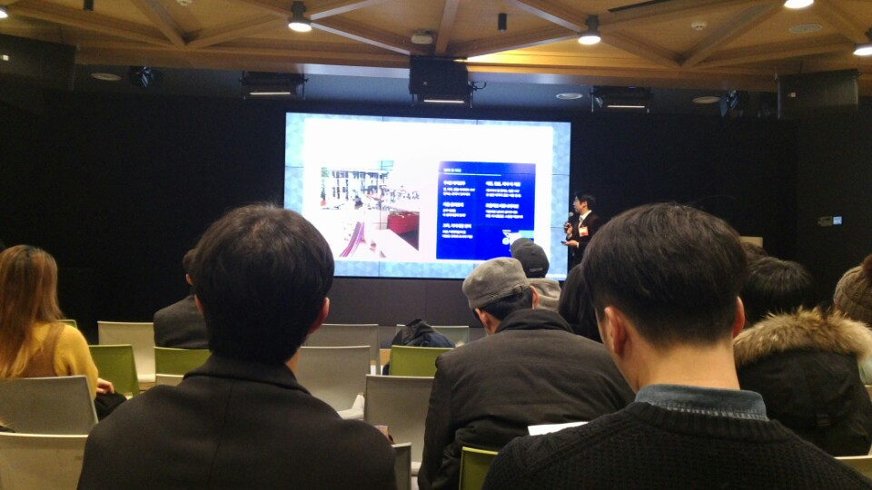
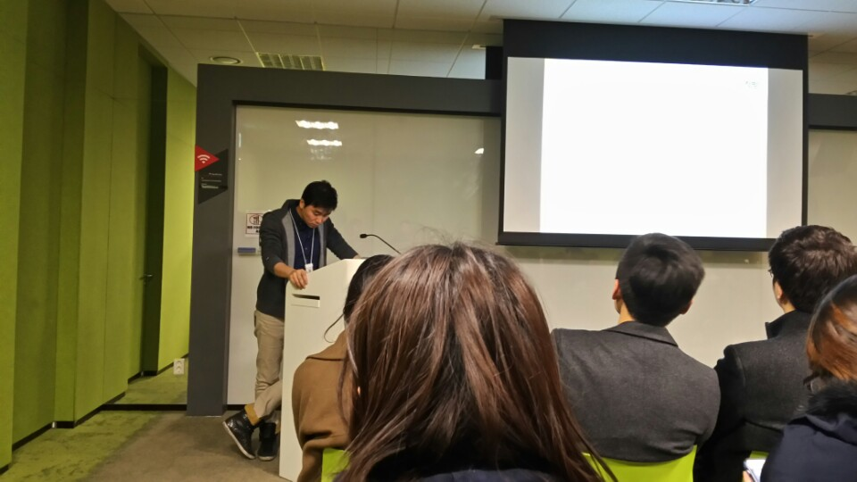

# 구글캠퍼스X원티드 캠퍼스 리쿠르팅 2017년 첫번째 참석후기
드디어 구글캠퍼스와 원티드가 함께하는 캠퍼스 리쿠르팅에 다시 한번 참석할 수 있게 되었습니다!  
작년에 1번 참석한 후([작년 후기](http://jojoldu.tistory.com/22)), 너무 좋은 시간이였던 기억이 있어 올해도 꼭 한번 더 참석해야지라고 생각했는데 정말 빠르게 기회가 와서 참석할 수 있게 되었습니다.  
자세한 행사 내용은 [링크](https://www.wanted.co.kr/campusrecruit)를 참고하시면 될것 같습니다.  

오늘은 사내의 수석님도 함께! 행사에 참가하셔서 (저와 입장은 많이 다르시지만^^;) 동행 할 수 있었습니다.  
좋은 얘기를 듣는데 정신없어서 수석님과 사진한번 못찍은 것이 아쉽네요 ㅠㅠ  
행사 시간표는 아래와 같습니다.  

작년 행사때와 전부 다른 회사들이 참여한걸 보면 많은 회사들이 개발자를 구인하기 위해 여러 방법을 시도중인것을 알 수 있겠죠?  
(개인적으로 정말 많은 IT회사들이 x코리아, 사람x 같은 범용적인 채용 사이트에 올린 것만으로 채용 시도를 끝내지 않았으면 합니다. **발로 뛰면서 개발자를 구하려고 하는 곳이 이렇게 많습니다.**)  

그럼 이제 본격적으로 행사 내용 시작하겠습니다!  

### 양찬석님의 커리어 토크

(구글 코리아에서 개발자로 활동하시는 양찬석님의 발표 시간)  

아마 많은 분들이 스타트업의 발표도 있지만 구글코리아에 재직중이신 개발자분의 커리어 관리 이야기는 어떤걸까 라는 생각에 오셨을것 같습니다.  

* 12년차 경력이 되었는데, 애기가 취업을 할때까지 **20년은 더 일을 해야하는데** 어떻게 준비해야하나라는 생각이 들었음

* IT인은 평균 **8번의 이직**을 한다.
   - 링크드인의 자료를 보아도 최근 졸업한 학생들은 **5년간 평균 3번의 이직**을 하게 된다는 결과가 나옴
   - 즉, 이 추세로 보면 내가 30년간 경력을 이어간다고 가정하면 대략 10번은 이직하게 될것 같다.
   - 앞으로 계속해서 회사를 옮기기 위해서, 경력관리가 필요하다
* 어떻게 하면 이직을 잘할까
   - 내가 가고 싶은 곳이 있는데 마침 거기서 나를 필요로 할때??
   - 내가 가고 싶은 곳은 많다.
   - 결국은 **남들이 나를 필요로 하도록** 나를 키우는 것
* 애니메이션 모아나
   - 할머니는 왜 미친짓을 하냐는 모아나의 질문에 마을에 미친여자 역할이 나라는 할머니의 대답.
   - 즉, **남이 바라보는 일이 아닌 내가 생각하는 나의 일이 중요**
   - 내가 할 말이 있는게 아니라, 니가 듣고 싶은 말이 있는게 아니니 라는 할머니의 말처럼 이직을 결심하게 되면 개발자는 자기가 듣고 싶은 말만 들으려고 한다.
   - 모아나에겐 배가 있었지만 개발자는 무엇을 준비해야할까
* 개발자가 준비해야할 것
   - 실력
     - 개발하는 것을 즐기는 사람이 너무 많다.
     - 그런 분들을 따라가는건 너무 어렵다.
     - 대신 본인이 그런 사람이 아니라면 **그런 사람이 닦은 길을 잘 따라가자**
     - 즉, **커뮤니티 활동을 열심히 해서 그런 분들을 만나고 배우자.**
   - Github & Stackoverflow의 코드를 쓰더라도 왜 그렇게 됐는지는 꼭 고민해보자
   - 이력서의 상태 점검
     - 블로그
     - 개인프로젝트
     - 오픈소스 활동
   - 영어
     - 영어는 절대 버릴수는 없다.
     - 개발자의 제 2의 언어는 영어라는 점을 잊지말자.
   - 운
     - 운은 때로 결정적인 역할을 한다.
     - 운 앞에서 겸손하자. 내가 어쩔수없다. 속상해봐야 별 수 없다.
   - 인맥
     - 인맥 = 태도
     - 적어도 최소한 나는 내친구에게 같이 일하고 싶은 사람이어야만 한다.

(개인적으로 가장 마음에 들었던 PPT 슬라이드)  

* 앞으로 일할 날이 너무 많이 남았다. **이직을 몇번이나 더 할지 모른다**는 점을 잊지말자.

### Q & A
* 왜 8번이나 이직을 해야하는지
   - 한 회사에 오래있다면 같은 일을 반복하는 순간이 오게 된다.
   - 그 순간이 오면 무섭다. 발전이 없다는걸 느끼게 된다.
   - 내가 **계속해서 성장하고 있다는걸** 느끼고 싶었다.
* 통계자료에서 나온 높은 이직율의 이유는?
   - 기술이 너무 빨리 발전하는것 같다.
   - 내가 기존에 해오던 것의 가치가 너무 빨리 사라지는것 같다.
   - 많은 개발자들이 위기감을 느껴서 자주 이직하는것 같다.

아무래도 듣는 분들의 입장에서는 커리어 관리보다는 **살면서 저렇게 많은 이직을 한다**는 사실에 놀라워하셨던것 같습니다.  
평균 8~10회의 이직이라고 하면 3년에 1번씩 이직하게 된다는 것인데 주변을 둘러보면 거의 맞는말 같습니다.  
한 회사에 5년 10년 근무하신 분들을 보기가 참 어려운 시긴인것 같다는 생각을 다시 한번 하게 되었습니다.  
당장 이직을 하는것이 아니라도 언제든지 이직을 할 수 있도록 평소에 준비가 되어있어야겠죠?  

양찬석님의 발표가 끝나고 본격적으로 스타트업들의 발표시간이 이어졌습니다.  

  

  

쉬는시간 행사장의 모습인데 정말 발디딜틈 없이 많은 분들이 참석하셨습니다.  
혹시나 이번에 못오신 분들은 다음에는 꼭 오셔서 들으시면 좋을것 같습니다^^     
저는 테라펀딩 -> Dable -> 직방 순으로 참석을 하였습니다.  

### 테라펀딩

  

(Luna폰 화질이 별로네요 ㅠㅠㅠ G3가 훨씬 더 좋은듯..)  

건축주와 투자자들을 연결해주는 부동산 P2P 금융 플랫폼  
누적투자액 950억 돌파 - 현재 업계 1위  

* 비전
  - 현재 : 사용자에게 빠르고 안전한 기술기반의 부동산 P2P 금융 플랫폼
  - 미래 : 부동산 개발에 필요한 모든 서비스를 제공하는 플랫폼
* 문화
  - 업력은 낮지만 다들 높은 경력자들로 구성
  - 금융 상품을 다루는 곳이기에 프로세스를 갖추기 위해 많은 노력중
  - 주로 모듈별로 활동하고 전체 회의 최소화
  - 책임근무제
  - 성과에 따른 보상 (연차 고려 x)
* 채용
  - 담당업무 : 운영시스템 개발, 은행등 외부연계 API 개발, 빅데이터 분석 및 관련시스템 개발
  - 자격요건
    - .NET/Java 중급이상의 개발자
    - Oracle, Mysql, Ajax, Jquery
    - 빅데이터 관련 시스템 구축 경험자
    - 새로운 시도에 열정이 있으신 분
  - 우대조건
    - 스타트업 창업 및 근무 경험자 (꼭 경험이 없더라도, 스타트업의 문화를 이해할 수 있는 분)
    - cloud 환경에 대한 이해가 있는 분
* 개발환경
   - .NET, Python, Javascript, Mysql
   - Sketch & Zeplin
   - Visual Studio, SVN, Trello, Slack
* 앞으로 할 일들
   - 빅데이터를 활용한 부동산 평가 예측 시스템
   - 플랫폼 고도화
   - 테라펀딩 모바일 앱
   - AI기반의 건축설계 자동화
   - 스마트홈 시스템 관련 인프라 구축
* Q & A
   - 경력자만 뽑는지?
      - 신입/경력 구별없이 채용중이다.
      - 개발자 3분정도를 더 채용할 예정이다.
   - 개인적으로 선호하는 인재?
      - 커뮤니케이션이 가장 중요

### Dable

  

개인화 추천 알고리즘 솔루션 제공  
**개인화 추천 기술은 국내 최고**라고 생각  
앞으로는 컨텐츠 마케팅 플랫폼으로서 나갈 예정  

* 장점
    - 포스텍 수석 졸업, 네이버, NC소프트, SK플래닛, 구글 출신의 경력 10년차 이상들로 이루어진 **국내 최고 수준의 개발자 멤버**들로 구성
    - 월 1.4억 사용자, 200여개 언론사의 하루 120만 컨텐츠를 다루는 **국내 최대 데이터**를 다룰 수 있는 기업
* 환경
   - 주 1회 재택근무
   - 자율 출퇴근제
   - 아침, 점심, 저녁비 지원
   - 교육, 자기개발비 지원  
* 채용 포지션
   - 안드로이드 앱 SDK 개발
   - 데이터분석
   - 프론트엔드
* 채용 과정
   - 온라인 코딩 테스트 진행 (30분간 약 2~3문제)

* Q & A
   - 프론트엔드 기술 스택
     - nodejs, express
     - 프론트 엔드라고 해서 화면만 하는게 아닌 웹 서버부터 시작해 웹 전체를 담당하게 됨
     - 지금 당장의 기술스택은 그렇게 중요하지 않고, 코딩 센스에 관심이 많다. 기술스택은 계속 변경될 수 있다.
   - 백엔드 프론트엔드 모두 코딩테스트 진행
   - 서류 필터링의 기준은?
     - 개발자들이 필터링 한다.
     - **경력은 별로 중요하지 않고**, 오픈소스에 기여했다던지 어떤 언어의 커뮤니티에 기여를 한적이 있다는지 등
     - 여태 어떻게 성장해왔는지에 관심 많음
   - 지금까지 신입을 뽑은적은 없는지?
     - 최근에 주니어 2명을 뽑았다.
     - 모든 일을 시니어가 할 수가 없으니 점점 더 주니어를 채용해갈 예정이다.
   - 채용 규모?
     - 이번 채용은 1명을 예정중인데, 괜찮은 분들이 많다면 **TO 관계 없이** 뽑을 예정

### 직방

(개인적으로 가장 채용행사에 공을 많이 들였던 느낌이 들었던 직방입니다.)   

보통은 이런 행사에 오시는 분들 대부분이 저 회사가 날 뽑을까에 집중하게 되는데, 반대로 오히려 내가 저기서 **잘 다닐 수 있을까의 관점**으로 봐주셨으면 좋겠다.  
* 직방에 다니고 있을 때 본인의 몸값을 최대한 올렸으면 좋겠다.
   - 직방의 많은 분들이 여러 곳에서 인정 받기를 바라고 있다.
   - 반대로 우리는 그런 분들이 안떠나시도록 더 노력하려고 한다.
   - 항상 성장을 강조
* 현재 25명의 개발자를 70명이상으로 만들고 싶다.
* 기술 스택
   - 프론트엔드 : AMP, PWA, Angular2, SVG
   - 백엔드 : Pass, Nodejs, C#
   - 안드로이드 : Kotlin, Realm, Rx, VR
   - IOS : swift, Realm, POP, Rx
* 위 기술을 잘하고 있지 않다. 그럼에도 사용하는 이유는 **우리가 성장하기 위해서**다.
   - 개인이 **여가시간을 내서 공부하는 것으로는 한계가 있다**.
   - 회사에서 적용해보지 않은 기술은 실력이 되지 않는다는 생각으로 실제 업무에 도입하고 있다.
   - 항상 신입/주니어 개발자들에게 하는 이야기가, 대기업을 가고 싶다면 스펙을 쌓고 우리와 같은 스타트업에 근무하고 싶다면 위에 나열한 기술들처럼 **기술에 중심**을 두라는 이야기를 한다.
* 복지
   - 최대 2주까지 휴가 및 항공비 최대 100만원 지원
   - 개발만 잘하는 사람보다는 운동,독서,여행 등 풍요로운 삶을 사는 개발자를 선호한다.
   - **풍요로운 삶의 일부가 직방에서의 일**이 되길 바람
   - 1주일에 2번씩 개발자들간 지식공유
* 성장
   - 정말 많은 회사가 망하기 때문에 이직할 때 그 회사가 망하지 않을지, 계속 성장할지를 봐야한다.
   - 현재 직방은 누적앱 다운로드 1800만이며 계속 성장중이다.
   - 회사 망할것 같으면 얼른 옮겨라. 의리에 남지말라.

### 후기
3개 회사 모두 발표에 공을 들였고, 긴장하신 모습을 볼 수 있었지만 그래도 그 중 직방의 발표가 가장 기억에 남았습니다.  
회사의 채용 발표보다는 **선배 개발자분의 이야기**와 같은 느낌으로 진행을 하시는데 정말 성장을 바라고 함께 공부하는 것을 즐기시는 분들은 발표를 보시고 다들 지원하시지 않을까라는 생각이 들정도였습니다.
그리고 놀라웠던 것은 모든 발표가 끝난 후 네트워킹 자리에서 정말 열정적인 분들을 뵙게 된 것입니다.  
이 이야기는 따로 정리를 할 계획인데, 덕분에 **에너지 충전 100%**하고 집에 돌아갈 수 있었습니다.  
모쪼록 이런 행사가 지속적으로 이루어져서 선순환 구조가 계속 이루어졌으면 하는 바램입니다.    
긴글 끝까지 읽어주셔서 감사합니다!!
