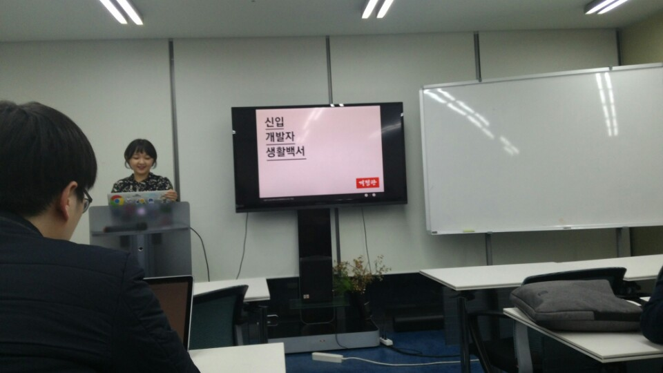
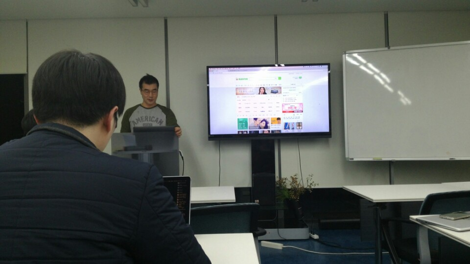
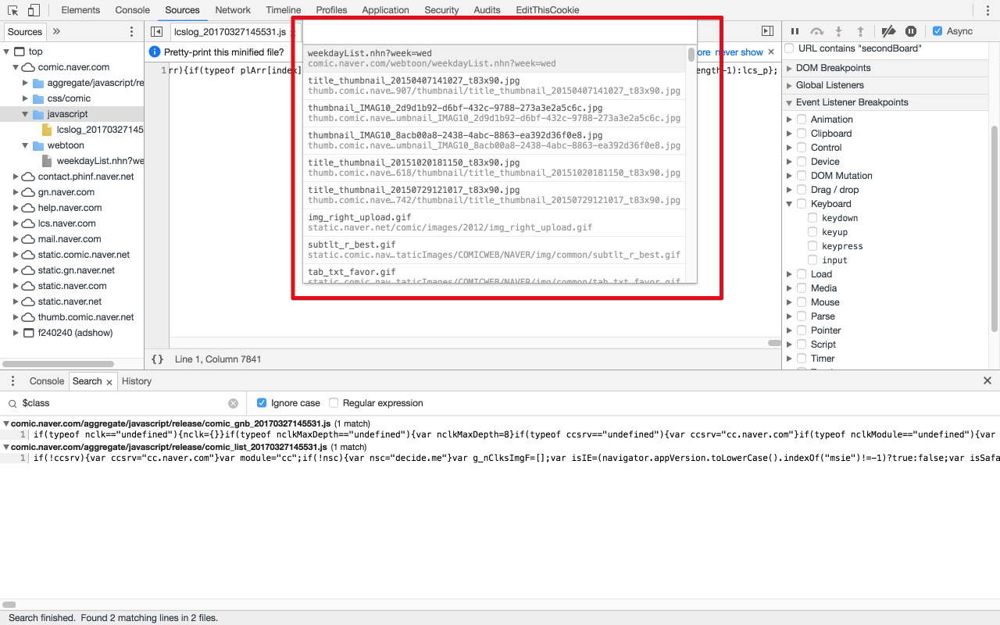
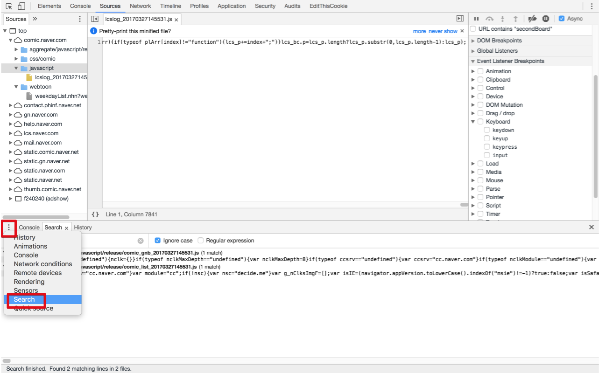
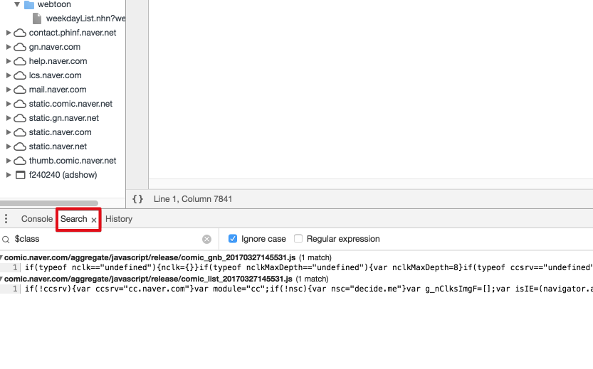
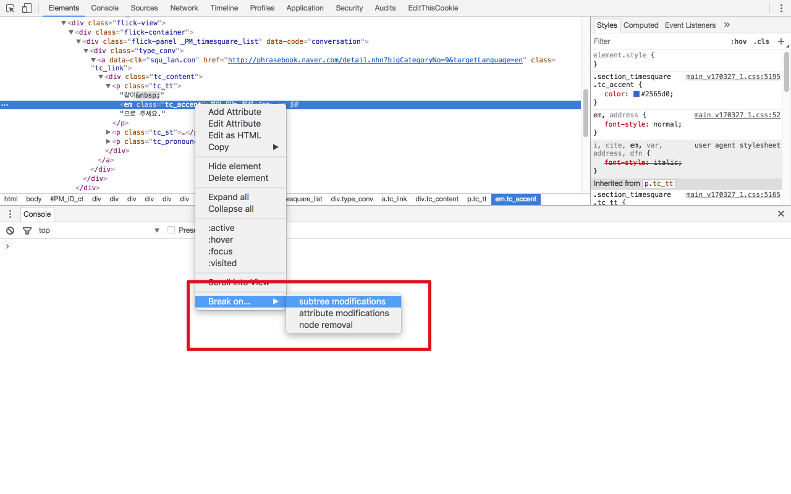
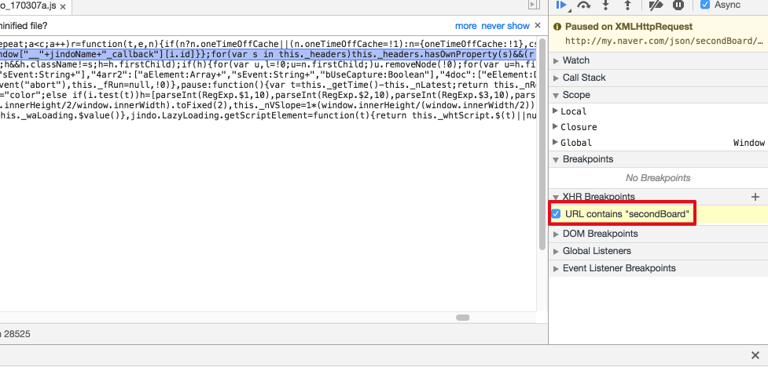
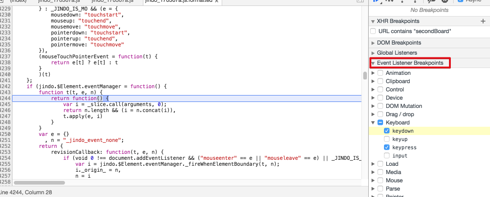
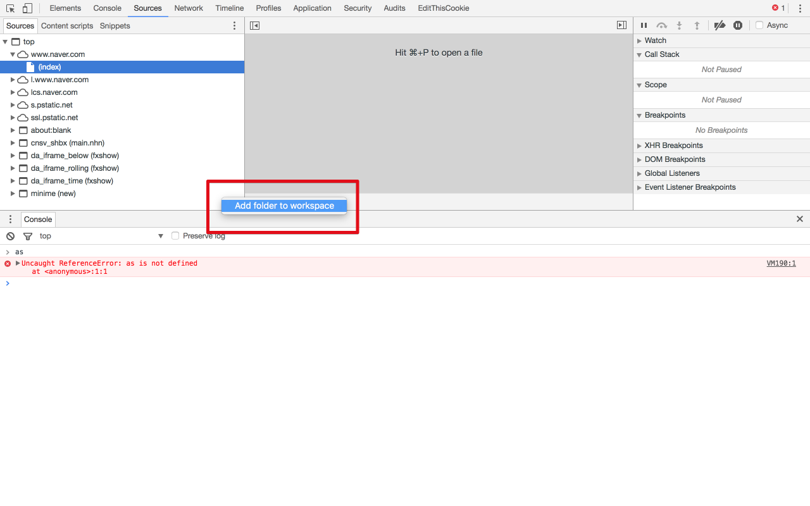

# 마스터즈 오픈 세미나 3회
프리미엄 프로그래밍 교육 센터인 [코드스쿼드](http://codesquad.kr/)에서 진행하는 마스터즈 오픈 세미나에 다녀왔습니다.  
(공부한 내용을 정리하는 [Github](https://github.com/jojoldu/blog-code)와 세미나+책 후기를 정리하는 [Github](https://github.com/jojoldu/review), 이 모든 내용을 담고 있는 [블로그](http://jojoldu.tistory.com/)가 있습니다. )<br/>
<br/>
이번 세미나는 진유림님께서 신입 개발자에 대한 이야기를, 윤지수님께서 크롬 개발자도구로 하는 프론트엔드 디버깅에 대해 이야기해주셨습니다.  
이외에도 꾸준하게 개발 관련 이야기를 계속 해주신다고 하시니 오픈 될때마다 관심있으신 분들은 참석하시길 바랍니다.  

## 신입개발자 생활백서 - 진유림



[발표자료](https://www.slideshare.net/jayjin0427/ss-71896768)

### 퍼스널 코딩
* 왜 N년이나 개발공부를 하시나요?
  * 꿈이 있다고 코딩을 잘하는건 아니다
  * NHN NEXT에서 나만의 꿈을 이뤄보자!
  * but 2번의 연속 학사경고
  * 자바, C, 파이썬 다 마음에 안맞았지만, 프론트 엔드를 만나게 됨
  * HTML/CSS는 재밌는데?
  * 내가 만든 화면에 이벤트를 추가하려면 Javascript가 필요하네? -> Javascript 개발 시작
  * 프론트 엔드를 하다가 서버 작업이 필요할때마다 백엔드 개발자의 도움이 필요하니 답답함을 느낌 -> 백엔드를 시작하자, 단 파이썬 & 장고로 시작하자
  * angular로 진행하다보니 모듈화가 너무 안되서 react를 진행
  * 즉, 나는 XX 코딩을 할때는 너무 지겨운데 YY 코딩할땐 너무 재밌다. 여기서 YY를 우린 찾아야 한다. 

### MOOC
* code school
* Django Girls
  * 따라만 가면 나만의 블로그를 만들고 배포까지 경험할 수 있음 
  * 여성 개발자를 위한 오픈라인 워크샵이 있음
* Udacity
  * 한달에 $200 
  * Nano degree : 아마존/구글과 같은 외국계 기업이 인정해줌
  * 5개월 과정인데 끝까지 수강하면 50% 페이백
* Khan Academy
  * 초심자 최고의 강의
  * 웹 개발자를 시작했을때도 알고리즘이 난 필요없구나라고 잠깐 생각 -> 시간이 흘러 난 알고리즘이 부족해서 이 함수를 못짜겠어 라는 깨달음을 얻게되서 시작
* Code Wars
  * 내가 문제를 맞추면 다른 개발자들이 짠 코드를 볼 수 있는데, 이때 **1등의 코드를 보는 것**이 백미

### TIL, 블로그
* TIL
  * 알게된 것은 하나도 빠짐없이 적는다.
  * 프로젝트 전체 검색으로 검색이 용이 => 나만의 위키
  * 깃헙에 같이 올리기 때문에 포트폴리오 가능
  * 마크다운을 꼭 배우자
* 블로그
  * 블로그 메인 화면은 꼭 1페이지로 된 포트폴리오로 구성할 것 (구직중, 관심기술, 경력 등등)

### 소셜코딩(Github)
* 필수 of the 필수 of the 필수
* 일일커밋
  * 회사일 말고는 거의 하지 않는 것을 깨닫고 시작
  * 커밋로그를 명확히 작성
  * 배운 것은 꼭 기록한다.
  * **면접관은 무조건 깃헙 주소를 요청**한다.
* 면접에서의 깃헙
  * 어떤 저장소에 star를 찍었는지 fork를 했는지 본다.
  * 코딩스타일, 컨벤션을 꼭 본다
  * 저장소에서 **DB아이디/암호를 함께 올리면 감점**
  * 이메일을 **네이버로 하면 감점**

### 오픈소스 기여
* 첫번째 오픈소스기여
  * JUI의 오타 수정
  * 간단한 수정이라도 결국 내가 기여한 프로젝트로 저장됨
* rankdein.kr

### 커뮤니티 활동
* 이상한 모임
  * 가장 활발한 커뮤니티
* 모각코
  * MS 개발자분들 다수 포진
* 파이썬 모임
  * 파이조그
  * 파이레이디스
  * 장고걸스
* GDG
* 9XD
  * 매월 밋업 (회사투어,세미나,네트워킹)
  * 또래 개발자들의 이야기를 통해 토이프로젝트를 지속할 수 있는 힘을 얻음

### 만들자
* 면접에서 100% 나오는 질문 : 무엇을 만들어 보셨나요?
  * 뭐가 됐든 **링크 하나**로 공유할 수 있게 만드는 것이 중요
  * 깃헙/유튜브/블로그 등으로

### 해커톤
* 혼자하기 힘들면 함께 만들자
* GS SHOP 해커톤, 제주해커톤 등등 
* 개인프로젝트는 끝이 안맺어지는 반면, 해커톤은 확실한 목표가 있어 마무리 할 수가 잇음
* YOP
  * 대회에 나가지 않아도 해커톤을 할 수 있구나! + 출시의 기쁨

### 스타트업 인턴
* 나는 무엇이 중요한지 꼭 생각해보기
  * 회사의 비전, 경영진의 비전, 연봉, 동료, 유명세, **지금의 내가** 이 회사에서 얼마나 성장할 수 있는지
  * 지금은 성장하더라도 내년에도 성장할 수 있는지가 중요하기 때문에, 기준은 항상 현재의 나

### 개발자라는 직업
* 어떤 회사를 선호나는지 생각하기
  * 자체제품 vs 다른회사가 요구한 제품
  * 주력제품이 소프트웨어 vs 아니다
  * 개발자이면서 다른 직업도 있음 : 에반젤리스트

### Q & A
* 혼자서 효율적으로 개발할 수 있는 방법은?
  * 루틴을 정하는 것이 좋다
  * 하루 1번씩 알고리즘 문제를 푼다 혹은 코딩을 한다 등
  * 지인의 경우 요일마다 공부하는 주제를 바꿔서 하기도 한다.
* 프론트엔드 개발자로 디자인 센스를 키우는 방법은?
  * 많이 해보는 수 밖에 없다.
  * 따로 책을 보지는 않았는데 발전할 수 있었던 건 그래도 계속해서 만들어봤기 때문인것 같다.

## 크롬 디버깅 - 윤지수



이번 발표는 화면 촬영을 진행하였습니다.  
조만간 해당 영상이 업로드 될것 같습니다.   
꼭 영상을 보시길 바랍니다.  

* 개발자도구 없던 시절에는 alert으로 확인
* 크롬 카나리
  * 크롬에서 시범적으로 하는 기능들이 적용되어있음
  * stable이 아니라서 불안정함
* ```console.log("%c안녕하세요", "font-size:10rem");```
* 마지막 선택한 dom element 요소는 console 창에서 $0으로 찾을 수 있음
  * 바로 전전은 $1
  * 즉, dom 히스토리를 $숫자로 할 수 있음

### 검색

* ```command+p``` : 파일 찾기
  * IDE에 있는 파일찾기와 동일 기능



* ```option+command+f``` 를 누르면 전체 코드 탐색
  * **제 PC는 안되네요 단축키가 ㅠ**
  * 단축키가 안되시는 분들은 아래이미지처럼 버튼으로 오픈하시면 됩니다.



console panel 좌측에 있는 설정버튼을 클릭해서 search panel을 open



search 입력창에 원하는 텍스트를 입력하면 전체 탐색한다.  
(IDE의 ```command+shift+f```와 같은 전체탐색과 동일)

### breaking

* source 탭에서 우측 상단 async 체크를 하게 되면 비동기도 동기와 함께 스택관리가 가능

* dom breaking : 구조가 변경되면 브레이킹을 걸 수 있음



* xhr breaking : source 탭에서 XHR에 url을 추가하면 해당 url로 Ajax 요청시 자동 브레이크 된다.



* event listener breaking : event 발생 시점을 브레이킹 된다.



### 성능측정
* Audits 탭
  * Run 버튼 누르면 시작
  * 로딩이 될때 문제가 되는 내용을 측정해줌
* timeline / performance 탭
  * 구간(시간)별 화면이 보임
  * javascript 콜 스택을 확인할 수 있음
* ```console.time("key")```, ```console.timeEnd("key")```로 하면 이 사이에 수행된 시간이 측정됨
  * [API 참고](https://developers.google.com/web/tools/chrome-devtools/console/console-reference?hl=ko#time)

### Source Tab
* source tab 내에서 코드 수정 가능
  * resource 리스트에서 우클릭 -> Add folder to workspace 클릭
  * 로컬에서 파일 부를수가 있음
  * 즉, 부른 파일을 변경하면 로컬파일도 같이 변경
  * css 수정시 굉장히 효율적



## 후기
예전에 박재성님의 패스트캠퍼스 자바 강좌를 듣고나서 NHN NEXT 교수님들의 강의에 대해선 무한신뢰를 하게 되었습니다.  
이번 세미나 역시 그런 제 기대를 충족시킬 수 있었던 시간이였습니다.  
돈이 좀 들더라도, 난 진짜 제대로된 교육과 멘토링을 받고 싶다면 코드스쿼드를 찾으시면 될것 같습니다.  
각 분야의 마스터 분들께서 해주시는 노하우를 직접 다 뽑아낼 수 있는 기회가 그렇게 많지 않을것 같습니다.  
다음에도 좋은 세미나가 있으면 많이 배우고 오겠습니다.  
감사합니다!