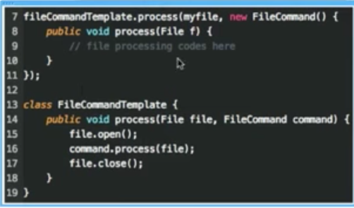

# 백명석님의 클린코더스 영상

[백명석님의 클린코더스](https://www.youtube.com/playlist?list=PLuLb6MC4SOvXCRePHrb4e-EYadjZ9KHyH)를 보면서 내용을 정리하는 페이지입니다.
(공부한 내용을 정리하는 [Github](https://github.com/jojoldu/blog-code)와 세미나+책 후기를 정리하는 [Github](https://github.com/jojoldu/review), 이 모든 내용을 담고 있는 [블로그](http://jojoldu.tistory.com/)가 있습니다. )  

### 1. OOP

* ArticleService : 객체를 데이터로 보기 때문에 이런 서비스가 만들어진다. **기능으로 봐야한다**. 즉, WriteArticleService 등이 되어야만 한다.
* 다른 객체가 갖고 있는 값을 내가 보고, 판단하는 행위는 지양한다. 그냥 그 객체에게 물어보는것이 낫다 (```member.isExpired()```처럼)
* 인터페이스를 사용해야 하는 이유
  * 변경이 안되는 일은 절대 없다 (구현체가 지금은 1개이지만, 2개가 안된다고 절대확신 가능한가?)
  * 테스트 하기가 쉽다
  * 부가기능 추가하기가 쉽다


* 팩토리메소드를 사용하면 구현체가 변경되어도 팩토리 코드만 변경되면 된다.
  * 최근엔 **DI로 다 해결**하고 있다.
  * DI로 풀지 않으면 MOCK 객체로 테스트하기가 너무 힘들다.
* 상속은 방법 자체는 쉽지만, **변경하기가 너무나 힘들다**
  * 슈퍼클래스의 변경이 서브클래스 전체에 영향을 미친다
  * 구현된 코드가 필요하다면 상속보다는 조립을 하라

### 2. Functions

* 함수는 한가지 일만 해야 한다.
  * 잘 지어진 서술적인 긴 이름을 갖는 많으면서 작은 함수들로 유지해야 한다.
  * 즉, 주석에서 해야할 일을 함수의 이름이 대체한다.

* 함수의 첫번째 원칙
  * **더이상 작아질 수 없을만큼** 작아야 한다.
  * 큰 함수는 클래스로 추출할 생각을 해야 한다
  * 클래스는 일련의 변수들에 동작하는 기능의 집합

* 리팩토링 과정
  * 테스트 코드를 무조건 만들어서 테스트 코드를 믿고 리팩토링을 진행한다.
  * 메소드 변수를 클래스 필드로 추출하기
    * 메소드의 인자는 3개 이하를 유지한다라는 조건 만족하기가 쉽다.
    * extract method 하기가 좀 더 편해진다.
  * 블록이 적어야 한다.
    * if, else, while등의 내부 블록은 한줄이어야 한다. 즉, 함수 호출이어야 한다.
  * 함수의 인덴트는 1~2 depth이어야 한다.
  * 해당 메소드에서만 사용하는 변수들은 extract 할 때, 해당 메소드의 인자값으로 전환한다.
    * 클래스 필드를 사용하도록 만들면 클래스 단위로 분리할 때 의존성 관계가 심해진다.
  * 20줄이 넘어가는 function은 리팩토링 고려해봐야 한다.

* Extract Till You Drop : 니가 포기할때까지 extract 하라
  * ```{}```은 extract 대상
  * **4줄 이내의 함수들로만** 구성된 클래스가 되도록

### 3. Function Structure
* 인자가 여러개일 경우 해당 인자가 뭔지 인식할 수 있는 클래스를 생성해서 사용하자


(Date, Date를 DateRange 클래스를 생성하여 대체)  
  
* 생성자 인자가 많을 경우 빌더패턴을 고려한다.
* boolean의 값에 따라 함수안에서 여러 일을 하도록 하지 않기
  * 차라리 2개의 함수를 만들고 2개의 함수에서 공통되는 코드는 다시 함수를 만들어서 이 함수를 사용하도록 할것
* input 값은 input에서 끝내고, 절대 return용으로 사용하지 않는다.
* null을 전달시키지 않는다.
  * null을 boolean처럼 쓰지 않는다.
  * null을 리턴하게 되면, 그 뒤 메소드들이 전부 null체크를 하게 된다.
  * 단, 외부 API를 쓰게 되는 경우는 null 체크를 한다.
* public은 위로, private는 아래로
  * private는 메소드명을 잘 지어서 굳이 아래를 안보더라도 이해할 수 있도록 한다.
  * 코드를 확인하기 위해 내려가며 읽던 흐름을 다시 위로 올리지 않도록 한다.
* ```if```, ```switch```보다는 DI를 사용해서 의존성을 제거하자.
  * Spring 가이드를 따르다보면 이런 DI 구조로 개발을 하게 된다.

* IntelliJ의 ```Push members down```로 클래스 계층 구조 정리
  * 상위 클래스의 멤버 메소드 혹은 변수를 지정한 하위 클래스로 이동시켜줌
* IntelliJ의 ```run with Coverage```로 어느 사용되지 않는 코드는 제거
* IntelliJ의 ```Inline... Refactor```로 의미없는 변수선언 제거
   

  
(팩토리에 어떤 구현체를 넣어줄것인지 결정하는 것은 Main이며, 스프링에선 이를 dispatcher servlet이 담당한다.  
런타임의 의존성은 FactoryImp에 있지만, 소스코드의 의존성은 Factory에 있다.)  
  
* 파일오픈 -> 파일수정 -> 파일 클로즈와 같이 임시의 커플링이 발생하는 경우 전략패턴을 고려한다.


  
(이럴 경우 개발자가 임시 커플링을 항상 고려하면서 개발하지 않아도 된다.)  
* CQS : Command(상태변경) Query(상태반환) Seperate(분리)
  * 상태 변경 함수는 **void** 여야하며, 상태 반환 함수는 **상태를 변경하면 안된다**.
  * 상태를 변경하는 함수는 exception을 발생시킬 수는 있지만 값을 반환할수는 없다.
  * **당신 코드의 독자들을 혼란스럽게 하지 말라**.
* Tell Don't Ask
  * 해당 객체가 해야할 일을 다른 객체가 하지 않도록 하자. (해당 객체의 상태를 다른 곳에서 불러와서 판단하고 일을 수행하지말고 그 객체 내부에서 진행하도록 하자.)
  * 이전 메소드의 호출의 결과로 얻는 객체의 메소드를 호출하면 안된다. (```o.getX().getY().getZ().do()```)
* Early Returns
  * early return, guarded return은 허용된다.
  * 단, 루프의 중간에서 리턴하는 것은 문제다.
* 코드를 동작시키는 것보다 남들이 이해가능한지가 더 중요하다.
* Exception은 해당 클래스에서만 발생시킨다면 inner Exception으로 생성하자.
  * 가독성이 굉장히 높아진다. XXX.aaaException이 되므로 명확해진다.
* UncheckedException은 스프링같은 컨테이너에서 롤백 대상이 되므로, 커스텀 Exception은 무조건 RuntimeException을 상속받자.
  * checkedException 구현하게 될 경우 해당 메소드를 사용하는 모든 메소드에서 catch를 해야한다.
  * checkedException은 사용하지 않는 편이 좋다.
  * exception은 이름을 잘 지어서 **메세지가 없어도 이름만으로 이해하기 쉬운것이 좋은 형태**이다.
* null은 error가 아니다.
  * null을 기대하지 않는 상황이라면 차라리 exception이 낫다.
  * 그게 아니라면 null을 나타내는 다른 값을 사용하라 (-1, nullvalue등)
* try도 하나의 기능이다.
  * try 블럭내에는 한줄만 있어야 한다.
  * finally는 무조건 **함수의 마지막**이어야 한다. 이후에 다른 코드는 존재해서는 안된다.

### 4. Form
* 코딩 스탠다드
  * 코딩 스탠다드는 필요하다.
  * 단, 별도의 문서로서 존재하는게 아닌, 코드내에서 스탠다드가 들어나야 한다.
* 주석
  * 메소드명, 필드명과 동일한 주석은 의미가 없어서 보지 않는다.
  * 프로그램의 의도를 파악하기 위해 반드시 필요한 경우에만 사용한다.
  * 주석을 읽는 모든 사람들이 감사한 마음을 가질 수 있도록 해야한다.
  * 작성자의 의도가 잘 드러나도록 코드를 짜면 사실상 필요없다.
* 좋은 주석
  * 정규표현식 포멧 결과
  * 메소드 실행시 조심해야할 경고 사항
  * TODO
  * 외부 API로 제공될 때
* 나쁜 주석
  * input,output 파라미터 설명 (이미 코드에 나와있다.)
  * 코드 작성 히스토리(git history 쓰자)
  * 닫기 괄호에 대한 설명 (```//end of if```등)
  * 작성자가 누구인지
  * 멀리 떨어진 코드의 설명을 주석으로 남기지 말라. 밀접한 코드에 남겨야 한다.

* vertical formatting (세로 포멧)
  * 공란은 아래와 같은 경우 사용한다.
    * 메소드 사이
    * private 변수들과 public 변수들 사이
    * 변수 선언과 메소드 실행의 나머지 부분 사이
    * ```if```, ```while``` 블록과 다른 코드 사이
  * 세로 간격에 따라 코드들간의 밀접함을 나타낼 수 있다.

* 클래스
  * 무의미한 setter는 만들지 않는다.
  * getter에서 이름은 필드명을 그대로 사용하기 보다는 추상화해서 사용한다. (다형성 활용성을 높일 수 있다.)
  * 객체지향의 핵심은 IoC를 통해 클라이언트 혹은 비지니스로직을 Entity(Low Level Detail)로 부터 보호하는 것이다.

* The Impedance mismatch
  * DB의 row는 자료구조이다. (값만 있으며 기능이 존재할 수 없다.)
  * DB는 특정 APP이 아닌 Enterprise를 위해 존재하기 때문에 RDB와 OOD는 불일치 할 수밖에 없다.
  * 그래서 APP Layer와 DB Layer가 서로를 모르면서도 통신할 수 있도록  중간 인터페이스를 생성하여 연동한다.

### 5. TDD
* TDD의 3대 원칙
  * 실패 케이스가 있을 경우에만 production 코드를 생성한다.
  * 실패를 입증하기에 충분한 테스트를 작성한다.
  * 어떤 테스트가 있으면 그 테스트가 통과할 만큼만 production 코드를 생성한다.
* 리팩토링은 선택 사항이 아니다. **필수사항**이다.
* 원칙 & 팁
  * 가장 간단하고 난이도가 낮은 부분부터 시작한다.
  * 테스트 실패시 production 코드 수정은 너무 어렵게 하지 않는다. 최소한의 코드로 수정한다.
  * 테스트가 많은 케이스를 수행할수록 production 코드는 범용적으로 된다.
* TDD의 장점
  * 디버깅 타임
    * 디버깅에 시간을 보내는건 좋은 것이 아니다.
  * 잘 디자인된 문서
    * 테스트코드 그 자체가 문서가 된다.
  * decoupling
    * 테스트 코드를 먼저 작성하면 decoupling 된 production 코드를 갖게 괸다.
    * 작성자 본인이 귀찮기 때문에 먼저 작성된 테스트 코드가 복잡하게 될 production 코드를 작성하지 않게 된다.
  * 변경을 두려워하지 않는다.
    * 테스트 코드가 있기 때문에 기능상 문제를 보장받고 리팩토링 할 수 있다.
    * 완벽한 설계에 기반해서 개발했더라도 테스트가 없다면 코드를 수정하는데 두려움이 있다.
    * 반면에 끔찍한 설계에 기반해서 개발했더라도 테스트가 있다면 코드를 수정하는데 두려움이 없다.
* 실습
  * 클래스 생성도 하지 않고, 테스트 코드를 먼저 만들어 실패케이스를 만든다.
  * split vertical 모드로 테스트 코드와 production 코드를 함께 보면서 진행한다.
  * 테스트 메소드는 한글/언더스코어를 사용해도 된다. 오직 어떤 테스트인지 나타내는데 집중한다.
    


