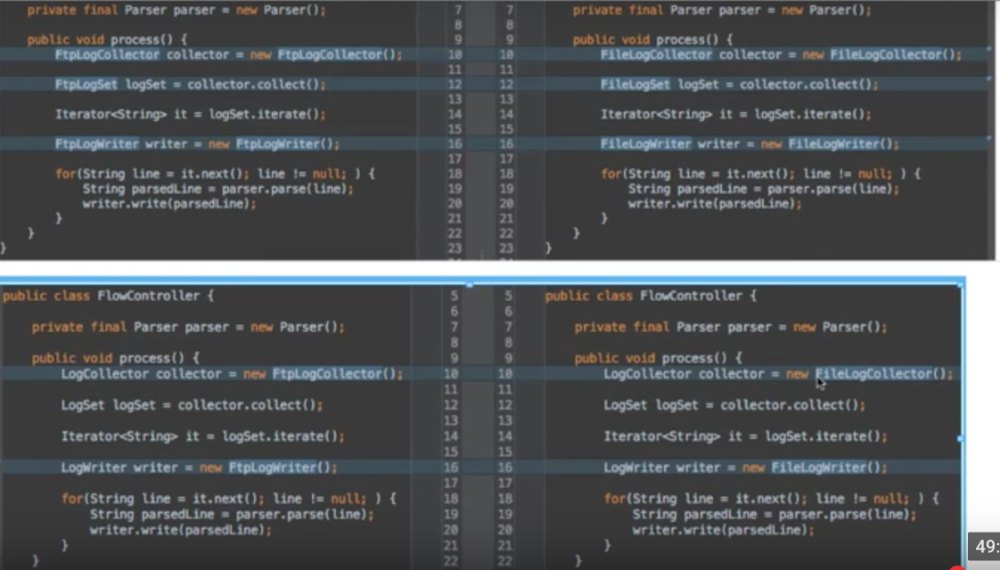
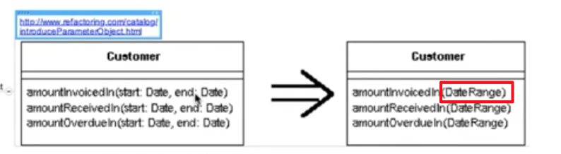
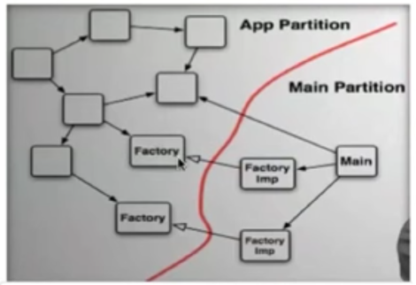

# 백명석님의 클린코더스 영상

[백명석님의 클린코더스](https://www.youtube.com/playlist?list=PLuLb6MC4SOvXCRePHrb4e-EYadjZ9KHyH)를 보면서 내용을 정리하는 페이지입니다.
(공부한 내용을 정리하는 [Github](https://github.com/jojoldu/blog-code)와 세미나+책 후기를 정리하는 [Github](https://github.com/jojoldu/review), 이 모든 내용을 담고 있는 [블로그](http://jojoldu.tistory.com/)가 있습니다. )  

### 1. OOP

* ArticleService : 객체를 데이터로 보기 때문에 이런 서비스가 만들어진다. **기능으로 봐야한다**. 즉, WriteArticleService 등이 되어야만 한다.
* 다른 객체가 갖고 있는 값을 내가 보고, 판단하는 행위는 지양한다. 그냥 그 객체에게 물어보는것이 낫다 (```member.isExpired()```처럼)
* 인터페이스를 사용해야 하는 이유
  * 변경이 안되는 일은 절대 없다 (구현체가 지금은 1개이지만, 2개가 안된다고 절대확신 가능한가?)
  * 테스트 하기가 쉽다
  * 부가기능 추가하기가 쉽다



* 팩토리메소드를 사용하면 구현체가 변경되어도 팩토리 코드만 변경되면 된다.
  * 최근엔 **DI로 다 해결**하고 있다.
  * DI로 풀지 않으면 MOCK 객체로 테스트하기가 너무 힘들다.
* 상속은 방법 자체는 쉽지만, **변경하기가 너무나 힘들다**
  * 슈퍼클래스의 변경이 서브클래스 전체에 영향을 미친다
  * 구현된 코드가 필요하다면 상속보다는 조립을 하라

### 2. Functions

* 함수는 한가지 일만 해야 한다.
  * 잘 지어진 서술적인 긴 이름을 갖는 많으면서 작은 함수들로 유지해야 한다.
  * 즉, 주석에서 해야할 일을 함수의 이름이 대체한다.

* 함수의 첫번째 원칙
  * **더이상 작아질 수 없을만큼** 작아야 한다.
  * 큰 함수는 클래스로 추출할 생각을 해야 한다
  * 클래스는 일련의 변수들에 동작하는 기능의 집합

* 리팩토링 과정
  * 테스트 코드를 무조건 만들어서 테스트 코드를 믿고 리팩토링을 진행한다.
  * 메소드 변수를 클래스 필드로 추출하기
    * 메소드의 인자는 3개 이하를 유지한다라는 조건 만족하기가 쉽다.
    * extract method 하기가 좀 더 편해진다.
  * 블록이 적어야 한다.
    * if, else, while등의 내부 블록은 한줄이어야 한다. 즉, 함수 호출이어야 한다.
  * 함수의 인덴트는 1~2 depth이어야 한다.
  * 해당 메소드에서만 사용하는 변수들은 extract 할 때, 해당 메소드의 인자값으로 전환한다.
    * 클래스 필드를 사용하도록 만들면 클래스 단위로 분리할 때 의존성 관계가 심해진다.
  * 20줄이 넘어가는 function은 리팩토링 고려해봐야 한다.

* Extract Till You Drop : 니가 포기할때까지 extract 하라
  * ```{}```은 extract 대상
  * **4줄 이내의 함수들로만** 구성된 클래스가 되도록

### 3. Function Structure
* 인자가 여러개일 경우 해당 인자가 뭔지 인식할 수 있는 클래스를 생성해서 사용하자



(Date, Date를 DateRange 클래스를 생성하여 대체)  
  
* 생성자 인자가 많을 경우 빌더패턴을 고려한다.
* boolean의 값에 따라 함수안에서 여러 일을 하도록 하지 않기
  * 차라리 2개의 함수를 만들고 2개의 함수에서 공통되는 코드는 다시 함수를 만들어서 이 함수를 사용하도록 할것
* input 값은 input에서 끝내고, 절대 return용으로 사용하지 않는다.
* null을 전달시키지 않는다.
  * null을 boolean처럼 쓰지 않는다.
  * null을 리턴하게 되면, 그 뒤 메소드들이 전부 null체크를 하게 된다.
  * 단, 외부 API를 쓰게 되는 경우는 null 체크를 한다.
* public은 위로, private는 아래로
  * private는 메소드명을 잘 지어서 굳이 아래를 안보더라도 이해할 수 있도록 한다.
  * 코드를 확인하기 위해 내려가며 읽던 흐름을 다시 위로 올리지 않도록 한다.
* ```if```, ```switch```보다는 DI를 사용해서 의존성을 제거하자.
  * Spring 가이드를 따르다보면 이런 DI 구조로 개발을 하게 된다.

* IntelliJ의 ```Push members down```로 클래스 계층 구조 정리
  * 상위 클래스의 멤버 메소드 혹은 변수를 지정한 하위 클래스로 이동시켜줌
* IntelliJ의 ```run with Coverage```로 어느 사용되지 않는 코드는 제거
* IntelliJ의 ```Inline... Refactor```로 의미없는 변수선언 제거
   

  
(팩토리에 어떤 구현체를 넣어줄것인지 결정하는 것은 Main이며, 스프링에선 이를 dispatcher servlet이 담당한다.)  
  
* 런타임의 의존성은 FactoryImp에 있지만, 소스코드의 의존성은 Factory에 있다.