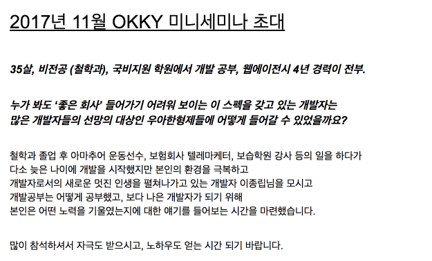

# OKKY 미니세미나 <비전공 학원출신 SI개발자, 유명스타트업 들어간.ssul>

[링크](https://okky.kr/article/423962)

## 들어가며

### OKKYCON 소개

### 노상범대표님

* 최근 들어 진행한 OKKY 세미나 중 가장 많은 비율이 참석했고, 가장 빨리 매진이 됨
* 우아한형제들 입사하시기전에 종립님과 여러 이야기를 해보며 깨달은게 많아, 이 분은 꼭 세미나에 한번 초대해야겠다고 생각했는데 실제로 진행하게 되어 대단히 기쁨
* 종립님 발표가 끝나고 짧게 5~10분정도 이야기를 추가하겠음

## 이종립님 발표

* 개인적으로 주로 어떤 개발자냐고 하면 Vim 사용자다, Vim 플러그인 개발자라고 함
* 사실 이 주제로 발표하는게 처음은 아님
* 이직이라고 하는게, 그냥 회사를 옮긴다라고 하는건 너무 짧은데 회사를 옮기게된 그 힘은 어디서부터 온걸까 생각해보면 초등학교때까지도 갈수도 있을것 같음
* 그렇게 이야기하면 너무 장황해지기 때문에 26살부터 시작하면 될것 같다.

### 대학 졸업 후

* 첫 월급 70만원
* 운동 -> 학원강사 -> 보험 텔레마케터 -> 학원 강사 -> SI
* 이전에도 알바는 했었지만 여기서부터 이야기하는건 사회의 부조리를 알게된 직업이기 때문
* 2007~2008년엔 경기도 시 대표로 운동선수로 활동
* 당시엔 운동을 평생해야지라고 생각함 (나만의 체육관을 차리고 등등?)
* 여기서 핵심은 운동을 그만두고 깨달은게 있다는 것
* 메달을 딴 친한 동료가 있었는데, 이 친구가 운동을 그만두더니 연락이 끊김
* 몇달 지나 연락을 하니 미용을 배우고 있었음
* 그때 마음속에서 이 직업에 대한 희망을 잃었던것 같음 
* 나는 이친구보다도 운동을 못하는데 평생 운동을 할수 있을까
* 운동을 그만두고 과외를 시작함
* 알바면접갔다가 강사를 시작하게 됐는데, 어떻게 이 사람은 날 바로 강사를 시켜주는거지 라는 의문이 생김
* 학원 강사를 1년반 하고 나서 알게된건, 이 학원에서는 강의 실력이 있는 사람이 오건 실력이없는 사람이 오건 상관 없었음
* 직업을 바꿀수없는 사람을 데리고 착취에 가까운 행위를 하고 있었던 것

* 학원을 그만두고 백수가 되었는데 보험 가입하라는 전화가 옴
* 백수라서 보험비 낼 돈이 없어서 안된다고 하니, 말을 참 재밌게 하니 보험을 파는게 어떠냐는 권유 받음
* 개발자가 되려는 사람이 국비지원 받는것처럼 무료로 회사에서 주는 보험교육을 받으러 갔더니 다 나이가 40~50대 였음
* 텔레마케터를 하면서 느낀 점은 영업을 할수 없다는 걸 알게 됨
* 보험의 장점을 얘기해야하는데, 보험의 단점을 얘기하고 보험을 어떻게 하면 뜯어낼수있는지를 얘기하는 걸 발견
* 더이상 주변에서 보험을 가입할 사람이 남지 않게 되서 보험을 그만둘수밖에 없었음
* 보험이라는게 대부분은 보험사가 된 사람의 주변인들이 모두 보험에 가입될때까지 뽑아내는 직업이라는걸 알게 됨

* 다시 학원으로 감
* 처음에 5명을 가르치다가, 나중엔 270명을 가르치게 됨
* 이 학원에선 자신감을 가지게 되었지만, 처음 월급 그대로 유지되고 있었음
* 원장의 가족에게 90도 인사를 하지 않아서 짤리게 됨
* 다시는 학원을 돌아가지 말아야지 라고 생각함 + 다음 직업은 앉아서 하는 직업을 가져야지라고 다짐
* 매일 일어서서 밤늦게까지 학생들을 가르치고, 학부모님들과 면담하는게 너무 힘들었음

* 학원을 그만두고 다음 직업을 뭘해야하나 엄청 고민하게 됨
* 친구들에게 상담을 하다가 개발자 친구가 개발자 직업을 권유함
* 그 말만 믿고 국비지원 학원을 가게 됨

> 도망쳐서 도착한 곳에 낙원은 없다.  
방향을 잘 잡으면: 도망치다 보면 낙원에 접근할 수 있지 않을까?  
레인 메이커: 낙원이 나올때까지 도망친다. (인디언의 기우제처럼)

* 개발을 해보고 안되면 그땐 다른걸 또 해보자. 인생은 기니깐

### 앉아서 일하고 싶다: 개발자가 되자

* 국비학원 갔을때는 31세/철학전공/통장잔고 50만원
* 내가 학원을 수료하고 과연 좋은 회사를 갈수있을까 고민
* 분명 나를 채용하는 회사는 좋은 회사가 아닐것이다. (이전 직업들을 떠올려보면)
* 좋은 회사가 아니더라도 일단 가서 경력을 쌓고 조금더 좋은 회사로 한걸음씩 움직이자

하지만 부족한게 너무 많아 이를 개선하기 위해 노력

* 돈이 부족하다
  * 가계부 개발 시작
  * 지금은 안쓰지만 다음 버전을 여전히 쓰는중
* 시간이 부족하다
  * 효율적인 시간 활용 관리
  * 잠을 제때 잔다(취침시간을 줄임, 새벽3시 -> 10시 30분)
  * 밥먹을때는 동영상 강의를 봄
* 경험이 부족하다
  * 어쩔수없는 부분
* 개발상식이 부족하다
  * 추천서 탐색
  * 구글 검색을 해보면 추천서가 굉장히 많은데, 이를 다 따라가면 힘듬 -> 모두가 공통적으로 추천하는 추천서 목록을 만들어서 봄
* 무엇을 공부해야할지 모른다
  * 대학 커리큘럼, 전공과목 소개 참고
  * 자료구조, 네트워크, 운영체제 등
  * 처음 보는 단어들이라 도서관에 가서 관련된 책들은 하나씩 계속 빌려서 봄
  * 공사장을 가면 그 사람들이 쓰는 언어가 있는데, 그 단어를 모르면 거기서 초짜가 되는 경험이 기억남 -> 전공자들의 상식/단어를 모르면 무시 받겠구나 -> 중요한 일을 못맡아서 좋은 기회를 못얻겠다 생각
  * 맨 처음 인덱스를 먼저 머리에 넣음 -> 단어가 어디 책에 있는지 정도만 기억해서 퇴근해서 꼭 확인하려고 함

* 새롭게 기억해야할 것이 많다.
  * 일지/레포트 기록

### 독서를 효율적으로

* X코리아 등에 이력서를 올림
  * 내가 현재 수준에서 어차피 좋은 회사는 못가는걸 아니 연봉이라도 많이 받자란 생각에 면접가면 항상 연봉을 몇백이상 더 부름
  * 면접을 여러군데 갔지만, 가장 가까우면서 연봉이 가장 많은 곳을 감
* SI회사에 입사하고 상무님이 많이 챙겨주는 것을 알게됨
  * 회사 지원으로 책을 많이 구입하게 됨
  * SI 프로젝트가 끝나고 다음 프로젝트 가기전까지는 정말 많은 책을 읽어서 SI탈출에 큰힘이 됨

* 하루에 3권을 조금씩 읽고, 요약
  * 집에서 : 각 잡고 읽을만한 것
  * 지하철에서 : 재미있으며 얇은 책
  * 학원/회사에서 짬짬이 : 회사업무에 도움이 될것 같은 표지이면서 나한테 도움이 되는 책

* 추천도서 목록을 찾아보고, 중복된 책 리스트를 만든다.
  * Code Complete
  * 실용주의 프로그래머
  * TDD
  * 기타 등등

* 돈이 없으면 도서관을 활용한다
  * 좋은 신간은 **도서 구입 의뢰**를 활용한다.
* 2주에 한번은 서점에 가서 분위기를 파악한다.
  * 내가 모르는 분야가 있나 (상식이 부족하다는 결핍때문에)
* 책을 읽을수 없을때 -> 동영상 강의를 준비한다.

### 나만의 건강/정신건강 cheat sheet를 만들자

* 전공자가 아니기 때문에 정신이 황폐해질거라 생각함
  * 임금체불
  * 새벽퇴근 등
* 개발자가 되고 마인드가 정말 중요하다고 생각함
  * 경력도, 실력도 없으니 마인드라도 제대로 갖추자고 생각함
  * 개발자들이 싫어할만한건 나도 하지말자란 생각에 불법 소프트웨어 절대 사용하지 않고 모두 구매해서 사용함
  * 이런 마인드 덕에 정말 좋은 습관이 생긴것 같음

* 내가 자고 싶은 시간이 아니라, 몸이 자고 싶은 시간에 잔다.
* 비누를 아끼지 말고 항상 깨끗하게 씻는다.
  * 독감, 배탈 등은 3~4일은 아무것도 못할수도 있다.
* 가급적 건강식을 먹는다
* 일주일에 한번은 운동/산책 한다
  * 개발자되면 절대 건강해질 수 없다고 비관적으로 생각
  * 지금은 괜찮아도 40대가 되었을때 암이라도 걸리면 끝장이다.
* 항상 Plan B를 세운다
  * 항상 인생이 망했던 경험을 기억함
  * 운동선수는 계획을 세워서 운동함
  * 망해도 뭔가 할 수 있게 계획한다
* 힘들땐 친구/가족과 가벼운 전화통화를 한다.
  * 아무한테나 얘기하면 안될것 같아 제한을 둠
  * 너무 진지하게 자랑/하소연하면 곤란 -> **당장은 편하지만 장기적으로 멘탈이 손상**
  * 과하게 긍정적이거나 과하게 칭찬해주는 사람과는 통화하지 않는다. -> **칭찬의 역효과를 조심**
  * **통화할 때마다 마음이 무거워지는 사람과는 통화하지 않는다.**

### Code Complete

* 회사 선배들은 프로젝트가 끝나고 게임만 함
  * 이 선배들이 짠 코드를 보고 한심하단 생각이 듬
* 공부할수록 SI회사가 작게 느껴지고, 자신감이 붙었다.
* 내 습관이 나를 더 좋은곳으로 데려다 줄거라는 생각이 들었다.

### 넘어지면 그냥 일어나지 말고 무언가를 주워라

새끼손가락 관절염 나비효과

* 자바스크립트 핵심 가이드
  * 이렇게 대가(더글라스 크락포드)가 프로그래밍 언어에 대한 장점과 단점을 이야기하는걸 보고 나도 이 대가의 관점을 공부해보자는 생각에 사게 됨
  * 너무 집중이 안되서 저자의 서문부터 마지막 끝장까지 구글닥스에 타이핑 하면서 거의 외우게 됨
  * 이 책은 정말 정규표현식을 잘 설명하는 책이라 그때부터 정규표현식에 자신감을 얻게 됨
  * 하루종일 타이핑 치다보니 양쪽 새끼손가락에 관절염이 오게 됨
  * 너무 아파서 코딩 속도가 안나오니 큰일났다는 생각에 전체를 타이핑하지않고 요약만 하자고 생각함

* 새끼손가락이 필요없는 타이핑 방법을 찾게 됨 -> Vim을 찾음
  * 틈만 나면 Vim을 쓰고 책을 찾아보고 플러그인을 개발

* 올해 7월에 Vim 플러그인을 개발
  * vimbreak
  * 레거시 코드를 보다가 코드를 다때려부수고 싶다는 생각을 하게 되서 개발 시작
  * 깃헙 트렌딩, 해커뉴스 등에 하루 동안 최상위권에 위치

> 무식하게 공부했지만 나비효과로 여기까지 가게 됨

### 나의 SI 탈출계획

퇴사를 결심하게 된 2가지 SI 프로젝트

* 첫번째 프로젝트
  * 8시까지 출근해서 국민체조를 함
  * 직장상사가 부하직원에게 물건을 던지는 것을 봄
  * 파견을 하면 여기보다 더 심한곳도 갈수도 있겠다고 생각
* 두번째 프로젝트
  * 정부기관
  * 거기 PM이 프로젝트 투입된지 며칠되지 않았는데 계약서에 싸인을 일단 하라고 계속 강요
  * 그 문서 내용은 프로젝트 각 모듈의 완료 여부를 싸인하는 계약서였음
  * 실제 그 모듈을 개발하기로 한 개발자는 도망을 갔고, 나는 그때 만들지도 않았던 모듈의 완성을 싸인해야 하는 상황이였음
  * 그때부터 한 일은 PM과 계약서에 싸인할수 없다고 싸우기만 함
  * 프로젝트가 끝나고 다시는 파견을 나가고 싶지 않다고 생각함
  * 코딩은 안하고 이런 이상한 일이나 하질 않나, 회사를 복귀하고 나서는 코딩외에 다른일을 해보라고 이야기를 들어 퇴사를 결심

* 약점을 보완하기 위한 막연한 준비
  * 알고리즘 문제 풀이
  * 오픈소스 라이브러리 개발
  * 주력 언어 공부
  * 기타 등등
* 위 내용들은 평생 공부해야하는것이니, 특정 회사에 이직 하기 위한 공부를 해야하지 않을까 생각

* 단기간에 실력을 급격히 올릴수는 없음
* 내 실력을 필요 이상으로 과장해도 안됨 (언젠가는 들통남)
* 내 실력을 객관적으로 봐줄수있는 곳으로 가는 것이 목표
  * 과대평가 해주는 곳은 곤란
  * 과소평가하는 곳으로 가면 현재와 다를바가 없음
* 회사 리스트를 작성
  * 합격 확률을 예상하여 정렬,
  * 합격 확률이 높을것 같은 회사부터 지원
    * 자꾸 합격하면 기분이 좋음
    * 면접 스킬 향상/내게 부족한것 확인/자신감 확인
    * **나쁜/좋은 회사를 알아보는 안목**이 조금씩 좋아짐
    * 중요: **한 이력서를 계속 업데이트 하지 않고, 매번 새로운 이력서를 만든다.**
  * 합격률이 높은 회사는 합격하고 나서도 가진 않음

* 노상범 대표님을 만나 우아한형제들 CTO이신 김범준님의 전화를 받게 됨
  * 당시엔 이미 최종면접만 남은 높은 랭크의 회사 채용이 진행중이였던 상황
* 코딩 테스트를 준비할때 다음과 같이 마음먹음
  * 게임으로 치면 망한 케릭터
  * 코딩테스트에서 튀어보자 라고 생각함
  * 라스칼라 멤버들이 우아한형제들에 있다는 소문을 들음
  * 1번은 JS, 2번은 스칼라, 3번은 SQL, 4번은 Java로 풀었음 -> 이러면 튀겠지란 마음
  * 문제를 다 풀고 1시간이 남아 이 시간동안에도 뭘 하자라고 생각함
  * TDD 해왔던것을 떠올리고 각 문제당 테스트케이스를 10개를 작성함
  * 누군가는 알아보겠지란 마음에 테스트케이스 코드는 지우지 않고 제출함
* 기술 면접에서 TDD에 대해 정말 많은 이야기를 나눔
  * 좋아하는 주제에 대해 이야기하는 기분이였음
* 성공한 사업가를 보면 항상 궁금했던것이 있어서 물어봄
  * 김봉진 대표님 면접에서 물어봄 -> "대표님, 사업을 하시다보면 불안하실때가 있을텐데 어떻게 이기시나요?"
  * "나는 원래 사업가가 아닌데, 사업을 하고 있고 이만큼 하는것도 대단하다고 생각한다" 란 답변을 듣고 스스로에게 많은 위안이 되었음
* 이직을 하고 정말 많은 것이 바뀐것을 느낌
  * 연봉도 오르고, 주변의 개발자들이 바뀌고 정말 다른 세상에 온것 같았음
  * 플레이샵에서 친해진 분과 버스에서 타고 오는길에 최근에 읽은 책에 대해 이야기하다가 JPA 책의 표지가 이상하다고 얘기했는데 그분이 저자였음
  * 당황스러웠지만, 대단히 기뻤음 -> 이렇게 대단한 사람과 같이 일할수 있구나

### 실용주의 프로그래머 : 습관에 대하여

개인적인 기준으로 이직에 성공했다고 생각하는데, 그 원동력은 **불안감**이라고 생각한다.  
다른 한편으로 도와줬던 것은 **습관**이였음.  

* 잠을 제때 자는 습관
* 몸을 깨끗하게 씻는 습관
* 매번 책을 요약하는 습관 
* 매일 코딩하는 습관 등등

> 좋은 프로그래머란, 일반통행 도로에서도 양쪽을 모두 보고 건너는 사람이다.

* 회사는 팀 플레이
  * 다른 사람을 도울 방법을 항상 생각한다
* 작은 도구를 만드는 습관
  * 같은 일을 수작업으로 처리하지 않는다
* 기억력을 보완하는 습관
  * 유사시에 항상 찾을수 있어야 한다고 생각
  * 블로그/개인 위키를 작성하고 관리한다
* 좋은 음식을 먹고 충분한 휴식을 취한다
* 항상 Plan B를 준비한다
* 일상 생활에서도 최적화를 고민한다

회사를 옮기고 나서 정말 행복하다.  
동료들이 기꺼이 다른 사람을 돕는게 너무 기뻤다.  
개발자로서 이렇게 행복한 조직일 얼마나 많을까 자주 생각함

### 마지막으로

우리가 단지 돌을 깎고 있더라도 언제나 대성당을 마음속에 그려야 한다.  

## 노상범님 발표

### 이종립님의 이직 당시 이력서

* 개발자 리쿠르팅 하는데 고객사가 굉장히 많은 돈을 제공하기 때문에 아무나 추천할수 없음
* 처음 종립님 이력서는 어렵겠다 생각함
  * 보통 큰회사의 인사담당자는 경우 이력서는 6초에 1장 정도를 봄
* 자기소개의 첫줄에 있는 "취미로 집에서도 코딩하고 공부하는 개발자" 라는 문장이 와닿았음
* 자기소개의 첫줄부터 끝줄까지 내가 코딩을 얼마나 좋아하고 즐겨하는지에 대해서만 나열되었음

### 서비스 개발자 vs SI 개발자

회사마다 상황을 다릅니다.  
SI 회사는 클라우드 안하나? 서비스 개발자는 다 좋냐?  
 **그런건 아닙니다**  
대신, **큰 흐름의 차이 정도로 이해하면 됩니다.**

* 가장 큰 차이 
  * SI는 서비스 오픈이 목표
  * **서비스는 서비스 오픈후부터 시작**  
* 기술셋은 큰차이가 안남
  * 문화가 맞지 않는다는 이야기가 많음
* 문화가 맞으려면?
  * 개인 프로젝트, 오픈소스 활동을 취미로 해야함
  * 내가 불편한걸 개선하기 위해 개인 시간에 무엇을 만드는 것을 습관화하는 것이 중요

## Q & A

### SI 하다보면 습관을 지속할수 없을때가 많은데 그럴때 어떻게 유연하게 대응하는지

* 처음에 회사에 들어갔을때, 항상 조건을 걸었음
  * 누군가 나에게 술을 권하는 사람이 생기면 퇴사하겠음
  * 회식하면 욕먹더라도 빨리 퇴근했음
* 프로젝트 가서는 항상 내 일을 빨리 끝내고 내 공부를 하게 됨
* 유지보수를 할때도 내가 쓰고 싶은 기술을 가지고 신규 기능을 개발해주기도 하고, 반복적인 일은 자동화 도구를 만들어 주기도 함
  * 거기 있는 사람들을 돕기 위한 도구를 항상 만들어줬기 때문에 주변의 많은 배려를 받을수 있었음
* 주말에도 항상 똑같이 자고 일어났음
  * 잠을 늦게 자는것에 비해서 일찍 자는것의 장점은 **선택**에 있음
  * 일찍 자면 "더잘까?", "공부할까?" 선택할 수 있어서 좋음
  * 아침에 공부하는게 큰 도움이 되었음

### 자동화 도구를 만들어서 고객에게 계속 제공하다보니 고객이 너무 당연하게 여겨 요구가 과해질때가 있는데 어떻게 해야할지

* 절대 거절은 하지 않았지만, 생색을 많이 냄
* 만들어 주고 항상 도구에 대해 설명을 해줬음
* 그런 고객들과 항상 좋은 관계를 유지하려고 노력했음
* 현업들의 좋은 평가로 휴가/개인시간등을 많이 받을 수 있었음
  * 그 시간에 개인 책을 보고 개인 개발을 할 수 있었음

### 면접을 보면서 느낀게 한계가 있다고 느껴서 눈을 낮춰서 바로 취업을 노릴지, 다시 한번 이직을 준비해야할지

* 개발자로서 이직은 딱 1번뿐이라 적절할지는 모르겠음
* 대신 나의 선택 원칙을 토대로 나였으면 어떻게 할까 얘기해주겠음
* 낮은 회사로 가서 빨아먹을건 다 빨아먹고 다시 이직 준비하겠음
* 프로그래머의 길, 멘토에게 묻다 라는 책을 추천함
  * 초보개발자가 읽으면 정말 좋음
  * 이런 이런 상황에선 어떻게 하는게 좋을까요? 라고 하면 저자가 이렇게 저렇게 하세요라고 아주 적절한 답변을 볼 수 있음
  * 개발자로서 성장할 수 있는 원칙을 볼 수 있음

### 코딩테스트를 하다가 도저히 안풀릴때는 어떻게 하는게 좋을지

* 사람마다 공부방식이 달라서 정답은 없음
* 개인적으로는 빨리 답지를 보는 편
* 그리고 왜 이렇게 풀었는지를 깨달을려고 함
* 소설가가 다른 소설가의 소설을 참고하듯이 개발자도 다른 사람의 코드를 많이 보는것이 좋다고 생각함
* 불안하다면 빨리 보고 왜 그랬는지 고민하는게 좋다고 생각함

### 한 언어를 어느정도 하게 되면 다른 언어를 공부하고 싶은데, 한 언어를 꼭 끝까지 파야하는 것인지 & 책만 단순히 보는게 실제로 공부가 되는지

첫번째 질문

* 언어를 마스터하는게 일단 가능한것인지?
* 다른 언어를 하고 싶다면 그냥 바로 시작하는게 나을수 있음
* 단, 언어의 시그니쳐같은 내용은 이해하는게 좋음
* 언어의 패러다임들을 이해하면, 같은 패러다임의 언어들은 이해하기가 쉽기 때문에 패러다임을 이해하는게 더 필요하지 않을까 생각
* 실용주의 프로그래머에서는 "1년에 1개의 새로운 언어를 공부하라"라는 과제가 주어진다.

두번째 질문

* 샘플 코드가 있는 책은 웬만하면 다 타이핑 할것
* 그럴필요가 없는 책이라 생각되어도 무조건 해볼것
* 꼭 코딩 책만 읽을 필요는 없다.
  * 경력관리, 커뮤니케이션 
  * 피플웨어, 클린코드 등등

### 국비지원 과정상 하루하루 따라가기가 힘든데, 좋은 개발자가 되고 싶다고 다짐하게 된 계기가 무엇인지 & 다양한 직업이 프로그래밍에 어떤 도움이 되었는지

첫번째 질문

* 처음부터 그렇게 생각함
* 나는 삼류 개발자가 되고 싶지 않다고 생각함
  * 학원다닐때부터 구글가야지라고 생각함
  * 얘기는 못했음 (남들이 욕할까봐..)
  * 목표를 구글을 잡으면 구글을 못가더라도 그 근처까지는 가지 않을까 생각
* 남들에게 얕보이고 싶을 생각은 없었음
* 나보다 잘하는 사람을 보면 질투가 나서 참을수가 없었음
  * 항상 국비지원 과정에서 1등하다가, 다른 사람이 1등 하는걸 보니 너무 질투가 났음

두번째 질문

* 개발만을 위한 개발을 하는게 아니라면 모든 경험이 개발에 도움이 됨
* 하림 프로젝트를 갔던 선배는 프로젝트가 끝나고 돌아와서 닭박사가 되있었음
  * 항상 **소프트웨어는 인간을 돕기 위한 것**
* 운동을 하면서 플랜을 짜는 경험, 보험을 하면서 법률에 관한 경험, 학원강사를 하면서 얻었던 커뮤니케이션 경험 모두가 도움이 되었음
* 회사에서 개발을 한다는건 그 기능에 대해 명확히 정의하는게 중요한데 이럴때 다양한 경험이 도움이 됨
* 개발자는 코딩만 하는 사람이 아니라고 생각함

### 다른 분야의 개발자로 옮기려고 할때 프로젝트를 어떻게 시작했는지

* 집에서 하느냐, 회사에서 하느냐에 따라 차이가 남
* 회사에서 프로젝트를 할때는 
  * 많이 물어보고 타인의 문서를 착실하게 봄
  * 어떤 개념이 있는데, 그냥 모르겠다고 하는거랑 잘 기억이 안나는데 어떤 개념인지 다시 물어보는것은 큰차이가 있음
* 집에서 할때는 
  * 오픈소스 코드를 많이 참고함
  * 개인적으로 실수라고 생각하는 것은, 1년차때 개발자 커뮤니티아 대화에 참여하지 않았음
  * 다시 그때로 돌아간다면 다른 개발자들과 정말 많은 대화를 하려고 노력할것임

### 워라벨이 좋은 회사에 다니고 있는데, 사수가 구현에만 초점이 있고 설명을 잘 못하면 어떻게 배워야하는지

* 사수긴 하지만 선생님이라고 생각하시는 것 같음
  * 선생님이 그러면 좋은 선생님은 아님
* 5~10년후에 그분과 똑같이 되면 좋으신지?
  * 그게 싫으시다면 다른 분을 사수로 모시던지, 회사를 옮겨야 한다
* 습관을 굉장히 강조하는데, 그분과 함께면 정말 나쁜 습관이 생길것 같다.

### 노상범 대표님 마무리

* 누구나 다 종립님처럼 할수는 없음
* 노력하는 것도 재능이라고 생각함
* 꼭 개발자만 직업은 아니다. 다른 IT 직업들도 많다.
* 초기에는 주변에 누가 있느냐에 따라 정말 차이가 난다.

* 이브레인 스페이스를 제공하니 와서 공부하면 좋을것 같음
* OKKY의 Q&A 를 활성화하려고 노력중이니, 많이 사용해주길 바람

## 마무리

> 구도자의 마음가짐으로 개발을 하는 분이라는걸 느낌