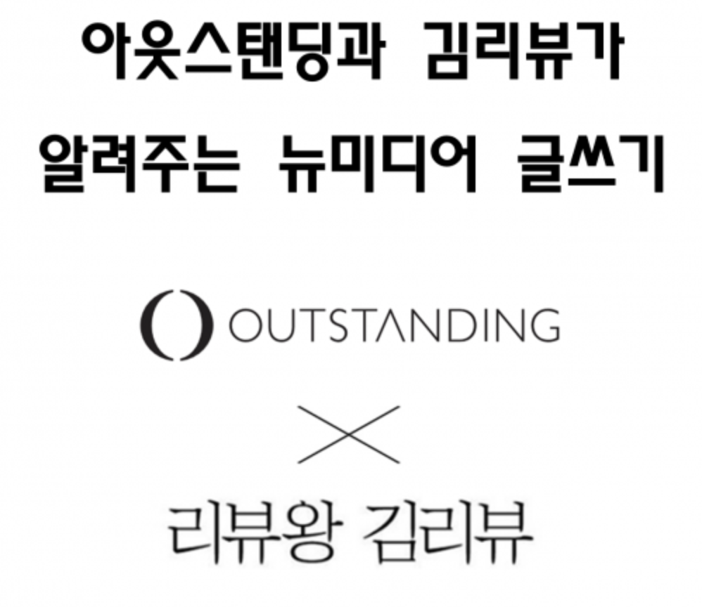
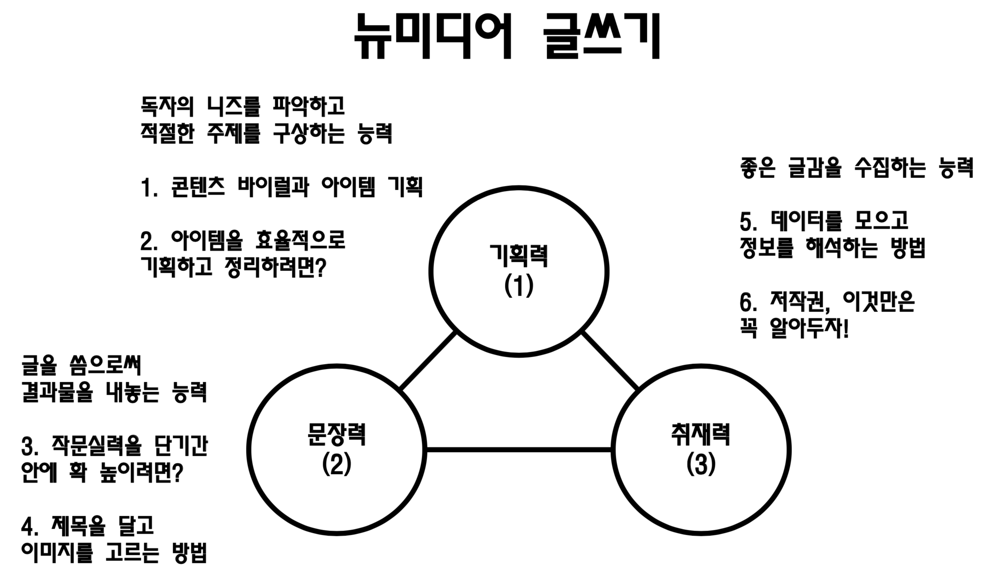
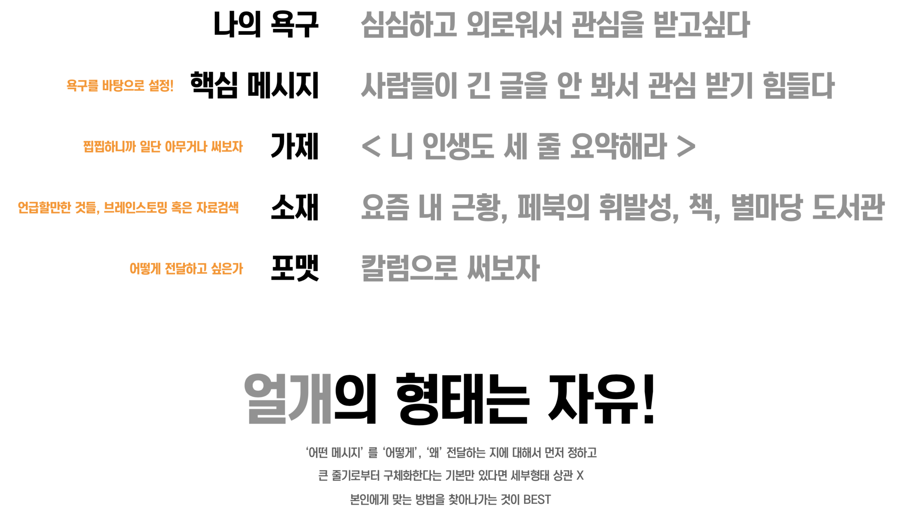

# 아웃스탠딩과 김리뷰가 알려주는 뉴미디어 글쓰기

10월의 마지막! 31일에 아웃스탠딩과 김리뷰님이 함께하는 뉴미디어 글쓰기 세미나에 참가했습니다!

발표 내용은 다음과 같습니다

자 그럼 바로 발표로 가보겠습니다!

## 1. 최용식 기자의 일곱가지 꿀팁

전체적인 발표 내용은 다음과 같음

### 1-1. 콘텐츠 바이럴과 아이템 기획

* 글을 쓰는 이유는 다양
    * 내가 만족하기 위해
    * 많이 읽히는게 좋아서
* 콘텐츠 바이럴
    * 우연처럼 보이는것도 있음
    * 하지만 필연적인 부분도 있음
        * 대중의 니즈를 건드려야 바이럴리 발생한다고 생각
* 대중의 니즈를 캐치하려면?
    * 에티튜드의 문제
    * 기본적으로 수요자의 관점으로 봐야함
        * 손님이 짜다고 하면 짠거라서 본인이 안짜다고 생각하는것과는 다름
    * 구상1) 사람들이 지금 관심을 가지고 있는 것을 다룬다.
        * 온라인, 현장으로 바로 달려가서 화제가 되는 것들을 찾아본다.
        * 다만 누구나 접근 가능한 만큼 차별화 시도가 핵심
            * 새로운 시각으로 접근
            * 탄탄한 내용
            * 스토리텔링
            * 핵심은 경쟁 컨텐츠와 비교해서 달라야함
    * 구상 2) 사람들의 숨겨진 관심사를 맞춘다.
        * 기본적으로 어려움
        * 가능하면 그만큼의 리워드가 보장
        * 기획은 철저히 창작의 영역... 감이 중요함
            * 양현석 사장은 2NE1의 타이틀곡 선정할때 졸면서 좋다고 한 곡이 선택 (그게 "내가 제일 잘나가" 였음)  => 딱 들으면 느껴져야함
        * 산술적 기획은 불가능, 다만 감은 키울 수 있음
            * 애널리틱스를 통해 잘된 컨텐츠들의 공통점을 뽑아냄
            * 예측력을 키우기 위해 **다음 글은 얼마나 터질까 예측**해본다.
        * 내 데이터가 없다면 남의 데이터라도 보고 분석한다.

### 1-2. 아이템을 효율적으로 기획하고 정리하려면?

* 아이템을 얻는 방법
    * **문득 생각이 나는 경우**
    * **외부에서 흥미로운걸 본 경우**
    * 위에서 시키는 경우
    * 공책 펴고 무작정 적는 경우
    * **컨텐츠 소비를 할 때**
    * 추천 혹은 제보를 받는 경우
* 구상한 것을 노트에 저장
* 숫자는 많을수록 좋다
    * 무작정 많이 적는다 (10 ~ 20개정도)
    * 중요도순으로 나열 한다
    * 별로다 싶으면 바로 폐기할 수 있어야 함

### 1-3. 작문실력을 단기간 안에 확 높이려면?

* 초보가 실수하는 것1. - 중구난방
* 초보가 실수하는 것2. - 불량 조절 실패
* 초보가 실수하는 것3. - 정제되지 않은 문장과 표현
    * 맞춤법, 비문, 가독성, 길이, 혼잡성 등
* 초보가 실수하는 것4. - 과격한 논리, 비약, 감정 표출
* 초보가 실수하는 것5. - 노잼
    * 딱히 흠잡을것 없지만, 별로 읽고싶지 않음
* 단기속성1. 서두에 눈길을 확끈다
    * 방법은 다양
    * 인용문, 의문문으로 시작
    * 나만의 클리세
    * 세태를 표현
* 단기속성3. 분량은 가급적 균일하게
    * 많은것 보다는 적은게 나음
    
* 단기속성4. 문장은 짧게, 쪼개서 쓴다
* 단기속성5. 비문을 쓰지 않은 습관을 길러야함
* 단기속성7. 대체적으로 문어체보다 구어체가, 평서체보다 경어체가 좋습니다
    * 친숙하다는 느낌

### 1-4. 제목을 달고 이미지를 고르는 방법

* 제목, 썸네일, 소개문구는 제품명, 포장지, 카피라이트와 같다.
* 제목
    * 주제를 함축적이고, 임팩트 있게
        * 16년간 400억원 빚을 꾸역꾸역 갚은 사나이
        * 아프리카TV 성공 비결은 BJ를 부자로 만들어줬기 때문 등
    * 포스팅 내 가장 중요한 내용을 인용하는 방식
        * 부장님 말씀드릴게 있습니다. 저 퇴사할게요
    * 인용과 주제의 적절한 합치
        * 최저가가 로켓배송보다 세다. 위메프의 약진 비결
    * 문학적 표현
        * 페이스북은 되고 다모임은 안된 이유
    * 과하지 않은 선에서 명언이나 유행어의 차용
        * 너무 트렌디한 문장과 단어는 몇개월 뒤에 유치하게 보일수 있으니 주의할것
    * 의문사로 궁금증을 유발
        * 왜 크라우드 펀딩은 대세가 될수밖에 없나
    * 아무래도 대중은 도발적이고 섹시한 것에 끌리기 마련
* 썸네일
    * **그림 한장으로 모든걸 말할 수 있어야** 한다.
        * 밍밍하거나 단조로우면 안됨 => 조금 선정적이라는 느낌이 들정도로 눈길이 확 가야함
        * 요즘은 자막을 활용한 짤이 흥하고 있음
    * 예시)
        * 그러니까 네이버 밑에서 어뷰징이나 하고 있지

### 1-5. 데이터를 모으고 정보를 해석하는 방법

* 좋은 콘텐츠란 **좋은 데이터를 최대한 많이 모아서 이중 가장 괜찮은 걸 골라서 배치**하는 것
* 수집처
    * 네이버 뉴스, 플래텀, 테크크런치
    * 유명 블로그
        * 조성문
        * 임정욱
        * 윤필구
        * 김관형
        * 임원기
    * 정보서비스
        * 와이즈FN
        * 크런치베이스
        * WSJ 스타트업 DB
        * 포브스 순위
        * 위키백과
        * 네이버 주식정보
* 기자는 어떻게 정보해석을 하나
    * 경영과 관련된 내용은 주관적인 내용에 따라 다르게 볼 수 있지만, 전문 영역인 기술,재무회계, 법무 등은 따로 공부가 필요
 * 기자는 어떻게 사실 확인을 하나
    * 정보의 확실성이 중요한 시대
    * 정보의 가치가 있는지부터 따져봐야함
    * 정황성과 개연성을 본다
        * 매출이 급감하는 상황 => 대규모 구조조정 발표 가능성 => 그럴수 있음
    * 교차확인 필요
        * 당사자와 비슷한 정보를 가진 사람을 찾아본다

### 1-6. 저작권, 이것만은 꼭 알아두자!

* 베스트 - 자체제작
* 저작권 만료
    * **70년전 콘텐츠는 오픈소스**
* 오픈소스, 무료이미지
    * pixabay, giphy 등
    * **크리에이티브 커먼저 라이센스를 지켜야함**
* 홍보물 - 보도자료, 공식 사이트, 홍보 포스터
* 원작자에게 허락받기
    * 답장 받기가 참 어려움
* 구매
    * 게티이미지, 셔터스톡, 연합뉴스
* 웬지 찝찝하다 싶으면.. => 어차피 주제 > 내옹 > 이미지 를 생각할 것
* 공정이용
    * 공익성을 띄고 있다면 사용 가능
    * 상업적으로 원저자작에게 피해를 주지 않나
* 뉴스 인용은 어디까지?
    * 영상이나 이미지와 같은 멀티미디어 콘텐츠는 안됨
    * 사설/분석의 경우 몇줄정도의 인용은 가능하나, 출처를 밝혀야함
* 고소하겠다는 메일을 받는다면?

### 1-7. 시드 트래픽은 어떻게 확보하나

* 플랫폼 안에서 활동하느냐, 바깥에서 활동하느냐
    * 자리잡기까지 전자가 훨씬 쉬움
    * 페이스북, 브런치, 네이버블로그 추천
* 페이스북 페이지, 사이트 빌드하기
    * 99%는 무관심임을 명심
    * 상대방의 컨텐츠에 대해 좋아요와 댓글을 달아, 상대가 미안해서라도 좋아요와 댓글을 달게 만든다
    * 가장 중요한 것은 콘텐츠 퀄리티와 빠른 발행주기
        * 온라인은 24시간 서비스되는 터라 워라벨을 포기하면 매우 유리합니다.
    * 만약 좋은 포스팅이 뜨면? 지인과 파워유저가 공유를 해줌
        * 파워 유저는 양질의 컨텐츠를 올리는 사명감? 같은 것이 있어 좋은 콘텐츠가 뜨면 바로 공유해줌
    * 블로그를 한다면 SEO를 꼭 할것
    * 재정적인 여유가 있다면 마케팅을 할 것

### Q & A

Q. 본인의 글이 무단으로 복붙되었을때 대응 하는 방법

* 메세지를 보내서 내려달라고 요청
* 대신 상대방에게 모욕을 주면 안됨
* 사태에 전혀 도움이 안됨
* 아무리 화가 나도 조심해서 메세지를 보낼 것

Q. 한 브랜드의 컨텐츠를 지속적으로 생산하기 위해서는 어떤 것이 필요한가요?

* 억압이 있으면 퍼포먼스는 떨어지는게 사실
* 어느정도 바이럴을 통해 트래픽을 발생시킨후 브랜딩을 시작할것 같음

Q. 아웃스탠딩과 같은 영리 목적 언론사도 공정이용을 통해 보호받는지?

* 피키의 사례를 보고 저작권에 굉장히 주의하고 있음
* 신문의 구독료가 15000원 (아웃스탠딩 월 구독료는 9900)인걸 보면 아웃스탠딩도 공정이용에 포함되지 않을까 싶다고 생각함

## 2. 김리뷰의 일곱가지 꿀팁

최용식 기자님이 정파, 프로격투기 선수라면 나는 사파, 스트리트파이터

* 저는
    * 김리뷰
    * 페이스북에서 리뷰왕김리뷰, 페이스북에 이딴 글 쓰지마 운영
    * <세상의 모든 리뷰>, <1인분의 삶>, <이번 생 플레이 가이드> 등 다섯 권의 책 출판
    * <대학내일>, <1boon>에 콘텐츠 연재
    * <ᄑᄑᄉᄉ>, <디에디트>, <아웃스탠딩> 등에서 외부필자로 활동 중
    * 최근 창업했다 말아먹고 마음고생 중
* 무엇을 알려주나요?
    * 기획, IR 작성등은 강연을 많이 했지만, 글쓰기에 대해서는 처음 강연해서 고민을 많이 함
    * 그냥 써왔지 어떤 방법론을 갖고 있던 것이 아닌 상황
    * 제 자신으 되돌아보며 글쓰기 팁 7가지를 골라봄
* 뉴미디어의 텍스트 기획..?
    * 글쓰기에 국한된 내용이 아님

## 2-1. 쓰기전에 자문하기 - 나는 뭘 위해 쓰는가

* 말초적인 욕구로 컨텐츠를 만들어왔음
* **글을 쓰는 사람은 많아졌지만, 글을 쓰는 목적에 대해 정확히 생각하는 사람은 많지 않다**
    * 쓰기로 결정하고, 뭘 쓸지를 결정하는 사람이 많음
        * 돈때문에 쓰는지
        * 관심때문에 쓰는지
        * 정말 글을 쓰고싶은지
        * 위 욕구들에 따라 달라짐
    * 저는 **관심을 갖기 위해** 쓰기 시작함
        * 제가 쓴 글을 통해 더 많은 사람들의 욕구를 끌어오고 싶음
        * "글을 잘 쓰는구나" 라는 댓글을 기대하고, 받기 위해 계속 쓰고 있음
        * 어렸을때부터 리뷰를 좋아했던 게 아닌, 잠에서 일어났다가 그냥 리뷰를 써야겠다 생각들어 페이지 생성하고 여기까지 옴
    * **욕구불만**으로 글을 쓰고 있었음
    * 모든 행동의 바탕에 욕구가 있듯, 글도 마찬가지
    * 어떤 욕구를 바탕으로 쓰려하는지를 객관화하면 시작점이 명료해진다

## 2-2. 체계적 접근 - 얼개부터 짜기

* 체계적 접근에 익숙하지는 않음
    * 칼럼등을 쓸때는 체계적으로 접근하기는 함
* 얼개 = Structure
  

(최근에 작성한 얼개)  
  
* 얼개를 한다고 해서 복잡한 형태로 하지 않음
* 교과서적인 얼개를 작성하면 **재미가 없음**
* 얼개의 형태가 자유로운게 좋다고 생각함
* 유명한 작가분들은 저마다의 얼개가 있음
    * 중요한건 형태에 얽매이지 않는 것
* 얼개는 집짓기처럼
    * 땅은 욕구
    * 주출돌은 메세지
    * 소재는 기둥
    * 포맷은 디자인
    * 가제는 서까래
    * 제목은 지붕

## 2-3. 창조적 접근 - 의식의 흐름

* 가장 좋아하는 방식
* 사실은 **자동기술법**
    * 작중 화자의 의식을 여과없이 쓰는 것을 의미
* 핵심은 **여과없이 흩뿌리기**
    * 완성된 문장을 뽑고 싶어해서 두려워 함
    *  아이디어 하나하나 완성된 문장으로 쓸 순 없다.
        * 글을 정리하다가 아이디어가 사라질 수 도 있음
    * 갑작스럽게 아이디어가 떠올랐을때 유효한 방법
    * 마구잡이로 낙서하듯이 쓰고 순서와 정리는 나중에!
        * 제출하기전에만 정리하면 됨
    * **사람들에게 얘기하고 싶은 표현**이 있을때가 많아 이를 글로 씀

## 2-4. 시작은 곧 절반이다 - 천리길도 한 걸음부터

* 오늘 발표 중 가장 중요한 내용
* "어디 한번 써볼까..." 란 마음가짐
    * 무라카미 하루키
    * "완벽한 글을 쓰기 보다 어디 한번 써볼까 라는 마음으로 첫 문장을 시작합니다"
    * 첫 문장부터 높은 완성도에 대해 압박을 가진다면 시작하기도 어렵다
    * 가볍게 몸을 푸는 마음으로 시작하기
* 눈 딱 감고 **두 문단**만 써보자
    * 나머지는 쓰다가 떠오르는게 있음.
    * 알아서 완성될 것
  
## 2-5. 과유불급 - 과하지 않은 세련미

* 많이 배우신 분일수록 **글을 잘 쓴다는 것을 보여주기 위한 글**이 많음
    * 독자로 하여금 잘난척 하는 사람이라고 느끼게 됨
    * 뉴 미디어 시대에서는 원하지 않는 형태
* 뉴미디어라하면 화려하지 않지만, 잘 읽히는 형태
* 문장이 짧고 간결할수록 잘 읽힌다.
    * 물론 어느정도 목적성이 있는 글과 순수창작은 다름
    * 다만 과도하게 정밀한 묘사는 필자와 독자 모두 지치게 만든다
    * 퇴고할때 정말 도움 됨 (짧은 문장들을 정리하는 것과 긴 문장을 정리하는것은 완전히 다른 일)
* 주술관계를 먼저 생각하고 다음에 수식 생각
    * 다만 수식을 고려할때 시대착오적인 단어는 역효과

## 2-6. 장기적인 생존 방향성 - 기계는 쓸 수 없는 것

아래의 글에서 빨간색은 기계가 쓴 글인데, 구분이 가능한지?

* 정보지향적 텍스트를 넘어
    * 정보의 수집과 전달에 있어 기계의 속도를 따라갈 수 없는 시기가 오고 있음
    * 뭘 다루느냐보다 **어떻게 다루는지에서 기계와 사람의 역량이 구분**될 것

### 2-7. 그래서 뭘 하지? - 그냥 많이 써보자

* 매일매일 뭐라도 써보자
* 20살때 피키케스트에 특채 입사를 하면서부터 이런 컨텐츠 제작 커리어를 시작함
* 글을 읽는 것보다 쓰는걸 더 좋아함
* 사유가 많이 필요한 글도 있겠지만, 최대한 많이 써보는게 최고의 방법이라고 생각함

### Q & A

Q. 광고왕 김광고는 왜 조용히 사라졌나요?

* 영상을 만드는 과정은 정이 가지 않았음
* 영상쟁이가 아니라는 객관적 판단이 서서 사라짐

Q. 김리뷰 초기 워라밸이 어떠셨는지?

* 김리뷰 초기엔 대학교를 다니고 있었음
* 수업이 재미없어서 수업시간에 많이 씀
* 워라벨이 없었던것 같음
* 그냥 생각나면 계속 씀

Q. 유튜브의 미래와 리뷰 컨텐츠의 미래?

* 유튜브가 대세가 되서 영상을 꼭 찍어야만 할것같은 느낌이 듫어서 싫음
* 글 쓰는게 좋은 나로서는 어색
* 장기적으로는 잘될것 같다고 생각
* 다만 지금까지처럼 폭발적 성장은 하지 않을것 같다고 생각함 (마치 페이스북처럼)
* 리뷰는 결과적으로는 시청각 콘텐츠로 넘어갈것 같다고 생각함
* 텍스트가 힘이 좀 빠지지 않을까 생각함

Q. 페이스북 채널 초기 구독자를 어떻게 늘리는지?

* 한번도 페이스북 광고를 통해서 구독자를 늘린적이 없음
* 콘텐츠를 잘 만들어서 바이럴을 해야한다고 생각함
* 블로그와 커뮤니티에서 글을 보고 있던 사람이 있었음
* 초기 구독자는 100명이였음
* 구독자는 킬러 컨텐츠 하나당 계단식으로 증가함
* 꾸준하게 올릴수 있는 콘텐츠 영역이어야 하는것 같음
  
Q. 콘텐츠의 소스를 어떤식으로 구하고 연재에 대한 설계 방법

* 평소에 소비하는 콘텐츠에서 많이 소재를 찾음
    * 넷플릭스, 만화 등등
* 연재에 대한 소재는 "이런식으로 하면 재밌지 않을까"로 몇권 연재될만큼 될것 같으면 설계를 시작함
* 자료를 많이 찾아야 하면 고민이 필요 => 리소스가 많이 듬
* 리소스가 적당히 들고, 지속가능한 주제 위주로 찾음
    * 만들면서 힘들면 지속가능 할 수가 없음