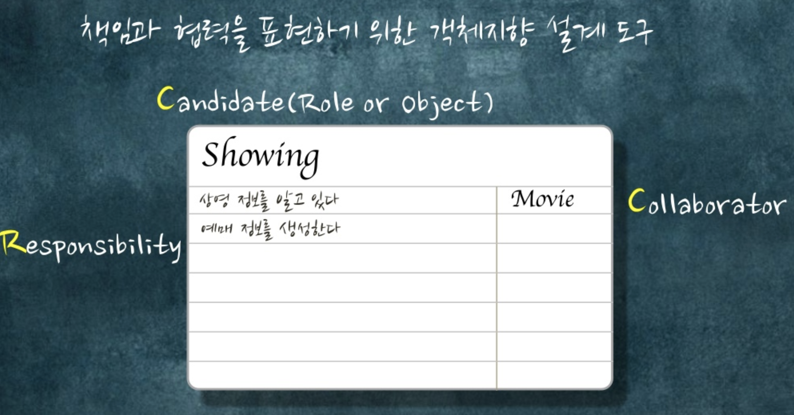
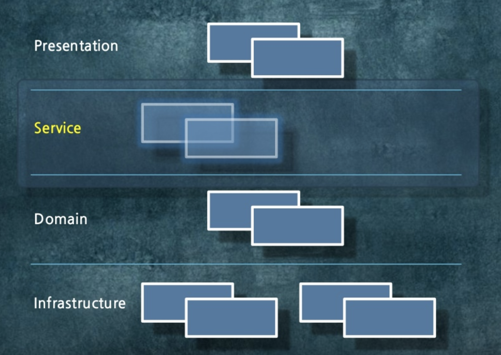

# 애플리케이션 아키텍처와 객체지향 - 조영호

* 레이어드 아키텍처와 객체지향의 접목
* 생각보다 올드함
* 요즘의 트렌드에서 조금 벗어날수 있지만, 기본적인 설계를 배워보는 정도로 볼것
* 2가지 방법을 실행
    * 하나는 절차지향
    * 하나는 객체지향
    * 둘을 비교
* 발표는 1시간 정도

## 1. 영화 예매 도메인

* 온라인 영화 예매 시스템
  
  

* 도메인 컨셉
    * Movie (영화)
        * 제목, 상영시간 등등
    * Showing (상영)
        * 어떤 시간에 상영되는지
        * 실제로 사용자들이 예매하는 대상
    * Discount (할인 정책)
        * 고정된 금액으로 할인
        * 비율 (%)로 할인
    * Rule (할인 규칙)
        * 어떨때 할인 해줄지
        * 영화의 순번을 갖고 할인
            * 조조 상영일 경우
            * 10회차 상영일 경우
        * 시간대 할인
            * 월요일 10 ~ 12시
            * 목요일 저녁 6시 ~ 9시
    * 할인 정책 + 할인 규칙
        * Movie 1 <-> 0..1 Discount 1 <-> 1..N Rule
        * 할인 정책이 없으면 할인 하지 않는다
        * 할인 정책 2개 (고정, 비율)중 하나만 존재한다고 본다
    * Reservation (예매)
        * 제목, 상영정보, 인원, 정가, 결제 금액

  

* Ex)
    * 이끼라는 영화 - 8000원
    * 고정된 할인 - 800원
    * 규칙 (아래중 하나를 만족하면 할인해줌)
        * 조조
        * 10회
        * 월요일 10 ~ 12시
        * 목요일 18 ~ 21시
    * 적용된 예시)
        * 목요일 18 ~ 20시에 상영된 이끼 영화라면 결과값으로 7200원이 반환

  

* 전체 도메인 관계
    * Showing 1 <-> 0..N Reservation
    * Showing 0..N <-> 1 Movie
    * Movie 1 <-> 0..1 Discount 1 <-> 1..N Rule

### 레이어 아키텍처

* Presentation
    * 사용자의 입력, 출력
* Domain
    * 중요한 로직이 실행
* Data Source
    * 네트워크, DB 등의 접점

위에서 언급한 도메인 로직들은 모두 **Domain 레이어**에 있어야만 함

### 도메인 레이어를 설계하는 방법

* 절차 지향
    * 트랜잭션 스크립트 패턴
* 객체 지향
    * 도메인 모델 패턴

영화 예매 시스템을 절차지향과 객체지향으로 구현해보겠음

## 2. 트팬잭션 스크립트

* 절차적?
    * 데이터와 프로세스를 서로 다른 모듈에 두는 것으로 보면 됨
    * 프로세스를 저장하는 클래스, 데이터를 저장하는 클래스를 나누는 것
* 무엇을 저장할 것인가? - 데이터
    * 실무에서 진행할때는 **어떤 데이터가 필요한지에 포커스**를 둠
    * 그 데이터에 프로세스를 맞춤
    * 데이터 모델에 굉장히 포커스를 둠
        * 나쁜것은 아님
        * 하지만 이렇게 만든 **데이터 모델이 설계를 주도하는 것은 나쁜것**
        * 데이터와 프로세스가 쪼개질 수 밖에 없음
        * 테이블당 클래스를 1:1로 맞춰서 생성해버림
        * 실무에서 왜 객체지향을 못하냐면 DB 때문
            * **테이블 데이터를 클래스에 맞추기가 힘드니, 클래스를 테이블에 맞춰버림**
        * 힘들다보니 DAO를 하나씩 만들어버림
* 어떻게 처리할 것인가 - 프로세스
    * 예매라는 서비스 메소드를 만들고 DAO 의존성을 막 걸기 시작함
  

**절차적인 예매 로직**

```java
@Transactional
public Reservation reserveShowing(int customerId, int showingId, int audienceCount) {
    1) 데이터 베이스로부터 Movie, Showing, Rule 조회
    2) Showing에 적용할 수 있는 Rule이 존재하는지 확인
    3) if(Rule이 존재하면) {
            Discount를 읽어 할인된 요금계산 
       } else { 
            Movie의 정가를 이용해 요금 계산 
       }
    4) Reservation을 생성해 데이터베이스에 저장
}
```

**실제 코드**

```java
@Transactional
public Reservation reserveShowing(int customerId, int showingId, int audienceCount) {
    
    //1)
    Showing showing = showingDAO.selectShowing(showingId);
    Movie movie = movieDAO.selectMovie(showing.getMovieId);
    List<Rule> rules = ruleDAO.selectRules(movie.getId());

    //2)
    Rule rule = findRule(showing, rules);

    //3)
    Money fee = movie.getFee();
    if(rule != null) {
        fee = calculateFee(movie);
    }

    //4)
    Reservation result = makeReservation(customerId, showingId, audienceCount, fee);
    servationDAO.insert(result);

    return result;

}

private Rule findRule(Showing showing, List<Rule> rules) {
    ...
} 

private Money calculateFee (Movie movie) {
    ...
}

private Reservation makeReservation(int customerId, int showingId, int audienceCount, Money payment) {

}
```

* 모든 프로세스는 한곳에 있음
* 시퀀스 다이어그램을 그려서 **어떤 한 메소드에서 모든걸 컨트롤 하는 것**이 보이면 절차적인 방식 
* 이 스크립트를 경계로 트랜잭션

## 3. 도메인 모델

* 객체지향은 데이터와 프로세스를 객체라는 하나의 단위에 몰아넣음
    * 데이터가 있는 곳에 프로세스를 넣는 것
* 객체지향 시스템
    * 책임을 수행하는 객체들의 협력



* CRC Card
    * 책임과 협력을 표현하기 위한 객체지향 설계 도구
    * Candidate: 후보
    * Responsibility: 이 후보가 수행할 책임들
    * Collabborator:: 이 후보와 협력할 객체들
    * 데이터를 지우고 **기능을 먼저 고민**
* 예매 생성 책임 할당
    * 내가 지금 어떤 기능이 필요해? 라는 질문에서 시작
    * **이 정보를 가장 많이 알고 있을것 같은 대상에게 책임을 주면 됨**
        * 예매는 상영 (Showing)이 가장 많이 알고 있음
    * 예매 생성에 필요한 **정보의 전문가에게 할당** (Creator 패턴)
* 가격 계산 책임 할당
    * 상영에서는 가격 계산을 하기에는 정보가 부족함
    * 영화 가격 정보를 알고 있는 전문가에게 할당 (Information Expert)
    * 가격 정보를 가장 많이 알고 있는 전문가는 영화 (Movie)
* **이 객체가 어떤 객체와 같이 협력 해야해** 가 핵심
* 할인율 계산 책임 할당
    * 할인율을 적용할 책임을 가진 객체 추가
    * Discount Strategy 객체에게 요청
* 할인 여부를 판단할 책임 할당
    * 규칙 (Rule)에게 요청
* **정보를 많이 가진 객체에게 계속 책임을 주면 응집력이 떨어짐**
    * 이럴 경우 분리해야함
    * 실무에서는 정보가 많다고 무조건 책임을 넣으면 안된다는 것 명심
* 객체지향 구현

```java

public class Showing {
    public Reservation reserve(Customer customer, int audienceCount) {
        return new Reservation(customer, this, audienceCount);
    }
}

public class Reservation {
    Reservation(Customer customer, Showing showing, int audienceCOunt) {
        this.customer = customer;
        this.showing = showing;
        this.fee = showing.calculateFee().times(audienceCount);
        this.audienceCount = audienceCount;
    }
}

public class Showing {
    public Money calculateFee() {
        return movie.calculateFee(this);
    }
}

public class Movie {
    public Money calculateFee(Showing showing) {
        return fee.minus(discountStrategy.calculateDiscountFee(showing));
    }
}
```

할인 전략들

```java
public abstract class DiscountStrategy {
    public Money calculateDiscountFee (Showing showing) {
        for(Rule each : rules) {
            if(each.isStatisfiedBy(showing)) {
                return getDiscountFee(showing);
            }
        }

        return Money.ZERO;
    }

    abstract protected Money getDiscountFee(Showing showing);
}

public class AmountDiscountStrategy extends DiscountStrategy {
    protected Money getDiscountFee (Showing showing) {
        return discountAmount;
    }
}

public class NonDiscountStrategy extends DiscountStrategy {
    protected Money getDiscountFee (Showing showing) {
        return Money.ZERO;
    }
}

public class PercentDiscountStrategy extends DiscountStrategy {
    protected Money getDiscountFee (Showing showing) {
        return showing.getFixedFee().times(percent);
    }
}
```

협력객체

```java
public interface Rule {
    boolean isStatisfiedBy(Showing showing);
}

public class SequenceRule implements Rule {
    public boolean isStatisfiedBy(Showing showing) {
        return showing.isSequence(sequence);
    }
}

public class TimeOfDayRule implements Rule {
    public boolean isStatisfiedBy(Showing showing) {
        return showing.isPlayingOn(dayOfWeek) && Interval.closed(startTime, endTime).includes(showing.getPlayingInterval());
    }
}
```

* CRC 카드에서 Rule이 할인을 결정할 수 있어 라는 책임만 정리
    * 외부와 협력하기 위해 얘는 뭘 해야해를 정의
    * 구현을 뒤로 미룰 수 있게 됨
        * 추상클래스, 인터페이스 등으로 책임만 정의하고 구체적 구현은 실제 구현체에서 진행
* 객체지향은 위임식
    * 시퀀스 다이어 그램에서 여러 객체가 일을 나눠하는지 확인
* 도메인 모델
    * 아키텍처패턴 관점에서 도메인 모델을 객체로 구현

## 4. 도메인 레이어와 아키텍처


도메인 레이어가 전체 아키텍처 구성을 주도한다.


객체만으로 구현한 구현도

* 굉장히 이상적인 구조도임
    * 실제로 어플리케이션으로 구현하려면 트랜잭션, DB, 웹 등이 연관되어야만 함
* 그래서 도메인 모델을 캡슐화 한다
    * 서비스 레이어를 둔다



* 도메인 모델만으로는 트랜잭션 경계를 넣기가 어렵기 때문에 Service 레이어를 둔다
* 서비스 레이어
    * 애플리케이션 경계
    * 애플리케이션 로직
    * 도메인 로직의 재사용성 촉진
* 비지니스 로직은 모두 도메인 모델로, 기술적인 (트랜잭션 등)을 서비스 레이어로 올린다

```java
@Transactional
public Reservation reserveShowing(int customerId, int showingId, int audienceCount) {

    Customer reserver = customerRepository.find(reserverId);
    Showing showing = showingRepository.find(showingId);

    Reservation reservation = showing.reserve(reserver, audienceCount);

    reservationRepository.save(reservation);

    return reservation;
}
```

* 트랜잭션 스크립트를 사용할때는 **서비스 레이어가 거의 필요없다**
    * 의미가 없다
    * **트랜잭션 스크립트에서는 도메인 모델이 아니라, 데이터 덩어리일뿐**
* 2개의 가장 큰 차이는 길이
    * 트랜잭션 스크립트는 **기술적인 이슈 (트랜잭션 등)와 도메인 로직이 한곳에 다있으니** 한 눈에 코드를 보기가 어려움
* 도메인 모델의 단점
    * 테이블 데이터와 매핑하기가 어려움
    * DB 테이블을 만드는 원칙과 객체를 만드는 원칙은 서로 다름
    * DB 테이블 만드는 원칙은 **중복 제거**
    * 객체는 데이터 기반이 아닌, **행위 기반**
* 객체 관계 - 임피던스 불일치
    * 객체 패러다임과 관계 패러다임 간의 불일치
    * 이를 해결하기 위해 데이터 매퍼를 사용
        * 객체 모델과 DB 스키마 간의 독립성 유지
        * ORM이라 하면 객체와 DB간의 매핑
* **JPA**
    * 임피던스 불일치를 해결할 수 있는 실용적인 솔루션

## 5. 선택의 기로에서

* 절차지향으로 짜야할 때가 있고, 객체지향으로 짜야할때가 있음
    * 무조건 객체지향이 좋다는 것은 아님


> 우리가 짜는 프로그램은 두가지 요구 사항을 만족시켜야한다.  
우리는 오늘 완성해야 하는 기능을 구현하는 코드를 짜야하는 동시에 내일 쉽게 변경할 수 있는 코드를 짜야한다.
샌디 메츠

* 현재 우리 시스템에서 **변경하기 쉬운 코드가 좋은 코드, 변경하기 쉬운 배치가 좋은 설계**
    * 변경이 안일어나는데 과하게 설계했다면 좋은 설계가 아님
* 만약 할인 정책이 변경된다면? - 중복 할인 가능
    * 트랜잭션 스크립트
        * 할인 로직에 ```For``` 추가
        * 하지만 **중복 할인이라는 개념은 어디로?**
        * 객체 지향을 쓰는 이유는 명사로 한정시킬 수 있기 때문
    * 도메인 모델을 사용한다면?
        * Movie의 입장에서는 DiscountStrategy가 1개이든, 여러개이든 동일함
        * 새로운 DiscountStrategy 클래스 추가
        * 이를 OCP (개방 폐쇄 원칙)
* 거짓말
    * **요구 사항이 어떻게 변경될지 알고 있으니 위와 같은 설계가 가능**
    * 만약 어떻게 변경될지 모른다면?
    * 대부분 현재 코드는 요구사항 변경에 부적합
        * 최대한 심플하게 짜는게 훨씬 나음
        * 괜히 모든걸 대응하는 코드를 짜면 오히려 더 못고치게 됨
    * 다형성은 코드를 이해하기 어렵게 만듬
        * 단지 코드를 한번 이해하면 쉽지만, 처음 그 코드를 보면 이해하기 힘들게함
* 변경의 방향을 알면 **객체 지향은 변화를 수용할 수 있는 설계를 지원**
    * 객체지향으로 짜면 확장 가능하다가 아님

* 절차지향은 복잡성을 알고리즘 안으로 넣음

> 도메인 모델은 **복잡성을 알고리즘에서 분리하고 객체 간의 관계로 만들 수 있다**.  
유효성 검사, 계산, 파생 등이 포함된 **복잡**하고 **끊임없이 변하는** 비지니스 규칙을 구현해야 한다면 객체모델을 사용해 비즈니스 규칙을 처리하는 것이 현명하다.  
마틴파울러

## 마무리

* [KSUG 영상](https://www.youtube.com/watch?v=26S4VFUWlJM)
* [슬라이드쉐어](https://www.slideshare.net/baejjae93/ss-55571345)