# 제 6회 대한민국 커뮤니티데이 참석 후기
2017년 2월 25일! 제 6회 대한민국 커뮤니티데이에 참석하고 왔습니다!  
커뮤니티데이는 처음 참석하는거라 어색할것 같은데 역시나 개발자 세미나는 편한것 같습니다!  

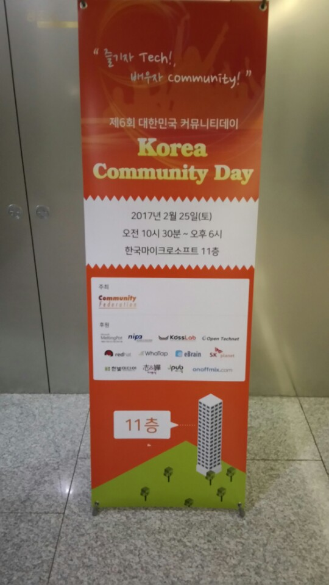

(세미나 장소인 한국 MS 11층입니다. 작년엔 KSUG 스프링캠프가 개최됐었죠?)   
입구에 들어서니 반갑게 간판이 맞이해주네요 ㅎㅎ  
세미나에 대한 자세한 내용은 [링크](http://kcd2017.onoffmix.com/program)를 참고하시면 될것 같습니다!  

다른 세미나와 커뮤니티데이가 결정적인 차이는 한 분야에 대한 이야기가 아닌, 정말 다양한 분야의 분들이 오셔서 발표를 해주신다는 점입니다.  
비유하자면 다른 기술세미나는 칼국수 명장의 느낌이라면, 커뮤니티데이는 뷔페식의 느낌이라고나 할까요?  
챗봇, 레드햇, 오픈스택, Gear, PHP 등 정말 평소에 접하기 힘든 기술들을 한곳에서 골라 볼 수 있다는 점이 너무 좋았습니다.  

여튼! 제 소감은 여기까지 하고 세미나 이야기를 시작해보겠습니다.  

### Web & Mobile 대담
첫번째 시간은 사전에 받은 질문을 토대로 각 커뮤니티 리더분들께서 대답을 해주시는 시간이였습니다.  

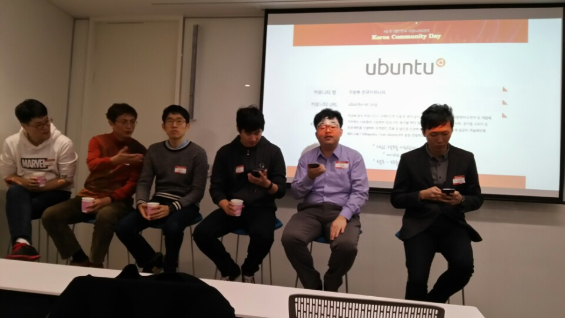

(좌측에서부터 김종광님, 한대승님, 김동우님, 김태호님, 남정현님, 엄지용님)  

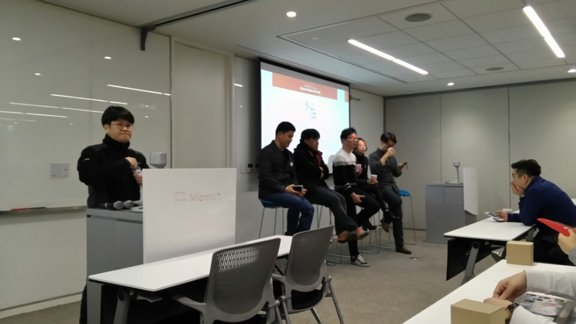

(좌측에서부터 이용혁님, 한상곤님, 한정현님, 임지현님, 장기효님, 박세정님이 계시는데 박세정님은 자리에 안계시네요 ㅠ)  
죄송하게도 진행을 해주신 선배님의 성함을 기록하지 못했습니다 ㅠㅠ 혹시나 기억하신 분들은 댓글이나 이슈에 꼭꼭 남겨주시면 감사하겠습니다!  

아래는 주고 받은 질문과 답변입니다.  

**그동안 뭘 만들었나? 자기가 만든것 소개 & 개발과 돈벌이에 대한 생각**  
* 남정현
   * 코딩을 잘한다고 돈을 많이 벌지는 않는것 같더라.
   * 그래도 돈이 나한테 중요한가 라는 질문을 던지면 돈 보다는 코딩 자체가 좋아서 그랬던것 같아서 지금까지 해왔던것 같다.
   * 지속가능한 일을 선택하는 것이 좋다.
* 김종광
   * 개발자에겐 2가지 일이 있는데, **급한 일과 중요한 일**이다. 안급한건 개발자에게 없다.
   * 회사에서 일하다보면 **급한일이 100%를 채워서 중요한 일을 못하게 된다**.
   * 개발자 직군만큼 실력과 비례해서 돈을 받는 일이 잘없다. 그래서 중요한 일을 해야한다.
   * 아무리 돈을 많이 줘도 주말에 자기계발 할 시간을 안주면 그 회사는 나오는게 낫다.

**앞으로의 웹과 미래는 어떻게 될것인지, 그리고 꼭 갖춰야할 소양은?**

* 남정현
   * 구글글라스를 보면 알 수 있듯이 디바이스가 변화해가고 있다.
   * 사용자와 상호작용 하는 영역이 계속 발전해나가는 것 같다.
   * 결국 내가 무엇을 만들고 싶은가가 중요한것 같다.
   * 소양이라고하면 역시 꾸준하게 할 수 있는 것을 밑바탕이 되고나서 다음을 바라봐야할 것 같다.
   * 개인적으로는 C언어는 배워보면 좋을것 같다.

**웹과 앱은 끝났다는 이야기가 있는데 어떻게 생각하는지?**  

* 한정현
   * 웹이 앱처럼 되어가고 있다. 브라우저 푸시 등은 벌써 접하고 있지 않나
   * 이젠 직접 설치보다는 바로가기와 비슷한 개념으로 가는 방향인것 같다.
   * 그렇다고 모바일을 이젠 버리자는 얘기는 아니다.
   * 인프라가 부족한 환경(중국, 인도등)에서 잘 구동할 수 있도록 경량화 기술들이 발전해나가는 것 같다. (AMP등)

**개발자로서 일정 수준에 도달했는데 진학이 필요한가?**   

* 한대승
   * 개발자로서 성공하는데 학벌이 꼭 필요하진 않다고 생각한다.
   * 하지만 **사회에서 나를 평가하는 기준으로 학벌**이 중요한 역할을 하는걸 많이 봤다.
   * 창의력은 평가하기가 힘든 분야이다.

* 남정현
   * 요즘은 NHN NEXT 같은 좋은 대체 교육제가 있고, 방통대도 있다.
   * 국내 입시제도는 불합리한것이 많다.
   * **성적 맞춰서 가다보면** 적성 안맞거나 손해를 보는 경우가 많다.
   * 나도 고3때 똑같이 고민했었는데 결국 본인이 각오가 되어있는지가 제일 중요한것 같다.

* 한상곤
   * **여건이 되시면 대학가시길** 바란다.
   * 전 회사에서 리액트의 flux를 써야했는데 팀원들 대부분이 이해못하고 있었다.
   * 운영체제의 디스패치 패턴이 그대로 녹아있어서 왜 이해못하는건가해서 바라보니 학교에서 이걸 전혀 안배웠던 것이다.
   * 운영체제와 같은 **기반기술을 스터디하는 모임은 없다**.
   * 당장 여기온 분들도 운영체제/네트워크 스터디한다라고 하면 가겠는지 생각해봤으면 좋겠다.
   * 다만 무조건 **좋은 대학을 가라**
   * **가서 기반기술, 협업등을 전부 배워오길 바란다**.

**하나의 프레임워크에만 의존해도 되는지?**  

* 한정현
   * nodejs, express 좋다. 하지만 팀내 모든 개발자가 그 프레임워크를 잘 알아야 하는데 현실적으로 그렇지 않다.
   * 하나에만 집중하라는 이야기는 아니지만, 그 안에서도 나눠져있는게 많다.
* 한상곤
   * node만 해도 nvm같은걸 써서 버전을 맞추는게 디폴트가 되버렸다. 안정화 되지 않은 언어들이 대부분이다.
   * **혼자서 여러 언어를 다루는건 좋은 선택이 아니다.**
   * 팀이면 그래도 다 찢어서 어떻게 하겠지만 혼자서 모든걸 할순 없다. 한 언어의 에코시스템을 최대한 많이 사용하는게 좋다.
   * **밖에서 보면 다 좋아보인다**. 근데 튜토리얼은 모든 프레임워크가 쉽다.
   * 하나도 제대로 못써서 난리인데 하스켈, 얼랭이 무슨 소용인가

모든 이야기를 담지는 못해서 아쉽지만, 그래도 최대한 리뷰를 보시는 분들이 보셨으면 하는 내용들은 최대한 담았습니다.  
특히 한상곤님의 답변은 정말 와닿았습니다.  
실제로 모든 스터디가 언어/프레임워크에만 너무 집중되있어서 이런 기반이 되는 기술들을 알지 못하는 비전공자들과 수강한 전공자들이 갈수록 더 차이가 벌어지는게 아닐까 싶습니다.  

### 컴퓨터구조론과 웹 - 윤성수

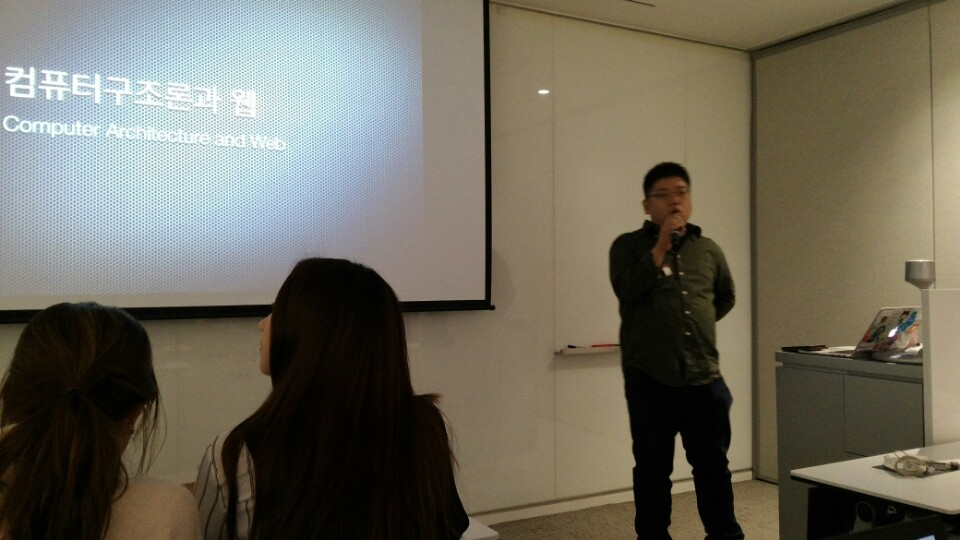  

(2번째 시간 발표자이신 온오프믹스의 개발자이신 윤성수님)  

* 웹 개발에 컴퓨터 구조론은 필요없는 존재인가?   
* 웹 개발은 이질적이다. (응용시스템과는 사뭇 다름)
* 웹개발에 쓰는 언어와 환경도 이질적인 구조
   * 프론트 엔드
     * HTML : 대충써도 화면은 일단 나옴
     * Javascript : 변수에 자료형 선언이 없음, 다른 자료형으로 재활용 가능
   * 미리완성된 도구
     * CMS : XE, Wordpress 등 설치하면 끝
   * 쉽게 다가갈 수 있는 웹이라 기존 개발자와는 다른 인력들이 유입
     * 중, 고등학생
     * 타전공
     * 코딩교육, 국비교육 등의 수강생
   * 저렴하고 빠르기 때문에 스타트업에서 많이 사용
   * 하지만 쉽고 빠르고 저렴하기 때문에 역효과가 발생
     * 사장님 : 간단하니까 저렴하게 되죠?
     * 디자인 필요없죠?
     * 오픈소스 쓰고도 개발자에요?
     * 쥐어짜기만 하기 때문에 난장판인 코드가 등장하게 됨
* 웹의 탄생 배경은 정보를 공유하기 위한 목적
   * 단순히 텍스트와 이미지만 출력되다가 왜 우리는 이걸로 보기만 하고 있는가? 라는 고민의 시작 -> 동적 웹의 시작
* 동적 웹의 등장
   * HTML + Javascript : 움직이는 웹 요소
   * CGI의 등장 -> 사용자의 요청을 서버에서 처리
   * SQL 서버를 연동 -> 사용자와 주고 받은 것을 저장
   * 이러다보니 웹을 통해 서비스를 할 수 있겠다는 생각에 시작하게 됨
   * 원래는 단순한 문서뿐이였는데, 그걸로 생태계를 만들어 버린것
* 웹은 어디서 어떻게 돌아가는 것일까?
   * 분명한 것은 서버도 클라이언트도 중간을 이어주는 인터넷도 다 컴퓨터의 일종이라는 것
   * 웹 브라우저 : 내가 쓰는 컴퓨터 안에서 동작하는 프로그램
   * 웹 서버도 결국엔 컴퓨터

* 컴퓨터 구조를 이해하지 않고선 안되는 경우가 있다.
   * 성능개선, 최적화를 논할 수 있을까?
   * CPU 연산
   * 기억장치
   * 인터럽트
   * 병렬처리          

40분남짓한 시간 동안 웹 개발자라면 무시하기 쉬울 컴퓨터 구조론의 중요성에 대해 밀도있게 이야기해주셨습니다.  
중간중간 개발자용? 드립을 많이 얘기해주셔서 피식피식하면서 들었습니다.  

### 배워서 바로 쓰는 챗봇 개발 - 김영욱

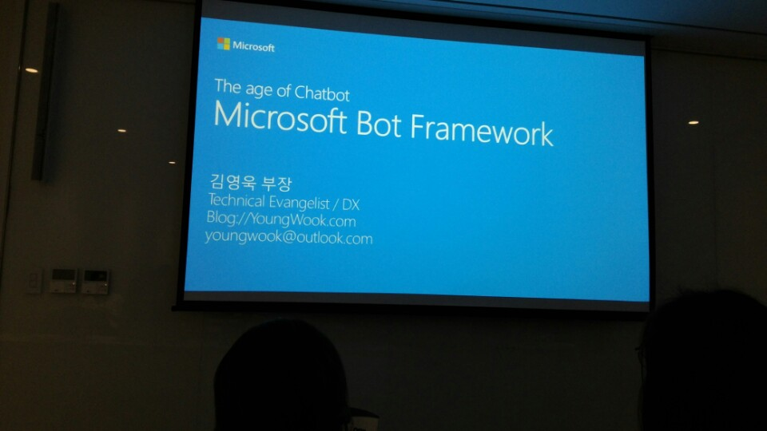

이번 발표시간은 MS의 에반젤리스트이신 김영욱 부장님의 MS 봇 프레임워크에 대한 이야기입니다.  
주변에 챗봇에 관심이 많은 동생이 있는데, 그 동생이 들었으면 참 좋겠다 싶은 생각에 더 열심히 사진을 찍고 기록을 하였습니다 ㅎㅎ  
* 4차 산업이라고 얘기하는데 그중 성과를 내는 곳이 챗봇이다.  
* 최근들어 앱 다운로드를 거의 하지 않고 있다.
* 앱을 만들때 가장 큰 고민이 무엇인가?
   * 디자인 & UI다
   * **챗봇은 UI가 없다**. 와우
   * 대신 사용자의 다음 행동을 유도할 수 있도록 기획을 잘해야 한다.
* 챗봇을 다루는 주요 기술
   * 패턴인식
   * 자연어처리 : 인간이 보통 쓰는 언어로 검색 질의
   * 시멘틱 웹
   * 텍스트 마이닝
   * 상황인식 컴퓨팅
* MS 봇 프레임워크
   * 현재는 C#, Nodejs 만 지원
   * 슬렉, 텔레그램, 페이스북 등 지원
   * [Github](https://github.com/KoreaEva/Bot) 참고

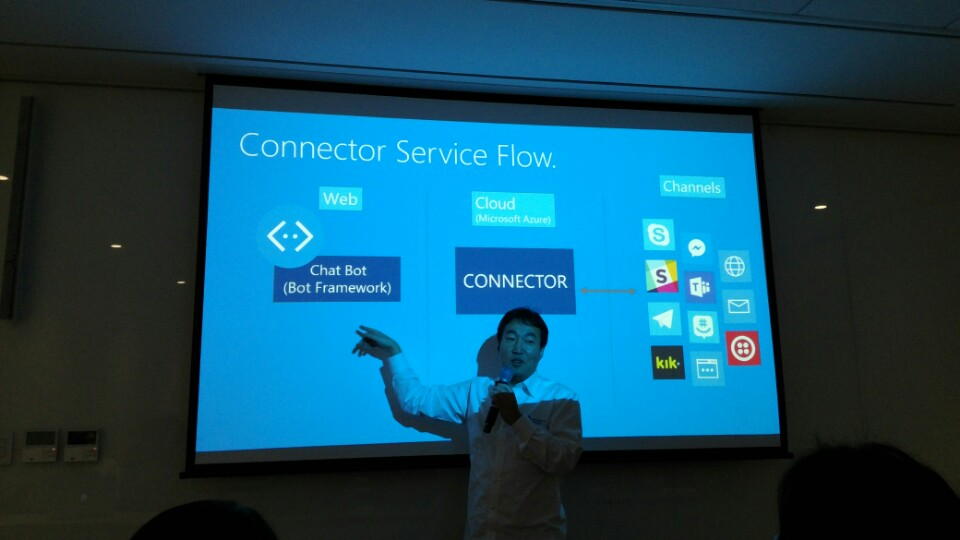  
* web (chat bot 프레임워크) <-> cloud <-> 챗봇채널과 연동된 상태이며, 개발자는 web으로만 개발하면 된다.    
* 브라우저에서 돌아가는게 아니기 때문에 클라우드에서 스테이트를 저장할 수 있도록 지원한다.
* MS는 각 앱 회사와 **비지니스 계약**을 맺어 앱 API 변경시 자동으로 커넥터가 업데이트 되도록 지원
   * 자고 일어나면 연동된 API가 안되는 문제 해결  
* Hello World

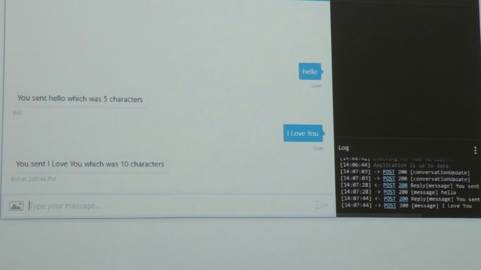

(세미나 장소에서 Visual Studio 템플릿으로 1분만에 만든 문자열 길이 출력 챗봇)    

* MS 챗봇 생태계

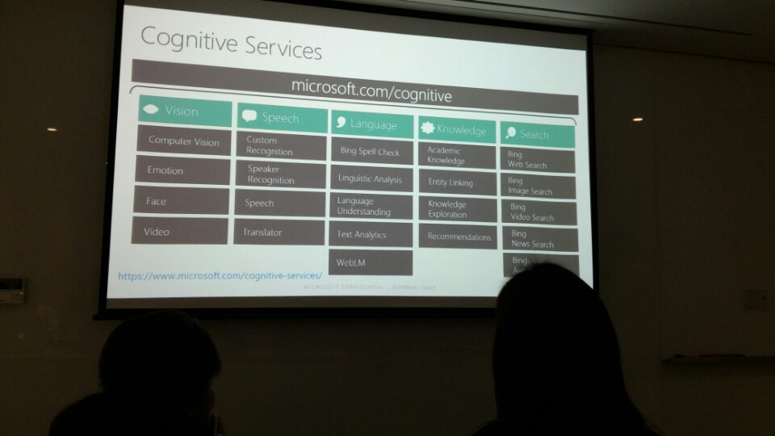

(검색, 자연어, 국가별언어 등 이미 너무 광범위하게 지원하고 있는 MS 봇 프레임워크를 확인할 수 있었습니다.)  

* 자연어처리 (Louis)
   * SDK와 Louis를 통해 전달된 메세지가 주문, 배달, 인사인지를 구분
   * 월 1만 호출은 공짜
   * 챗봇 이외에 웹 서비스에서도 사용 가능   
* 챗봇은 배포되는 웹서버는 HTTPS로만 통신된다.
   * 그래서 SSL 인증서가 필요
   * 하지만 Azure는 지원
   * 기승전 MS!!

역시 재미와 배움을 모두 잡아주시는 김영욱님의 발표였습니다.  
같이 들었던 동생은 당장 챗봇 시작해봐야겠다고 이야기를 했을 정도였습니다.  
개인적으로 카카오톡이 봇 API를 적극 지원하거나, 라인이나 텔레그램 같은 앱이 국내 사용율이 높아지면 정말 국내 환경도 급변할것이라 생각이 들었습니다.  
(카카오톡은 현재 옐로아이디로만 제공되고 있습니다. 좀 더 많은 지원이 있으면 하는 아쉬움이 계속 있습니다.)  

### 오픈소스 커뮤니티와 레드햇의 역할 - 이규석
* Bash, OpenSSL, OpenJDK등은 기반기술이라 많은 개발자가 필요한데, 오픈소스다보니 누군가의 지원과 희생없이는 계속해서 업데이트 할 수가 없다.
   * 그래서 레드햇이 이를 직접 급여를 제공하며 오픈소스 커뮤니티에 직접적으로 지원을 시작
* 오픈소스 A를 사용해서 B라는 서비스를 만든다고 할때 오픈소스 A가 변경될 경우 관련된 코드 전체를 다 바꿔야 하는 경우가 발생
   * 레드햇에서 이를 통합 & 안정화하여 레드햇이 몇년간 안정적으로 보장을 해주기 시작
* 레드햇의 커뮤니티 개발자 프로그램
* 개발자로 등록후에는 레드햇 엔터프라이즈 버전은 전체 무료
   * 단, 개발용도에 한해서만 이며 상용으로는 안됨
   * 한대의 머신에서만 가능 (단, 가상화는 무제한)

### 중국 클라우드 마이그레이션 후 발생한 장애 사례와 대응 방안 - 이나라 (와탭)
* 클라우드는 좋아보이지만 결국 공유자원
   * 요청이 많으면 내 차례를 기다리거나 한정된 자원을 나눠가져야 함
* 잘 동작하던 게임 서버에서 사용자들이 갑자기 튕겨나간 사례
   * 클라우드의 자원 공유 제약 때문
   * IOPS가 항상 250으로 항상 일정이 이상해 보임
   * IOPS가 높을때마다 Disk Queue Length가 높은 수치로 증가
   * 높은 IOPS를 제공하는 프리미엄 클라우드를 사용해서 해결할 수 있음
* 클라우드 환경에서 수집 대상
   * IOPS
   * iowait / Disk Queue Length
   * CPU Steal time 등
* 국내 쇼핑몰 K사의 사례
   * 중국진출을 위해 클라우드 마이그레이션 이후 성능 저하 발생
   * 밤사이 톰캣이 다운되는 장애 발생
   * 물리 서버로 운영하던 오라클 DB를 클라우드 VM으로 마이그레이션
     * DB DISK IO 성능 저하 발생
   * 서비스를 하는 도중 DB의 대용량 데이터 동기화과정이 배치잡으로 잡혀있음
   * 이 과정에서 DB 네트워크 실패로 write 실패로 발생
* 무수하게 많은 트랜잭션을 표현하는 좋은 지표
   * 평균 응답시간
   * 백분위 기준
   * 분포
* 와탭(APM)으로 K사의 문제를 확인
   * 지연 트랜잭션이 실시간으로 500개 이상 유지중이였음을 확인
   * DB 튜닝 먼저 진행
* 예고없이 갑작스런 프로모션 시작으로 서버 폭주
   * 종료되지 않는 트랜잭션이 3천개 이상, 80초 이상 지연되는 트랜잭션 폭주
   * 하지만 CPU 사용량은 50% 이하
* 엎친데 덮친격으로 Debug Log로 인한 2차 장애 발생
   * callAppender가 sync라 병목 현상 발생
* 하지만 왜 서버 폭주가 발생한것인가?
   * 폭주 당시 DB는 안정화
   * CPU도 50% 사용으로 자원 여유가 있었음
   * 100초가 넘어도 트랜잭션 종료가 안되는 현상을 모니터링 수집으로 확인 됨
   * 이미 끝났어야 하는 쿼리에서 트랜잭션이 멈춰서 종료되지 않는다, 커넥션을 점유하고 있다면 장애 발생 가능성이 있음
* 먼저 커넥션 풀 라이브러리 분석 (톰캣 라이브러리가 아닌 알리바바 라이브러리 사용중)
   * 커넥션을 얻고 반환하는 로직을 분석햇으나 이상없음
   * 다만 커넥션을 관리하는 방식이 큐가 아닌 스택이였음
   * LB의 idle timeout(기본 4분)
   * 즉, 어플리케이션과 DB서버 사이에 LB로 연결되어있다보니 LB에서 연결이 끊어진 커넥션을 사용하면 hang이 걸림을 확인
   * 알리바바의 라이브러리가 스택을 사용하고 있어 가장 최근에 사용한 커넥션을 다시 사용하다보니 문제가 발생
   * 당장 커넥션 풀 라이브러리 업데이트나 교체는 힘들기 때문에 idle timeout을 30분으로 교체하고 문제가 해결

### 쉬는시간
쉬는 시간이 중간 중간있어 OKKY 부스에 방문했습니다!  
믿음님, karen님 모두 반갑게 맞이 해주셨지만 다들 부끄러워하셔서 같이 사진은 못찍고 부스만 찍었습니다^^  

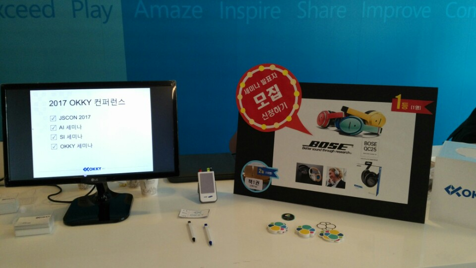  

위 사진처럼 올해는 4개의 세미나를 계획하고 계신다고 하십니다!  
아마 저는 특별한 일이 있지 않는 이상은 4개 세미나 모두 참석할것 같은데 이 중 SI 세미나는 특히 기대가 많습니다.  

### 개발자 경력 관리 - 노상범

언제나 개발자들을 위해 노력하시는 OKKY의 대표이시자, 개발자 서치펌 ebrain의 대표님이신 노상범 대표님의 커리어에 관한 이야기입니다.  
혹시나 앞으로 이직 & 경력 관리에 관심이 많으시면 대표님께 한번 메세지를 드려보시는게 어떨까 추천드립니다. ([페이스북 주소](https://www.facebook.com/sbroh))  

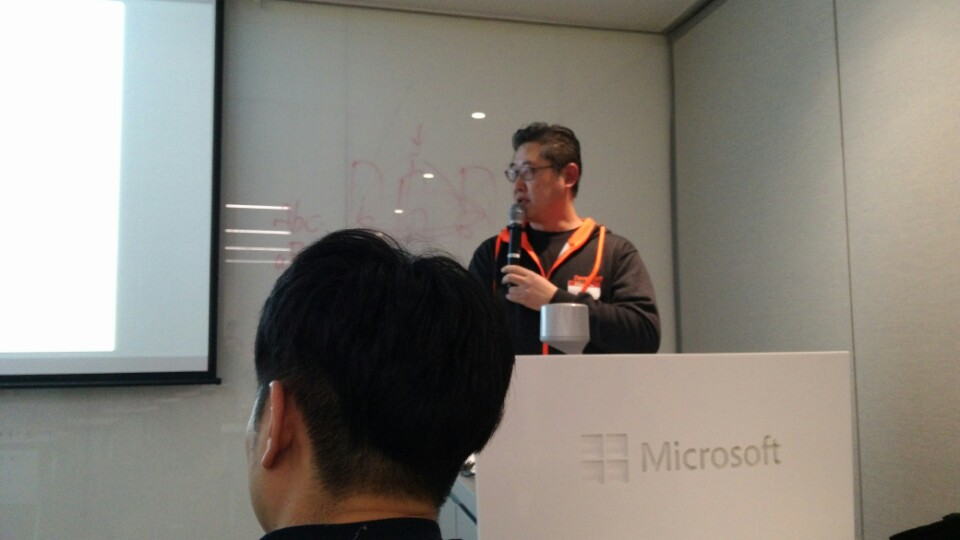  

* 데이터 기반 X
   * 경험/느낌/촉으로 이야기 진행
* 2011년도부터 서치펌 일을 시작함
   * 이전에는 IT회사에서 개발자를 뽑았지만, 이젠 모든회사가 뽑기 시작함
   * GE, 현대카드, 골드만삭스, 뉴욕타임즈 등등
* 개발자들이 항상 하는 이야기 : "좋은 회사에 가고 싶어요"
   * 그럼 좋은 회사는 무엇인가? "소프트웨어 개발자를 중요하게 생각하는 회사"
* 개발실력을 키우기 좋은 곳은?
   * 코딩 테스트를 까다롭게 보는 곳
   * 신입이더라도 학교에서 공부를 얼마나 했는지 꼬치꼬치 캐묻는 곳
   * 사수를 어떤 사람을 만나느냐에 따라 1~2년 후에 엄청난 실력 차이 발생
   * 결국 **채용 과정이 어려운 곳일수록 개발실력을 키우기 좋은 곳**
* 대표적으로
   * 포털회사, 대형게임사
   * 기술스타트업 (그루터, 제플린 등등)
   * 솔루션 회사 일부
   * 서비스 스타트업 일부 (우아한형제들, 토스 등)
   * 개발대행회사 일부
* 소프트웨어 명가
   * 이전에는 한컴, 오픈마루, KTH 등
   * 최근에는 쿠팡, 우아한 형제들
   * 추가로 solbox, 이베이코리아
* 이런 공고는 좋은 회사로 봐도 무방

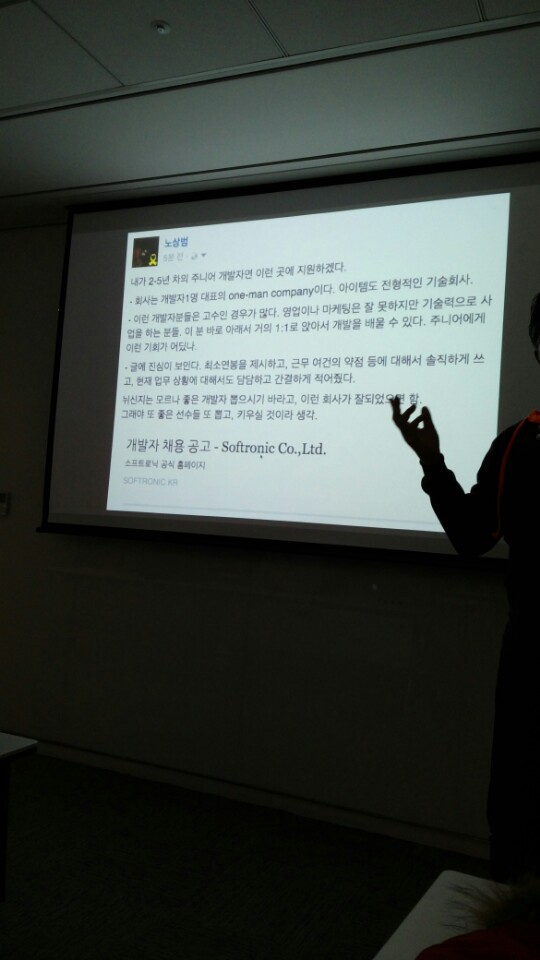

(노상범 대표님의 페이스북에 공유된 회사소개)  

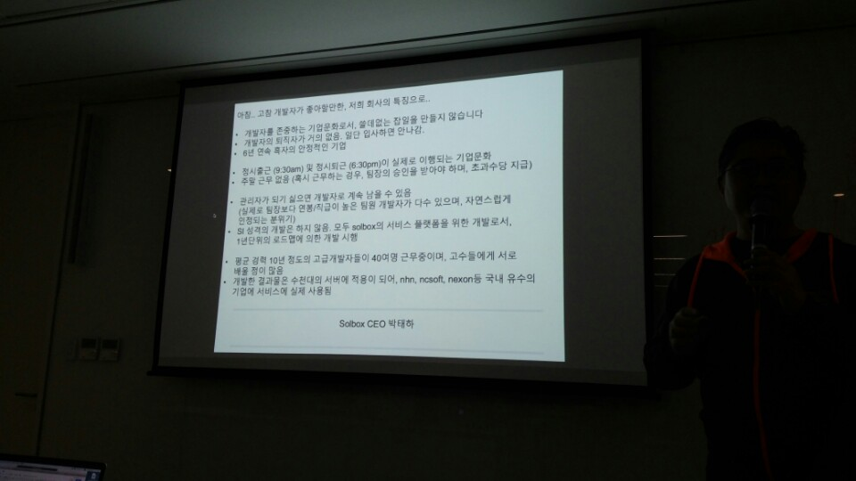  

(솔박스의 구인 공고)  
   
* 좋은 개발자? 신입편
   * 좋은 회사 가려면 학점이 중요하지 않나요?
     * 코딩외에 전혀 필요하지 않음
     * 단 전공학점은 중요함
   * 자격증이 필요하지 않은가요?
     * 자격증은 개발자에 대한 모독
   * 대기업이 안정적이지 않나요?
     * 흔히 말하는 전통적인 대기업, 은행 등은 절대 가면 안된다.
   * 큰 회사에 가야 체계적으로 일을 배울 수 있지 않을까요?
     * 작은 회사라도 개발체계가 잡혀있는 경우가 많다.
     * 이런건 면접에서 확인해야 한다.

* 좋은 개발자? 안신입편
   * 이직은 얼마에 한번 정도가 좋을까요?
     * 예전에는 4~5년에 1번
     * 최근에는 3년 정도
     * 근데 실제로 나한테 취업을 부탁하는 개발자들은 대기업에서 18~20년 근무하신 분들이다. 너무오래 한 기업에서 일하기도 했으며 연봉이 너무 높다.
     * 한 대기업에서 오래 하다보면 너무 좁은 분야에서 깊게 하다보니 다른 회사에서 필요로 하는 경우를 찾기가 힘들다.
   * 스타트업은 불안하지 않나요?
     * 스타트업이란 회사 하나를 보지말고 **스타트업이란 생태계**를 보고 들어가면 좋을것 같다.
     * 대기업을 거친 모범적인 커리어 패스보다 스타트업등을 거친 **모험적인 커리어 패스를 지닌 후보자를 우선 추천**해달라는 대표적 금융회사의 구인 요청
     * 반대로 스타트업들은 대기업 출신들을 선호하지 않음
   * 관심가는 회사이긴 한데, 사업모델에 대한 확신이 안들어요.
     * 회사가 죽고 살고는 크게 신경쓰지 않았음 좋겠다.
     * 본인이 어떻게 그 회사에서 기술력을 쌓을 수 있을지 고민해라
   * 개발은 몇살까지 할 수 있나요?
     * 우리나라는 개발자가 너무 부족하다
     * IMF 이후 컴퓨터/전산 학과 입학생이 급격히 하락했다.
     * 본인의 노력에 따라 백발까지 할 수 있다.
   * CTO가 되려면 어떤 준비를 해야 하나요?
     * 개발만 잘해서는 안된다.
     * 개발뿐만 아니라 상품에 대한 이해, 그리고 **사람에 대한 이해**
     * 요즘 들어서 진짜 많이 듣는 CTO의 요구조건이 개발자 채용 잘해줄 수 있는 CTO
   * 개발만 하고 싶은데, 회사에서 자꾸 관리를 하래요
     * 나는 거의 회사를 나오라고 답변을 한다.
     * 개발자는 손에서 코딩을 놓는 순간 죽는다고 생각하는게 낫다.
     * 본인이 정말 관리 역량이 있다고 생각하면 옮기면 되지만 팀장에서 다른 회사의 개발자로 일하기는 정말 어렵다.
   * SI회사에 다니고 있는데, 인터넷 서비스로 들어갈 수 있을까요?
     * 갈수는 있다.
     * 하지만 잡코리아와 같은 사이트에 올린 본인의 이력서로는 거의 안된다고 보면 된다.
     * SI를 하더라도 차라리 웹에이전시를 가라
     * 자체 서비스를 하는 회사들이 어떤 환경에서 일하는지를 먼저 확인해보고 그 환경에 맞는 기술을 습득해야 한다.
   * 경력을 바꾸고 싶은데 손해 안보고 가능할까요?
     * 거의 불가능하다
     * 연봉의 20~30프로 포기해야 한다.
   * 내 분야의 채용이 너무 없어요
     * 그 분야를 계속 하는게 나쁜건 아니지만, 그럴려면 해당 기술의 커뮤니티 활동을 계속해야 한다.
   * 커뮤니케이션이 정말 그렇게 중요한가요?
     * 코딩만큼 중요하다
   * 안정적인 회사에 가고 싶어요
     * 저 새가 저 나뭇가지에 앉아있는건 나뭇가지가 안부서질것 같아서 앉아있는것이 아니다.
     * **나무가 부러져도 날수 있다는 자신이 있기 때문**이다.

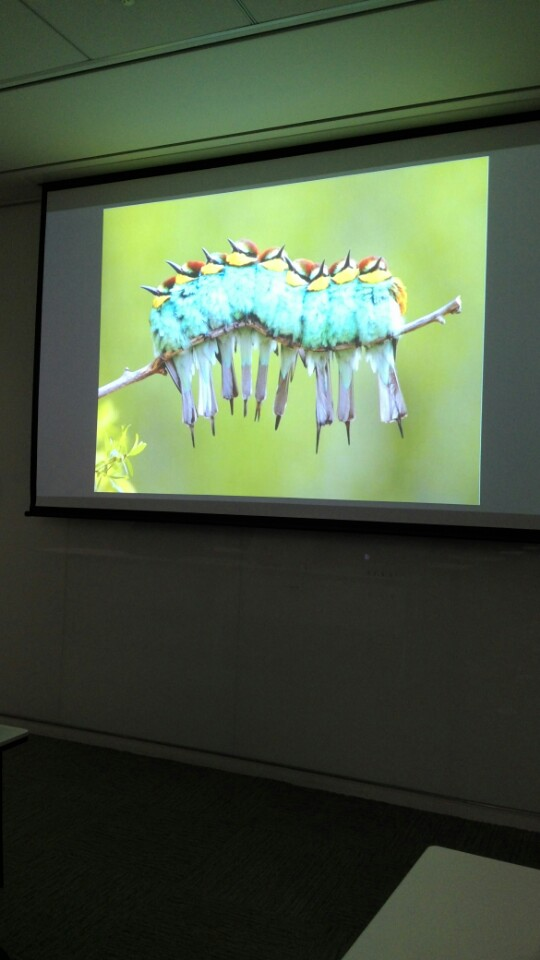  

(이번 커뮤니티데이에서 가장 감명깊게 본 슬라이드)  

* 끊임없이 공부할 생각없으면 개발자 하지 마세요
   * IT지식이 필요한 SW 주변일들이 많다.
   * 테크HR, 테크블로그 등등
* 시장 상황에 민감하셔야 해요
   * 좋은 학벌, 좋은 회사에 다녔지만 심비안OS만 10년을 넘게하다가 들어갈 회사가 없는 개발자분을 보게 됐다.
   * 최근 키워드는 Data / AI / VR / OpenSource / Cloud / Mobile
* 모니터만 보고 있지 마세요
   * 문제는 현장에 있는 경우가 많아요
* 네트워크를 만들거나 개인 브랜드를 만들면 여러모로 편해요
* 본인의 키워드를 만드세요       
   * 이 사람은 **이거 하나는 정말 잘합니다**. 라고 주변에서 얘기할 수 있는 사람이 되어야 한다.
* 인터뷰를 준비하세요
* 이력서는 당신의 상품소개서
   * 약간의 포장은 있어도 된다.
* JD(Job Description)에 관심을 가지세요
* 3년차 넘어가면 헤드헌터 1~2명과는 친하게 지내세요.
* 영어를 잘하면 선택의 폭이 수십배 늘어나요
* 좋은일 많이 하세요. **아무나 여러분 같은 재능 갖고 있지 않아요**.   

### 끝나고
세미나가 끝나고 여자친구와 함께 촛불집회에 참가하였습니다.  
  

저는 너무 늦지 않게 돌아왔지만 지금까지도 추운날씨에 열심히 집회를 진행해주시는 많은 분들께 항상 감사드립니다.  
너무나 꽉차게 보낸 하루였습니다.  
긴글 끝까지 읽어주셔서 정말 감사드립니다!
